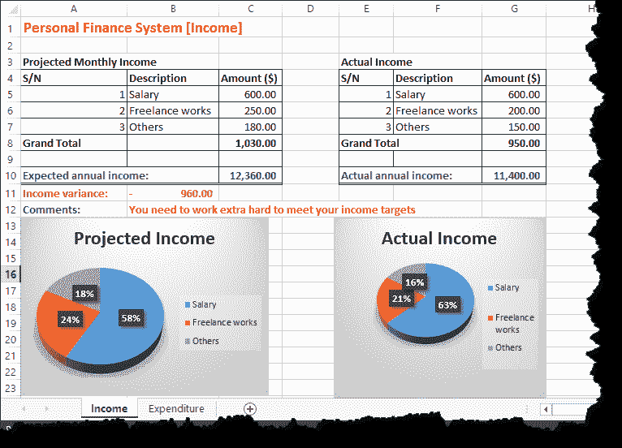
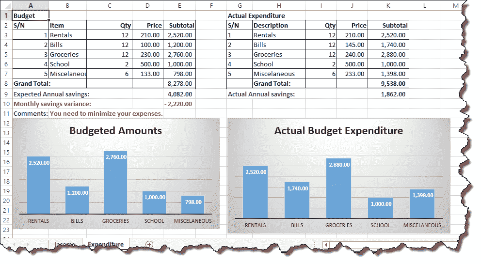
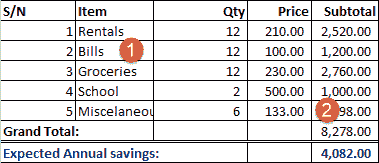
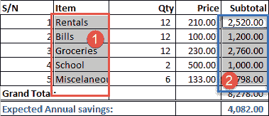
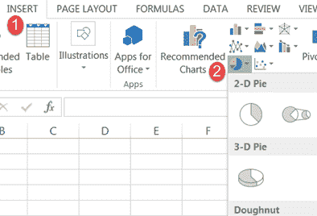
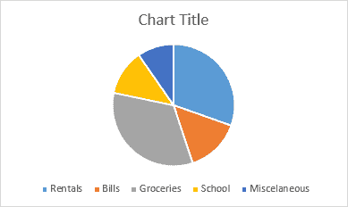

# 如何在 Excel 中进行预算：个人理财教程

> 原文： [https://www.guru99.com/case-study-managing-personal-finance-using-microsoft-excel.html](https://www.guru99.com/case-study-managing-personal-finance-using-microsoft-excel.html)

“金钱是一种工具。正确使用它会产生美丽的事物-错误使用会造成混乱！” -布拉德利·文森

正确使用金钱需要纪律。 在本教程中，我们将研究如何使用 Excel 正确管理我们的个人财务。 我们将涵盖以下主题。

*   [为什么要管理预算？](#1)
*   [个人理财系统](#2)的主要组成部分
*   [使用 Excel 设置个人预算，记录收入和支出](#3)
*   [使用图表](#4)可视化数据

## 为什么要管理预算？

面对现实，我们赖以生存的世界充满了金钱。 我们去学校找一份好工作，从事商业和其他相关活动，其主要目标是赚钱。 如果我们不能适当地管理个人理财，那么我们所有的努力都将浪费掉。

大多数人的支出超过收入。 为了获得财务上的成功，人们需要养成一种习惯，即养成支出少于收入的习惯，并将剩余资金投资于将增加所投资额的商业投资中

## 个人理财系统的主要组成部分

这是一个基本的个人理财系统，因此我们将考虑以下组成部分；

1.  **预计收入** –这是您期望现在和将来赚到的钱。
2.  **预算** –这是您希望购买的项目，数量及其各自价格的列表
3.  **实际收入**-这是您随着时间的推移所赚取的实际收入
4.  **实际支出**-这是您实际花费在购买商品上的钱

预期收入与实际收入之间的差异为我们提供了估算准确度或工作辛苦程度的绩效指标。

预算与实际支出之间的差异为我们提供了绩效指标，表明我们在遵守预算方面的纪律性。

由于储蓄是拥有个人理财系统的目标的一部分，因此每月说出的实际收入与实际支出可以使我们大致了解一年内可以节省多少。

## 使用 Excel 设置个人预算，并记录收入和支出

我们已经研究了个人理财系统的组成部分，现在我们将使用到目前为止所学的知识来实现​​上述目标。 我们将为本教程创建两本工作簿，一本用于收入，另一本用于预算。

完成本教程后，您的工作簿应如下所示

打开 Excel 并创建一个新的工作簿

### 收入表

*   将工作表 1 重命名为收入
*   输入如下所示的数据
*   预计每月收入

<colgroup><col style="width: 123px;"><col style="width: 131px;"><col style="width: 96px;"></colgroup>
| **S / N** | **说明** | **金额（$）** |
| 1 | 薪水 | 600.00 |
| 2 | 自由作品 | 250.00 |
| 3 | 其他 | 180.00 |
| **总计** |  |  |
|  |  |  |
| **预期年收入**： |  |  |

**实际收入**

<colgroup><col style="width: 132px;"><col style="width: 123px;"><col style="width: 94px;"></colgroup>
| **S/N** | **Description** | **Amount ($)** |
| 1 | Salary | 600.00 |
| 2 | Freelance works | 200.00 |
| 3 | Others | 150.00 |
| **Grand Total** |   |   |
|   |   |   |
| **实际年收入**： |   |   |

### 收入表公式

我们现在需要；

1.  计算预期收入和实际收入的月收入。
2.  根据月总计计算预计的年收入和实际年收入。
3.  找出实际年收入与项目年收入之间的差异
4.  显示有关如何使用逻辑函数的提示
5.  使用条件格式来突出显示我们对财务的管理水平

### 教程练习 1

1.  找到所有每月收入来源的总和。 使用 **SUM** 功能。 为预计和实际月收入执行此操作。
2.  将问题 1 的答案乘以 12，即可得出年收入和实际收入。
3.  通过从实际年收入中减去预计年收入来找到收入差异。
4.  在表格下方添加评论行。 如果方差小于零（0），则使用 IF 函数显示“您需要加倍努力才能实现收入目标”，否则显示“工作聪明又勤奋的出色工作”。
5.  如果方差小于 0，请使用条件格式将文本颜色更改为红色，否则将文本颜色更改为绿色。

如果您坚持要做的事情，请阅读有关公式和函数的文章，并在 Excel 中使用图表可视化数据。

### 支出表

添加一个新工作表并将其重命名为“支出”

输入数据，如下所示

**预算**

<colgroup><col style="width: 156px;"><col style="width: 100px;"><col style="width: 96px;"><col style="width: 64px;"><col style="width: 67px;"></colgroup>
| **S/N** | **项目** | **数量** | **价格** | **小计** |
| 1 | 租金 | 12 | 210.00 |  |
| 2 | 账单 | 12 | 100.00 |  |
| 3 | 杂货 | 12 | 230.00 |  |
| 4 | 学校 | 2 | 500.00 |  |
| 5 | 杂 | 6 | 133.00 |  |
| **总计**： |  |  |  |  |
| **预计每年节省**： |  |  |  |  |

**实际收入**

<colgroup><col style="width: 139px;"><col style="width: 111px;"><col style="width: 64px;"><col style="width: 64px;"><col style="width: 85px;"></colgroup>
| **S/N** | **Description** | **Qty** | **Price** | **Subtotal** |
| 1 | Rentals | 12 | 210.00 |   |
| 2 | Bills | 12 | 145.00 |   |
| 3 | Groceries | 12 | 240.00 |   |
| 4 | School | 2 | 500.00 |   |
| 5 | Miscellaneous | 6 | 233.00 |   |
|   | **Grand Total:** |   |   |   |
| **实际年度节省额**： |   |   |   |   |

### 支出表公式

我们将需要；

1.  计算小计
2.  根据小计计算总计
3.  计算预期的年度节省。 预期年节省额是预计年收入与预算总额之间的差额。 这也将针对实际收入和实际支出进行。
4.  计算每月储蓄差异
5.  在表格下方添加评论行。 使用 IF 函数显示“您需要减少开支”。 如果方差小于零（0），则显示“出色的预算”。
6.  如果方差小于 0，请使用条件格式将文本颜色更改为红色，否则将文本颜色更改为绿色。

**教程练习 2**

编写实现上述方案的公式。

## 使用图表可视化数据

图表是可视化我们的数据的好方法。 现在，我们将为预期的月收入在其收入表中添加一个饼图。 下图显示了我们的数据

如上图所示，我们的图表仅应显示

1.  项目栏
2.  小计栏

在项目列中突出显示项目 **1 至 5**

按住键盘上的 Ctrl 键，然后在小计列中突出显示 **1 到 5 的小计。**

您的选择应如下图所示

从主菜单中单击“插入”选项卡

*   使用图表功能区栏，单击饼图下拉菜单，然后选择所需的饼图。
*   现在，您的饼图应类似于以下所示的饼图

### 教程练习三

创建实际支出，预计收入和实际收入的图表

[下载上述 Excel 文件](https://drive.google.com/uc?export=download&id=0BwL5un1OyjsdTGhRQ3c2X3p4WWc)

## 摘要

在本教程中，我们学习并应用了先前教程中获得的知识。 我们还能够使用图表将数据可视化。