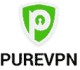
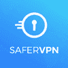
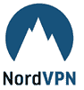
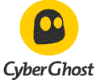
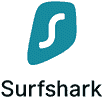
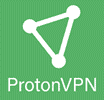
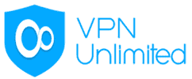
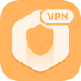
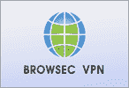

# 最佳 16 无日志 VPN（2020 更新）

> 原文： [https://www.guru99.com/no-log-vpn.html](https://www.guru99.com/no-log-vpn.html)

没有日志 VPN 工具不会使用网络交换用户信息。 少日志软件提供了一种通过 Internet 连接设备的安全方式。 这些软件不会存储您的数据，因此即使您的网络受到破坏，它们也很可靠。

以下是精选的顶级无日志 VPN 工具，以及流行的功能和最新的下载链接。

### 1）PureVPN

 

PureVPN 工具提供了一种安全的方式来访问 Internet 上的任何内容。 使用此工具，您可以在浏览 Internet 时保持受保护的状态。 PureVPN 不存储您的 VPN IP，以及您连接到服务器的特定时间。

**功能：**

*   它在 140 多个国家/地区拥有 2,000 多台服务器。
*   该软件提供无限带宽。
*   允许拆分隧道，您可以在其中通过 VPN 或 ISP 选择数据连接方法。
*   24 小时友好的现场支持
*   通过优化具有安全文件共享的服务器来提供支持 P2P 的服务。

**下载链接：** [https://www.purevpn.com/](https://www.purevpn.com/)

### 2）更安全的 VPN

SaferVPN 为 Windows，iOS，Mac，Android，Firefox 和 Chrome 提供无缝的 VPN 应用程序。 它允许您隐藏您的个人信息。 SaferVPN 可防止窥探者，黑客和网络诈骗。

**Features:**

*   它在 34 个以上的国家/地区拥有 700 多个高速服务器。
*   该软件不会记录您的 VPN 和源 IP 地址，DNS 查询，元数据和浏览历史记录。
*   帮助您在任何不安全的公共 Wi-Fi 热点上保护所有有价值的数据和个人信息
*   允许您从世界任何地方访问被阻止的站点，在线流，应用程序游戏和智能电视。
*   提供无限的服务器切换。
*   帮助您使用 Telegram，Whatsapp 和 Viber 等应用程序安全地呼叫其他人。

**下载链接：** [https://www.safervpn.com/](https://www.safervpn.com/)

### 3）NordVPN

 

NordVPN 是不跟踪，收集或共享数据的软件。 它在 Android，Windows，Apple，macOS 和 Linux 上可用。 您可以享受快速连接而无需缓冲。

**Features:**

*   在 60 多个国家/地区拥有 5700 台 NordVPN 服务器
*   该软件不存储会话信息，使用的带宽，IP 地址，流量数据和会话详细信息
*   提供双 VPN 或基于 VPN 的洋葱。
*   NordVPN 不会使日志活动保持在线状态。
*   提供 24/7 产品支持。

**下载链接：** [https://nordvpn.com](https://nordvpn.com)

### 4）ExpressVPN

 

ExpressVPN 可以防止三封信机构和骗子对 Internet 浏览进行保护。 它提供对音乐，社交媒体和视频的无限制访问，因此这些程序永远不会记录 IP 地址，浏览历史记录，DNS 查询或流量目标。

**Features:**

*   在 94 个国家/地区的 160 个地点提供服务器
*   连接到 VPN，没有任何带宽限制。
*   使用防泄漏和加密功能提供在线保护。
*   隐藏 IP 地址并加密网络数据，以确保安全。
*   Assistance is available 24/7 via email as well as live chat.
*   Pay with Bitcoin and use Tor in order to access hidden sites.

**下载链接：** [https://www.expressvpn.com/](https://www.expressvpn.com/)

### 5）Cyber​​ Ghost

 

Cyber​​Ghost 软件可为您提供安全的 P2P 洪流。 您可以取消阻止所有流服务。 它使您可以加密在线连接并增强安全性和数字隐私。 每当您连接到新的 Internet 连接时，Cyber​​Ghost 工具都会自动提供保护。

**Features:**

*   Having 4900 servers in more than 59 countries
*   允许访问 NoSpy 服务器。
*   使用最新的 256 位 AES 加密技术加密数据
*   允许您同时连接七个设备
*   提供无限带宽
*   Cyber​​ Ghost VPN 允许您将隐私放在首位，并保护您免受数据挖掘者和黑客的攻击。

**下载链接：** [https://www.cyberghostvpn.com/zh_CN/](https://www.cyberghostvpn.com/en_US/)

### 6）冲浪鲨

 

Surfshark 提供对网络内容的快速安全访问。 它使您的位置保密，并确保敏感数据的安全。 该软件提供安全的隧道协议，例如 OpenVPN 和 IKEv2。

**Features:**

*   50 多个国家/地区的 800 多台服务器
*   允许特定应用&网站绕过 VPN
*   隐藏您的真实 IP 地址以保护您的机密性
*   该软件不会记录您的 IP，WebRTC 并防止 DNS 泄漏。

**下载链接：** [https://surfshark.com](https://surfshark.com)

### 7）ProtonVPN

ProtonVPN 使您能够匿名使用 Web，取消阻止网站&加密您的 Internet 连接。 它使用高速的瑞士 VPN 服务器来保护您的隐私。

**功能：**

*   超过 436 台服务器，可在 33 多个国家/地区使用。
*   它具有完善的前向保密性密码，可以实现更好的加密。
*   匿名 VPN 服务使您无需监视即可使用 Internet。
*   它可以与 tor 匿名网络集成。
*   在冰岛和瑞士等国家/地区，通过安全的核心网络传递用户流量。

**下载链接：** [https://protonvpn.com/](https://protonvpn.com/)

### 8）定位器

Unlocator 允许您不受任何限制地维护隐私来上网。 每当您使用此软件时，您的网络连接都会被加密，并且所有网络活动都将保持安全。

**Features:**

*   Unlocator 在 36 个国家/地区拥有服务器
*   它支持 58 种设备和平台。
*   一键式隐私和安全性
*   通过智能 DNS 流轻松提供 VPN 的隐私
*   没有 IP DNS 或 WebRTC 泄漏，可以有效地保护您的隐私。

**下载链接：** [https://unlocator.com/](https://unlocator.com/)

### 9）突击

 

Astrill 是另一种无日志记录 VPN 软件，可让您与家庭网络上的多个设备（包括 Xbox，Roku Boxes，PS4 和 Boxee）共享 VPN 连接。 它允许您通过 5 个同时连接将整个家庭或办公室连接到 VPN。

**Features:**

*   遍布 113 个城市和 64 个国家/地区的服务器
*   SSL 加密可确保网络流量安全
*   将设备连接到任何服务器
*   提供无限的服务器切换
*   通过 SSL 加密帮助您保护 Internet 流量免受任何黑客和间谍的侵害
*   软件支持比特币

**下载链接：** [https://www.astrill.com/](https://www.astrill.com/)

### 10）VPN 无限

 

无论您使用信用卡数据还是个人密码，VPN Unlimited 都能提供安全性。 它可以保护您的个人数据免受第三方和黑客的攻击。 这是建立与其安全服务器的安全虚拟连接的有效方法。

**Features:**

*   它拥有超过 400 台超高速服务器。
*   超过 70 个位置的服务器
*   最多连接 5 台设备
*   保护您的隐私，更改您的 IP 地址。
*   无论使用 Wi-Fi，都可提供全面的安全性。

**下载链接：** [https://www.vpnunlimitedapp.com/](https://www.vpnunlimitedapp.com/)

### 11）F-安全自由

F-Secure Freedom 通过将其重新定位到其他位置来隐藏您的 IP 地址。 该软件可保护在线银行，电子商务交易，税收，浏览和流媒体的安全。 它还使您可以访问地理封锁的内容。

**功能：**

*   提供无限带宽
*   F-Secure 可轻松访问受地理限制的内容
*   使用该软件无需注册或帐户。
*   阻止您的互联网提供商跟踪您和您的在线活动。

**下载链接：** [https://www.f-secure.com/en/home/products/freedome](https://www.f-secure.com/en/home/products/freedome)

### 12）HexaTech

 

HexaTech 提供了安全，私密的访问方式，可以访问您在世界各地的所有内容。 借助 HexaTech VPN，您将获得具有军事级加密的安全连接，以保护您免受各种网络攻击。

**Features:**

*   安全地访问 Wi-Fi 网络
*   阻止恼人的广告客户，您的 ISP，黑客阻止您在线跟踪您的私人在线体验。
*   自动阻止所有在线威胁。
*   提供智能网络预防
*   使用此工具无需注册或记录

**下载链接：** [https://www.hexatechvpn.com/](https://www.hexatechvpn.com/)

### 13）Bitdefender VPN

Bitdefender VPN 是计算机专家和独立实验室认可的安全软件。 它为您的网络提供了真实的保护。 该软件可帮助您保护家庭和企业免受网络威胁。

**Features:**

*   在 150 多个国家/地区拥有 5 亿台服务器。
*   防止所有类型的 IP 泄漏。
*   没有任何数据保留法律
*   基于云的多设备集中控制
*   防止恶意软件和黑客尝试在您系统中的漏洞

**下载链接：** [https://www.bitdefender.com/](https://www.bitdefender.com/)

### 14）浏览器

 

Browsec 允许您访问任何地方的任何站点。 该软件可保护您的数据免受嗅探器的侵害。 它提供了在各种设备（包括计算机，iOS 或 Android 移动设备）上的匿名浏览的功能。 它是与所有主流浏览器（例如 Chrome，Firefox 和 Opera）兼容的工具。

**Features:**

*   在 36 个国家/地区拥有超过 400 台服务器
*   访问受地理限制的内容
*   提供快速的电子邮件支持
*   如果 VPN 服务器不可用，出于安全考虑，它将终止连接。
*   它具有智能设置功能，可让您在访问某些网站时隐藏自己的身份。

**下载链接：** [https://browsec.com/en/](https://browsec.com/en/)

### 15）Hidemyass

Hidemyass 提供安全的银行交易。 您可以获得物联网网络的 VPN 保护。 它使用户能够保持匿名并加密在线流量。 Hidemyass 是用于流和 P2P 共享的专用无日志 VPN 工具。

**Features:**

*   它在 290 多个位置中拥有 980 多个 VPN 服务器。
*   允许使用安全的公共 Wi-Fi 浏览。
*   通过隐藏搜索和浏览历史记录来提供隐私。
*   取消阻止受限制的内容而没有任何麻烦

**下载链接：** [https://www.hidemyass.com/en-in/index](https://www.hidemyass.com/en-in/index)

### 16）TigerVPN

 

TigerVPN 允许您访问您想要阻止内容或绕过审查的服务，否则这些服务将无法使用。 该软件提供地理解锁。

**Features:**

*   它在 62 个位置中拥有 300 个 VPN 服务器
*   它通过实时聊天提供快速有效的客户支持
*   它可以帮助您提高游戏或流媒体上的互联网速度。
*   网状 IP 地址以增强隐私性
*   允许您同时保护所有设备

**下载链接：** [https://www.tigervpn.com/](https://www.tigervpn.com/)

### 常问问题

## 💻 How VPN works?

VPN 通过选择 VPN 的专用服务器而不是 Internet 服务提供商（ISP）路由设备的 Internet 连接来工作。 这可以帮助您将数据直接传输到 Internet，因为它直接来自 VPN，而不是计算机。

## 🔐 What is a no-log VPN?

没有日志 VPN 是不使用网络交换用户信息的软件。 少日志软件提供了一种通过 Internet 连接设备的安全方式。 这些工具不会存储您的数据，因此即使您的网络受到威胁，它们也很可靠。

## 💻 How VPN works?

A VPN works by routing your device's internet connection by selecting VPN's private server instead of your internet service provider (ISP). This helps you to transmit data to the internet, as it comes directly from the VPN instead of your computer.

A VPN works by routing your device's internet connection by selecting VPN's private server instead of your internet service provider (ISP). This helps you to transmit data to the internet, as it comes directly from the VPN instead of your computer.

A VPN works by routing your device's internet connection by selecting VPN's private server instead of your internet service provider (ISP). This helps you to transmit data to the internet, as it comes directly from the VPN instead of your computer.

## 🔐 What is a no-log VPN?

No log VPN are software that does not exchange user information using the network. Log less software provides a secure way to connect devices over the internet. These tools do not store your data, so they are reliable even if your network is compromised.

No log VPN are software that does not exchange user information using the network. Log less software provides a secure way to connect devices over the internet. These tools do not store your data, so they are reliable even if your network is compromised.

No log VPN are software that does not exchange user information using the network. Log less software provides a secure way to connect devices over the internet. These tools do not store your data, so they are reliable even if your network is compromised.