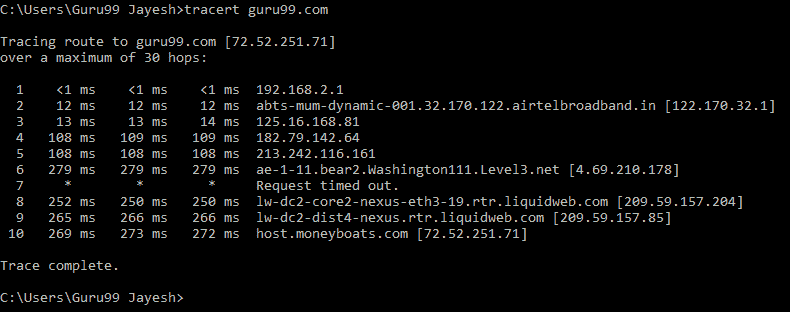

# 热门的 110 个网络安全面试问题&答案

> 原文： [https://www.guru99.com/cyber-security-interview-questions.html](https://www.guru99.com/cyber-security-interview-questions.html)

以下是面试中针对新生和有经验的网络安全认证候选人的常见问题。

**1）什么是网络安全？**

网络安全是指保护硬件，软件和数据免遭攻击者的攻击。 网络安全的主要目的是防止网络攻击，例如访问，更改或破坏敏感信息。

**2）网络安全的要素是什么？**

网络安全的主要要素是：

*   信息安全
*   网络安全
*   运营安全
*   应用安全
*   最终用户教育
*   业务连续性计划

**3）网络安全有哪些优势？**

网络安全的好处如下：

*   它可以保护企业免受勒索软件，恶意软件，社会工程学和网络钓鱼的侵害。
*   它保护了最终用户。
*   它为数据和网络提供了良好的保护。
*   破坏后增加恢复时间。
*   网络安全可防止未经授权的用户。

**4）定义密码术。**

它是一种用于保护信息免受第三方（称为对手）攻击的技术。 密码术允许消息的发送者和接收者读取其详细信息。

**5）区分 IDS 和 IPS。**

入侵检测系统（IDS）检测入侵。 管理员在防止入侵时必须小心。 在入侵防御系统（IPS）中，系统会找到并阻止入侵。

**6）什么是 CIA？**

机密性，完整性和可用性（CIA）是一种流行的模型，旨在开发安全策略。 CIA 模型包含三个概念：

*   机密性：确保仅授权用户才能访问敏感数据。
*   完整性：完整性表示信息格式正确。
*   可用性：确保数据和资源可供需要它们的用户使用。

**7）什么是防火墙？**

它是为网络设计的安全系统。 防火墙设置在监视和控制网络流量的任何系统或网络的边界上。 防火墙通常用于保护系统或网络免受恶意软件，蠕虫和病毒的侵害。 防火墙还可以防止内容过滤和远程访问。

**8）解释跟踪路由**

它是显示数据包路径的工具。 它列出了数据包通过的所有点。 当数据包未到达目的地时，通常使用 Traceroute。 Traceroute 用于检查连接断开或停止的位置或识别故障。

**9）区分 HIDS 和 NIDS。**

| **参数** | **HIDS** | **NIDS** |
| 用法 | HIDS 用于检测入侵。 | NIDS 用于网络。 |
| 它有什么作用？ | 它监视可疑的系统活动和特定设备的流量。 | 它监视网络上所有设备的流量。 |

**10）说明 SSL**

SSL 代表安全套接字层。 它是一种在 Web 服务器和 Web 浏览器之间创建加密连接的技术。 它用于保护在线交易和数字支付中的信息以维护数据隐私。

**11）您所说的数据泄漏是什么意思？**

数据泄漏是指未经授权将数据传输到外界。 数据泄漏通过电子邮件，光学介质，笔记本电脑和 USB 密钥发生。

**12）说明蛮力攻击。 怎么预防呢？**

找出正确的密码或 PIN 码是一种反复试验的方法。 黑客反复尝试使用所有凭据组合。 在许多情况下，暴力攻击是自动进行的，其中软件会自动运行以使用凭据登录。 有多种方法可以防止蛮力攻击。 他们是：

*   设置密码长度。
*   增加密码复杂度。
*   设置登录失败的限制。

**13）什么是端口扫描？**

这是用于识别特定主机上可用的开放端口和服务的技术。 黑客使用端口扫描技术来查找恶意目的信息。

**14）命名 OSI 模型的不同层。**

OSI 模型的七个不同层如下：

1.  物理层
2.  数据链路层
3.  网络层
4.  传输层
5.  会话层
6.  表示层
7.  应用层

**15）什么是 VPN？**

VPN 代表虚拟专用网。 它是用于创建加密和安全连接的网络连接方法。 此方法可保护数据免受干扰，监听和检查。

**16）什么是黑帽黑客？**

黑帽黑客是那些非常了解破坏网络安全性的人。 这些黑客可能出于个人经济利益或其他恶意原因而生成恶意软件。 它们闯入安全的网络以修改，窃取或破坏数据，以使授权的网络用户无法使用该网络。

**17）什么是白帽黑客？**

白帽黑客或安全专家专门从事渗透测试。 它们保护组织的信息系统。

**18）什么是灰色帽子黑客？**

灰帽子黑客是有时会违反道德标准的计算机黑客，但是他们没有恶意。

**19）如何重置受密码保护的 BIOS 配置？**

有多种方法可以重置 BIOS 密码。 其中一些如下：

*   卸下 CMOS 电池。
*   通过使用该软件。
*   通过使用主板跳线。
*   通过利用 MS-DOS。

**20）什么是 MITM 攻击？**

MITM 或中间人是攻击者拦截两个人之间的通信的一种攻击。 MITM 的主要目的是访问机密信息。

**21）定义 ARP 及其工作过程。**

它是用于查找与 IPv4 地址关联的 MAC 地址的协议。 该协议充当 OSI 网络和 OSI 链路层之间的接口。

**22）说明僵尸网络。**

它是由互联网连接的许多设备，例如服务器，移动设备，IoT 设备和受恶意软件控制的 PC。

**23）SSL 和 TLS 之间的主要区别是什么？**

两者之间的主要区别在于 SSL 验证发送方的身份。 SSL 可帮助您跟踪与之通信的人。 TLS 提供了两个客户端之间的安全通道。

**24）CSRF 的缩写是什么？**

CSRF 代表跨站点请求伪造。

**25）什么是 2FA？ 如何在公共网站上实施？**

TFA 代表两因素身份验证。 识别访问在线帐户的人员是一个安全过程。 仅在向身份验证设备提供证据后才授予用户访问权限。

**26）解释非对称和对称加密之间的区别。**

对称加密需要相同的密钥进行加密和解密。 另一方面，非对称加密需要不同的密钥进行加密和解密。

**27）XSS 的完整形式是什么？**

XSS 代表跨站点脚本。

**28）解释 WAF**

WAF 代表 Web 应用程序防火墙。 WAF 用于通过过滤和监视 Web 应用程序与 Internet 之间的传入和传出流量来保护应用程序。

**29）什么是黑客行为？**

黑客攻击是发现计算机或专用网络中的弱点以利用其弱点并获得访问权限的过程。

例如，使用密码破解技术来访问系统。

**30）谁是黑客？**

黑客是指发现并利用计算机系统，智能手机，平板电脑或网络中的弱点来获取访问权限的人。 黑客是具有计算机安全知识的经验丰富的计算机程序员。

**31）什么是网络嗅探？**

网络嗅探是用于分析通过网络发送的数据包的工具。 这可以通过专用软件程序或硬件设备来完成。 嗅探可用于：

*   捕获敏感数据，例如密码。
*   窃听聊天消息
*   通过网络监控数据包

**32）DNS 监视的重要性是什么？**

雍域很容易感染恶意软件。 您需要使用 DNS 监视工具来识别恶意软件。

**33）定义腌制过程。 加盐有什么用？**

盐腌是通过使用特殊字符来延长密码长度的过程。 要使用盐腌，了解盐腌的整个机制非常重要。 撒盐是为了保护密码。 它还可以防止攻击者在整个系统中测试已知单词。

例如，将 Hash（“ QxLUF1bgIAdeQX”）添加到每个密码中，以保护您的密码。 它被称为盐。

**34）什么是 SSH？**

SSH 代表安全套接字外壳或安全外壳。 它是一个实用程序套件，可为系统管理员提供安全的方法来访问网络上的数据。

**35）SSL 协议是否足以确保网络安全？**

SSL 验证发件人的身份，但是一旦将数据传输到服务器，它就不提供安全性。 最好使用服务器端加密和散列来保护服务器免遭数据泄露。

**36）什么是黑盒测试和白盒测试？**

*   黑匣子测试：这是一种隐藏内部结构或程序代码的软件测试方法。
*   白盒测试：一种软件测试方法，其中测试人员知道其内部结构或程序。

**37）解释网络安全漏洞。**

漏洞是指威胁者可以利用的软件代码中的弱点。 它们最常见于诸如 SaaS（软件即服务）软件的应用程序中。

**38）说明 TCP 三向握手。**

它是网络中用于在本地主机和服务器之间建立连接的过程。 此方法要求客户端和服务器在开始通信之前协商同步和确认数据包。

**39）定义术语残余风险。 应对风险的三种方法是什么？**

在发现和消除威胁之后，它是一种平衡风险暴露的威胁。

应对风险的三种方法是：

1.  减少它
2.  避开它
3.  接受。

**40）定义渗透。**

数据泄露是指未经授权从计算机系统传输数据。 该传输可以是手动的，并且可以由具有物理访问计算机权限的任何人执行。

**41）什么是网络安全漏洞？**

漏洞利用是黑客以未经授权的方式访问数据的一种方法。 它被合并到恶意软件中。

**42）渗透测试是什么意思？**

这是检查目标上可利用漏洞的过程。 在 Web 安全中，它用于增强 Web 应用程序防火墙。

**43）列出一些常见的网络攻击。**

以下是黑客可以用来破坏网络的常见网络攻击：

*   恶意软件
*   网络钓鱼
*   密码攻击
*   拒绝服务
*   中间的人
*   偷渡式下载
*   恶意广告
*   流氓软件

**44）如何使用户身份验证过程更安全？**

为了验证用户，他们必须提供其身份。 ID 和密钥可用于确认用户的身份。 这是系统授权用户的理想方式。

**45）解释跨站点脚本的概念。**

跨站点脚本是指一种网络安全漏洞，其中恶意脚本被注入到网站中。 当攻击者允许不受信任的源将代码注入 Web 应用程序时，就会发生此攻击。

**46）命名在所有设备之间广播信息的协议。**

Internet 组管理协议或 IGMP 是在游戏或视频流中使用的通信协议。 它有助于路由器和其他通信设备发送数据包。

**47）如何保护电子邮件？**

使用密码算法来保护电子邮件，信用卡信息和公司数据。

**48）公共 Wi-Fi 有哪些风险？**

公共 Wi-Fi 有许多安全问题。 Wi-Fi 攻击包括业障攻击，嗅探，战争驾驶，蛮力攻击等。

公共 Wi-Fi 可能会识别通过网络设备传递的数据，例如电子邮件，浏览历史记录，密码和信用卡数据。

**49）什么是数据加密？ 为什么它在网络安全中很重要？**

数据加密是一种技术，发件人将消息转换为代码。 它仅允许授权用户访问。

**50）解释 Diffie-Hellman 与 RSA 之间的主要区别。**

Diffie-Hellman 是在两方之间交换密钥时使用的协议，而 RSA 是一种基于称为私钥和公钥的两个密钥工作的算法。

**51）什么是远程桌面协议？**

远程桌面协议（RDP）由 Microsoft 开发，它提供 GUI 来通过网络连接两个设备。

用户使用 RDP 客户端软件来实现此目的，而其他设备必须运行 RDP 服务器软件。 该协议是专门为远程管理和访问虚拟 PC，应用程序和终端服务器而设计的。

**52）定义前向保密性。**

转发保密是一种安全措施，可确保在长期密钥被泄露的情况下唯一会话密钥的完整性。

**53）解释加密中 IV 的概念。**

IV 代表初始向量是一个任意数字，用于确保将相同的文本加密为不同的密文。 加密程序每个会话仅使用一次此号码。

**54）解释流密码和分组密码之间的差异。**

| **Parameter** | **流密码** | **分组密码。** |
| 它是如何工作的？ | 流密码在小型明文单元上运行 | 块密码适用于大型数据块。 |
| 代码要求 | 它需要更少的代码。 | 它需要更多代码。 |
| 按键用法 | 密钥仅使用一次。 | 重用密钥是可能的。 |
| 应用 | 安全套接字层。 | 文件加密和数据库。 |
| Usage | 流密码用于实现硬件。 | 分组密码用于实现软件。 |

**55）给出一些对称加密算法的示例。**

以下是对称加密算法的一些示例。

*   RCX
*   河豚
*   Rijndael（AES）
*   的

**56）ECB 和 CBC 的缩写是什么？**

ECB 的完整形式是电子密码本，CBC 的完整形式是密码块链接。

**57）解释缓冲区溢出攻击。**

缓冲区溢出攻击是一种利用试图将更多数据写入固定长度存储块的进程的攻击。

**58）定义间谍软件。**

间谍软件是一种旨在窃取有关组织或个人数据的恶意软件。 该恶意软件可能会损坏组织的计算机系统。

**59）什么是假冒？**

这是一种将用户帐户分配给未知用户的机制。

**60）您所说的 SRM 是什么意思？**

SRM 代表安全性参考监视器，它为计算机驱动程序提供例程，以授予对对象的访问权限。

**61）什么是计算机病毒？**

病毒是未经用户同意而执行的恶意软件。 病毒会消耗计算机资源，例如 CPU 时间和内存。 有时，该病毒会在其他计算机程序中进行更改，并插入其自己的代码以损害计算机系统。

计算机病毒可用于：

*   访问私人数据，例如用户 ID 和密码
*   向用户显示烦人的消息
*   计算机中的数据损坏
*   记录用户的击键

**62）您对 Authenticode 表示什么？**

Authenticode 是一种识别 Authenticode 签名软件的发布者的技术。 它允许用户确保该软件是正版软件，并且不包含任何恶意程序。

**63）定义 CryptoAPI**

CryptoAPI 是加密 API 的集合，允许开发人员在安全的网络上创建项目。

**64）说明保护 Web 服务器安全的步骤。**

请按照以下步骤保护您的 Web 服务器：

*   更新文件的所有权。
*   保持您的网络服务器更新。
*   禁用 Web 服务器中的其他模块。
*   删除默认脚本。

**65）什么是 Microsoft Baseline Security Analyzer？**

Microsoft Baseline Security Analyzer 或 MBSA 是图形和命令行界面，提供查找丢失的安全更新和配置错误的方法。

**66）什么是道德黑客？**

道德黑客是一种提高网络安全性的方法。 通过这种方法，黑客可以修复计算机或网络的漏洞和弱点。 有道德的黑客使用软件工具来保护系统。

**67）解释社会工程及其攻击。**

社会工程学是用来说服人们透露机密信息的术语。

主要有三种类型的社会工程攻击：1）基于人的攻击； 2）基于移动的攻击； 3）基于计算机的攻击。

*   基于人的攻击：他们可能伪装成真正的用户，要求更高的权限以泄露组织的私人和机密信息。
*   基于计算机的攻击：在这种攻击中，攻击者发送虚假电子邮件来损害计算机。 他们要求人们转发此类电子邮件。
*   基于移动的攻击：攻击者可能会将 SMS 发送给其他人并收集重要信息。 如果有任何用户下载恶意应用程序，则可能会滥用它来访问身份验证信息。

**68）什么是 IP 和 MAC 地址？**

IP 地址是 Internet 协议地址的缩写。 Internet 协议地址用于唯一标识计算机或设备，例如打印机，计算机网络上的存储磁盘。

MAC 地址是媒体访问控制地址的首字母缩写。 MAC 地址用于唯一标识网络接口，以便在网络的物理层进行通信。

**69）蠕虫是什么意思？**

蠕虫是一种从一台计算机复制到另一台计算机的恶意软件。

**70）说明病毒和蠕虫之间的区别**

| **Parameter** | **病毒** | **蠕虫** |
| 他们如何感染计算机？ | 它将恶意代码插入特定的文件或程序。 | 使用电子邮件客户端生成它的副本并传播。 |
| 相依性 | 病毒需要宿主程序才能起作用 | 它们不需要任何主机即可正常运行。 |
| 与文件链接 | 它与.com，.xls，.exe，.doc 等链接。 | 它与网络上的任何文件链接。 |
| 影响速度 | 它比蠕虫慢。 | 与病毒相比，速度更快。 |

**71）列出一些用于数据包嗅探的工具。**

以下是一些用于数据包嗅探的工具。

*   Tcpdump
*   基斯梅特
*   Wireshark
*   网络矿工
*   斯尼夫

**72）解释防病毒传感器系统**

防病毒软件是用于识别，防止或删除计算机中存在的病毒的软件工具。 它们执行系统检查并定期增加计算机的安全性。

**73）列出嗅探攻击的类型。**

各种类型的嗅探攻击包括：

*   协议嗅探
*   网络密码嗅探
*   应用层嗅探
*   TCP 会话窃取
*   局域网嗅探
*   ARP 嗅探

**74）什么是分布式拒绝服务攻击（DDoS）？**

这是多台计算机攻击网站，服务器或任何网络资源的攻击。

**75）解释会话劫持的概念。**

TCP 会话劫持是滥用有效的计算机会话。 IP 欺骗是会话劫持的最常见方法。 在这种方法中，攻击者使用 IP 数据包在网络的两个节点之间插入命令。

**76）列出会话劫持的各种方法。**

会话劫持的各种方法有：

*   使用数据包嗅探器
*   跨站点脚本（XSS 攻击）
*   IP 欺骗
*   盲目攻击

**77）什么是黑客工具？**

黑客工具是计算机程序和脚本，可以帮助您发现和利用计算机系统，Web 应用程序，服务器和网络中的弱点。 市场上有各种各样这样的工具。 其中一些是开源的，而另一些是商业解决方案。

**78）解释蜜罐及其类型。**

Honeypot 是一个诱骗的计算机系统，它记录与用户的所有交易，交互和操作。

蜜罐分为两类：1）生产蜜罐和 2）研究蜜罐。

*   生产蜜罐：旨在捕获真实信息，以供管理员访问漏洞。 通常将它们放置在生产网络中以提高其安全性。
*   Research Honeypot：研究机构和组织使用它的唯一目的是研究后帽子社区针对不同网络的动机和策略。

**79）命名常用的加密工具。**

可用于加密的工具如下：

*   RSA
*   fish 鱼
*   AES
*   三重 DES

**80）什么是后门？**

这是一种恶意软件类型，其中绕过了安全机制以访问系统。

**81）通过电子邮件发送登录凭据是否正确？**

通过电子邮件发送登录凭据是不正确的，因为如果您在邮件中向某人发送了用户名和密码，则遭受电子邮件攻击的可能性就很高。

**82）解释 80/20 的联网规则？**

此规则基于网络流量的百分比，其中所有网络流量的 80％应该保留在本地，而其余流量应路由到永久 VPN。

**83）定义 WEP 破解。**

它是用于无线网络中的安全漏洞的一种方法。 WEP 破解有两种类型：1）主动破解和 2）被动破解。

**84）什么是各种 WEP 破解工具？**

众所周知的 WEP 破解工具是：

*   空袭
*   Web 解密
*   基斯梅特
*   WEPC 机架

**85）什么是安全审核？**

安全审核是对应用程序和操作系统的内部检查，以检查是否存在安全漏洞。 审计也可以通过逐行检查代码来完成。

**86）说明网络钓鱼。**

它是一种用于从其他用户获取用户名，密码和信用卡详细信息的技术。

**87）什么是纳米级加密？**

纳米加密是一个研究领域，可为计算机提供强大的安全性并防止其被黑客入侵。

**88）定义安全测试？**

安全测试被定义​​为一种软件测试，可确保软件系统和应用程序免受任何可能造成重大损失的漏洞，威胁和风险的影响。

**89）说明安全扫描。**

安全扫描涉及识别网络和系统漏洞，并在以后提供降低这些风险的解决方案。 可以对手动扫描和自动扫描都执行此扫描。

**90）命名可用的黑客工具。**

以下是有用的黑客工具的列表。

*   Acunetix
*   Web 检查
*   大概
*   Netsparker
*   愤怒的 IP 扫描器：
*   打 p 套房
*   Savvius

**91）渗透测试在企业中的重要性是什么？**

这是渗透测试的两个常见应用。

*   股票交易所，投资银行等金融部门希望保护其数据的安全，而渗透测试对于确保安全至关重要。
*   如果软件系统已经被黑客入侵，并且组织希望确定系统中是否仍然存在任何威胁，以避免将来遭到黑客入侵。

**92）渗透测试的缺点是什么？**

渗透测试的缺点是：

*   渗透测试无法找到系统中的所有漏洞。
*   渗透测试人员的时间，预算，范围和技能受到限制。
*   数据丢失和损坏
*   停机时间长，这会增加成本

**93）解释安全威胁**

安全威胁被定义为可以窃取机密数据并损害计算机系统和组织的风险。

**94）什么是身体威胁？**

物理威胁是事件的潜在原因，可能导致计算机系统丢失或物理损坏。

**95）举例说明非人身威胁**

以下是非人为威胁的一些示例：

*   敏感信息丢失
*   系统数据丢失或损坏
*   网络安全违规
*   破坏依赖计算机系统的业务运营
*   非法监视计算机系统上的活动

**96）什么是特洛伊木马病毒？**

Trojan 是黑客和网络窃贼使用的一种恶意软件，用于访问任何计算机。 在这里，攻击者使用社交工程技术在系统上执行木马。

**97）定义 SQL 注入**

这是一种使恶意 SQL 语句中毒到数据库的攻击。 它可以帮助您利用设计不良的 Web 应用程序中的设计缺陷来利用 SQL 语句执行恶意 SQL 代码。 在许多情况下，攻击者可以升级 SQL 注入攻击以执行其他攻击，即拒绝服务攻击。

**98）根据开放式 Web 应用程序安全项目（OWASP）列出安全漏洞。**

每个开放式 Web 应用程序安全项目的安全漏洞如下：

*   SQL 注入
*   跨站点伪造
*   不安全的密码存储
*   身份验证和会话管理中断
*   传输层保护不足
*   未经验证的重定向和转发
*   无法限制 URL 访问

**99）定义访问令牌。**

访问令牌是一种凭证，系统使用它来检查是否应将 API 授予特定对象。

**100）说明 ARP 中毒**

ARP（地址解析协议）中毒是一种网络攻击，用于将 IP 地址转换为网络设备上的物理地址。 主机在网络上发送 ARP 广播，​​并且收件人计算机以其物理地址进行响应。

ARP 中毒会将虚假地址发送到交换机，以便它可以将虚假地址与网络上正版计算机的 IP 地址相关联并劫持流量。

**101）列出非物理威胁的常见类型。**

以下是各种非物理威胁：

*   木马
*   广告软件
*   蠕虫
*   间谍软件
*   拒绝服务攻击
*   分布式拒绝服务攻击
*   病毒
*   按键记录器
*   未经授权访问计算机系统资源
*   网络钓鱼

**102）解释 TCP 连接的顺序。**

TCP 连接的顺序为 SYN-SYN ACK-ACK。

**103）定义混合攻击。**

混合攻击是词典方法和蛮力攻击的结合。 这种攻击通过更改带有符号和数字的字典单词来破解密码。

**104）什么是 Nmap？**

Nmap 是用于查找网络和进行安全审核的工具。

**105）EtterPeak 工具有什么用？**

EtterPeak 是一种网络分析工具，用于嗅探网络流量数据包。

**106）网络攻击有哪些类型？**

网络攻击有两种类型：1）基于 Web 的攻击，2）基于系统的攻击。

**107）列出基于 Web 的攻击**

一些基于 Web 的攻击包括：1）SQL 注入攻击，2）网络钓鱼，3）蛮力，4）DNS 欺骗，4）拒绝服务和 5）字典攻击。

**108）举例说明基于系统的攻击**

基于系统的攻击示例如下：

*   病毒
*   后门
*   机器人
*   虫

**109）列出网络攻击者的类型**

有四种类型的网络攻击者。 他们是：1）网络犯罪分子，2）黑客主义者，3）内部威胁，4）国家资助的攻击者。

**110）定义意外威胁**

它们是组织员工意外完成的威胁。 在这些威胁中，员工会无意间删除任何文件或与外部人员或业务合作伙伴共享机密数据，这超出了公司的政策范围。