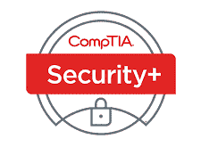
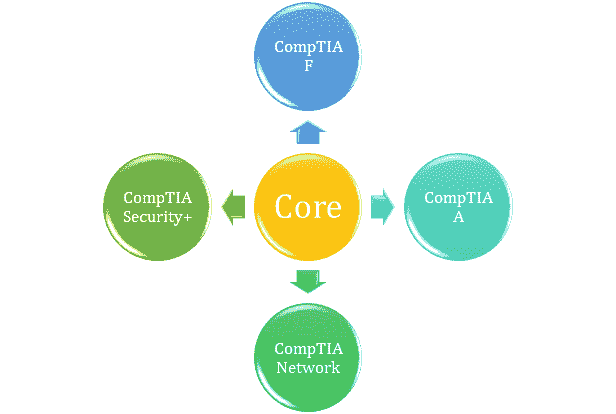
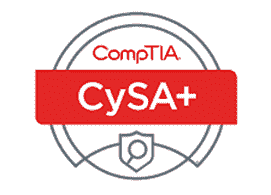
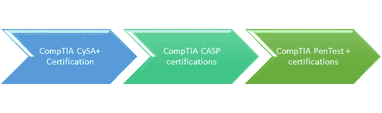
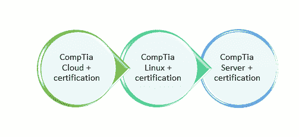
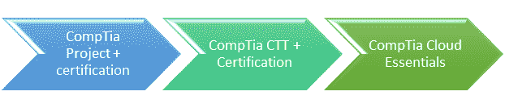

# CompTIA 认证指南：职业道路&学习资料

> 原文： [https://www.guru99.com/comptia-certification-guide.html](https://www.guru99.com/comptia-certification-guide.html)

## 什么是 CompTIA 认证？

**CompTIA 认证**课程被认为是 IT 行业最受信任的凭证之一，因为它准确反映了员工的成功。 CompTIA 吸引了来自世界各地的国际焦点小组和 IT 领导者，他们定义了各种认证计划，并帮助您创建 CompTIA 认证考试。

在此 CompTIA 认证教程中，您将学习：

*   [核心认证](#1)
*   [网络安全认证](#2)
*   [基础结构](#3)
*   [其他认证](#4)
*   [CompaTIA 证书](#5)的好处

## 如何通过 CompTIA 认证开始职业？

如果您希望通过享誉全球的认证并已为雇主所接受的著名认证来开始 IT 事业，那么 CompTIA 认证是最好的开始方式。 该认证可帮助您建立批判性思维和解决问题的能力，这在现代企业网络中至关重要。

认证计划采用易于学习的方式，以适应您的时间和便利。 您可以进行自学或基于指导的学习。 它也适用于学生，教育者，技术专家，企业家和企业，其座右铭是为非赢利性事业推进信息技术。

## 核心认证

核心技能认证分为 CompTIA F +，CompTIA A +，CompTIA Network +，CompTIA Security +。

### CompTIA F +认证

该证书适用于所有希望转行至 IT 领域的人。 该认证具有 IT 术语和 IT 概念的基本知识，数据库的基础知识，理解应用程序软件的概念以及应用程序体系结构的目标。 您还将了解有关无线网络的必要基础结构集。

链接： [https://www.comptia.org/certifications/it-fundamentals](https://www.comptia.org/certifications/it-fundamentals)

### CompTIA A +认证

在此认证中，您将获得有关硬件及其组件，网络和各种网络协议的知识，学习配置和连接平板电脑，智能手机等移动设备。 您还将学习使用决策树对硬件和软件进行故障排除，学会在 Linux，Windows，iOS，Windows 等各种操作系统上工作。

链接： [https://www.comptia.org/certifications/a](https://www.comptia.org/certifications/a)

### CompTIA Network +认证：

该认证可帮助您获得信息技术基础架构和网络协议方面的专业知识。 通过此认证，您可以设计网络，配置，管理网络以及对网络进行故障排除。 您可以确定当前网络系统的优点和陷阱。

链接： [https://www.comptia.org/certifications/network](https://www.comptia.org/certifications/network)

### CompTIA 安全性+认证

Security +认证专注于安全管理，风险管理和缓解，威胁管理和入侵方面的最新趋势。 通过此认证，作为网络安全专业人员，您可以识别和报告安全事件。

**链接：** [https://www.comptia.org/certifications/security](https://www.comptia.org/certifications/security)

## 网络安全认证

### CompTIA CySA +认证

该网络安全分析师认证将帮助您通过行为分析来对抗网络安全，对抗恶意软件和高级持续威胁。 您可以在分析的帮助下配置威胁检测工具。 通过此认证，您将学习，威胁和漏洞管理以及对网络威胁的响应。

链接： [https://www.comptia.org/certifications/cybersecurity-analyst](https://www.comptia.org/certifications/cybersecurity-analyst)

### CompTIA CASP 认证：

高级安全从业人员认证将帮助专业人员实施网络安全策略和框架的解决方案。 对于想要深入研究该技术而不进行管理的网络安全专业人员来说，这是一项高级认证。

您将学习和研究诸如区块链，加密货币的先进技术，进行企业安全操作。 它可以帮助您学习将技术与企业安全性集成在一起。

链接： [https://www.comptia.org/certifications/comptia-advanced-security-practitioner](https://www.comptia.org/certifications/comptia-advanced-security-practitioner)

### CompTIA PenTest +认证

渗透测试证书适用于网络安全专业人员进行测试，漏洞评估并保护网络免受网络攻击。 您将学习计划基于合规性的评估。 您将学习在移动设备，台式机，服务器等平台上执行渗透测试。

链接： [https://www.comptia.org/certifications/pentest](https://www.comptia.org/certifications/pentest)

 

## 基础架构

以下是 CompTIA 的重要云认证：

### CompTIA Cloud +认证：

云认证将帮助您在云平台上执行安全或网络功能。 这是唯一与供应商无关的认证，它将验证您维护和优化您的云基础架构服务的技能。

链接： [https://www.comptia.org/certifications/cloud](https://www.comptia.org/certifications/cloud)

### CompTIA Linux +认证

CompTIA Linux 认证对组织中使用 Linux 的所有 IT 专业人员都是有益的。 许多企业正在云平台，网络安全，移动应用程序，Web 应用程序以及移动和 Web 应用程序管理中使用 Linux。

链接： [https://www.comptia.org/certifications/linux](https://www.comptia.org/certifications/linux)

### CompTIA Server +认证

服务器认证是唯一涵盖最新服务器技术（例如虚拟化，存储，安全性和故障排除）的行业认证。 该证书可验证您作为服务器管理员的技能。 该认证将帮助您了解服务器体系结构，实现服务器的网络数据安全性并支持存储设备。

链接： [https://www.comptia.org/certifications/server](https://www.comptia.org/certifications/server)

 

## 附加认证

这是其他一些重要的 CompTIA 认证

### CompTIA 项目+认证：

对于在组织中管理中小型项目的所有经理或业务专业人员而言，项目证书非常有用。 除了管理技能，您还将学习一些通过此认证计划处理中小型项目所需的项目管理技术。

链接： [https://www.comptia.org/certifications/project](https://www.comptia.org/certifications/project)

### CompTIA CTT +认证

经过认证的技术培训师证书可传授训练团队所需的所有技能。 该认证验证了培训师所需要的工具和技术知识。 您将成为有效的沟通者，并在一大群观众面前充满信心地学习管理课堂培训，进行考试。

链接： [https://www.comptia.org/certifications/ctt](https://www.comptia.org/certifications/ctt)

### CompTIA Cloud Essentials

云基础知识认证适用于不熟悉 IT 概念并了解基本云原理的业务专业人员。 本课程对企业计划适应云平台并管理供应商关系的所有非 IT 专业人员都非常有用。

链接： [https://www.comptia.org/certifications/cloud-essentials](https://www.comptia.org/certifications/cloud-essentials)

## CompTIA 证书的好处

*   CompTIA 认证为 IT 职业机会提供了奖励。
*   CompTIA 认证可帮助您提高当前职位的工作安全性。
*   帮助专业人员在 IT 工作场所中获得尊重和信誉。
*   CompTIA 认证可以为利润丰厚的政府和军​​事技术职位敞开大门。
*   拥有 CompTIA 认证有助于雇用您想要发展 IT 事业的经理。
*   聘请获得 CompTIA 认证的客户可以提高客户满意度。
*   拥有 CompTIA 认证的员工可以轻松地提高业务效率。

### 摘要：

*   CompTIA 认证是开始您在 IT 领域的职业的最佳方法。
*   如果您希望通过享誉全球的认证并已为雇主所接受的著名认证来开始 IT 事业，那么 CompTIA 认证
*   CompTIA F +认证适用于所有希望将职业转向 IT 领域的人员。
*   CompTIA Network +认证可帮助您获得信息技术基础架构和网络协议方面的专业知识
*   CompTIA PenTest +认证测试认证是针对网络安全专业人员进行的测试，漏洞评估。
*   Security +认证专注于安全管理，风险管理和缓解，威胁管理和入侵方面的最新趋势。
*   CompTIA CySA +认证可帮助您通过行为分析，打击恶意软件和高级持续威胁来应对网络安全。
*   CompTIA CASP 认证可帮助专业人员实施针对网络安全策略和框架的解决方案。
*   PenTest +认证是渗透测试认证，用于网络安全专业人员进行测试，漏洞评估等。
*   Cloud +认证可帮助您在云平台上执行安全或网络功能
*   Linux 认证对组织中使用 Linux 的所有 IT 专业人员都是有益的
*   服务器+认证证明了您作为服务器管理员的技能。