# 16 本最佳道德黑客书籍（2020 更新）

> 原文： [https://www.guru99.com/best-ethical-hacking-books.html](https://www.guru99.com/best-ethical-hacking-books.html)

道德黑客正在发现计算机系统/网络中的弱点，并提出保护弱点的对策。 道德黑客必须在调查和透明地报告调查结果之前获得计算机所有者的书面许可。

以下是精选的 16 本书，列出了 Ethical Hacking 书籍，这些书籍应该成为提高 Ethical hacker's library 的任何初学者的一部分。

### 1）[黑客：剥削的艺术](https://geni.us/BHGGM)

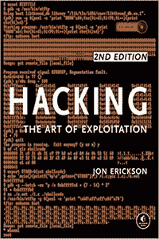

黑客：剥削的艺术是乔恩·埃里克森（Jon Erickson）所写的书。 在本书中，您将从黑客的角度学习 C 编程的基础知识。

您还将了解黑客技术，例如缓冲区溢出，网络通信劫持。 您还将了解绕过保护，利用等的知识。这本书将提供编程，网络通信等的完整介绍。

[Check Latest Price and User Reviews on Amazon](https://geni.us/BHGGM)

* * *

### 2）[黑客手册 2：渗透测试实用指南](https://geni.us/TzleP)

Hacker Playbook 为他们提供了他们的游戏计划。 由 Peter Kim 撰写。 这本道德黑客手册是分步指南，可教您很多黑客功能。 它还提供了现场实例的动手实例和有用的建议。

本书包括最新的攻击，工具和经验教训。 该经过认证的道德黑客指南进一步概述了实验室的建设。 本书介绍了攻击的测试用例，并提供了更多的自定义代码。

[Check Latest Price and User Reviews on Amazon](https://geni.us/TzleP)

* * *

### 3） [Web 应用程序黑客手册：查找和利用安全漏洞](https://geni.us/s1LC)

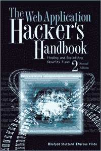

Web 应用程序黑客手册是 Dafydd Stuttard 写的一本书。 该书探讨了 Web 应用程序中采用的各种新技术。 该书向您教授已开发的高级黑客攻击技术，尤其是针对客户端的技术。

该书还涵盖了新的远程处理框架，HTML5，跨域集成技术，UI 纠正，框架破坏，混合文件攻击等。 这本书是最新资源。 关于发现，利用以及防止 Web 应用程序和安全漏洞的关键主题。

[Check Latest Price and User Reviews on Amazon](https://geni.us/s1LC)

* * *

### 4）[渗透测试–黑客动手入门](https://geni.us/9lu0fB)

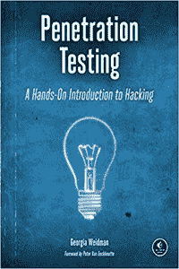

在渗透测试中，安全专家，研究员和培训师由 Georgia Weidman 撰写。 这本书向您介绍了每一个彭特所需要的必要技能和技巧。

您还将了解有关强制和单词列表，测试 Web 应用程序的漏洞，自动执行社交工程攻击，绕过防病毒软件的知识。 您将收集高级信息，例如如何将对一台计算机的访问变成对企业的完全控制。

[Check Latest Price and User Reviews on Amazon](https://geni.us/9lu0fB)

* * *

### 5）[黑客和渗透测试的基础知识：轻松进行道德的黑客和渗透测试](https://geni.us/AgFl12)

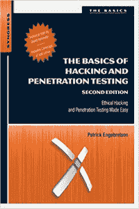

黑客和渗透测试的基础知识由 Patrick Engebretson 撰写。 它介绍了完成渗透测试以从头到尾执行道德规范所需的步骤。

这本书教学生如何利用和解释完成渗透测试所需的黑客工具。 本书的每一章都包含示例和练习，旨在教给学习者如何解释结果并利用这些结果。

[Check Latest Price and User Reviews on Amazon](https://geni.us/AgFl12)

* * *

### 6）[计算机黑客入门指南：如何入侵无线网络，基本安全性和渗透性测试，Kali Linux，这是您的第一个黑客](https://geni.us/mSkPA)

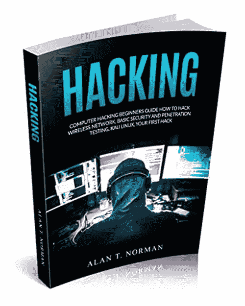

《计算机黑客入门指南》教您如何通过了解黑客的工作原理来保护自己免受最常见的黑客攻击！ 您应该领先于任何犯罪黑客，以学习可以阅读本书的这些技术。

本书涵盖了犯罪和道德黑客都使用的方法和工具。 您将在此处找到的所有主题将向您展示如何破坏信息安全以及如何在系统中发现网络攻击。 您要保护的内容。

[Check Latest Price and User Reviews on Amazon](https://geni.us/mSkPA)

* * *

### 7）[黑客&画家：计算机时代的大创意](https://geni.us/qucD)

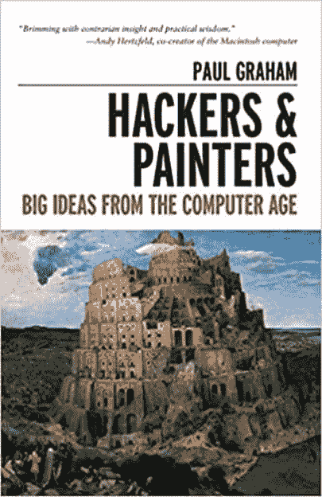

黑客& Painters：Big Ideas 是 Paul Graham 所写的书。 这本黑客书籍将对我们的思维方式，工作方式，技术开发方式以及生活方式产生重大影响。

这本书包括软件设计的重要性，如何赚钱，编程语言复兴，数字设计，互联网初创公司等主题。

本书包括软件设计中美的重要性，如何赚钱，编程语言复兴，开源运动，数字设计等。

[Check Latest Price and User Reviews on Amazon](https://geni.us/qucD)

* * *

### 8）[高级渗透测试：黑客入侵世界上最安全的网络](https://geni.us/wdDAB)

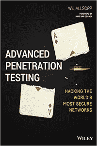

先进的渗透测试：入侵世界上最安全的网络使黑客攻击远远超出了 Kali Linux 和 Metasploit。

该书使您可以集成社会工程，编程和漏洞利用。 该书提供了针对和破坏高安全性环境的多学科方法。

它还包含一些关键技术，这些技术可以更准确地描述系统的防御情况。 使用 VBA，C，Java，JavaScript 等的自定义编码示例

[Check Latest Price and User Reviews on Amazon](https://geni.us/wdDAB)

* * *

### 9）[黑客：计算机黑客，安全测试，渗透测试和基本安全性](https://geni.us/i4g0)

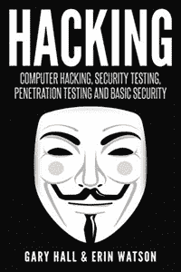

黑客：计算机黑客，安全测试是 Gary Hall 写的一本书。 本书从基本概念原理一直到复杂的技术方法。 它是书面的，适合初学者和高级学习者。

这本道德黑客书籍使用了初学者可以理解的语言，而不会遗漏计算机黑客所需的复杂细节。 这本书是了解如何黑客以及如何保护设备的理想参考书。

[Check Latest Price and User Reviews on Amazon](https://geni.us/i4g0)

* * *

### 10）[硬件黑客：制造和破坏硬件的历险记](https://geni.us/1JTEaqd)

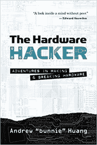

硬件黑客是安德烈·黄（Andre Huang）所写的书。 作者分享了他在制造和开放硬件方面的经验。 它使您能够创建具有启发性和令人信服的职业回顾。

这本个人论文和访谈集涵盖了与逆向工程和知识产权比较相关的主题。 它包括开放硬件挂毯与社会之间的实践。

本书是有关制造和综合的高度详细的文章。 您可以处理与开源硬件有关的问题。

[Check Latest Price and User Reviews on Amazon](https://geni.us/1JTEaqd)

* * *

### 11） [BackTrack 5 无线渗透测试入门指南](https://geni.us/Jz8yUB)

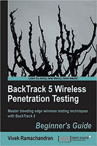

BackTrack 5 无线渗透测试入门指南是 Packt 出版商编写的书。 使用帮助书，您将掌握概念并了解在实验室中执行无线攻击的技术。

在这种道德规范中，描述了每一次新的攻击。 该书以实验室练习的形式提供了此信息，并详细说明了所有相关步骤。 实际上，您将在组织中实施各种攻击。

[Check Latest Price and User Reviews on Amazon](https://geni.us/Jz8yUB)

* * *

### 12）[黑客：计算机黑客地下指南，包括无线网络，安全性，Windows，Kali Linux 和渗透测试](https://geni.us/GwG2)

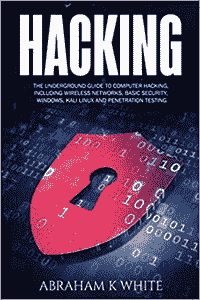

黑客：《计算机黑客地下指南》是亚伯拉罕·K·怀特（Abraham K White）写的一本书。 本书提供了用于黑客攻击的最佳工具，并指出了保护系统的方法。 本书提供了带有命令提示的说明。

该书涵盖了诸如入侵无线网络，道德黑客，破解加密之类的主题。 您还将了解其他无线黑客资源以及与黑客相关的其他主题。

[Check Latest Price and User Reviews on Amazon](https://geni.us/GwG2)

* * *

### 13）[骇客骇客：向可以攻克骇客的专家学习](https://geni.us/iApBkY)

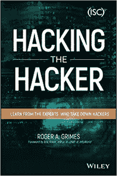

《骇客骇客》这本书是由 Roger A. Grimes 写的。 它带您进入网络安全领域。 它向您显示幕后情况，并向您介绍前线的男女。

这本书包含来自世界顶级白帽黑客，安全研究人员，作家和领导人的信息。 本书介绍了有助于维护世界安全的人员和做法。

[Check Latest Price and User Reviews on Amazon](https://geni.us/iApBkY)

* * *

### 14）[灰色帽子黑客：道德黑客手册](https://geni.us/qWRZYIN)

Gray Hat 骇入了这本书，其中包含 13 个新章节。 本书可帮助您通过安全专家小组的可靠方法来加强网络并避免数字灾难。

您还将学习最新的道德黑客技巧和策略。 它还提供了经过实践检验的补救措施，案例研究等。这本书有助于说明黑客如何获得访问权限并超越不同的网络设备。

[Check Latest Price and User Reviews on Amazon](https://geni.us/qWRZYIN)

* * *

### 15）[哈希破解：密码破解手册](https://geni.us/gxM42Ek)

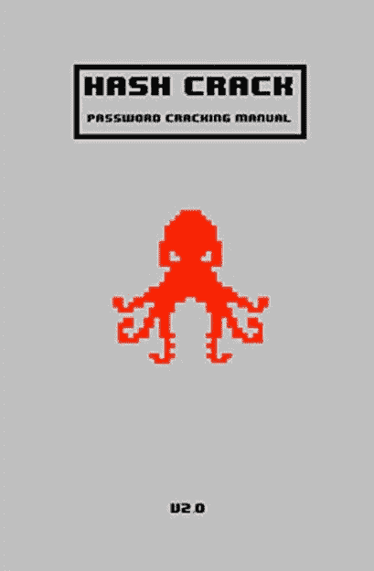

哈希破解：密码破解手册由 Joshua Picolet 编写。 它是有关密码恢复（破解）方法，工具和分析技术的扩展参考书。

面向渗透测试人员和网络安全专业人员的基本和高级方法的汇编。 它可以帮助您评估其组织的网络安全性。 哈希破解手册包含语法和示例。

[Check Latest Price and User Reviews on Amazon](https://geni.us/gxM42Ek)

* * *

### 16）[掌握黑客（信息收集的艺术&扫描）](https://geni.us/HNId)

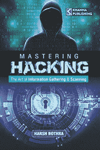

掌握黑客技术是 Harsh Bothra 所写的书。 通过使用本书，您将能够了解现代的渗透测试框架。

它还讲授技术，发现所有类型的漏洞，修补程序等等。 本书旨在提供简化方法中的最佳实践和方法。 这将对技术和非技术读者都有帮助。

[Check Latest Price and User Reviews on Amazon](https://geni.us/HNId)