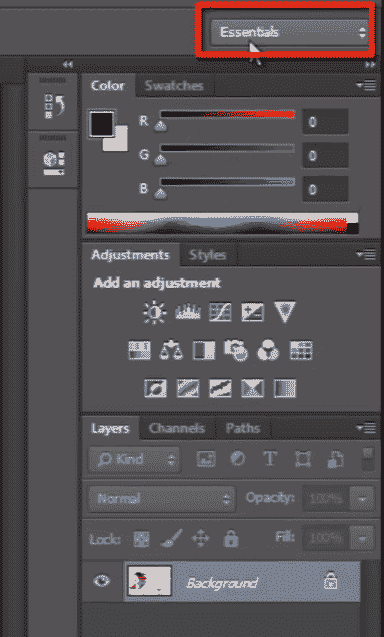
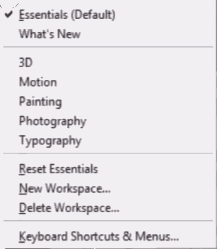
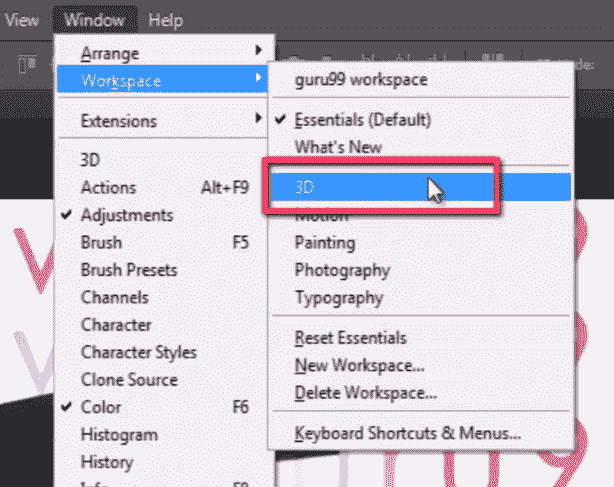
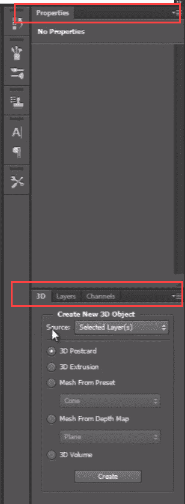
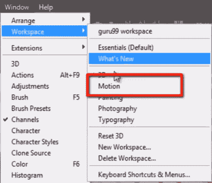
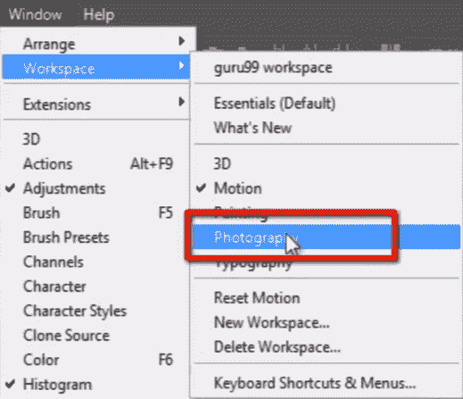
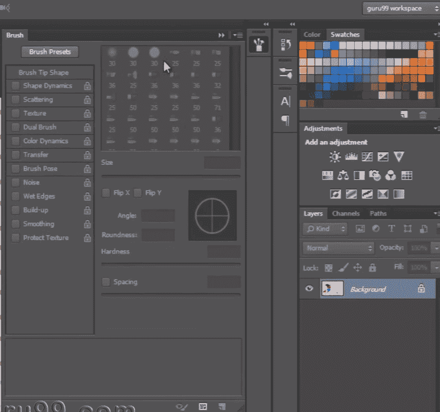
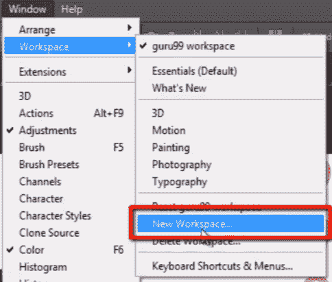
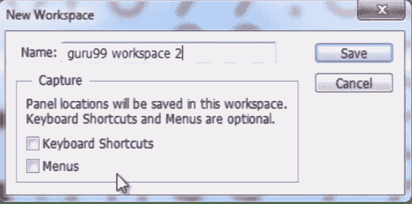

# 如何在 PhotoShop CC 中使用工作区

> 原文： [https://www.guru99.com/how-to-use-workspace-in-photoshop-cc.html](https://www.guru99.com/how-to-use-workspace-in-photoshop-cc.html)

### Photoshop 工作区

在本文和下面的视频中，我们将学习如何根据您的工作流创建“工作区”以自定义 photoshop。

我们所有人都将 photoshop 用于不同目的，例如照片编辑，图形设计，3D 设计，视频编辑。

Photoshop 可以做很多事情，并且您可以在 Photoshop 中自定义自己的工作流程，并且可以单独处理要在工作流程中看到或不希望看到的所有面板。

根据您的工作目的，可能会有一些您永远不会使用的面板，并且您根本不需要查看这些面板。

因此，您可以根据自己的工作来创建自己的 Adobe 工作区。

## Photoshop 的默认工作区

Right now i'hv got a default workspace known as “essentials”. By default, Photoshop uses a workspace known as Essentials. If you've never chosen a different workspace, you're using the Essentials workspace.

## Photoshop 的其他工作区

我们可以在窗口菜单的第二个顶部找到工作区面板。

您可以在此处看到一些针对特定行业的预设居留区工作区，例如 3D，图形和 Web，运动，绘画和摄影。

## 选择不同的工作区-摄影

如果我想在 Photoshop 中处理 3D，那么我将在工作区面板中选择 3D，并使所有与 3D 相关并且需要编辑 3D 对象的特定面板可见。

例如 3D 面板，属性，图层，通道。 所有这些都与编辑 3D 对象有关。

## 运动工作区

让我们来看看运动工作区。 如果我想做一些动画，那么这个工作空间对此很有用。 在这里，您可以看到时间线面板和其他一些视频和动画所需的面板。

## 摄影工作区

现在转到工作区并签出摄影工作区，如果我们要进行一些照片编辑，这将非常有用。 它会显示与摄影目的有关的面板。

## 我的工作区

这些都是一些预设的居留区工作区。 但由于我的工作方法，现在我想创建自己的工作区，我已经知道我需要哪些面板以及不需要处理哪些面板。

看这里。 我已经创建了自己的工作空间，称为“ guru99 工作空间”。

在这个工作区中，我有一些选定的面板。 例如“画笔，历史记录，角色，图层，通道，路径，调整，色板和颜色”。

## 如何创建一个新的自定义工作区。

让我们对 Photoshop 的默认面板布局进行一些快速更改。 根据需要安排所有单独的面板。

完成后。 转到“窗口菜单”，然后转到“工作区”，然后单击“新工作区”。

现在给您自己的工作区命名。

在这里，您可以将任何键盘快捷键保存在工作区中，甚至可以设置菜单。 您可以使菜单仅在工作区中可见。

然后点击保存。

现在您可以看到您的工作区已创建。

而且，如果您不熟悉 Photoshop，则需要花一些时间养成自己的习惯，并意识到按照您的工作方式哪些面板有用，哪些面板没有用。