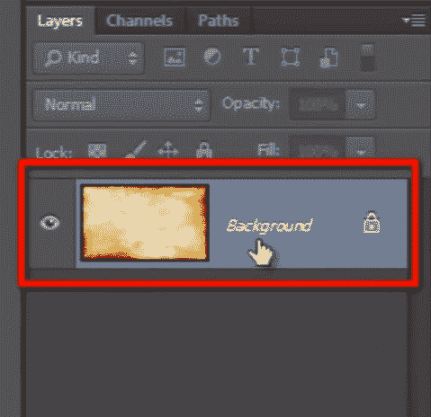
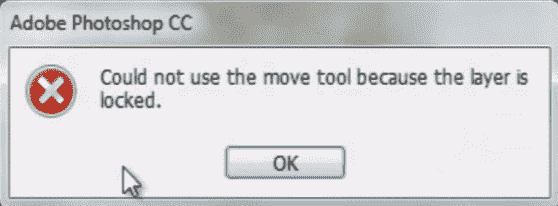
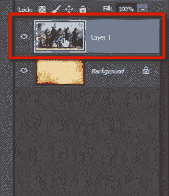
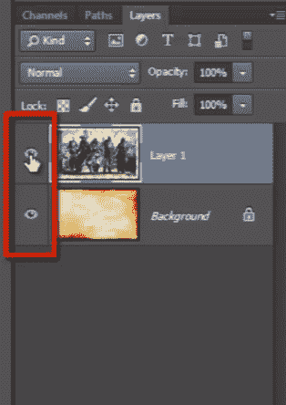
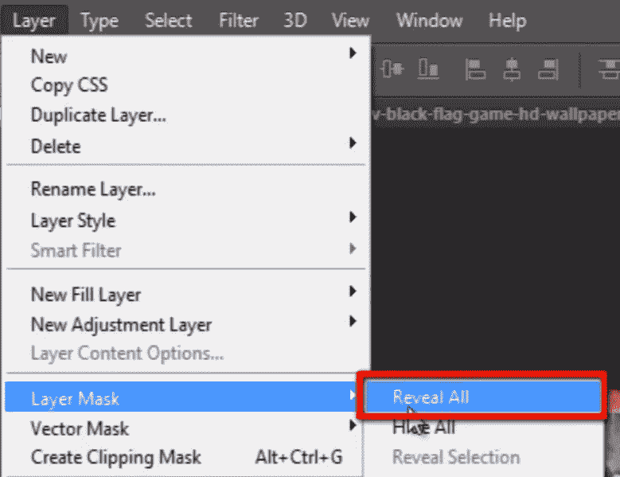
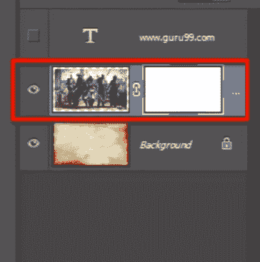
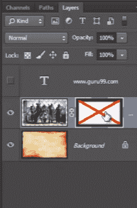

# Photoshop LAYERS 教程

> 原文： [https://www.guru99.com/what-is-layer-photoshop-cc-tutorial.html](https://www.guru99.com/what-is-layer-photoshop-cc-tutorial.html)

 **### Photoshop 中的图层** 

Photoshop 图层允许您通过将图像堆叠在图像顶部来进行无损工作，而无需交互和混合图像像素。

“图层”是使 Photoshop 成为惊人的照片编辑和合成工具的唯一方法。

我们可以随时添加或删除它们

**步骤 1）**不可见层

现在，当您创建图片或在 Photoshop 中打开图片时，它会在“图层”面板中可见。

让我拖出图层面板。

您可以默认看到一个背景层。 

**步骤 2）**解锁层

您会注意到上面有一个锁符号。 因此图层已锁定。 这意味着您不能移动或做类似的事情。 因为该图层已锁定。

因此，要解锁图层，我们有不同的选择。 其中之一是我们可以双击锁定的图层。 它将显示一个弹出窗口，您可以在其中更改该锁定层的名称，然后按 OK。

现在您可以看到我们的 Photoshop 图层已解锁，其名称也已更改。

现在，您可以轻松移动该图层，并且在移动它时，您将看到该图层后面的透明度检查器模式。

这些都表明背景是透明的。 您可以在首选项中对其进行自定义。

现在，让我们看看另一种解锁图层的选项。

您只需要抓住该锁定符号并将其拖到垃圾桶中，即可轻松解锁该层。

现在这是背景层，要添加更多图像，请按 Shift 键并将图像拖放到中心。 

**步骤 3）**已创建新层

您可以在“图层”面板中看到发生了什么。 它在图层面板的顶部创建了一个新图层，而不是在 Photoshop 背景图层中添加或混合像素。

**步骤 4）**使用眼形符号关闭图层

在图层面板中，您可以看到每个图层都有一个眼睛符号。 通过单击眼睛符号，可以打开或关闭图层。

这是两个“图像”，现在让我们检查一下“文本”。 添加一些文本，然后查看``图层''面板，在顶部创建一个新的文本图层。

因此，图层系统的主要目的是将每一项都保留在不同的图层中，并且不要让它们相互破坏或混合。 

**步骤 5）**图层蒙版

现在让我们谈谈“图层蒙版”图层的最大特点之一。 Photoshop 图层蒙版可以隐藏或显示图层的像素而不删除它们。 如果没有遮罩的帮助，如果我们要隐藏图像的某些部分，则必须使用工具面板中的橡皮擦工具删除该部分。 图层蒙版是附加到该图层的另一个图像。

您可以通过单击该图标来获取图层蒙版，或者另一个选项是选择图层并打开“图层”菜单，然后转到图层蒙版并选择“全部显示”。

您注意到它添加了一个充满白色的新层，白色将揭示图像上的所有内容。

 

**步骤 6）**使用“图层蒙版”隐藏部分图像

现在，我想隐藏图像的某些部分，因此不必使用橡皮擦工具，而必须选择画笔工具。 我们可以看到图层蒙版填充有白色，所以我是黑色的 gona 涂料。 您会注意到，使用橡皮擦工具时，我所做的事情与以前一样。

但这并没有删除任何内容，我只是使用 photoshop 中的图层蒙版隐藏了这些像素。

看一下图层蒙版。 它会在该区域上涂成黑色，而黑色则隐藏了图层上的内容。

如果按 Shift 键并单击该图层蒙版，则该蒙版将被禁用，并显示该图层上的所有内容。 那意味着我什么也没删除。

因此，这是 photoshop 图层蒙版的基本概念。 

**步骤 7）**混合模式

混合模式使您可以将任何层与其下面的另一层混合。 例如，如果我选择此图层并进入混合模式，然后将其从普通更改为叠加。

看看它如何与背景图像融合。 您可以尝试不同的混合模式。

但好消息是该层不会与其他层混合在一起。 它仍然是分开的。 如果将混合模式更改为普通模式，则可以恢复原来的图像。

这些都是 photoshop 中图层系统的基本概念。

我们可以在图层面板中添加不同的内容，无论是文本，图像，形状还是在最新版本的 Photoshop 中，我们甚至可以在图层面板中添加 3D 模型并对其进行处理。 

Photoshop Layers allow you to work non-destructively by stacking images in top of images without interacting and mixing pixels of images.

“layers” is the only thing that makes the photoshop an amazing photo editing and compositing tool.

We can add them or delete them at any time we want

**Step 1)** Invisible Layer

Now when you create an image or open an image in photoshop it’s visible in layer panel.

Let me drag out layer panel.

You can see bydefault a background layer. 

**Step 1)** Invisible Layer

Now when you create an image or open an image in photoshop it’s visible in layer panel.

**Step 2)** UnLock Layer

You can notice a lock symbol on it. so the layer is locked. It means you can’t move or do anything like that. Because the layer is locked.

So to unlock a layer we have different options. One of them is we can double click on locked layer. It will show you a popup where you can change the name of that locked layer and then press ok.

Now you can see our Photoshop layer is unlocked and its name is also changed.

Now you can easily move the layer and when you move it you will see the transparency checker patter behind the layer.

This all indicates a transparent background. You can customize it in the preferences.

Now let’s see another option to unlock the layer.

You just need to grab that lock symbol and drag it to the trash and it simply unlocks the layer.

Now this is the background layer, to add more images, press shift key and drag and drop the image to the center. 

**Step 2)** UnLock Layer

You can notice a lock symbol on it. so the layer is locked. It means you can’t move or do anything like that. Because the layer is locked.

**Step 3)** New Layer Created

You can see what happened in the layer panel. it has created a new layer on top of layer panel  instead of adding or mixing the pixels with photoshop background layer.

**Step 3)** New Layer Created

You can see what happened in the layer panel. it has created a new layer on top of layer panel  instead of adding or mixing the pixels with photoshop background layer.

**Step 4)** Turn off Layer with Eye Symbol

In layer panel you can see each layer has an eye symbol. by clicking on eye symbol you can turn on or off the layer.

These are two “images” but now let’s check about “text”. add some text and then look into  layer panel, a new text layer is created on the top.

So the main thing about layer system is to keep every single item in different layer and don’t let any of them destroy or mix with each other. 

**Step 4)** Turn off Layer with Eye Symbol

In layer panel you can see each layer has an eye symbol. by clicking on eye symbol you can turn on or off the layer.

**Step 5)** Layer Mask

Now let’s talk about one of the greatest features of layer the "layer mask". Photoshop Layer mask can hide or reveal pixels of a layer without deleting them. Without the help of mask if we want to hide some part of the image then we have to delete that part by using eraser tool in the tools panel. Layer mask is another image attached to the layer.

You can take a layer mask by clicking on this icon or the another option is select the layer and open “layer” menu and go to layer mask and choose ”reveal all”.

You noticed it adds a new layer filled with white color and white color will reveal every thing on image.

 

**Step 5)** Layer Mask

Now let’s talk about one of the greatest features of layer the "layer mask". Photoshop Layer mask can hide or reveal pixels of a layer without deleting them. Without the help of mask if we want to hide some part of the image then we have to delete that part by using eraser tool in the tools panel. Layer mask is another image attached to the layer.

You can take a layer mask by clicking on this icon or the another option is select the layer and open “layer” menu and go to layer mask and choose ”reveal all”.

**Step 6)** Hide part of image with Layer Mask

Now I want to hide some part of the image so for that instead of using the eraser tool you have to choose brush tool. And we can see that the layer mask is filled with white color so I’m gona paint with black color. You can notice that I’m doing the same thing what I have done before when using eraser tool.

But in this I haven’t deleted anything, I’m just hiding those pixels with the use of the layer masking in photoshop .

Look at the layer mask. it’s painted this area with black color and that black color is hiding what is on the layer.

If I press shift key and click on that layer mask then the mask will be disabled and it reveals everything on that layer. that means I have deleted nothing.

So this was the basic concept of photoshop layer mask. 

**Step 6)** Hide part of image with Layer Mask

Now I want to hide some part of the image so for that instead of using the eraser tool you have to choose brush tool. And we can see that the layer mask is filled with white color so I’m gona paint with black color. You can notice that I’m doing the same thing what I have done before when using eraser tool.

But in this I haven’t deleted anything, I’m just hiding those pixels with the use of the layer masking in photoshop .

Look at the layer mask. it’s painted this area with black color and that black color is hiding what is on the layer.

If I press shift key and click on that layer mask then the mask will be disabled and it reveals everything on that layer. that means I have deleted nothing.

**Step 7)** Blending Modes

Blending mode allows you to blend any layer with another below it. For example if I select this layer and go to blending mode and change it to overlay from normal.

Look how it’s blend with the background image. You can try different blend modes.

But the good thing is the layer is not mixing up with the other layer. it is still separated. If I change the blend mode to normal then I can get my original image back as it was before.

These were all the basic concepts of layer system in photoshop.

We can add different things in layer panel, whether it is text, images, shapes, or in the latest version of photoshop, we can add even a 3D model in layer panel and work on it. 

**Step 7)** Blending Modes

Blending mode allows you to blend any layer with another below it. For example if I select this layer and go to blending mode and change it to overlay from normal.