# Photoshop 图层蒙版教程和示例

> 原文： [https://www.guru99.com/how-to-use-layer-mask-photoshop-cc-tutorial.html](https://www.guru99.com/how-to-use-layer-mask-photoshop-cc-tutorial.html)

### 什么是 Photoshop 图层蒙版？

图层蒙版是 Photoshop 工具中非常重要的一部分，它可以隐藏和显示图层的某些部分而不删除它们。

这是非常有效且无损的工作方式。 它可以帮助设计师提高效率和创造力。

让我们尝试在图层蒙版的帮助下制作图像，以便我们可以准确了解图层蒙版的用途。

我想为好莱坞著名电影“复仇者联盟”制作电影海报。 因此，让我们开始吧。

我正在使用这张图片作为海报的背景。

这些都是我们将在此海报中使用的图像。

这是我们的背景层，我们将一张一张地拍摄所有其他图像，并将它们全部设置在背景的天空部分中。

因此，让我们来第一个。 我首先选择钢铁侠。 因为我想把他放在天空的中间

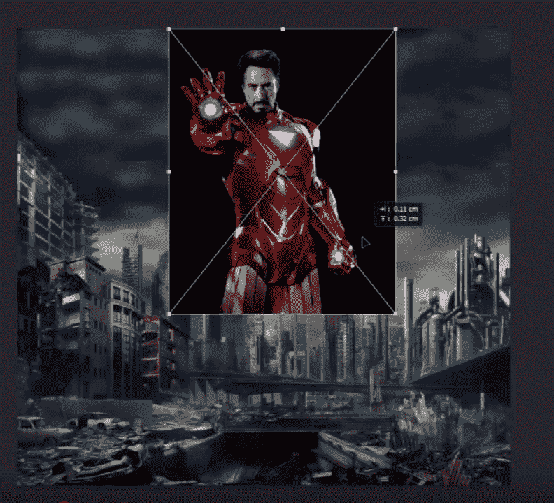

缩放图像并正确设置其位置。

然后为该图像制作一个 Photoshop 图层蒙版。 然后用光滑的圆形刷子抓住刷子工具。 设置画笔大小，然后开始在图像上绘画以隐藏图像中不需要的部分。

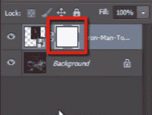

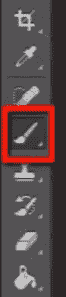

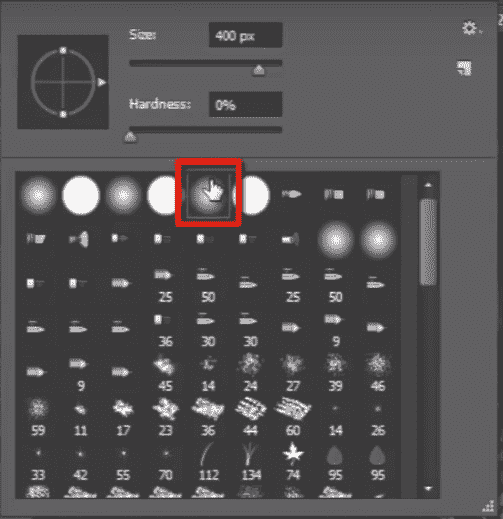

看一下图层蒙版，它会显示您已经绘制过的一些黑色区域，而黑色则隐藏了像素。

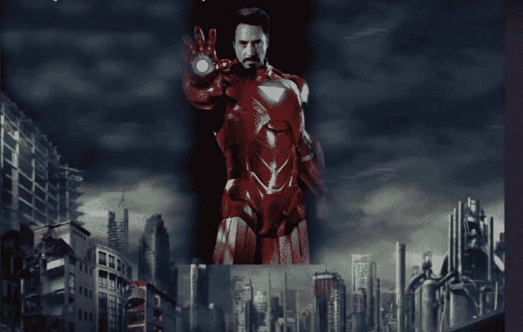

现在下一张图片“美国队长”。 并执行与之前对钢铁侠形象所做的相同过程。

并对我们在此文件中使用的其他 3 张图像再次执行相同的过程。

**让我们加快速度。**

现在，将 Ironman 放在图层面板的顶部。 因为它位于中间部分，因此位于所有其他层的后面看起来并不好。

看到，所有图像的底部边缘仍然很清晰，因此看起来非常糟糕。 因此请抓住画笔工具并使所有底部边缘模糊，以便所有图像看起来都可以正确合并。

完成操作后，选择所有五张图像，然后按 CTRL + G 将它们全部放在一个组中。

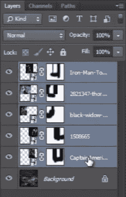

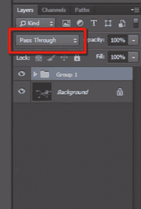

并将该组的混合模式更改为“屏幕”，并使其与天空完美融合。

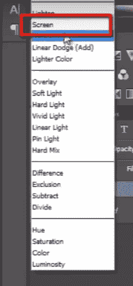

然后借助“曲线”使图像更有效。

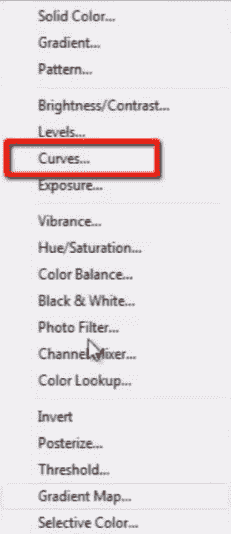

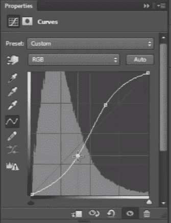

现在我们需要给这张海报一个标题。 我有一张可以在此海报中使用的图像。

缩放并排列图像的位置。

现在为该图像设置一个图层蒙版。 然后开始用黑色和光滑的圆形笔刷在图像的不需要的部分上绘画。

删除名称周围的所有黑色。

然后将混合模式更改为“线性减淡”。

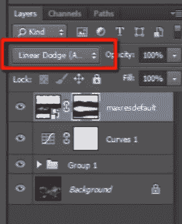

将其向下拖动到曲线图层下方。

现在保存文件并进行查看。

它看起来很棒。

我们借助图层蒙版非常快速，轻松地设计了此海报。

因此，现在只需记住黑色会隐藏像素，而白色则会显示像素。

因此，您现在可以了解 Photoshop 遮罩层工具有多重要。

这是图层蒙版工具，现在转到下一个主题“形状图层”。