# 如何使用 Photoshop 图层样式&效果[示例]

> 原文： [https://www.guru99.com/how-to-use-layer-styles-photoshop-cc-tutorials.html](https://www.guru99.com/how-to-use-layer-styles-photoshop-cc-tutorials.html)

在本文中，我们将学习如何应用 Photoshop 图层样式以及如何在图层之间共享它们，以及如何利用图层样式使我们的内容更具吸引力。

在此图像中看，我已对该单词 **www.guru99.com** 应用了一些图层样式。

在这里，您可以看到一些图层样式，例如“斜角&浮雕”，“描边”，“渐变叠加”和“阴影”。

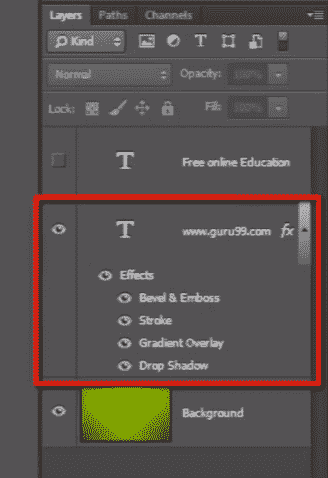

我们可以单独或一起打开或关闭它们。

并且该 fx 图标表示该图层已应用了图层样式。

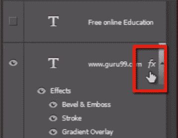

要将图层样式应用于图层，您需要选择图层并转到“图层”菜单，然后转到“图层样式”，然后选择要应用的任何图层样式。

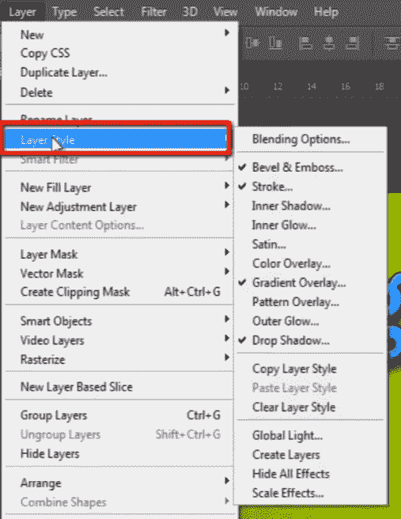

它将打开图层样式面板，您可以在其中根据需要编辑每个图层样式。

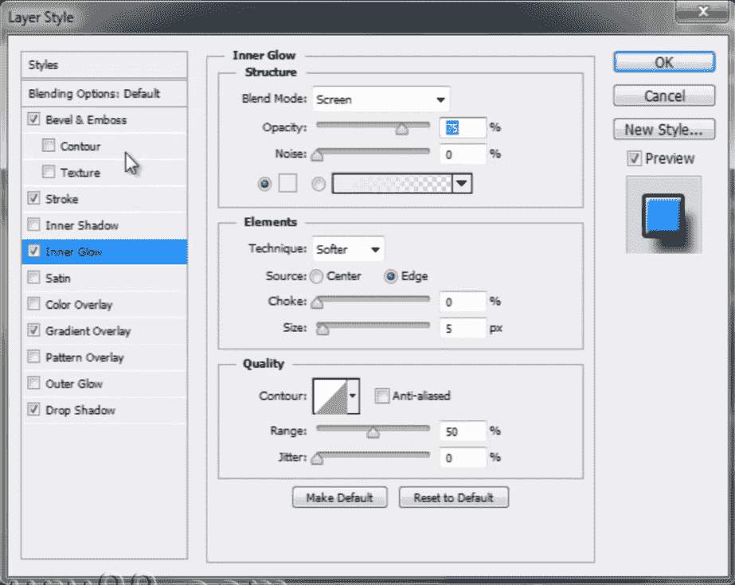

在这里，我已经应用了一些图层样式，例如“斜角&浮雕”，在其中我有一些选择。 我可以轻松地编辑它们。 然后我得到了“笔画”，“渐变叠加”和“拖放阴影”。 所有这些都有自己的和不同的可定制选项。

如果要添加或减去任何图层样式，则只需单击它。

应用图层样式的另一种方法是在图层面板的底部。 通过单击此按钮来查看此 FX 图标，您将拥有与图层菜单中相同的选项。

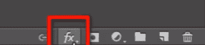

## 共享图层样式

现在，我们来讨论两层之间的共享层样式。

因此，这里还有一个 photoshop 文字样式层“免费在线教育”。 共有多种共享图层样式的方式。

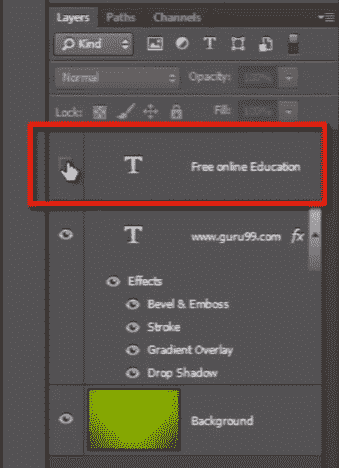

这是一个非常快速的方法。 按住 ALT 键并抓住 fx 图标，然后将其放在要应用相同图层样式的图层上。

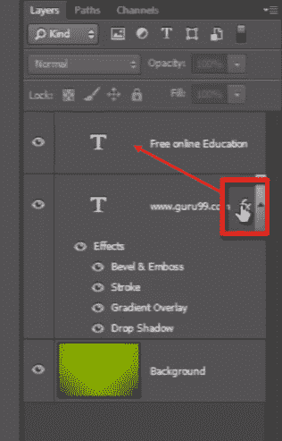

一键复制和粘贴图层样式。

另一种方法是，右键单击具有图层样式的图层，然后选择“复制图层样式”，然后右键单击目标图层，然后选择“粘贴图层样式”。

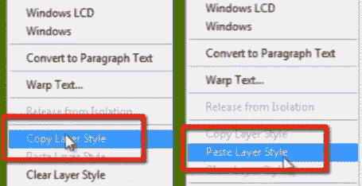

现在，如果您认为自己不喜欢这种图层样式，则可以轻松地抓住“ fx”图标并将其拖动到“垃圾箱”中。 它只会删除图层样式，而不会删除图层本身。

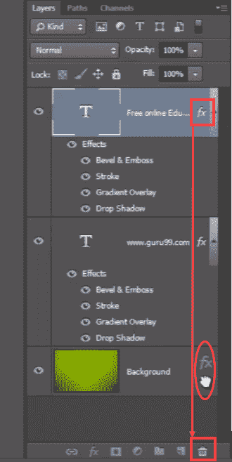

另一种方法是，您只需在图层上单击鼠标右键，然后选择“清除图层样式”，即可清除在该图层上应用的所有图层样式。

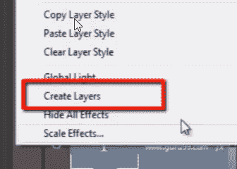

另一重要的事情是您还可以从图层分离图层样式。

为此，您只需要右键单击“ fx”图标并选择“创建图层”。 它将为您应用于图层的每个图层样式创建图层。

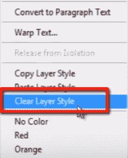

您还可以打开和关闭它们，并且可以将它们作为单独的图层进行处理。

关于图层样式的另一件事是，如果将图层样式应用于文本图层，则可以轻松地对其进行编辑。 因此，请重新输入，您将对新输入的单词产生相同的效果。