# 如何使用形状工具在 Photoshop 中绘制形状

> 原文： [https://www.guru99.com/how-to-use-shape-layer-in-photoshop-cc.html](https://www.guru99.com/how-to-use-shape-layer-in-photoshop-cc.html)

就像钢笔工具一样，形状图层也使用 photoshop 矢量技术。

您将在工具栏中在此处获得形状图层工具。

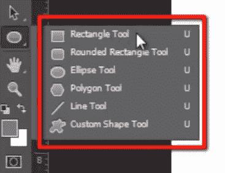

现在单击它，您可以看到各种**形状**，例如；

*   Ractangle 工具
*   圆角矩形工具
*   椭圆工具
*   Polygan 工具
*   线工具
*   自定义形状工具

通过选择这些项目，您可以将它们绘制为常规路径或形状图层。

请参阅选项栏中的第二个位置，您可以看到一个菜单。 它将显示三个绘制形状的选项，例如“路径”，“形状”和“像素”。

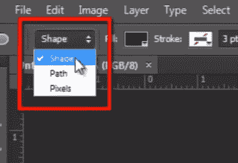

现在，pixel 用像素填充绘制的路径，此选项不使用矢量技术。

并且 path 只会绘制形状的路径，不会填充路径中的任何颜色。

但是在这里我选择了形状选项，您可以在此处看到一些不同的选项。

我可以在此处选择“填充颜色，笔触颜色，笔触类型”以及更多选项。

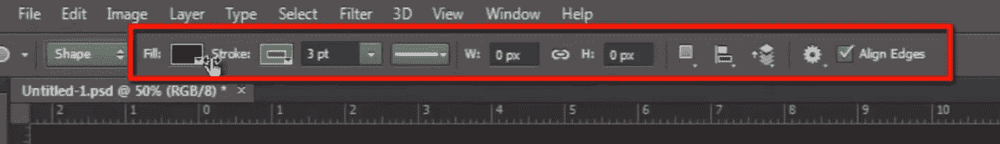

现在绘制形状，并在“图层面板”中看到在其中创建的新图层。

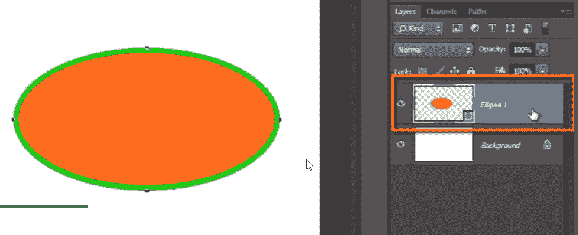

您会在图层上看到一个小路径图标。 表示此图层是形状图层。

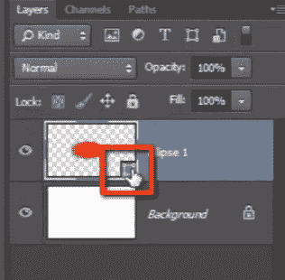

现在抓取“路径选择工具”，您可以单击它。 您可以看到矢量形状的一些控制手柄。

如果要编辑形状的颜色？ 然后只需双击形状图层，即可获得颜色选择器。

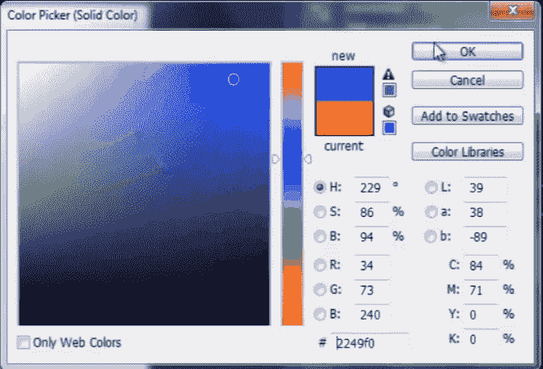

这些是矢量形状，这意味着它们与分辨率无关，并且我可以在任何文档中拖动和使用它们，并且可以缩放它们而不会造成质量损失，因为它们使用的是矢量技术而不是像素技术。

让我们看一下形状工具的有用方面，即“ photoshop 自定义形状工具”。 这为您提供了许多现成的形状，您可以在需要时轻松使用它们。

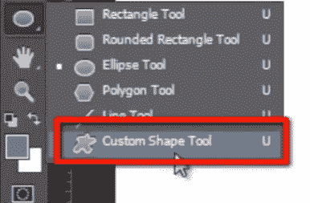

所有这些形状均按不同类别的数量包含在此弹出菜单中，但现在我选择所有这些形状。 这样我就可以在列表中找到所有形状。

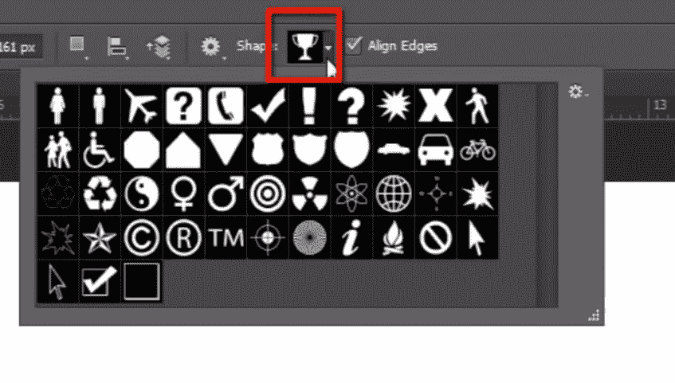

现在，选择您要使用的形状。

要绘制形状，如果您要绘制任何特定尺寸的图形，只需单击工作区即可。 或者，您也可以简单地拖动并绘制形状以创建形状图层。

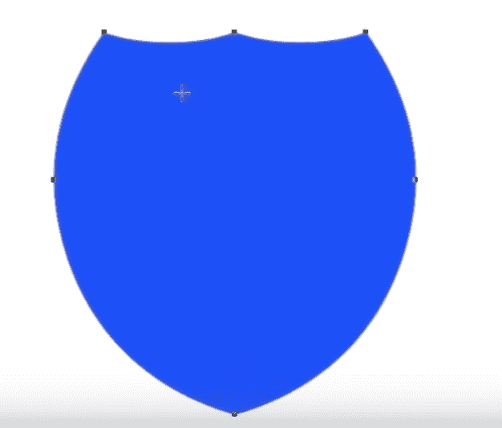

让我们在顶部的选项栏中编辑形状的颜色和笔触属性。

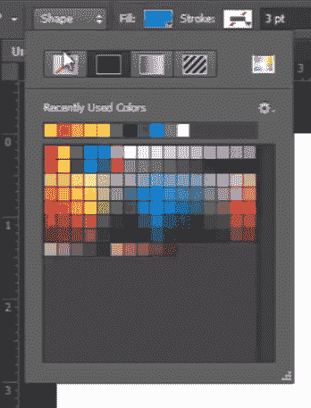

现在，如果我想减去此形状内的某些部分。 然后我将选择“椭圆工具”，然后在此处设置路径查找器功能以减去前部形状并

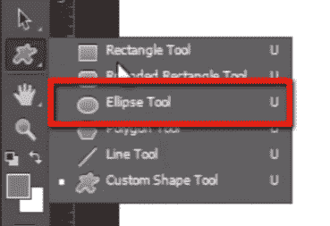

如果我在里面画一个圆，它将从主要形状中减去该面积。 我也可以更改形状的位置。

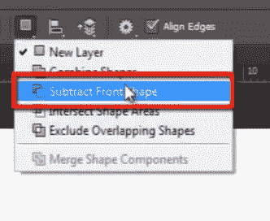

因此，这是有关 Photoshop 中形状图层的简要概述。 您可以在形状层的帮助下创建各种设计，而不会损失任何质量，因为它使用了矢量 photoshop 技术。

现在，让我们继续下一个主题“智能对象”。