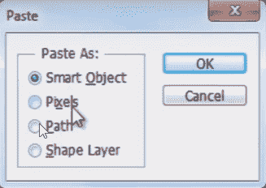
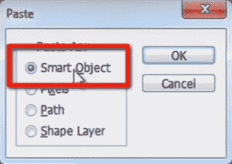
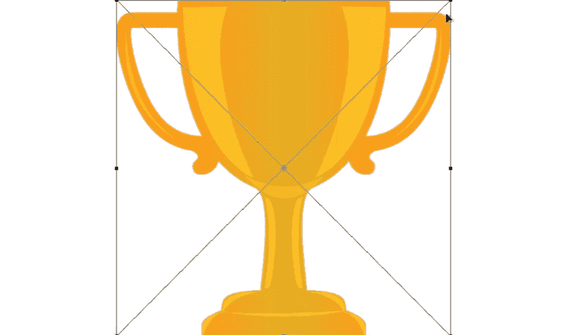
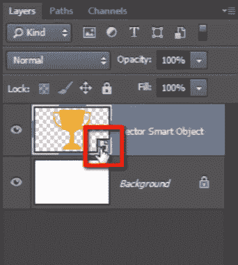
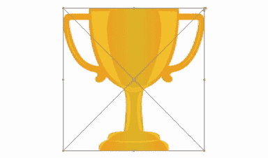
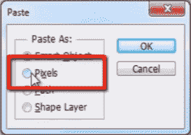
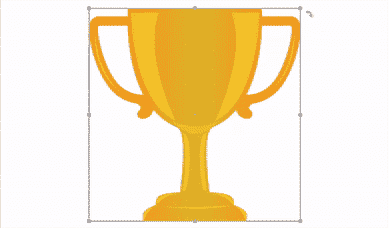
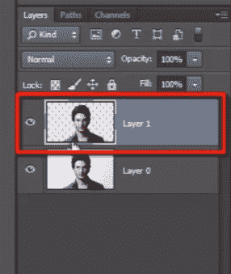

# 什么是智能对象？ 如何在 Photoshop 中使用智能对象？

> 原文： [https://www.guru99.com/how-to-use-smart-object-in-photoshop-cc.html](https://www.guru99.com/how-to-use-smart-object-in-photoshop-cc.html)

### 什么是 Photoshop Smart Object？

即使我们要在文档中进行重新缩放，重新采样，更改其位置或旋转它，Photoshop Smart Object 也不会让任何矢量对象或图像失去质量。

每个设计师都必须了解“智能对象”的好处。

表示您将文档中的任何照片或任何矢量对象带入并缩小并再次放大。 在放大和缩小图像的过程中，如果您不想丢失图像的真实质量，则必须首先将该图像作为“智能对象”

让我们看一个示例，以便您可以真正了解“智能对象”。

在这里，我在 Illustrator 中有一个矢量对象。

我通过按 CTRL + C 复制此对象，然后转到 photoshop 并按 CTRL + V 进行粘贴。

当我将其粘贴到 Photoshop 上时，它提供 4 种不同的选项供您选择，例如“智能对象”，“像素”，“路径” &“形状层”。

这次，我将选择 photoshop 智能对象。

按确定。

因此，这是我们具有良好质量的矢量对象。

在图层面板中看到该图层，该图层在其底角有一个小图标。 这个小图标表示这是一个智能对象。

现在按 CTRL + T 并按比例缩小对象。

再次按 CTRL + T 并将其放大并按 Enter。

您可以在此处看到物体的质量和清晰度与缩小之前一样。 它甚至没有损失 1％的质量。

现在切换此层，然后按 CTRL + V 再次粘贴它。

但是这次我要选择像素。

该对象现在处于原始质量状态。

但是，一旦我们按比例缩小并再次按比例放大，您就可以看到它是如何失去对象的真实质量的。 它已经模糊并且丢失了太多的对象颜色信息。

让我们看看原因，为什么当将对象转换为智能对象时对象不会丢失其信息，以及为什么当它是普通层时会丢失所有信息。

取智能对象层并将其缩小并重新缩放。

您会看到它不会丢失任何颜色信息并且保持清晰，这是因为它嵌入在智能对象内部，这意味着它在导入时是指原始矢量信息，而不是像素信息。

现在，我们来谈谈已导入为像素的对象。

当我们按比例缩小它时，以较小的尺寸显示它不需要太多信息，因此它会丢弃不需要显示的多余信息。

现在，当我们将其按比例放大时，它已经记不起来了，当我们按比例缩小时，它已经扔掉了多余的信息。 这样您就可以了解它是如何失去质量和清晰度的，以及看起来有多糟糕。

如果您是设计师，并且正在 photoshop 中进行合成设计，并且在工作中使用了不同的对象，则需要对其进行重新缩放，重新采样，旋转和重新放置以获得正确的外观，这肯定会降低其真实质量。 如果没有将所有图像转换为“智能对象”。

