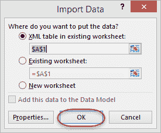
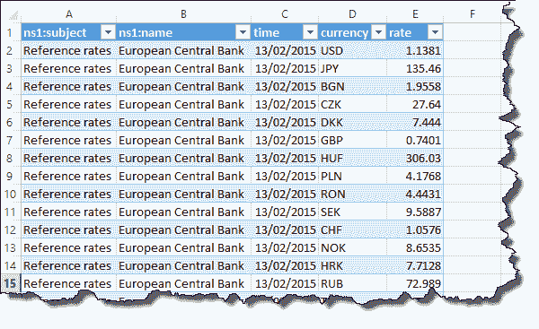
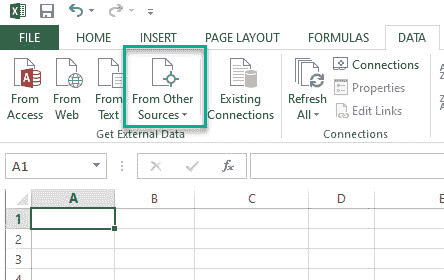
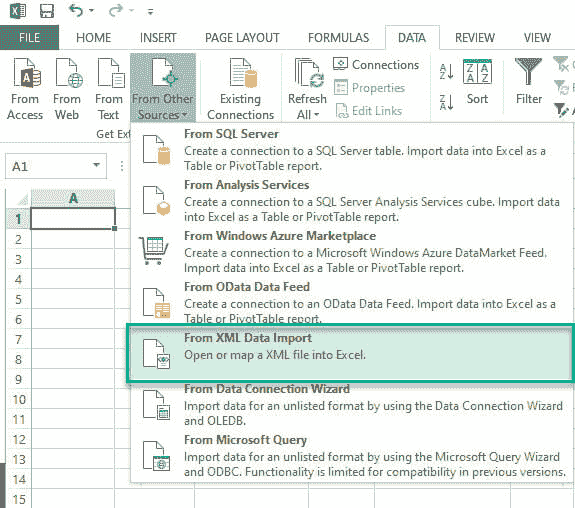
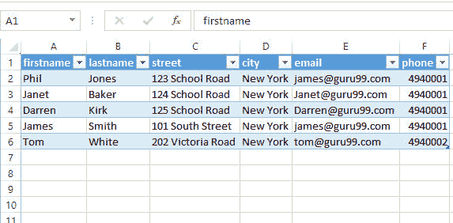

# 如何将 XML 数据导入 Excel [示例]

> 原文： [https://www.guru99.com/connecting-microsoft-excel-to-external-data-sources.html](https://www.guru99.com/connecting-microsoft-excel-to-external-data-sources.html)

数据是任何业务实体的血液。 企业根据业务数据存储要求使用不同的程序和格式来保存数据。 **您可能有一个由数据库引擎提供动力的工资核算程序，您可能会将数据存储在 CSV 文件中，或者甚至是要在 Excel** 中进行分析的网站中。 本文向您展示了如何实现上述目标。

## 什么是外部数据源？

外部数据是您从 excel 外部的源链接/导入 excel 的数据。

外部示例包括以下内容

*   数据存储在 Microsoft Access 数据库中。 这可以来自自定义应用程序的信息，即**工资单，销售点，库存，**等。
*   来自 [SQL](/sql.html) Server 或其他数据库引擎（即 MySQL，Oracle 等）的数据–这可能是来自自定义应用程序的信息
*   来自网站/网络服务–这可能是来自[网络服务](/web-services-tutorial.html)的信息，即来自互联网的货币汇率，股票价格等。
*   文本文件，即 CSV，制表符分隔等–这可能是来自不提供直接链接的第三方应用程序的信息。 这些数据可能包括导出到逗号分隔文件 CSV 等的银行付款。
*   其他类型，例如 HTML 数据，Windows Azure Market Place 等。

## 网站（XML 数据）外部数据源示例

在此示例中，我们假设我们正在交易欧元，并希望从欧洲中央银行 Web 服务获取汇率。 货币汇率 API 链接为 [http://www.ecb.europa.eu/stats/eurofxref/eurofxref-daily.xml](https://www.ecb.europa.eu/stats/eurofxref/eurofxref-daily.xml)

*   打开一个新的工作簿
*   单击功能区栏上的“数据”选项卡
*   点击“来自网络”按钮
*   您将获得以下窗口

1.  在地址中输入 [http://www.ecb.europa.eu/stats/eurofxref/eurofxref-daily.xml](https://www.ecb.europa.eu/stats/eurofxref/eurofxref-daily.xml)
2.  单击执行按钮，您将获得 XML 数据预览
3.  完成后单击“导入”按钮

您将获得以下选项对话框

*   点击确定按钮
*   您将获得以下数据

让我们再举一个例子，这次您的本地 xml 不是 Web 链接的形式。 您可以在下面下载 XML 文件。

[下载 XML 文件](https://drive.google.com/uc?export=download&id=1TNhCKy_2idJ9Umwk5QAtrUNFEeCejBEh)

*   打开一个新的工作簿
*   单击功能区栏上的“数据”选项卡
*   点击“来自其他来源”

*   然后点击“从 XML 数据导入”

*   现在选择 XML 文件

您将获得如上例所示的选项对话框窗口

*   点击确定按钮
*   您将获得以下数据

## 摘要

Excel 具有强大的功能，可让我们分析数字数据并创建可视报告（例如图表）。 您可以利用外部数据导入来创建自己的满足业务报告要求的自定义报告。