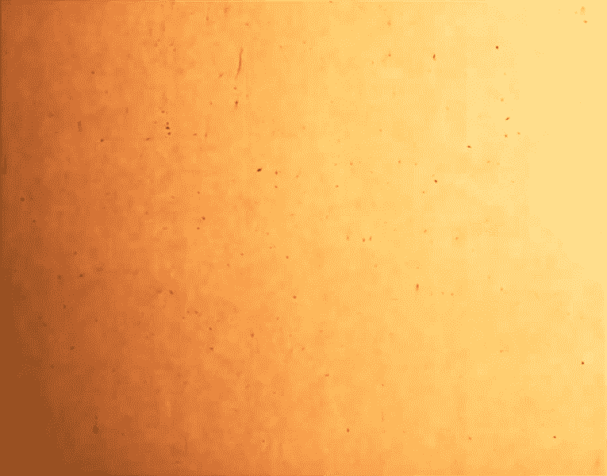
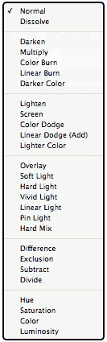
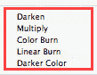
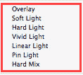
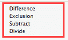
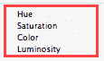

# Photoshop 中的混合模式

> 原文： [https://www.guru99.com/how-to-use-blending-mode-in-photoshop-cc.html](https://www.guru99.com/how-to-use-blending-mode-in-photoshop-cc.html)

 **## 如何在 Photoshop 中融合** 

Photoshop 混合模式是一种将两个图像的像素彼此混合以获得不同类型的效果的方法。 混合模式在设计人员中流行的原因有很多。 您可以校正照片，可以将较亮的图像转换为较暗的图像，或者可以将较暗的图像转换为较亮的图像，或者可以通过对特定图像使用特定的混合模式来创建几种类型的效果。

**步骤 1）**选择背景图像

在这里，我有一个用于背景的 Ruff 纹理图像。 我将使用其他图像并将其与该背景混合。

**步骤 2）**选择背景需要更改的图像。

让我拍摄另一张图像以与背景纹理融合。

因此，这里有两个不同的层。 要应用混合模式，您需要选择图层并打开混合模式列表，然后选择其中任意一个。

**步骤 3）**混合模式的类型

混合模式菜单位于图层面板的顶部，默认情况下始终处于普通模式。

您可以在列表中的各种类别中找到各种类型的 photoshop 混合模式。 您可以选择其中任何一个来创建不同的效果。

在混合模式列表中，每组混合模式都有特定的功能。

如此处的第一部分使图像变暗。 它会影响图片的整体黑暗度。

第二组影响图像的整体亮度。 它允许较亮的区域显示出来，并使较暗的区域回退。

下一组影响明暗。 我在这里选择叠加。

下一组创建倒置效果。

列表中的最后一组处理图像的颜色。

您也可以按上下箭头键依次更改混合模式。

**步骤 4）**将混合应用到图像

对于此图像，“乘”是更好的选择。 它给这张图像一个醒目的外观。

我们还可以在“图层样式面板”中获得混合模式。

为此，让我画一个新的形状。 然后给它一些 layerstyle，以便我们可以在“ layer style panel”中检查混合模式。 让我检查“外发光”并设置其参数。 现在，您可以在顶部看到此处相同的混合模式列表，该列表位于“图层面板”中的混合模式菜单中。

您可以选择任何所需的混合模式。

还有一件事是，当使用混合模式以获得更好的效果时，您可以使用“图层的不透明度”。

请参阅我正在使用颜色加深模式。 我喜欢在 Photoshop 效果中进行这种混合，但是它使图像过亮。 因此，我可以向下拖动背景层的不透明度以设置适当的图像。 现在您可以看到区别。

现在，我希望您对“混合模式”的功能有一个基本的了解。

Photoshop Blend modes is a way to blend pixels of two images with each other to get different types of effects. There are so many reasons for blend modes to be popular among the designers. You can correct the photos, you can convert a lighter image to darker or darker image to lighter, or you can create several types of effects by using particular blend modes for specific images.

**Step 1)** Select the Image for Background

Here I have a ruff texture image for my background. I will use another image and blend it with this background.

**Step 1)** Select the Image for Background

Here I have a ruff texture image for my background. I will use another image and blend it with this background.

**Step 2)** Select the Image for whose background needs change.

Let me take another image to blend with the background texture.

So here are two different layers. To apply blending mode, you need to select the layer and open the blend mode list and choose any one of them.

**Step 2)** Select the Image for whose background needs change.

Let me take another image to blend with the background texture.

**Step 3)** Types of Blend Modes

Blend mode menu is at the top of the layer panel, and by default, it is always on normal mode.

Look there are various types of photoshop blending modes grouped in various categories in the list. You can choose any one of them and create a different effect.

In blending mode list, each group of blend mode has specific functions.

Such as the first section here darkens the image. It effects the overall darkness of the picture.

The second group affects the overall brightness of the image. It allows lighter areas to show through and makes darker areas drop back.

The next group affects the lightness and darkness. I choose overlay here.

The next group creates inverted effects.

And the last group in the list deals with the colors of the image.

You can also change blend modes sequentially by pressing up and down arrow keys.

**Step 3)** Types of Blend Modes

Blend mode menu is at the top of the layer panel, and by default, it is always on normal mode.

**Step 4)** Apply Blend to the Image

"Multiply" is a better option for this image. It gives a striking look to this image.

We can also get blending modes in "layer style panel."

For that, let me draw a new shape. Then give some layerstyle to it so that we can check blending modes there in "layer style panel." Let me check on “outer glow” and set its parameters. Now you can see on top, the same list of blend modes over here, which was in blend mode menu out there in "layer panel."

You can choose any blend mode you want.

One more thing is you can play with "opacity of layer" when using blend modes to get a better result.

See I’m using color burn mode. I liked this blending in photoshop effect, but it has over-brightened the image. So I can drag down the opacity of the background layer to set the image proper. Now you can see the difference.

Now I hope you got the basic idea of how powerful feature the "blend mode" is.

**Step 4)** Apply Blend to the Image

"Multiply" is a better option for this image. It gives a striking look to this image.