# 如何在 Photoshop 中使用钢笔工具？ 完整的教程

> 原文： [https://www.guru99.com/how-to-use-pen-tool-photoshop-cc-tutorial.html](https://www.guru99.com/how-to-use-pen-tool-photoshop-cc-tutorial.html)

在 Photoshop 中有许多选择工具，但是钢笔工具是唯一一种可以使您进行非常干净和清晰的选择而没有模糊线条或柔和边缘的工具，因为钢笔工具使用了“矢量技术”。

因此，如果您想切割任何具有清晰锐利边缘的物体，那么您必须对“笔工具”有所了解。 因此，让我们开始吧。

这是我的图像，我想在“钢笔工具”的帮助下切出这种太阳镜。

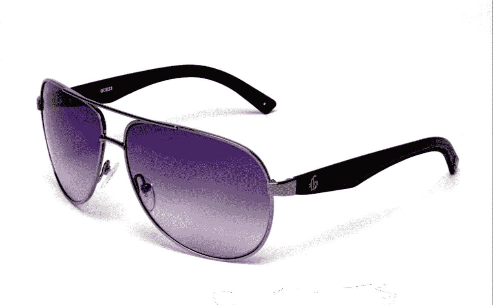

因此，首先在工具栏中选择钢笔工具。 我们可以看到多种类型的笔工具，但是现在我正在使用第一个笔工具。

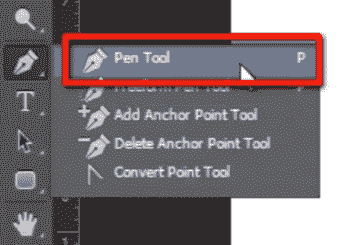

当您开始使用钢笔工具绘制路径时，建议您从对象的任何角点开始。 并采取很少的控制点。

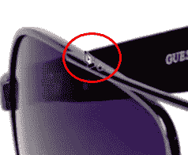

现在单击并拖动它，您可以看到控制点的移动手柄，它可以弯曲路径，如您所见。 我们可以借助此手柄正确设置路径。

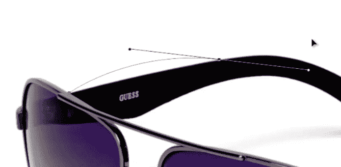

现在单击并拖动到下一个控制点，并以这种方式弯曲其手柄以正确设置它。

您可以在此处看到绘制我们已弯曲其手柄的上一个控制点时路径偏离 bcz 线。 因此，要解决此问题，只需按住 alt 键并在创建新的控制点之前单击最后一个控制点即可。 它将移除手柄，并允许您正确绘制路径。

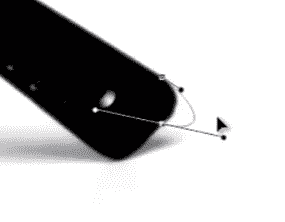

继续像这样绘制路径。

这是路径面板。 在此您可以看到一段时间之前绘制的路径。 只需双击并保存。

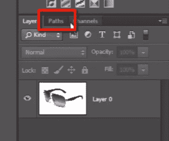

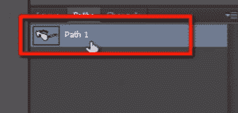

这是我之前创建的路径。 单击它，然后在路径面板的底部看到一个名为“将路径作为选择加载”的图标，单击此图标可以将路径转换为选择。

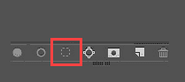

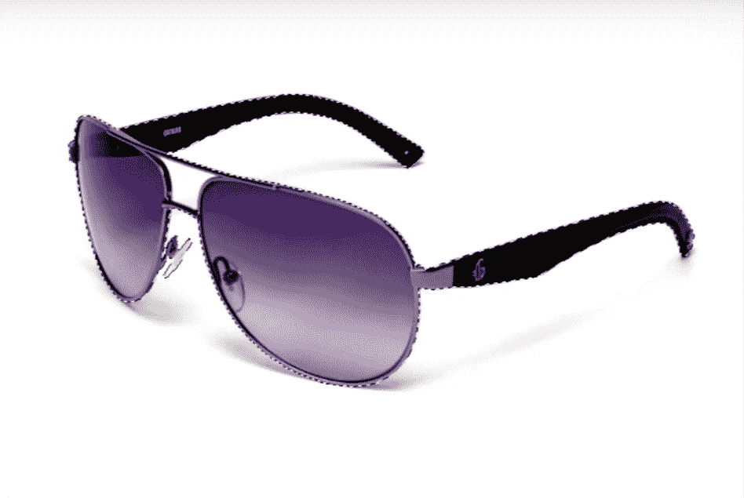

因此，现在选择该层，然后按 CTRL + J 可以创建所选部分的新层。

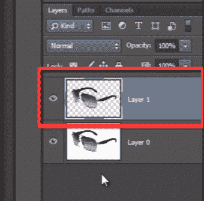

在这里，我想从路径上适当地切出这个孔。 因此，我必须转到路径面板，然后再次选择我的路径，然后在“路径查找器”选项中看到此处，我必须选择“减去前部形状”。

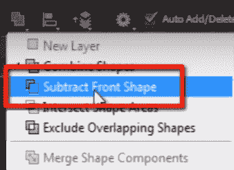

现在在该孔的边缘绘制路径。 然后选择并删除它。

让我在这里放大。

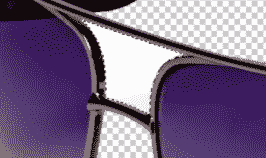

在这里您可以看到对象的边缘仍然非常清晰。 他们没有被模糊。

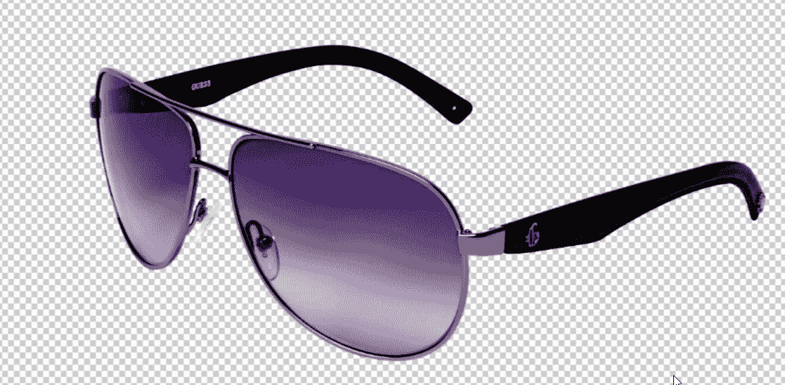

因此，借助钢笔工具，您可以获得非常干净，清晰，准确的提取效果，这比 Photoshop 中的任何其他提取技术都多，因为它遵循矢量技术。