# 如何在 Photoshop 中删除背景？

> 原文： [https://www.guru99.com/how-to-use-extraction-techniques-in-photoshop-cc.html](https://www.guru99.com/how-to-use-extraction-techniques-in-photoshop-cc.html)

 **### 如何在 Photoshop 中删除背景** 

作为设计师，我们应该知道一些快速有效的技术，可以从图像中提取某些特定的对象或设计元素。 我们将在本教程中学习它们。

## Photoshop 提取/删除背景：-第一个示例

**步骤 1）**选择要删除背景的图像

这是具有干净白色背景的模型的图像，我们要提取模型。

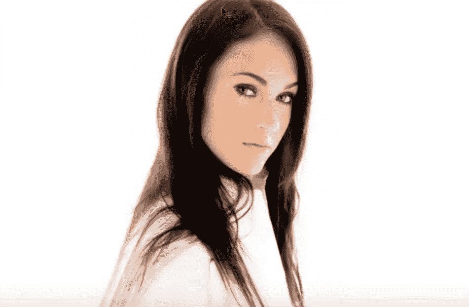

我们可以借助诸如“钢笔工具”之类的 photoshop 提取工具来提取它，但这将是一项非常耗时的技术。 所以我们不能使用笔。 

**步骤 2）**选择魔术棒工具并选择背景

因此，现在去抓住“魔术棒工具”，然后在白色背景上单击将其选中，要添加选择区域，请按住“ Shift 键”，然后单击要添加到选择中的部分。

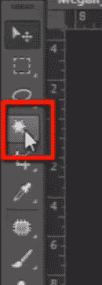

**步骤 3）**套用反

现在我们要提取模型，所以我们必须选择她，进入选择菜单，然后选择“ inverse”，这样它将反转选择。

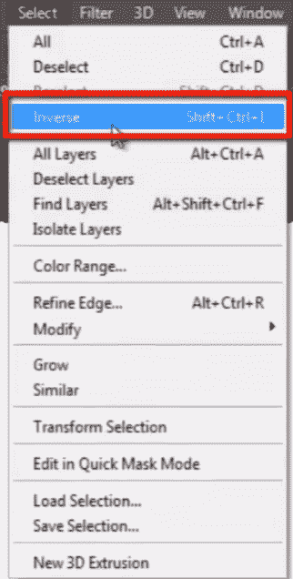

**步骤 4）**优化边缘

我们做出了选择，但是仍然选择不理想，因为它周围有非常尖锐的边缘，并且边缘上没有选择某些像素，并且选择了一些不需要的像素，因此要解决此问题，请单击 选项栏上的“优化边缘”按钮。

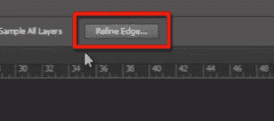

这是精致的边缘面板。 我正在将查看模式从“黑色&白色”更改为“黑色”。

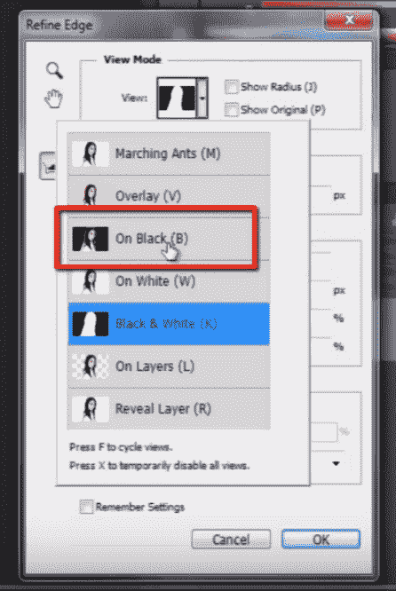

由于背景为黑色，我们可以看到模型边缘存在什么问题。

现在开始在模型的边缘上绘画，看看它如何从选择中减去一些不需要的白色像素。

我去除了粗糙的边缘并使它们更柔和。

让我将查看模式更改为“黑色&白色”。

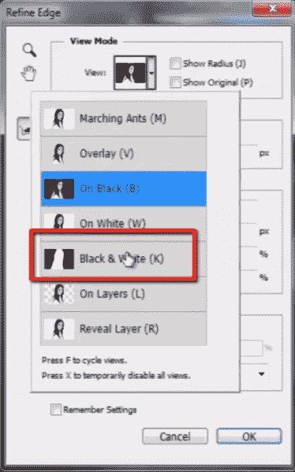

请记住，黑色表示“透明”，白色表示“不透明”。 

**步骤 5）**使用“擦除细化工具”。

在这里，模型的某些部分是透明的，因此我需要针对该选择“擦除细化工具”将其删除并更正选择。

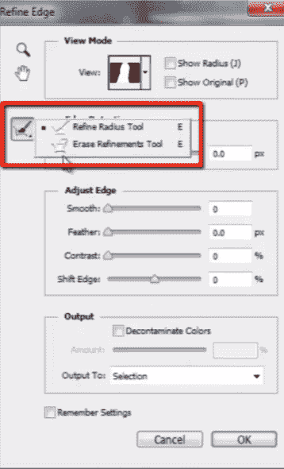

但这不是一个大问题，因此我们以后可以处理。 

**步骤 6）**新层

您可以在此处在模型边缘的某些特定部分看到一些透明像素。 因此，现在更改“输出”选项的设置。 从下拉列表中选择“带有图层蒙版的新图层”。

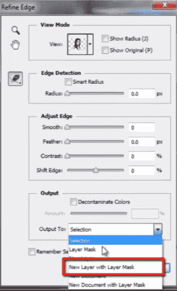

按确定

您可以在“图层面板”中看到使用图层蒙版创建的新图层。

现在在这里看到这些透明像素。 要处理它，请按 CTRL + J 复制该层。

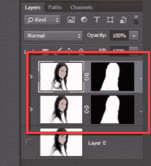

您可以看到我们的问题已解决。 

**步骤 7）**输出

您可以在这个很酷的技巧的帮助下看到，我们很好地提取了模型。

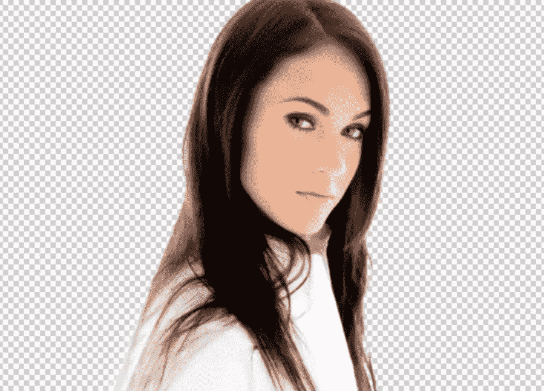

## 基于亮度的提取技术。

在这项技术中，我们将讨论“基于亮度的选择”。

看到这里是烟雾的图像，在烟雾中，某些部分是完全不透明的，而某些部分是半透明的。 因此，我们要提取具有适当透明像素的烟雾。

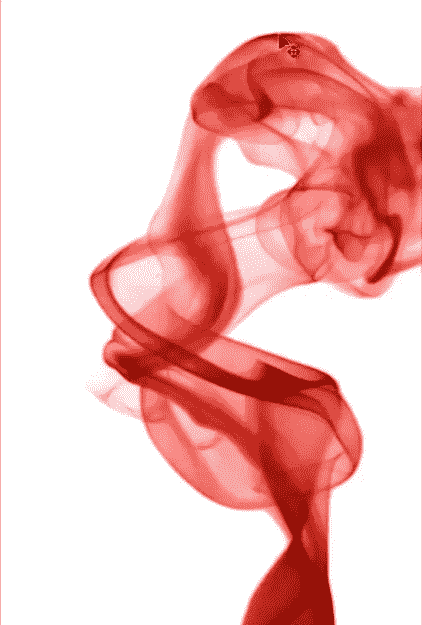

在先前的技术中，我们已使用“魔术棒工具”进行了选择，但在冒烟的情况下，这不是合适的技术。

因此，这里我们将使用“通道调色板”。

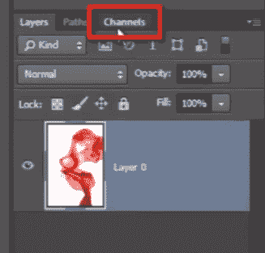

在通道面板中，按住 CTRL 键并单击通道面板顶部的“ RGB 通道”，它将所有亮度值加载为活动选择。 它选择了整个白色背景。

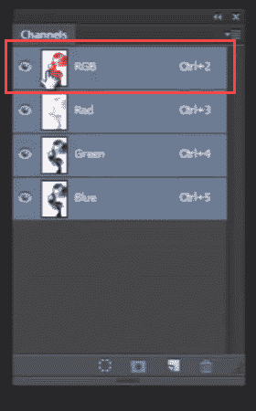

现在转到选择菜单，然后选择逆。

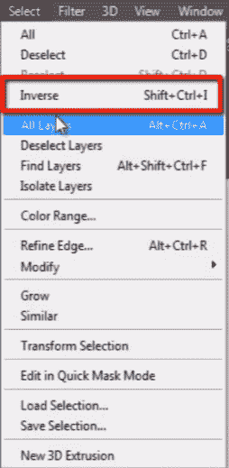

然后按 CTRL + J 来创建所选部分的新层。

您可以在此处看到所选区域的新图层创建。

但是它看起来很平坦。

因此，要保持其密度，请选择 CTRL + J 大约 4-5 次。

并合并所有重复的图层。

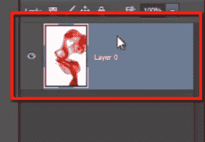

现在您可以看到，借助此技巧，我们如何完美地抽出了烟雾。

这称为**“基于亮度的选择”** 技术。

## 让我们转到下一个示例。

这是一个模型，我们要非常快地拔出她的头发。

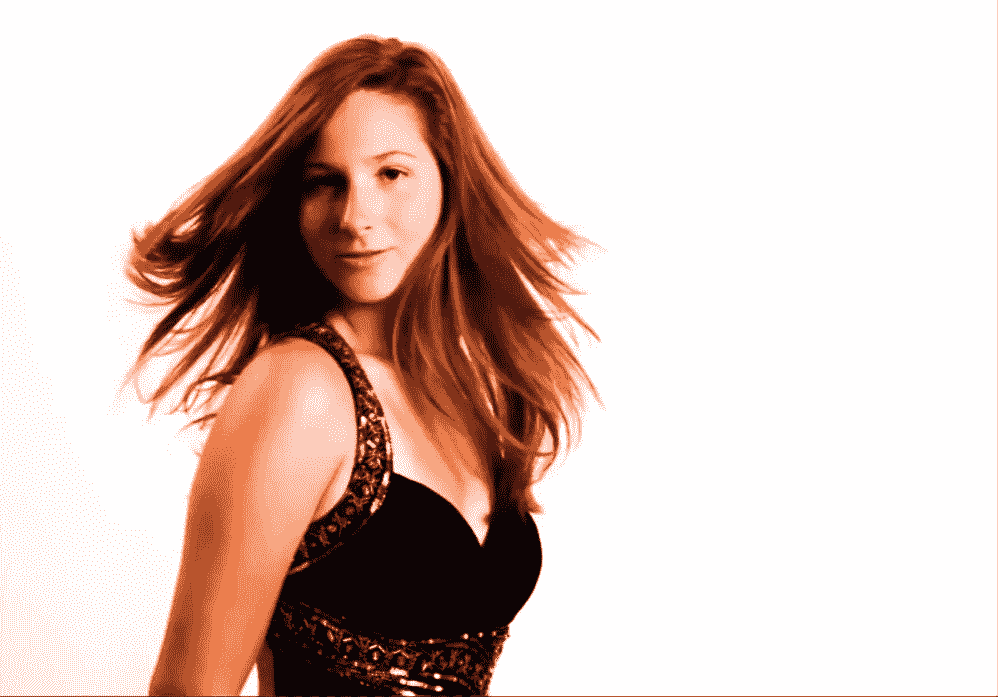

如果我们在此特定图像中使用“笔工具”，则将是一个耗时的过程，但是如果我们不需要在此上浪费更多的时间，则可以在“优化边缘”的帮助下非常好而快速地完成此操作。 “ 选项。

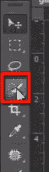

抓住“快速选择工具”，然后大致选择模型。

单击“优化边缘”选项。

选择“在图层上”的查看模式。

并开始在头发的边缘周围绘画。

您会看到它如何完善头发周围的选择。

看起来一些不需要的像素也从选择中删除。

我将把这个选择作为“带图层蒙版的新图层”。

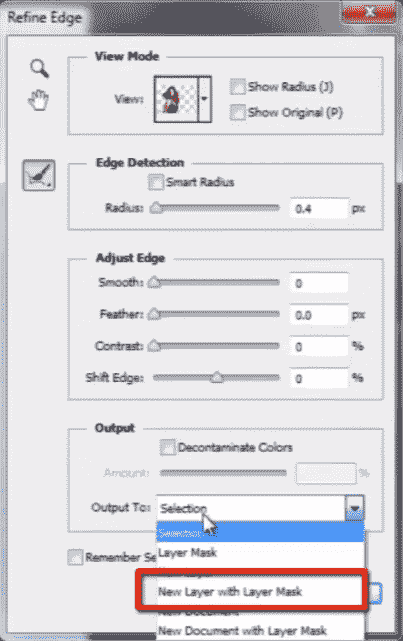

看这里，使用图层蒙版创建了一个新图层，并且很好地提取了模型。

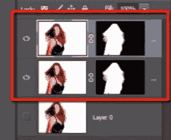

复制图层，以便我们可以处理模型边缘周围的一些透明像素。

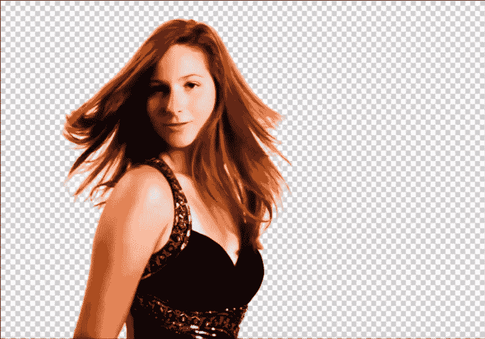

因此，这些是在 Photoshop CC 中进行提取的一些很酷而又快速的技巧。 

As a designer, we should know some quick and efficient techniques to extract some particular objects or design element from an image. We will learn them in this tutorial.

## Photoshop Extraction/Remove Background:- First example

**Step 1)** Select Image whose background you want to remove

This is an image of a model with a clean white background, and we want to extract the model.

We can extract this with the help of photoshop extraction tool like "pen tool," but it will be a very time-consuming technique. So we can't use the pen. 

**Step 1)** Select Image whose background you want to remove

This is an image of a model with a clean white background, and we want to extract the model.

**Step 2)** Chose the Magic Wand Tool and select background

So now go and grab the "magic wand tool" and click on a white background to select it, to add selection area hold "shift key" and click on the portion which you want to add in selection.

**Step 2)** Chose the Magic Wand Tool and select background

So now go and grab the "magic wand tool" and click on a white background to select it, to add selection area hold "shift key" and click on the portion which you want to add in selection.

**Step 3)** Apply Inverse

Now we want to extract the model so we have to select her, go to select menu and choose “inverse” so it will invert the selection.

**Step 3)** Apply Inverse

Now we want to extract the model so we have to select her, go to select menu and choose “inverse” so it will invert the selection.

**Step 4)** Refine Edges

Our selection is made, but still, it is not perfectly selected, because it has very sharp edges selected around it, and some pixel is not selected on edges and some unwanted pixels are selected, so to deal with this problem I'll click on "refine edges" button, up here in option bar.

This is refined edge panel. I'm changing the view mode from "black & white" to "on black."

Because of the black background, we can see what the problem with edges of the model is.

Now start painting on edges of the model and see how it is subtracting some unwanted white color pixels from the selection.

I have removed rough edges and made them softer.

Let me change the view mode to "black & white."

Keep in your mind that black means "transparent" and white means "opaque." 

**Step 4)** Refine Edges

Our selection is made, but still, it is not perfectly selected, because it has very sharp edges selected around it, and some pixel is not selected on edges and some unwanted pixels are selected, so to deal with this problem I'll click on "refine edges" button, up here in option bar.

**Step 5)** Use the "erase refinements tool."

Here some part of the model has been transparent, so I need to remove it for that select "erase refinements tool" and correct the selection.

But this is not a big issue so that we can deal with it later. 

**Step 5)** Use the "erase refinements tool."

Here some part of the model has been transparent, so I need to remove it for that select "erase refinements tool" and correct the selection.

**Step 6)** New Layer

You can see here some transparent pixels around the edges of the model in some specific portions. So now change the setting of "output" option. Select "new layer with layer mask" from drop-down list.

Press ok

You can see here in layer panel a new layer is created with a layer mask.

Now see these transparent pixels here. To deal with it duplicate the layer by pressing CTRL + J.

And you can see our problem is solved. 

**Step 6)** New Layer

You can see here some transparent pixels around the edges of the model in some specific portions. So now change the setting of "output" option. Select "new layer with layer mask" from drop-down list.

**Step 7)** Output

You can see with the help of this cool trick we have extracted the model very nicely.

## Luminosity Based Extraction Technique.

In this technique, we will talk about "luminosity based selection."

See here is an image of smoke, in smoke, some portion is full opaque while some part is half transparent. So we want to extract the smoke with proper transparent pixels.

In the previous technique, we have made our selection with "magic wand tool," but here it will not be the proper technique in the case of smoke.

So here we will use the "channels palet."

In channels panel hold the CTRL key and click on "RGB channel" on the top of the channels panel, it loads all the brightness value as the active selection. It has selected the entire white background.

Now go to select menu and choose Inverse.

Then press CTRL + J to create a new layer of the selected portion.

You can see here a new layer is created of the selected area.

But it looks very flat.

So to maintain it’s density select layer and press CTRL + J for around 4-5 times.

And merge all duplicate layers.

Now you can see, with the help of this trick how perfectly we have extracted the smoke.

This is called **"luminosity based selection"** technique.

## Let’s move to our next example.

Here is a model and we want to extract her hair very quickly.

If we use the "pen tool" in this particular image then it will be a time-consuming process, but if we do not need to waste more time on this, we can do this very nicely and quickly with the help of "refine edge" option.

Grab the "quick selection tool" and select the model roughly.

Click on the "refine edge" option.

Select view mode "on layer."

And start painting around edges of the hair.

You can see how it is refining the selection around the hair.

Look some unwanted pixels are also removed from the selection.

I’ll take out this selection as "new layer with layer mask".

Look here a new layer is created with a layer mask and the model is extracted very nicely.

Take a duplicate of layer and so that we can deal with some transparent pixels around edges of the model.

So these are some cool and quick tricks for extraction in photoshop cc. 

**Step 7)** Output

You can see with the help of this cool trick we have extracted the model very nicely.