# 如何在 PhotoShop 中使用画笔工具？

> 原文： [https://www.guru99.com/how-to-use-brush-tool-in-photoshop-cc.html](https://www.guru99.com/how-to-use-brush-tool-in-photoshop-cc.html)

### 什么是 Photoshop 中的画笔工具？

在本教程中，我们将学习 Photoshop CC 笔刷的基本功能，还将讨论“笔刷选项”以不同方式管理笔刷的行为。

## Photoshop 笔刷的基本功能

现在，从工具栏中获取“画笔工具”。

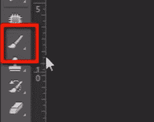

选项栏中的第一个菜单是“画笔预设选择器”。 在这里我们可以更改笔尖，此菜单显示不同类型的图标实际上是可用的不同类型的笔刷。

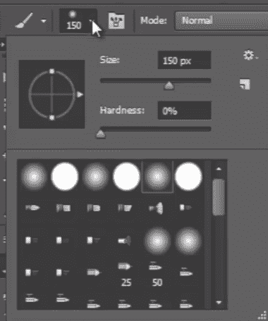

现在单击此小转盘图标。 您将在此处获得一些不同组的预设画笔的列表。 这些画笔是用 Photoshop 内置的。

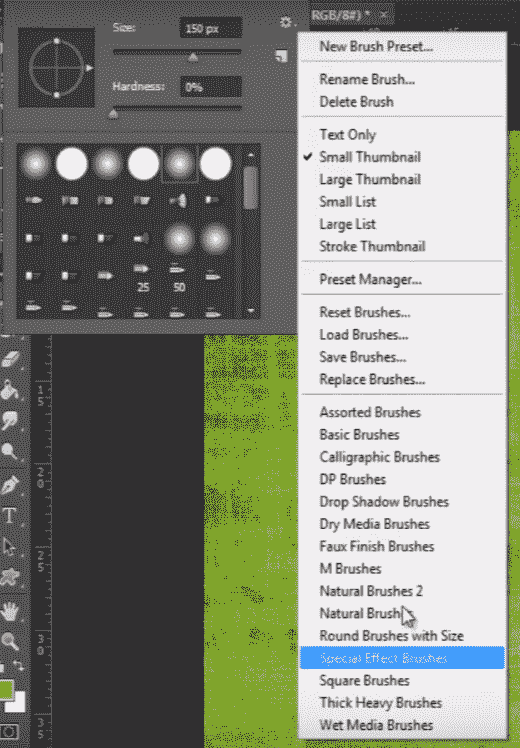

If you want to add any brush preset then just click on it. I choose “Square Brush”.

Then it will ask you to append brushes or replace them. “Append” means it will add them to existing list of brushes and if you click “ok” then it will replace all brushes together.

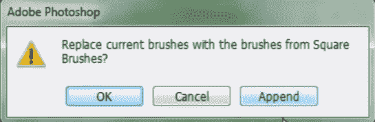

现在，如果您有一组自己从互联网上下载的画笔，那么要添加这些画笔，您需要结束选择“加载画笔”。

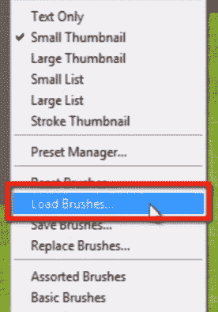

要谈论编辑画笔，我在这里选择一个软边画笔，您可以在其上方看到“大小”和“硬度”。 您可以设置笔刷的大小，硬度决定了笔刷边缘的硬度和柔软度。

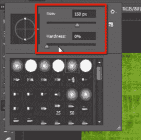

如果我将硬度保持为 0，则画笔将以非常柔软的边缘进行绘制。

如果我将硬度设置为 100，则它将油漆非常坚硬和锋利的边缘。

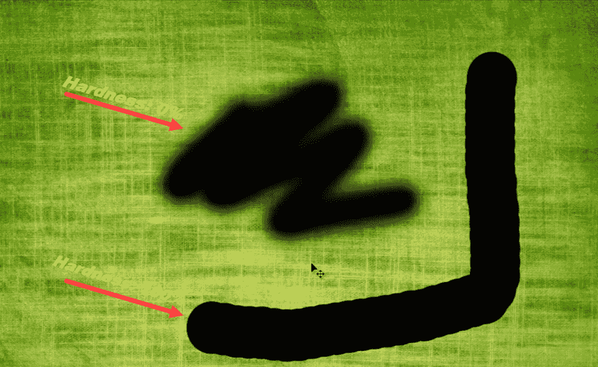

无论您在前景色中设置的颜色如何，画笔都会绘制颜色。 现在是黑色，但是如果我选择红色，它将用红色绘制。

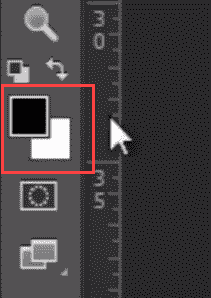

现在还有一件事是我们还可以将混合模式应用于画笔。 如果我选择覆盖模式并用相同的红色绘画，则它将与背景图像融合。

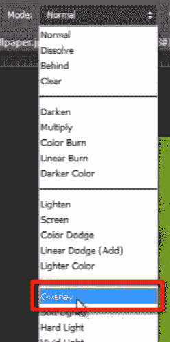

我也可以玩它的不透明性。 如果我想用相同的颜色绘制一些透明度，那么我需要拖动不透明度。 流量决定了用笔刷单击时像素在多少区域中流动。

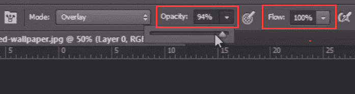

如果我想调整笔刷的大小，则这是执行此操作的快捷方式。 只需按“ [”和“]”即可放大和缩小。

这些是画笔工具的非常基本的功能，但是要变得更具创意，我们需要通过向画笔添加行为来进一步迈进高级一步。

## 画笔选项以管理画笔行为

为此，我需要单击“画笔预设选择器”旁边的选项菜单中的此图标

它将打开“画笔选项面板”。 我们也可以从“窗口”菜单中打开它，然后选择“画笔”以打开同一面板。

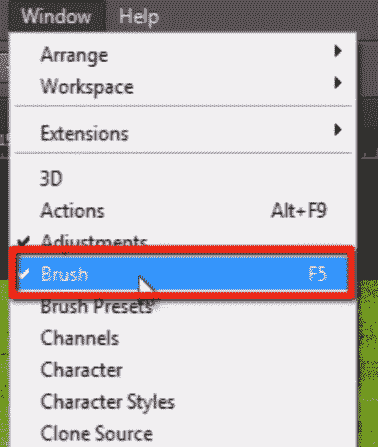

在“笔刷笔尖形状”选项列表顶部的此面板中，我们具有与“笔刷预设选择器”中以前看到的选项相同的选项，例如“大小”，“角度”，“圆度”，“硬度” 和“间隔”。

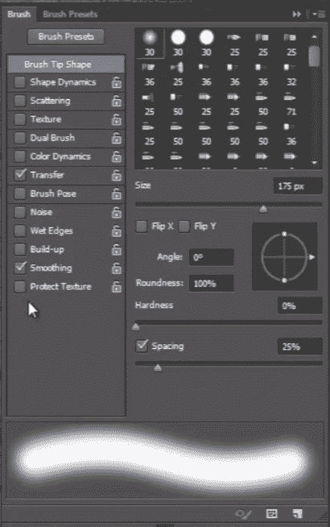

在下面检查这些项目。 如果我想更改“形状动力学”，只需单击它，您将获得它的选项来修改画笔行为。

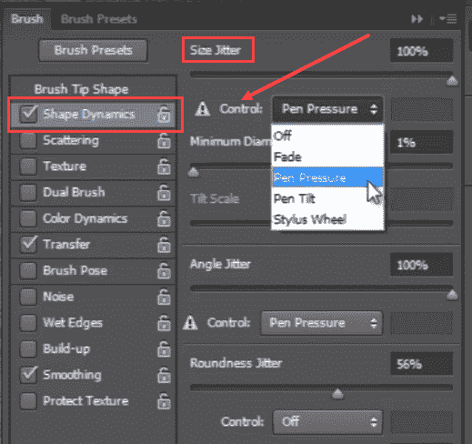

如“大小抖动”。 只需记住，“抖动”意味着在绘画时会随机化该功能。

您还可以选择不同的控件，例如“淡入淡出”，“笔压”，“笔倾斜”和“触控笔转盘”。

让我更改笔刷，以便在更改它时可以看到每个选项的效果。

您可以在“画笔面板”的底部看到此“预览面板”。 当您更改画笔时，可以在其中看到画笔行为的变化。

因此，您有“大小抖动”，“天使抖动”，“声音抖动”等等。

当我在此面板中设置不同的值时，画笔将绘制。

接下来，我可以分散画笔。 绘画时可以增加或减少画笔的数量。 我们也可以设置“计数抖动”。

您可以看到它看起来非常不错。

接下来，我可以给画笔添加纹理。 为此，转到模式选择器，然后从纹理菜单中选择所需的任何纹理。 并根据您的要求修改所有其他行为。

在双笔刷中，我们可以在混合模式下同时使用两个不同的笔刷，并且可以修改它们的大小，间距，散布和计数。

我可以在笔刷上添加“颜色动态”，笔刷的颜色将介于前景色和背景色之间，我们需要设置色相抖动，饱和度抖动，亮度抖动和纯度，以获得正确的输出。

在“ Transfer”选项中，我可以随机化画笔的不透明度和流动性。 您可以在预览面板中看到笔刷不透明度的变化。

“画笔姿势”是一项新功能，可以修改任何画笔的“倾斜”和“旋转”。

您可以使用“噪点”使画笔产生一点噪点。

“湿边缘”。 它将使您的笔刷看起来更自然，可以使湿水变成彩色。

堆积允许您使用真实的画笔和自然色彩以自然的方式在其顶部堆积。

平滑会使事情更平滑。

您可以通过选中“保护纹理”选项来保护图像上的纹理。

因此，您有许多选择和行为的笔刷，并且可以每次进行各种类型的笔刷设计并提高创造力。

现在，在下一个视频中，我们将讨论如何在 Photoshop 中使用“文本”。