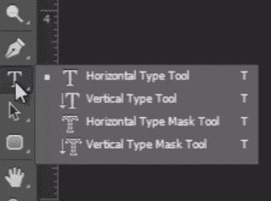
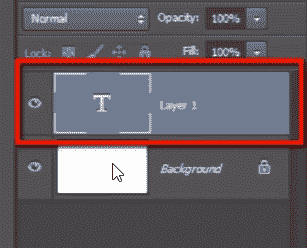
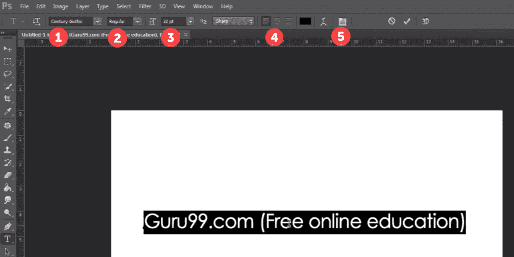
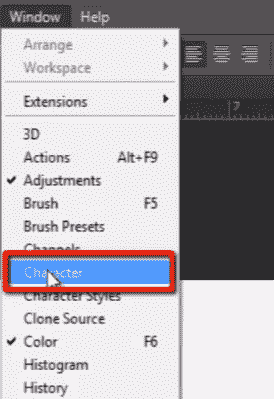
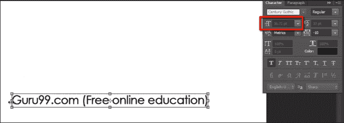
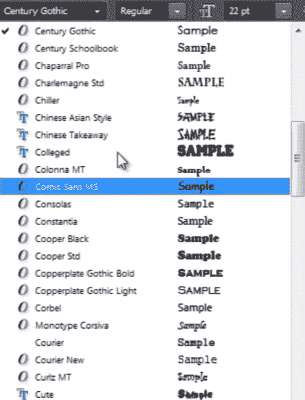
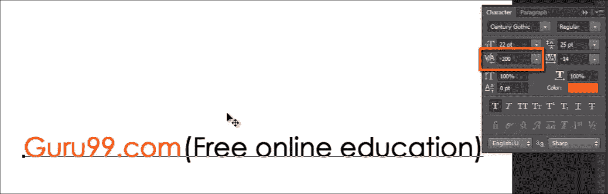
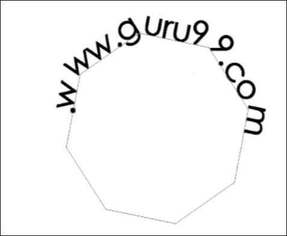
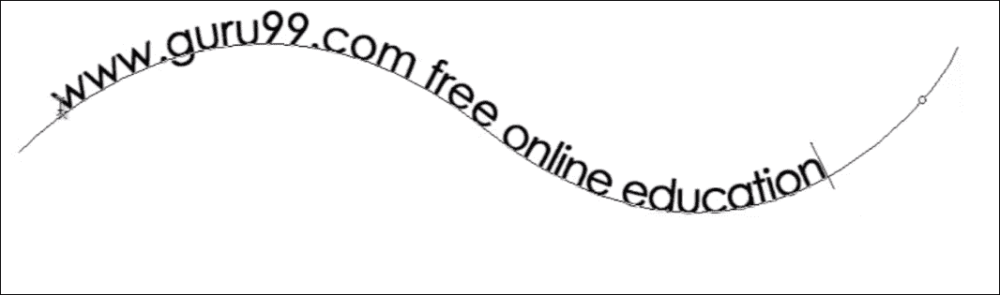
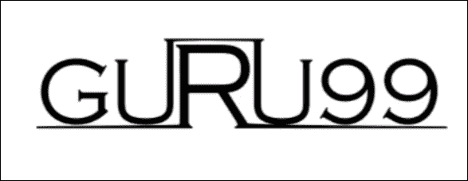

# 如何使用 Photoshop 文字工具添加文字

> 原文： [https://www.guru99.com/how-to-use-text-tool-in-photoshop-cc.html](https://www.guru99.com/how-to-use-text-tool-in-photoshop-cc.html)

## Photoshop 文字工具的基础

在 Photoshop 中进行设计时，可以通过多种方式使用“文本”。

因此，让我们从工具栏中获取“文本工具” photoshop。

如果单击并按住文本工具，则会看到各种类型的文本工具，例如“水平字体工具”，“垂直字体工具”，“水平字体蒙版工具”和“垂直字体蒙版工具”。 但最常见的是，我们将使用“水平类型工具”。

现在，只需单击画布，然后在“图层”面板中看到创建了一个空白文本图层。

让我输入“ Guru99.com（免费在线教育）”。

要选择文本，只需双击文本层。

Look here in options bar for some options to modify the text.

1）您可以在此处更改所选文本的字体样式。 有大量的字体样式。

2）您可以在此处给出一些常规字体效果，例如“粗体”，“斜体”和“常规”。

3）通过此选项，我们可以设置字体大小。 您可以单击并拖动此图标以增加或减小字体大小。

4）以下是一些字体调整选项。

5）单击此图标以打开“字符”面板。

## 角色面板

字符面板包含文本的所有设置。 我们也可以在“窗口”菜单中找到该面板。

在此面板中，我们具有与“选项栏”中看到的选项相同的选项，以及诸如“字距调整”，“跟踪”，“垂直缩放”，“水平缩放”，“字体颜色”之类的更多选项，以及此菜单中的更多选项 面板来修改您的文本。

现在，通过双击文本层并按 CTRL + T 来选择文本，以进行“显示转换”。

您可以无损地拖动和缩放文本。

请注意此处的字体大小，然后按比例缩小文本。 当您按 Enter 键时，您会看到文本的字体大小也已更改。

您可以像处理图像一样上下缩放文本，但是缩放后仍然不会像在图像中那样失去质量。 因为当我们缩放文本时，它不会重新采样文本，所以实际上它会调整文本的大小，以便可以无损地缩放文本。

现在，如果要更改字体样式，请选择文本并打开此字体样式列表。 您可以从此列表中选择任何字体样式。 如果要一一检查所有字体，则只需单击字体名称并保持选中状态，然后开始按向上和向下箭头键即可一一更改所有字体。

## 跟踪与紧缩

让我们谈谈跟踪和字距调整。 跟踪表示两个字符之间的间距，字距调整表示两行之间的间距。

让我更改此词的颜色，以便在更改跟踪值时可以清楚地看到差异。

但是首先，我们将通过单击并拖动此图标来更改整个行的跟踪。

您还可以设置两个单独字符之间的跟踪间隔。 为此，只需在这两个词之间单击，然后将光标放在此处，更改跟踪值的快捷方式就是按住 ALT 键并向左和向右按箭头键以增加或减少空格。

若要更改整行的间距，可以使用相同的快捷方式。

我们还可以通过更改“垂直缩放”和“水平缩放”选项中的值来水平和垂直缩放文本。

## 路径上的文字

现在，我们来谈谈路径上的文字。

让我画一个形状作为路径，以便我们可以在上面加上一些文字。

现在只看到光标。 当它在路径外的画布区域上时，它看起来像普通的文本工具光标，但是当我将其放在路径上时，它将改变。 更改后的光标表示您的文本将坚持该路径。

现在单击该路径，您将可以在该路径上键入您的文字。

您还可以确定路径上文本的起点和终点。

因此，选择文本，然后按住 CTRL 键，然后将光标置于文本的开头。 您可以看到已更改的光标，现在单击此处并拖动光标，这样便可以看到两个不同的点。

这个小十字表示这是文本的起点，而小圆点符号表示这是文本的终点。 因此，您不能超出限制范围。

您可以通过按住 CTRL 键然后单击并拖动它们来更改这些点。

您可以通过将光标移入和移出路径区域来上下移动路径周围的文本，但请按住 CTRL 键。

我们也可以在钢笔工具绘制的简单路径上执行此操作。 所以我们来看看。

抓住钢笔工具并绘制一条简单的路径。

现在，使用文本工具，单击路径并开始输入。

在这里您会看到，您具有与以前在形状路径上的文本中看到的功能相同的功能。

## 自定义字体样式

现在让我们谈谈自定义字体样式。

我的意思是说，每次字体风格都无法完全满足您的需求。 因此，在某些情况下，您需要获取一些文本并根据需要对其进行修改。

您可以通过将文本转换为路径来实现。

让我输入单词“ Guru99”。 然后右键单击文本面板中的文本层，然后选择“创建工作路径”。

它将文本转换为可以轻松修改的路径。

关闭文本层，并查看其是否已在文本周围生成路径。

然后在“路径面板”中查看创建的工作路径。 先保存。

现在，如果要修改路径，只需抓住钢笔工具，然后选择一些要移动的控制点并正确设置它们，这样就可以牢记设计了。

您必须按住 CTRL 键，然后单击并拖动所需的任何控制点。

您可以看到我如何修改字体并创建了新设计。 如果我认为我只能使用字体样式来获取输出，那么每次都不会成功。 一段时间后，我们必须根据需要修改文本。

因此，这些是下一个视频教程中有关文本的一些功能，我们将讨论“过滤器”。