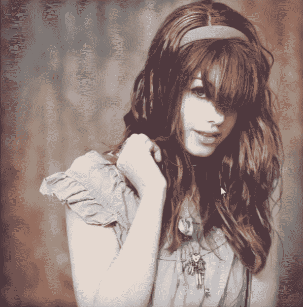
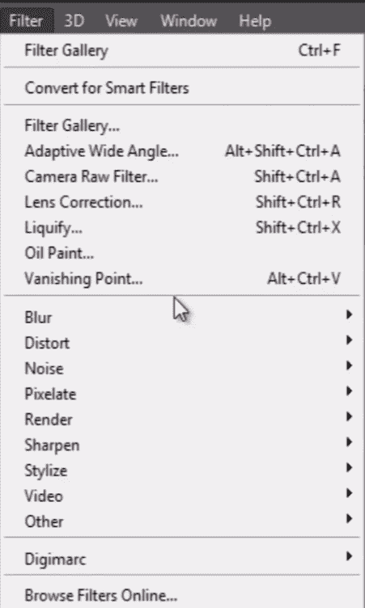
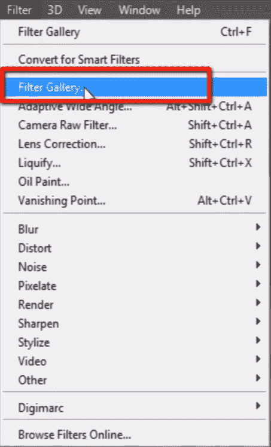
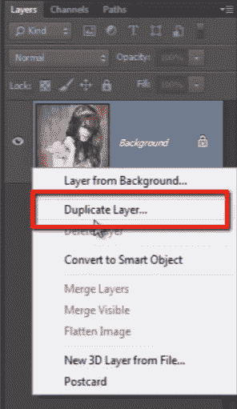
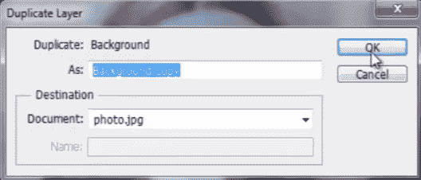
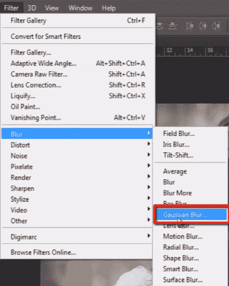
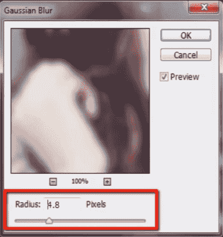
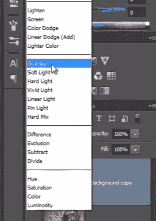
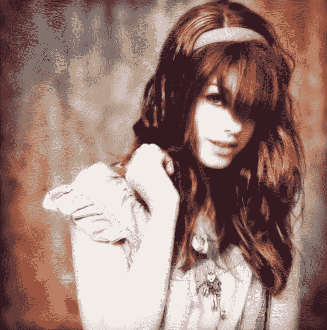

# 如何在 Photoshop 中使用滤镜&效果

> 原文： [https://www.guru99.com/working-with-filters-in-photoshop-cc.html](https://www.guru99.com/working-with-filters-in-photoshop-cc.html)

## 基本的 Photoshop 照片滤镜

过滤器就像“图层样式”。

它们具有各种**组合**和**效果**可以应用。

有许多设计师使用过滤器并与他们进行非常深入的合作，并提出了许多创造性的组合和图像。

在这里，我要应用不同的滤镜以使其更有效。

## 从“过滤器”菜单应用过滤器

在“过滤器”菜单中查看此处。 这里有很多不同类别的过滤器。

我建议您，不要关注过滤器名称，而应一个接一个地应用它们，并检查它们对图像的实际作用。 因为任何特定滤镜的输出完全取决于您要处理的图像。

在这里，我们有“模糊”，“失真”，“噪声”，“风格化”以及更多的过滤器组。

## 筛选器库概述

“过滤器库”是一个选项，我们可以在应用过滤器之前先预览其所有效果。

看，这是我们之前在过滤器菜单中看到的过滤器列表。

您还可以从此下拉列表中应用相同的 photoshop 滤镜效果，该下拉列表将所有滤镜一起包含在一个列表中。

## 应用过滤器库中的过滤器

让我们为图片尝试一些滤镜效果。

确保必须睁大眼睛，以便我们可以在预览面板中看到图像上每个滤镜效果的预览。

现在，只需单击要应用于图像的过滤器。

您必须对每个滤镜进行实验才能找到适合您图像的效果，因为滤镜会为每个不同的图像提供不同的输出。

让我尝试“海报边缘”过滤器。

在这里，您可以看到一些用于修改所选滤镜效果的选项。

当我左右拖动这些选项时，可以在预览面板中查看变化的效果。

最后，当您对滤镜进行实验后，只需点击“确定”即可将最终效果应用于图像。

因此，在滤镜库中设置滤镜效果后，您会注意到我们图像的差异。 它锐化了所有边缘，使图像看起来像被绘制。

## 提高过滤器性能

让我们尝试使这张图片更有效。 为此，让我复制该层。

您可以在此处看到一组不同的模糊滤镜效果。 我选择“高斯模糊”。 它将模糊整个图像。

将其值设置为 3 或 4 左右，然后单击“确定”。

现在，将此模糊图像的混合模式更改为“叠加”。

您可以看到如何改善图像的感觉。 在我们对图像没有任何效果之前，它是非常暗淡的图像。 但是现在图像的色彩和感觉有了很大的改善。

因此，我希望您了解过滤器的基本概念，如何使用它们以及如何帮助我们提高创造力。

伙计们，这是我们使用“ guru99”进行“ photobig CC for biginers”课程的最后一课。 感谢您的收看，希望您喜欢本课程。 您可以访问我们的网站“ www.guru99.com”以获取更多免费的在线教育课程。