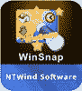
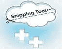

# 2020 年 30 种最佳屏幕捕获软件工具，可提供更好的屏幕截图

> 原文： [https://www.guru99.com/screen-capturing-tools.html](https://www.guru99.com/screen-capturing-tools.html)

在各种情况下，捕获计算机屏幕都是一个方便的窍门，从创建教程到捕获网络时刻以备后用。 有很多工具可以帮助您捕获桌面。

以下是精选的前 30 种精选屏幕捕获软件的列表，这些软件具有受欢迎的功能和最新的下载链接

**What You Will Learn:** []

**Best Screen Capture Software Tools in 2020**

*   [Snagit](#1)
*   [Greenshot](#2)
*   [Fireshot](#3)
*   [ShareX](#4)
*   [遮光罩](#5)
*   [截图工具](#6)
*   [FastStone Capture](#7)
*   [Jing](#8)
*   [Skitch](#9)
*   [TinyTake](#10)
*   [轻击](#11)
*   [Screenpresso](#12)
*   [截图截图](#13)
*   [Gadwin PrintScreen](#14)
*   [PicPick](#15)
*   [SnapCrab](#16)
*   [Monosnap](#17)
*   [快门](#18)
*   [Snipaste](#19)
*   [Gyazo](#20)

### [1）Snagit](//techsmith.pxf.io/c/1359419/476802/5161)

[Snagit](//techsmith.pxf.io/c/1359419/476802/5161) 是一个功能强大的屏幕捕获工具，可让您捕获两个静止图像并从视频中抓取一帧。 这些工具随 Smart Windows Detection 一起提供。 它允许您裁剪图像，以便您可以选择整个窗口或部分窗口。

**功能**：

*   Windows 支持的屏幕捕获工具
*   捕捉整个屏幕
*   单击几下进行编辑
*   快速说明流程
*   允许您将视觉效果添加到文档中

下载链接： [https://www.techsmith.com/screen-capture.html](//techsmith.pxf.io/c/1359419/476802/5161)

* * *

### 2）Greenshot

[Greenshot](http://getgreenshot.org/) 是一个开源的屏幕捕获工具。 使用此工具，您可以快速捕获所选区域，窗口或整个屏幕的屏幕截图。 它还可以帮助您从 Internet Explorer 和其他浏览器捕获滚动的网页。

**Features:**

*   兼容 Window OS（任何版本）
*   轻松注释，突出显示或混淆屏幕截图的一部分
*   快速创建所选区域的屏幕截图

**下载链接**： [http://getgreenshot.org/](http://getgreenshot.org/)

* * *

### 3）Fireshot

[射击](https://getfireshot.com/)是理想的屏幕捕获工具，可让您根据业务需要快速创建屏幕截图。

**Features:**

*   Windows 的截图软件工具
*   FireShot 可帮助您捕获网页屏幕截图，执行快速编辑，添加文本注释
*   允许您注释，突出显示屏幕截图的一部分

**下载链接**： [https://getfireshot.com/](https://getfireshot.com/)

* * *

### 4）ShareX

它是一个免费的开源轻量级免费广告捕获屏幕工具。 它提供了屏幕截图捕获，屏幕录像机，文件共享和生产力工具。

**Features:**

*   Windows 支援
*   轻松的屏幕截图共享
*   提供可定制的工作流程
*   带有多种工具，例如屏幕颜色选择器，图像编辑器，QR 码生成器等。

**下载链接**： [https://getsharex.com/](https://getsharex.com/)

* * *

### 5）遮光罩

[Lightscreen](http://lightscreen.com.ar/) 是易于使用的屏幕捕获工具。 该工具允许您自动执行屏幕截图的保存和分类过程。

**Features:**

*   Windows 和 Linux 的屏幕捕获工具
*   系统托盘图标，方便访问
*   允许您通过全局热键访问功能执行可配置的操作
*   您可以使用集成的图像查看器预览窗口

下载链接： [http://lightscreen.com.ar/](http://lightscreen.com.ar/)

* * *

### 6）截图工具

[截图工具](https://support.microsoft.com/en-in/help/13776/windows-use-snipping-tool-to-capture-screenshots)可帮助您截取屏幕截图。 它使用户能够以矩形形式捕获整个屏幕或所选区域。

**Features:**

*   Window OS 的屏幕捕获工具
*   用户可以使用彩色笔，荧光笔等编辑这些快照。
*   捕获的图像应以 PNG，GIF 和 JPEG 格式存储
*   捕获屏幕后，可以将其复制，如果需要还可以进一步粘贴

**下载链接**： [https://support.microsoft.com/en-in/help/13776/windows-use-snipping-tool-to-capture-screenshots](https://support.microsoft.com/en-in/help/13776/windows-use-snipping-tool-to-capture-screenshots)

* * *

### 7）FastStone Capture

[FastStone Capture](http://www.faststone.org/FSCaptureDetail.htm) 是功能强大，轻巧的全功能屏幕捕获工具。 它可以帮助用户捕获和注释屏幕上的所有内容，包括窗口，菜单，对象，甚至是网页。

**Features:**

*   借助热键即时捕获屏幕
*   捕获窗口，对象，菜单，全屏，矩形/手绘等。
*   捕获包括多级菜单的多个窗口和对象
*   绘制注释对象，例如文本，箭头线，高光，水印，圆形和矩形

**下载链接**： [http://www.faststone.org/FSCaptureDetail.htm](http://www.faststone.org/FSCaptureDetail.htm)

* * *

### 8) [Jing](https://bit.ly/3e4pozX)

[Jing](https://bit.ly/3e4pozX) 是 TechSmith 提供的屏幕捕获工具。 捕获的图像在 screencast.com 上共享，以提供复制/粘贴图像的 URL。 它允许您捕获屏幕视频。

**Features:**

*   Windows 和 Mac 操作系统的屏幕捕获工具
*   Jing 易于使用，并且具有友好的用户界面
*   它允许用户非常快速地共享屏幕捕获图像
*   它允许将图像和 URL 上传到社交媒体网站，例如 YouTube，Flickr 等。
*   帮助您从图像中删除品牌名称

**下载链接**： [https://www.techsmith.com/jing-tool.html](https://bit.ly/3e4pozX)

* * *

### 9）Skitch

[Skitch](https://evernote.com/products/skitch) 是一个屏幕捕获以及快速图像捕获和注释工具。 此屏幕捕获工具使您可以标记区域。

**Features:**

*   Skitch 是适用于 Mac 和 Windows OS 的免费屏幕捕获工具
*   它具有易于使用的用户界面
*   适用于 Android 和 iOS 移动设备
*   用户可以通过 Skitch 直接从相机注释照片。

**下载链接**： [https://evernote.com/products/skitch](https://evernote.com/products/skitch)

* * *

### 10）TinyTake

[TinyTake](https://tinytake.com/) 屏幕按用户指定的区域或区域捕获任何屏幕。 您可以借助彩色笔和图像突出显示图像。 可以在文本框，箭头或图片标题的帮助下进行编辑。

**Features:**

*   免费的屏幕捕获和视频录制工具
*   捕获整个屏幕或特定区域的图像
*   屏幕截图的选定部分可以被模糊以隐藏敏感数据
*   它还记录屏幕活动的区域

**下载链接**： [https://tinytake.com/](https://tinytake.com/)

* * *

### 11）轻弹

[Lightshot](https://app.prntscr.com/en/index.html) 是屏幕捕获工具，可让您快速拍摄屏幕截图。 它允许用户拍摄所选区域的屏幕快照，可以自由调整大小或移动该区域。

**Features:**

*   它使您只需单击两次即可捕获屏幕
*   友好的用户界面使您的工作更快地完成
*   在捕获屏幕时，用户应该能够编辑相同的屏幕截图
*   自动在线上传捕获的图像以进行共享

**下载链接**： [https://app.prntscr.com/en/index.html](https://app.prntscr.com/en/index.html)

* * *

### 12） [Screenpresso](https://bit.ly/2ylO6vg)

[Screenpresso](https://bit.ly/2ylO6vg) 是功能强大的屏幕捕获工具。 它允许用户以各种格式保存捕获的图像，还可以保存所有最近的屏幕捕获历史记录。

**Features:**

*   Windows 的屏幕捕获工具
*   具有内置图像编辑器的轻巧而强大的屏幕捕获工具
*   用箭头，彩色气泡，文本框等突出显示捕获的图像。
*   捕获的图像可以转换为 PDF，MS Word 或 HTML 文档

**下载链接**： [https://www.screenpresso.com/](https://bit.ly/2ylO6vg)

* * *

### 13）屏幕截图

[屏幕截图捕捉器](http://www.donationcoder.com/software/mouser/popular-apps/screenshot-captor)以全屏模式，选定区域，滚动窗口，固定大小的窗口等捕获图像。这是易于使用的屏幕捕获工具。

**Features:**

*   屏幕快照 Captor 是可用于 Windows 的免费工具
*   它允许您从网络摄像头捕获图像
*   它可以轻松捕获多台监视器的屏幕截图
*   它会自动修剪捕获图像的多余边缘
*   支持第三方可配置工具，例如文件浏览器，图像编辑器

**下载链接**： [http://www.donationcoder.com/software/mouser/popular-apps/screenshot-captor](http://www.donationcoder.com/software/mouser/popular-apps/screenshot-captor)

* * *

### 14）Gadwin PrintScreen

[Gadwin PrintScreen](https://www.gadwin.com/printscreen/) 易于使用，也是最方便的屏幕捕获工具。 它允许您在键盘上分配一个热键，以捕获具有不同模式的屏幕。 在选定区域中全屏显示。

**Features:**

*   Windows 的屏幕捕获工具
*   可自定义的导出选项，用于简单控件
*   全屏数据可以放在剪贴板上

**下载链接**： [https://www.gadwin.com/printscreen/](https://www.gadwin.com/printscreen/)

* * *

### 15） [PicPick](https://bit.ly/34iVfs0)

[Pickwick](https://bit.ly/34iVfs0) 屏幕捕获工具提供内置的图像编辑器，颜色选择器，调色板，像素标尺，量角器等。

**Features:**

*   允许您截取整个屏幕，滚动窗口或桌面的任何特定区域的屏幕截图
*   注释并突出显示图像：文本，箭头，形状等
*   支持浮动小部件捕获栏，该栏允许您截取屏幕截图

**下载链接**： [https://picpick.app/en/](https://bit.ly/34iVfs0)

* * *

### 16）SnapCrab

[SnapCrab](https://snapcrab-for-windows.en.softonic.com/) 按照用户定义的区域捕获图像，全屏显示，并以 JPEG，PNG 和 GIF 格式保存图像。

**Features:**

*   Windows 平台的屏幕捕获工具
*   它具有自拍功能，因此用户可以设置时间以自动在屏幕上捕获图像
*   各种自定义选项，例如定义您的热键，修改如何拍摄屏幕快照

**下载链接**： [https://snapcrab-for-windows.en.softonic.com/](https://snapcrab-for-windows.en.softonic.com/)

* * *

### 17）Monosnap

该程序允许用户创建屏幕截图，对其进行批注并将其上传到云中。 它允许屏幕的某些部分或选定区域。

**Features:**

*   Monosnap 是适用于 Mac OS X 和 Windows 的免费屏幕截图程序
*   捕获全屏，部分屏幕或选定区域
*   一键上传快照到存储
*   使用我们的模糊工具隐藏私人信息

**下载链接**： [https://monosnap.com/](https://monosnap.com/)

* * *

### 18）快门

[快门](https://shutter-project.org/)是功能丰富的屏幕截图程序。 它可以帮助您截取特定区域，窗口，整个屏幕或整个网站的屏幕截图。

**Features:**

*   用于基于 Linux 的操作系统的屏幕捕获工具
*   它可以捕获屏幕上的每个细节，而不会失去对屏幕截图的控制
*   提供各种插件，可让您在屏幕截图中添加令人印象深刻的效果

**下载链接**： [https://shutter-project.org/](https://shutter-project.org/)

* * *

### 19）Snipaste

[Snipaste](https://www.snipaste.com/) 是一款易于使用且功能强大的截图工具。 它使您可以将屏幕截图固定在屏幕上。 您还可以将剪贴板中的文本或颜色信息转换为浮动图像窗口。

*   支持 Windows 操作系统
*   自动检测 UI 元素
*   详细功能选项
*   多屏支持& HiDPI 支持

**下载链接**： [https://www.snipaste.com/](https://www.snipaste.com/)

* * *

### 20）Gyazo

[Gyazo](https://gyazo.com/en) 工具可让您抓取屏幕上的任何内容，在任何地方共享，以及查找屏幕内的所有内容。

**Features:**

*   立即捕捉
*   随处分享
*   通过自动标记快速查找捕获区域

**下载链接**： [https://gyazo.com/cn](https://gyazo.com/en)

* * *

### 21）很棒的截图

使用此屏幕捕获工具，您可以捕获网页的每个部分，包括添加批注，注释，模糊敏感信息以及与一键式上传共享。

**Features:**

*   Windows 的屏幕捕获工具
*   有关您的屏幕截图和设计的具体反馈
*   与图像交流的最简单方法
*   按项目存储和整理图像

**下载链接**： [https://www.awesomescreenshot.com/](https://www.awesomescreenshot.com/)

* * *

### 22）热门

[HotShots](https://sourceforge.net/projects/hotshots/) 是用于捕获屏幕并将其保存为各种图像格式的软件。 它还添加了注释和图形数据。

**Features:**

*   适用于 Linux 的屏幕捕获工具
*   功能齐全但简单的工具
*   使用热键加快速度
*   内置倍率
*   徒手和多屏幕捕获

**下载链接**： [https://sourceforge.net/projects/hotshots/](https://sourceforge.net/projects/hotshots/)

* * *

### 23）贪吃

[Snaggy](https://snag.gy/) 是共享屏幕快照的最直接的工具。 只需单击一下即可共享您的屏幕截图。

**Features:**

*   使用简单的内置编辑器裁剪和编辑图像
*   注册一个帐户来管理和删除您的旧图像
*   它提供了快速的工作流程，只需要最少的按键操作

**下载链接**： [https://snag.gy/](https://snag.gy/)

* * *

### 24）Ashampoo Snap

[Ashampoo Snap](https://www.ashampoo.com/snap) 是创建屏幕截图和视频的强大工具。 该工具还允许您创建 3D 全屏游戏的屏幕截图。 它还可以立即将所有可见的桌面窗口捕获为一个对象。

**Features:**

*   Windows 的屏幕捕获工具
*   捕获的灵活性和准确性
*   捕获和编辑任何屏幕内容
*   在单个图像中提供所有信息
*   帮助您创建实时视频

下载链接： [https://www.ashampoo.com/snap](https://www.ashampoo.com/snap)

* * *

### 25）7 次捕获

[7capture](http://www.7capture.com/) 是一个屏幕捕获工具，可以自动处理复杂的透明度问题。 它提供了屏幕圆角和透明背景的屏幕截图。

**Features:**

*   Windows 的屏幕捕获工具
*   完美的质量截图
*   轻松处理所有类型的透明度问题
*   允许您捕获为半透明的 JPEG，PNG，GIF 图像

**下载链接**： [http://www.7capture.com/](http://www.7capture.com/)

* * *

### 26） [WinSnap](https://bit.ly/2UYDNGr)

[WinSnap](https://bit.ly/2UYDNGr) 是一个用户友好的屏幕捕获工具，用于拍摄和修改屏幕截图。 它捕获具有透明背景的非矩形形式的窗口。

**功能**：

*   捕获多个对象和区域
*   支持 PNG 透明度和 Alpha 通道
*   内置预设可简化您的工作

Guru99 用户的特殊折扣-在订购页面上输入优惠券代码 **GURU99** ，以 30％的折扣购买 WinSnap。

**链接**： [https://www.ntwind.com/software/winsnap.html](https://bit.ly/2RttasO)

* * *

### 27）截图工具++

[截图工具++](https://snipping-tool-plus-plus.en.softonic.com/) 是一个免费且简单的工具。 它允许用户截取特定在线页面的屏幕截图。

**Features:**

*   Windows 的屏幕捕获工具
*   与社交媒体自动集成
*   它检查病毒和类似恶意软件的存在
*   免费和用户友好的个人计算机截图软件

**下载链接**： [https://snipping-tool-plus-plus.en.softonic.com/](https://snipping-tool-plus-plus.en.softonic.com/)

* * *

### 28）云应用

[CloudApp](https://www.getcloudapp.com) 是另一个功能强大的屏幕录像机工具。 它使您可以将视频，网络摄像头，屏幕截图注释和 GIF 创建安全地捕获到云中。

**Features:**

*   适用于 Mac，Windows 和 Linux OS 的屏幕捕获工具
*   捕获您在云中看到的所有内容
*   使用注释增强屏幕截图和 GIF

**下载链接**： [https://www.getcloudapp.com](https://www.getcloudapp.com)

* * *

### 29）格拉比拉

[Grabilla](http://grabilla.com/) 是一个简单而强大的屏幕截图捕获工具。 您可以使用语音命令来捕获或录制屏幕。

**Features:**

*   屏幕截图或屏幕视频
*   云或个人存储
*   从任何地方访问
*   发布到社交网络，博客，论坛
*   创建短链接和 QR 码

**下载链接**： [http://grabilla.com/](http://grabilla.com/)