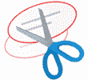
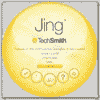

# 2020 年 15 种最佳 Snagit 替代品

> 原文： [https://www.guru99.com/snagit-alternative.html](https://www.guru99.com/snagit-alternative.html)

Snagit 是一个非常有用的屏幕捕获工具。 它允许您捕获/注释/共享图像和视频。 但是，最大的缺点是该工具不包含任何视频编辑器，而且它也是一种昂贵的软件。

这里是精选的 15 种工具的清单，可以轻松替换 Snagit。 该列表包括具有流行功能和最新下载链接的商业以及开源屏幕捕获工具。

### 1）射击

[射击](https://getfireshot.com/)是理想的屏幕捕获工具，可让您根据业务需要快速创建屏幕截图。

**功能**：

*   Windows 的截图软件工具
*   FireShot 可帮助您捕获网页屏幕截图，执行快速编辑，添加文本注释
*   允许您注释，突出显示屏幕截图的一部分

**下载链接**： [https://getfireshot.com/](https://getfireshot.com/)

### 2）TinyTake

[TinyTake](https://tinytake.com/) 屏幕按用户指定的区域或区域捕获任何屏幕。 您可以借助彩色笔和图像突出显示图像。 可以在文本框，箭头或图片标题的帮助下进行编辑。

**Features:**

*   免费的屏幕捕获和视频录制工具
*   捕获整个屏幕或特定区域的图像
*   屏幕截图的选定部分可以被模糊以隐藏敏感数据
*   它还记录屏幕活动的区域

**下载链接**： [https://tinytake.com/](https://tinytake.com/)

### 3） [PicPick](https://bit.ly/34iVfs0)

[Pickwick](https://bit.ly/34iVfs0) 屏幕捕获工具提供内置的图像编辑器，颜色选择器，调色板，像素标尺，量角器等。

**Features:**

*   允许您截取整个屏幕，滚动窗口或桌面的任何特定区域的屏幕截图
*   注释并突出显示图像：文本，箭头，形状等
*   支持浮动小部件捕获栏，该栏允许您截取屏幕截图

**下载链接**： [https://picpick.app/en/](https://bit.ly/34iVfs0)

### 4）Greenshot

[Greenshot](http://getgreenshot.org/) 是一个开源的屏幕捕获工具。 使用此工具，您可以快速捕获所选区域，窗口或整个屏幕的屏幕截图。 它还可以帮助您从 Internet Explorer 和其他浏览器捕获滚动的网页。

**Features:**

*   兼容 Window OS（任何版本）
*   轻松注释，突出显示或混淆屏幕截图的一部分
*   快速创建所选区域的屏幕截图

**下载链接**： [http://getgreenshot.org/](http://getgreenshot.org/)

### 5）截图工具

[截图工具](https://support.microsoft.com/en-in/help/13776/windows-10-use-snipping-tool-to-capture-screenshots)可帮助您截取屏幕截图。 它使用户能够以矩形形式捕获整个屏幕或所选区域。

**Features:**

*   Window OS 的屏幕捕获工具
*   用户可以使用彩色笔，荧光笔等编辑这些快照。
*   捕获的图像应以 PNG，GIF 和 JPEG 格式存储
*   捕获屏幕后，可以将其复制，如果需要还可以进一步粘贴

**下载链接**： [https://support.microsoft.com/en-in/help/13776/windows-10-use-snipping-tool-to-capture-screenshots](https://support.microsoft.com/en-in/help/13776/windows-10-use-snipping-tool-to-capture-screenshots)

### 6）屏幕截图

[屏幕截图捕捉器](http://www.donationcoder.com/software/mouser/popular-apps/screenshot-captor)以全屏模式，选定区域，滚动窗口，固定大小的窗口等捕获图像。这是易于使用的屏幕捕获工具。

**Features:**

*   屏幕快照 Captor 是可用于 Windows 的免费工具
*   它允许您从网络摄像头捕获图像
*   它可以轻松捕获多台监视器的屏幕截图
*   它会自动修剪捕获图像的多余边缘
*   支持第三方可配置工具，例如文件浏览器，图像编辑器

**下载链接**： [http://www.donationcoder.com/software/mouser/popular-apps/screenshot-captor](http://www.donationcoder.com/software/mouser/popular-apps/screenshot-captor)

### 7）ShareX

它是一个免费的开源轻量级免费广告捕获屏幕工具。 它提供了屏幕截图捕获，屏幕录像机，文件共享和生产力工具。

**Features:**

*   Windows 支援
*   轻松的屏幕截图共享
*   提供可定制的工作流程
*   带有多种工具，例如屏幕颜色选择器，图像编辑器，QR 码生成器等。

**下载链接**： [https://getsharex.com/](https://getsharex.com/)

### 8）SnapCrab

[SnapCrab](https://snapcrab-for-windows.en.softonic.com/) 按照用户定义的区域捕获图像，全屏显示，并以 JPEG，PNG 和 GIF 格式保存图像。

**Features:**

*   Windows 平台的屏幕捕获工具
*   它具有自拍功能，因此用户可以设置时间以自动在屏幕上捕获图像
*   各种自定义选项，例如定义您的热键，修改如何拍摄屏幕快照

**下载链接**： [https://snapcrab-for-windows.en.softonic.com/](https://snapcrab-for-windows.en.softonic.com/)

### 9) [Jing](https://bit.ly/3e4pozX)

[Jing](https://bit.ly/3e4pozX) 是 TechSmith 提供的屏幕捕获工具。 捕获的图像在 screencast.com 上共享，以提供复制/粘贴图像的 URL。 它允许您捕获屏幕视频。

**Features:**

*   Windows 和 Mac 操作系统的屏幕捕获工具
*   Jing 易于使用，并且具有友好的用户界面
*   它允许用户非常快速地共享屏幕捕获图像
*   它允许将图像和 URL 上传到社交媒体网站，例如 YouTube，Flickr 等。
*   帮助您从图像中删除品牌名称

**下载链接**： [https://www.techsmith.com/jing-tool.html](https://bit.ly/3e4pozX)

### 10） [Screenpresso](https://bit.ly/2ylO6vg)

[Screenpresso](https://bit.ly/2ylO6vg) 是功能强大的屏幕捕获工具。 它允许用户以各种格式保存捕获的图像，还可以保存所有最近的屏幕捕获历史记录。

**Features:**

*   Windows 的屏幕捕获工具
*   具有内置图像编辑器的轻巧而强大的屏幕捕获工具
*   用箭头，彩色气泡，文本框等突出显示捕获的图像。
*   捕获的图像可以转换为 PDF，MS Word 或 HTML 文档

**下载链接**： [https://www.screenpresso.com/](https://bit.ly/2ylO6vg)

### 11）遮光罩

[Lightscreen](http://lightscreen.com.ar/) 是易于使用的屏幕捕获工具。 该工具允许您自动执行屏幕截图的保存和分类过程。

**功能**：

*   Windows 和 Linux 的屏幕捕获工具
*   系统托盘图标，方便访问
*   允许您通过全局热键访问功能执行可配置的操作
*   您可以使用集成的图像查看器预览窗口

下载链接： [http://lightscreen.com.ar/](http://lightscreen.com.ar/)

### 12）加德温印刷屏幕

[Gadwin PrintScreen](https://www.gadwin.com/printscreen/) 易于使用，也是最方便的屏幕捕获工具。 它允许您在键盘上分配一个热键，以捕获具有不同模式的屏幕。 在选定区域中全屏显示。

**Features:**

*   Windows 的屏幕捕获工具
*   可自定义的导出选项，用于简单控件
*   全屏数据可以放在剪贴板上

**下载链接**： [https://www.gadwin.com/printscreen/](https://www.gadwin.com/printscreen/)

### 13）Skitch

[Skitch](https://evernote.com/products/skitch) 是一个屏幕捕获以及快速图像捕获和注释工具。 此屏幕捕获工具使您可以标记区域。

**Features:**

*   Skitch 是适用于 Mac 和 Windows OS 的免费屏幕捕获工具
*   它具有易于使用的用户界面
*   适用于 Android 和 iOS 移动设备
*   用户可以通过 Skitch 直接从相机注释照片。

**下载链接**： [https://evernote.com/products/skitch](https://evernote.com/products/skitch)

### 14）轻弹

[Lightshot](https://app.prntscr.com/en/index.html) 是屏幕捕获工具，可让您快速拍摄屏幕截图。 它允许用户拍摄所选区域的屏幕快照，可以自由调整大小或移动该区域。

**Features:**

*   它使您只需单击两次即可捕获屏幕
*   友好的用户界面使您的工作更快地完成
*   在捕获屏幕时，用户应该能够编辑相同的屏幕截图
*   自动在线上传捕获的图像以进行共享

**下载链接**： [https://app.prntscr.com/en/index.html](https://app.prntscr.com/en/index.html)

### 15）FastStone 捕获

[FastStone Capture](http://www.faststone.org/FSCaptureDetail.htm) 是功能强大，轻巧的全功能屏幕捕获工具。 它可以帮助用户捕获和注释屏幕上的所有内容，包括窗口，菜单，对象，甚至是网页。

**Features:**

*   借助热键即时捕获屏幕
*   捕获窗口，对象，菜单，全屏，矩形/手绘等。
*   捕获包括多级菜单的多个窗口和对象
*   绘制注释对象，例如文本，箭头线，高光，水印，圆形和矩形

**下载链接**： [http://www.faststone.org/FSCaptureDetail.htm](http://www.faststone.org/FSCaptureDetail.htm)

### 常问问题

**什么是 Snagit？**

Snagit 是一个方便的屏幕捕获工具。 它允许您捕获/注释/共享图像和视频。

✔️ **Snagit 的缺点是什么？**

Snagit 不包括功能强大的视频编辑器。 而且，它是昂贵的软件。

❓ **Snagit 可用的最佳替代品是什么？**

Snagit 工具的一些替代方法是 Fireshot，TinyTake，PicPick，Greenshot，Snipping 工具，Screenshot Captor 等。

⚡ **What is Snagit?**

Snagit is a handy screen capture tool. It allows you to capture/annotate/share images and videos.

Snagit is a handy screen capture tool. It allows you to capture/annotate/share images and videos.

Snagit is a handy screen capture tool. It allows you to capture/annotate/share images and videos.

✔️ **What are the drawbacks of Snagit?**

Snagit doesn't include powerful video editor. Moreover, it is expensive software.

Snagit doesn't include powerful video editor. Moreover, it is expensive software.

Snagit doesn't include powerful video editor. Moreover, it is expensive software.

❓ **What are the best alternatives available for Snagit?**

A few alternatives for Snagit tool are Fireshot, TinyTake, PicPick, Greenshot, Snipping Tool, Screenshot Captor, etc.

A few alternatives for Snagit tool are Fireshot, TinyTake, PicPick, Greenshot, Snipping Tool, Screenshot Captor, etc.

A few alternatives for Snagit tool are Fireshot, TinyTake, PicPick, Greenshot, Snipping Tool, Screenshot Captor, etc.