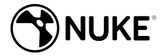

# 2020 年 11 种最佳 After Effects 替代品（免费&付费）

> 原文： [https://www.guru99.com/after-effects-alternative-free.html](https://www.guru99.com/after-effects-alternative-free.html)

After Effects 是 Adobe 开发的一种数字视觉效果和动态图形软件。 广泛用于制膜的生产过程。 After Effects 提供高质量的虚拟效果后，此工具可帮助您轻松删除影片中的元素。

但是，它具有与 3D 动画和声音同步相关的一些限制。 这里是精选的可以替代 After Effects 的顶级工具的列表。 该列表同时包含开源（免费）和商业（付费）软件。

### 1）融合 16

Fusion 16 是一种动画工具，可提供视觉效果，VR，动态图形和 3D 解决方案。 通过将不同类型的照片处理软件连接在一起，可以轻松创建效果。

**功能：**

*   该工具为主要的 VR（虚拟现实）耳机提供支持。
*   它可以分析实景镜头的摄像机运动并重建 3D 摄像机运动。
*   它会自动查找图像的跟踪详细信息。
*   您可以使用高级遮罩控件删除背景色。
*   它提供了多镜头时间轴，并支持自定义情节提要，播放列表，注释注释，版本跟踪等。
*   通过附加的 GPU（图形处理单元）加速来提高性能。

**下载链接：** [https://www.blackmagicdesign.com/in/products/fusion/](https://www.blackmagicdesign.com/in/products/fusion/)

* * *

### 2） [Camtasia Studio](http://bit.ly/2Srr9gq)

[Camtasia Studio](http://bit.ly/2Srr9gq) 是一款视频编辑器，可轻松基于 Windows，Mac 和 Linux 平台创建具有专业外观的视频。 该软件可帮助您记录会议，操作视频，YouTube 视频和演示视频。

**Features:**

*   您可以从桌面捕获和剪切清晰的音频和视频。
*   Camtasia 为您提供可以轻松自定义的预制动画。
*   它提供引人注目的图块，注释和标注。
*   使用此工具可以添加放大，缩小和平移动画。
*   您可以添加测验问题和互动性来衡量学习视频。
*   Camtasia Studio 使您可以记录和导入演示文稿。
*   它提供各种音乐和声音效果。

* * *

### 3） [Filomra9](https://bit.ly/2UA2tEV)

[Filmora](https://bit.ly/2UA2tEV) 是具有直观用户界面和大量视频效果的视频制作应用程序。 此工具具有高级编辑模式，并且可以对视频进行更大的控制，包括关键帧设置。

**Features:**

*   该工具提供快速处理，代理文件和可调节的预览质量，可帮助您提高工作效率。
*   您可以解决相机抖动和鱼眼之类的相机问题。
*   一键式更改视频的美感。
*   您可以在线分享故事。
*   在 100 个完整的视频轨道中组织您的媒体。
*   它具有 PC / Mac 交叉兼容性。

**下载链接：** [https://filmora.wondershare.com/](https://bit.ly/2UA2tEV)

* * *

### 4）核弹

Nuke 旨在简化日常工作流程。 它是一个灵活，高效且功能丰富的工具集。 合成器和动画师可以使用此工具。

**Features:**

*   它包括矢量绘制工具，颜色校正，旋转仪等。
*   使用此工具可以处理包含多个不透明度和颜色的图像。
*   您可以快速准确地跟踪和纠正各种对象。
*   它可以精确处理镜头变形。
*   此工具可帮助您预览 3D 环境中的更改。
*   Nuke 使您可以轻松创建更清晰的图像。

**下载链接：** [https://www.foundry.com/products/nuke](https://www.foundry.com/products/nuke)

* * *

### 5）苹果运动

 

Apple Motion 是一种工具，可让您创建电影 2D 和 3D 字幕，流畅的交易并实时添加逼真的效果。 六个家庭成员可以使用此软件。

**Features:**

*   您可以导入 360°媒体并设计 360°标题，生成器和效果。
*   提供高动态范围图形。
*   您可以使用相同的高级色轮调整色相，亮度和饱和度。
*   拖放功能可通过 200 个滤镜选择组合动画。

**下载链接：** [https://apps.apple.com/ua/app/motion/id434290957?mt=12](https://apps.apple.com/ua/app/motion/id434290957?mt=12)

* * *

### 6）连续体

Continuum 是由 Boris Fx 开发的插件。 它使您可以使用 17 种创意效果简化工作流程。 它提供了电影院 4D 集成。

**Features:**

*   它支持 FX 浏览器应用程序和 Title Studio。
*   它包含大量启动项目的预设。
*   您可以通过遮挡粒子来增加任何对象的深度。
*   此插件可帮助您完成高级视觉效果（VFX）。
*   它为您提供了一系列的颜色校正和颜色匹配选项。
*   电影风格单元可让您创建经典的电影外观。
*   您可以将聚光灯以及喜怒无常的光线添加到舞台表演中。

**下载链接：** [https://borisfx.com/products/continuum/](https://borisfx.com/products/continuum/)

* * *

### 7）Corel 会声会影 Pro X6

Corel 会声会影 Pro X6 是一款视频编辑软件，可让您开发具有专业外观的视频。 它支持新的视频编辑技术，可帮助您快速创建自己的电影。

**Features:**

*   只需单击几下，您就可以跟踪视频中的特定元素，例如车牌，弹跳球或走路的人。
*   您可以自定义标题，图形，视频剪辑或对象的移动。
*   该程序使您可以查看 4K 视频格式的文件。
*   它会自动检测视频中的语音并将其转换为字幕段。
*   您可以在屏幕捕获期间指定帧速率。

**下载链接：** [https://www.videostudiopro.com/en/pages/videostudio-x6/](https://www.videostudiopro.com/en/pages/videostudio-x6/)

* * *

### 8）搅拌机

Blender 是一个开源 3D 创建套件，支持动画，运动跟踪，视频编辑，2D 动画等。此工具允许您使用 Blender 的 Python 脚本 API 自定义应用程序。

**Features:**

*   它可以帮助用户创建令人叹为观止的渲染。
*   用户可以更改动画姿势编辑器。
*   该工具可以渲染多层 OpenEXR 文件。
*   用户可以轻松地将 2D 图像与 3D 结合在一起。
*   它提供了带有洋葱皮的动画支持。
*   Blender 允许用户自定义窗口布局和快捷方式。

**下载链接：** [https://www.blender.org/download/](https://www.blender.org/download/)

* * *

### 9）小苏打

Natron 是一个开放源代码和跨平台的工具，可以满足您的 2D / 2.5D 需求。 它具有键控，roto / roto 绘画，2D 跟踪功能，需要视觉效果。

**Features:**

*   该工具提供了功能强大的曲线和摄影表编辑器。
*   它提供了功能强大的 2D 和计划程序跟踪器。
*   它具有 Natron 的 GPU 和渲染功能。
*   支持大量免费和开源的 OpenFX 插件。
*   您可以保存各种格式的图像，例如 PNG，JPG，SVG 和 PSD。

**下载链接：** [https://natrongithub.github.io/](https://natrongithub.github.io/)

* * *

### 10）电影

Hitfilm 是一个编辑合成器，具有 800 多种视觉效果。 该软件使您可以创建具有专业外观的视频并轻松修复音频。

**Features:**

*   您可以将标题从 2D 转换为 3D。
*   它支持灯光，阴影和环境贴图，使您的文本看起来像真实的自然对象。
*   该工具具有 Surface Studio 效果，使您可以生成动画纹理。
*   它使您可以向视频中添加文本。
*   该工具提供音频可视化。
*   您可以将对象与灯光和阴影集成在一起，以获得更逼真的外观。

**下载链接：** [https://fxhome.com/hitfilm-pro](https://fxhome.com/hitfilm-pro)

* * *

### 11）Autodesk 3DS Max

Autodesk 3DS Max 是功能强大的 3D 建模和动画软件。 游戏开发人员，视觉效果艺术家和图形设计师可以使用它来创建高质量的场景并提供引人入胜的 VR 体验。

**功能：**

*   该工具允许您使用集成的 Arnold 渲染器创建和渲染引人注目的场景。
*   您可以使用自动化流程扩展工作流程。
*   使用选择和造型工具，可以更轻松地在视口中直接操纵毛皮和头发。
*   您可以使用顶点，边和面信息来更改模型。
*   使用多边形细分曲面有效地创建有机对象和参数对象。
*   产生复杂的粒子效果，例如水，喷雾，雪和火。

**下载链接：** [https://www.autodesk.in/products/3ds-max/overview](https://www.autodesk.in/products/3ds-max/overview)