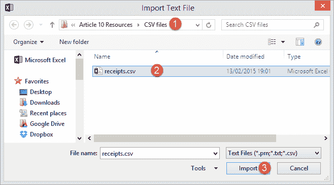
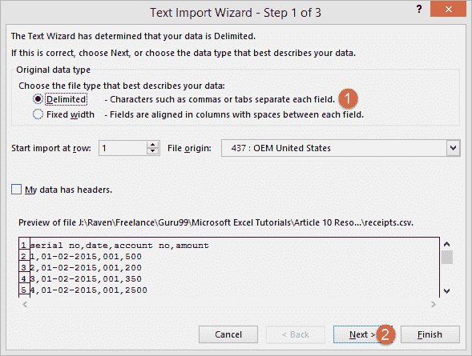
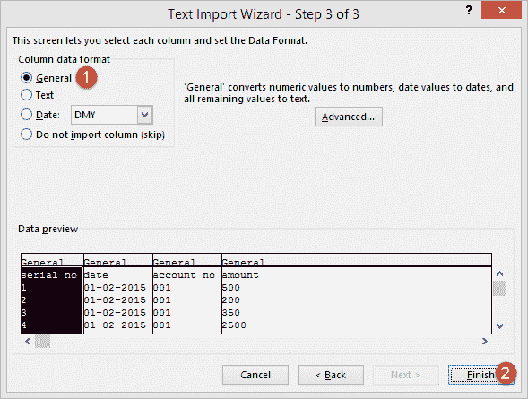
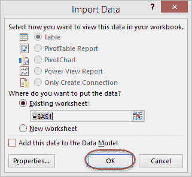
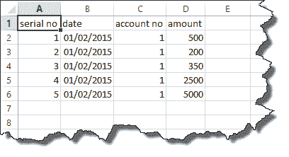
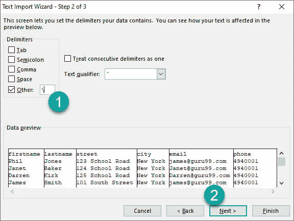
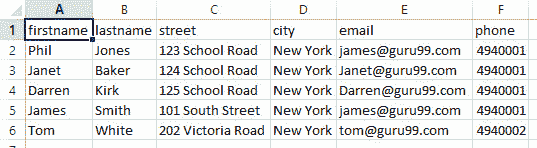

# 如何将 CSV 数据（文本）导入 Excel [示例]

> 原文： [https://www.guru99.com/import-csv-data-excel.html](https://www.guru99.com/import-csv-data-excel.html)

在本教程中，我们将从包含客户付款的简单 CSV 文件中导入外部数据。 您可以下载此练习的 CSV 文件。

[下载 CSV 文件](https://drive.google.com/uc?export=download&id=1JKQ3HV5bQibhknA0wpETxQDa6hdIR2OK)

*   打开一个新的工作簿
*   单击功能区上的“数据”选项卡
*   单击来自文本按钮
*   您将获得以下窗口

*   浏览到下载 CSV 文件的文件夹
*   选择.csv 文件
*   点击导入按钮
*   您将获得以下导入文本文件向导

*   点击下一步按钮

*   在“定界符”面板上选择“逗号”
*   点击下一步按钮

*   点击完成按钮

*   点击确定按钮
*   您将获得以下数据

在某些情况下，您可能无法获得逗号分隔的文件，它可能是斜杠（\），竖线（|）或其他分隔符分隔的文件。 让我们看一下如何处理它们。

这是可以下载的示例斜杠（\）分隔值文件。

[下载用斜杠（\）分隔的 CSV 文件](https://drive.google.com/uc?export=download&id=1lk0vV5OMDPq8jXZ8Knfl06DHoDRcgenE)

*   打开一个新的工作簿
*   单击功能区上的“数据”选项卡
*   单击来自文本按钮
*   浏览到下载文件的文件夹并导入
*   您将获得以下导入文本文件向导

*   点击下一步按钮

*   现在，安装“逗号分隔符”，选择“其他”，然后在“分隔符”面板上将斜杠（\）设置为分隔符
*   然后单击下一步按钮。
*   然后点击完成按钮
*   现在在现有工作表中导入数据

您将获得愚蠢的数据

