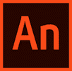
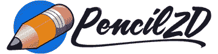
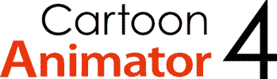
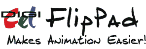

# 2020 年 14 种最佳 2D 动画软件[免费/付费]

> 原文： [https://www.guru99.com/best-2d-animation-software.html](https://www.guru99.com/best-2d-animation-software.html)

2D 动画工具可帮助您创建角色，背景，情节提要和应用效果。 2D 动画代表二维动画，这意味着这些类型的项目中的角色和背景是在二维的平坦空间中创建的。 这些工具使用矢量和位图图形制作和编辑动画图像。

以下是热门 2D 动画工具的精选列表，包括其受欢迎的功能和网站链接。 该列表同时包含开源（免费）和商业（付费）软件。

### 1）Animaker

Animaker 是一个在线 2D 动画工具，可提供许多动画角色，图标，属性，BG，地图和图表。 它可以帮助您为组织，演示文稿，自由职业项目以及个人项目创建理想的视频。

**功能：**

*   您可以创建 6 种独特的视频样式的动画视频，例如 2D，手工，白板，信息图表，2.5 D 和排版。
*   初学者可以制作视频并将其用作动画和动画演示。
*   它具有 200 种声音效果可供选择。
*   此工具提供 100 个背景音乐曲目。
*   它使您可以记录直接的语音记录。
*   Animaker 允许团队合作。
*   您可以导出全高清质量的视频。

**下载链接：** [https://www.animaker.com](https://www.animaker.com)

* * *

### 2） [Animate CC](https://bit.ly/3a6ihUe)

[Animate CC](https://bit.ly/3a6ihUe) 是一款可帮助您为游戏，应用和网络设计交互式位图和矢量动画的工具。 您可以向图表和教程添加操作。

**Features:**

*   您可以为矢量图像或图形创建新的姿势。
*   它使您可以按父子层次结构排列图层。
*   它会自动将嘴形与声音变化相匹配。
*   您可以导出 360 VR 动画。
*   使用此工具，您可以直接使用 Animate 制作广告。
*   通过绕过图像优化并使用图像设置以正确的分辨率导出图像。

**下载链接：** [https://www.adobe.com/in/products/animate.html](https://bit.ly/3a6ihUe)

* * *

### 3）Synfig

Synfig 是一个开源 2D 矢量图形和动画程序。 该软件可在 Windows，OSX 和 Linux 三个操作系统平台上运行。

**Features:**

*   它允许您将任何包含矢量形状的图像转换为另一图像。
*   您可以通过数学表达式链接图层的参数。
*   此应用程序提供了 50 多个图层来创建动画。
*   您可以使用位图图像创建切口动画效果。

**下载链接：** [https://www.synfig.org](https://www.synfig.org)

* * *

### 4）粉笔

Krita 是一个简单的 2D 动画工具，可让您自定义工作流程。 它提供了 100 多个专业制作的刷子。

**Features:**

*   它使您可以添加稳定剂以使其平滑。
*   使用 9 个独特的画笔引擎自定义画笔。
*   您可以使用内置的矢量绘图工具创建漫画面板。
*   通过在 x 和 y 轴上进行图像参考来创建无缝的纹理和图案。
*   它允许您导入其他艺术家的纹理和画笔包。
*   您可以组合，展平或订购图层以组织艺术品。
*   您可以突出显示绘图部分。
*   Krita 帮助您将其合并到当前的颜色管理管道中。

**下载链接：** [https://krita.org/en/features/highlights/](https://krita.org/en/features/highlights/)

* * *

### 5）Pencil2d

Pencil2d 是 2D 手绘动画软件。 它易于使用且重量轻。 它使您可以在旅途中草绘墨水和颜料。

**Features:**

*   Pencil2D 是可在 Windows，macOS 和 Linux 操作系统上运行的跨平台工具。
*   它可以免费用于商业。
*   您可以使用翻转或滚动技术快速查看工作。
*   该工具提供对 TIFF 格式（标记图像文件格式）的支持。
*   您可以将图像导入为特定帧上的新图层。

**下载链接：** [https://www.pencil2d.org](https://www.pencil2d.org)

* * *

### 6）开音

Opentoonz 是一个开源动画制作应用程序。 它与 4 种类型的扫描兼容。 它允许您保存扫描设置。

**Features:**

*   它与 TWAIN（无趣名称的技术）标准兼容。
*   它允许您使用抗锯齿线。
*   该工具提供了一种使用临时颜色绘画的简便方法。
*   您可以通过节点树使用图形用户界面（GUI）合成效果。
*   可以使用实际比例分辨率来管理图像。
*   与光栅和矢量图像兼容。
*   您可以使用插件使用更多效果。

**下载链接：** [https://opentoonz.github.io/e/](https://opentoonz.github.io/e/)

* * *

### 7）定格工作室

Stop Motion Studio 是功能强大的 2D 动画编辑器，可用于 iPhone，iPad 和 macOS。 它支持来自佳能，尼康和索尼等最著名相机制造商的相机。

**Features:**

*   它具有逐帧视图，可按时间顺序显示所有图像。
*   Stop Motion Studio 允许您设置切入点和切出点，以标记影片的特定部分以进行播放和循环播放。
*   它带有许多音乐剪辑和声音效果。
*   它具有多种绘画工具，可像在传统画布上一样进行绘画。
*   此工具有一个魔术橡皮擦，用于删除影片中不需要的对象。
*   它可以帮助您设计标题和信用屏幕。
*   它提供了多种效果来改变电影的外观。

**下载链接：** [https://www.cateater.com](https://www.cateater.com)

* * *

### 8）Celaction

 

Celaction 是电影，广告商业和电视连续剧的专业 2D 动画应用程序。 该工具可帮助您轻松处理具有多个层的复杂项目。

**Features:**

*   您可以同时使用位图或向量，或同时使用两者。
*   它提供浮动面板和可停靠面板以及用户可定义的工作区。
*   该工具为用户提供了定义快捷键的功能。
*   您可以用超过 1600 万种颜色创建味觉。
*   它适用于 Windows 7，Vista，Windows XP，Windows 8 和 Windows 10。
*   您可以将矢量形状转换为可变形的可变形对象。

**下载链接：** [https://www.celaction.com](https://www.celaction.com)

* * *

### 9）和谐

Harmony 是从绘图到最终制作的高效动画的多合一工具。 它使您可以创建图稿，制作动画以及将声音和特殊效果添加到动画中。

**Features:**

*   稳定线条的稳定剂。
*   它提供了 3 点，4 点和 5 点弯曲的透视导轨。
*   此应用程序允许您创建剪切动画。
*   您可以将其与生产管道中可用的软件集成。
*   它提供 2D 或 3D 集成。
*   和声可以帮助您为游戏创建 2D 动画。
*   您可以导入多层 PSB 和 PSD 文件，Illustrator，PDF，位图和媒体文件。

**下载链接：** [https://www.toonboom.com/products/harmony](https://www.toonboom.com/products/harmony)

* * *

### 10）搅拌机

Blender 是 2D 计算机图形软件应用程序，用于开发视觉效果，动画电影，游戏等。 使用此工具可以导入或导出 MPEG，QuickTime 和 AVI 文件格式的视频。

**Features:**

*   该工具提供用于脚本和自定义的 Python API。
*   您可以自定义快捷方式。
*   它提供了用于真实渲染的路径跟踪器。
*   您可以创建，变形，雕刻和编辑模型。
*   它提供 3D 场景和跟踪素材的实时预览。
*   您可以将静态字符变成令人印象深刻的动画。

**下载链接：** [https://www.blender.org](https://www.blender.org)

* * *

### 11）CrazyTalk 动画师

CrazyTalk Animator 是 2D 动画产品，使您可以将图像转换为控制角色和动画角色。 使用此软件，您可以轻松地从音频生成口型同步动画。

**功能：**

*   它可以让您捕捉面部动作。
*   您可以将 photoshop 图层转换为 2D 字符。
*   它提供运动路径和时间线编辑。
*   您可以创建交互式复合动画。
*   它最多支持 4K 高清晰度显示器。
*   CrazyTalk Animator 可帮助您通过运动将现有内容转换为 360 个头部。

**下载链接：** [https://www.reallusion.com/cartoon-animator/default.html](https://www.reallusion.com/cartoon-animator/default.html)

* * *

### 12）动画书

FlipBook 是 2D 动画工具，用于将 pdf 文件转换为 HTML 翻转书。 它可以在 Microsoft Windows 或 Mac OS X 上运行。

**Features:**

*   它允许您自定义工具栏。
*   您可以插入和删除帧以节省时间。
*   FlipBook 只需单击捕获图标，即可帮助您拍摄铅笔测试图。
*   将 4 种类型的图像（例如背景，叠加层，电影和 cel）导入该软件。
*   您最多可以添加三个配乐。
*   它使您可以在更短的时间内绘制场景。
*   您可以使用数字键确定要绘制的帧总数。

**下载链接：** [https://digicel.net](https://digicel.net)

* * *

### 13）Moho Pro

Moho Pro 工具是将动画技术与专业工具相结合的 2D 动画系统。 它允许您为角色创建独特的纹理和效果。

**Features:**

*   它具有一个自定义位图画笔，可让您创建自定义位图画笔。
*   该工具改进了 3D 对象支持。
*   您可以在相机操作期间看到更好的对象预览，并可以更改 3D 对象的材质属性。
*   您可以使用子词，关键字和布尔运算进行搜索。
*   它使您可以通过将位图工具与逐帧图层结合使用，在 Moho 中创建传统风格的动画。

**下载链接：** [https://my.smithmicro.com/moho-pro.html](https://my.smithmicro.com/moho-pro.html)

* * *

### 14）电视涂料

TVPaint 是基于位图技术的 2D 应用程序。 您可以混合纸上动画和数字动画，并使用此软件制作项目。

**Features:**

*   该工具使您可以管理图层和图像。
*   您可以制作情节提要并立即将其视为动画。
*   它使您可以在 FX 堆栈中组合许多 FX（效果）。
*   您可以使用图形输入板实时处理画笔的不透明度，大小，抖动和角度。
*   Tvpaint 使您可以修改实时摄像机参数，例如色调，亮度，色相等。
*   您可以使用绘图工具修饰图像。

**下载链接：** [https://www.tvpaint.com](https://www.tvpaint.com)