# 2020 年 20 种最佳 3D 动画软件[免费/付费]

> 原文： [https://www.guru99.com/best-3d-animation-software.html](https://www.guru99.com/best-3d-animation-software.html)

3D 动画代表三维动画，这意味着这些类型的项目中的角色和背景是在三维空间中创建的。 3D 动画工具可帮助您创建模型，背景，情节提要和应用效果。 您可以使用这些工具为广告，电影和电视中的人物设置动画。

以下是精选的顶级 3D 动画软件列表，以及其受欢迎的功能和网站链接。 该列表同时包含开源（免费）和商业（付费）软件。

### 1）疯狂的谈话

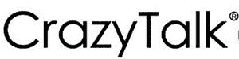

CrazyTalk 是 3D 动画工具，使用语音和文本为面部图像制作动画。 它使您可以使用声音的强度实时驱动动画。 该工具可通过表达式模板提供 3D 编辑，修改滑块和肌肉控制。

**功能：**

*   它使您可以将照片实时转换为 3D 头像。
*   您可以同时使用正面和侧面照片合成 3D 头部，以获得正确和正确的外观。
*   您可以打扮并定制配件的设计。
*   它使您可以控制选定的部分并微调面部行为。
*   Crazytalk 提供带有单独的零件控制和运动剪辑的时间线编辑。
*   它支持最大 4K 的主要图像和视频文件格式。

**链接：** [https://www.reallusion.com/crazytalk/](https://www.reallusion.com/crazytalk/)

* * *

### 2）Maxon

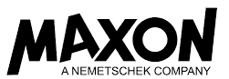

Maxon 是 MAXON Computer 设计的 3D 建模，运动和渲染软件。 它具有动画效果，闪电效果和纹理效果。 此工具可帮助您处理 3D 图形和动画。

**Features:**

*   它可以帮助您创建现实模型和抽象模型。
*   您可以使用可自定义的模型来创建高质量的产品可视化。
*   它使您可以从显示预览的下拉菜单中快速选择字体。
*   该工具提供了程序对象和着色器制作，使您可以轻松完善您的想法。

**链接：** [https://www.maxon.net/en/](https://www.maxon.net/en/)

* * *

### 3）按键

KeyShot 是用于创建 3D 视觉效果的渲染软件。 它包括对超过 35 种领先文件格式的支持。 该工具提供了免费的插件，可提供一键式加载。 它与 Windows 和 macOS 兼容。

**Features:**

*   它包括 750 多种具有高级功能的预设材料，可以创建您自己的样式。
*   一键即可体验 VR（虚拟现实）。
*   该工具使您可以创建，迭代和完善设计和概念。
*   您可以将纹理，标签和变体应用于任何照片。
*   KeyShot 可帮助您创建静止图像以及动画。
*   您可以为网络和移动设备创建视觉效果。

**链接：** [https://www.keyshot.com](https://www.keyshot.com)

* * *

### 4）玛丽

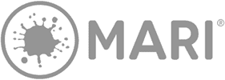

Mari 是 3D 绘画工具，可让您在任何对象周围添加纹理。 它提供了数百种高清纹理。 该工具具有 Python API，可自动执行工作流程和工作室。

**功能：**

*   该工具支持 UDIM 工作流程。
*   您可以在处理照片之前对绘画进行调整和更改。
*   它允许艺术家导入您的纹理集并将其转换为 Mari 材料。
*   您可以将油漆与调整层混合以构建着色器。
*   该工具支持将 Ptex 格式转换为基于 UV 的纹理。
*   它允许您管理颜色变换。

**链接：** [https://www.foundry.com/products/mari](https://www.foundry.com/products/mari)

* * *

### 5）香椿繁荣

 

Harmony 是从绘图到最终制作的高效动画的多合一工具。 它使您可以创建图稿，制作动画以及将声音和特殊效果添加到动画中。 您可以导入多层 PSB 和 PSD 文件，Illustrator，PDF，位图和媒体文件。

**Features:**

*   稳定线条的稳定剂。
*   它提供了 3 点，4 点和 5 点弯曲的透视导轨。
*   此应用程序允许您创建剪切动画。
*   您可以将其与生产管道中可用的软件集成。
*   它提供 2D 或 3D 集成。
*   和谐帮助您为游戏创建 3D 动画。

**链接：** [https://www.toonboom.com/products/harmony](https://www.toonboom.com/products/harmony)

* * *

### 6）iClone

Iclone 是用于创建实时 3D 动画的工具。 该工具可以帮助您制作电影，视频游戏，教育，内容开发等方面的动画。它可以让您轻松创建逼真的或风格化的动画。

**Features:**

*   您可以通过简化的界面分配和管理材质以控制纹理。
*   该软件为脸部和身体提供了立即对任何角色进行动画处理的工具。
*   它提供拖放功能以照亮任何内部或外部场景。
*   您可以将普通的 3D 场景变成逼真的世界。
*   Iclone 提供了动画，角色和配件动画的准备。
*   您可以使用 Python API 扩展 IClone。

**链接：** [https://www.reallusion.com/iclone/default.html](https://www.reallusion.com/iclone/default.html)

* * *

### 7）MotionBuilder

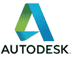

MotionBuilder 的 Auto Desk 是由 Autodesk 开发的 3D 角色动画软件。 它可用于运动捕捉，虚拟摄影和传统关键帧动画。

**Features:**

*   您可以捕获，编辑和播放角色动画。
*   它可以帮助您操纵运动捕捉数据。
*   字符。
*   使用此工具可以在 Maya，3ds Max 和 Motion Builder 等其他动画应用程序之间交换数据。
*   它使您能够为任何角色创建逼真的动作。

**链接：** [https://www.autodesk.com/products/motionbuilder/overview](https://www.autodesk.com/products/motionbuilder/overview)

* * *

### 8）[效果](https://bit.ly/2V2elji)

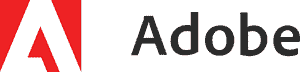

[After Effects](https://bit.ly/2V2elji) 是 Adobe 开发的动态图形和数字视觉效果应用程序。 该工具可帮助您轻松删除胶片中的元素。

**Features:**

*   该工具提供了 100 多种选择效果的选项。
*   您可以使用 GPU（图形处理单元）预览回放。
*   它可以动画标题。
*   您可以组合图像和视频来创建动画。
*   该工具提供了 100 多种选择效果的选项。
*   您可以从视频剪辑中删除对象。

**链接：** [https://www.adobe.com/products/aftereffects.html](https://bit.ly/2V2elji)

* * *

### 9） [Unity](https://bit.ly/3egOATV)

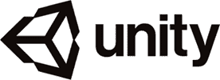

[Unity](https://bit.ly/3egOATV) 是一个完全集成的开发游戏引擎，具有创建游戏和其他交互式 3D 内容的功能。 它可以帮助您将艺术品和资产组合到场景和环境中。

**Features:**

*   您可以将其用于 Windows，Linux 和 Mac。
*   该工具可用于 2D 以及 3D 开发。
*   它可以帮助您直观，快速地创建用户界面。
*   您可以使用许多其他工具来扩展 unity 编辑器，以匹配您的团队工作流程。
*   它使您可以与他人合作。

**链接：** [https://unity3d.com/unity](https://bit.ly/3egOATV)

* * *

### 10） [Adob​​e Character Animator](https://bit.ly/3ek1IYe)

[Adob​​e Character Animator](https://bit.ly/3ek1IYe) 是一款软件产品，可帮助您实时设置角色动画。 您可以使用此软件通过网络摄像头将任何艺术品变成动画角色。

**Features:**

*   它可以帮助您创建与面部表情匹配的动画。
*   您可以使用手臂，腿部和头部进行动画处理。
*   使用此工具可以设置特定的照片，例如特写镜头和变焦。
*   您可以设计角色来传达运动和速度。
*   它提供了关键帧来创建时刻。
*   您可以将音频同步到动画。

**链接：** [https://www.adobe.com/products/character-animator.html](https://bit.ly/3ek1IYe)

* * *

### 11）Mixamo

Mixamo 是允许开发人员和美工人员自定义和创建 3D 角色动画的工具。 它收集了高质量的 3D 随时可用的角色。

**Features:**

*   它可以根据完整的人体骨骼自动设置自定义字符。
*   您可以将现成的字符转换为自己的字符。
*   它允许您下载多种格式的动画。

**链接：** [https://www.mixamo.com/](https://www.mixamo.com/)

* * *

### 12）搅拌器

Blender 是 3D 计算机图形软件应用程序，用于开发视觉效果，动画电影，游戏等。 使用此工具可以导入或导出 MPEG，QuickTime 和 AVI 文件格式的视频。

**Features:**

*   该工具提供了用于脚本编写和自定义的 Python API。
*   您可以自定义快捷方式。
*   它具有用于真实渲染的路径跟踪器。
*   您可以创建，变形，雕刻和编辑模型。
*   它提供了 3D 场景和跟踪素材的实时预览。
*   它可以帮助您将静止字符变成令人印象深刻的动画。

**链接：** [https://www.blender.org/features/animation/#animation-toolset](https://www.blender.org/features/animation/)

* * *

### 13）光波

LightWave 是由 NewTek 开发的 3D 计算机图形软件应用程序。 它可以用于动画 3D 图像和静态 3D 图像。 该软件为多显示器设置提供独立的缩放选项。

**Features:**

*   它提供了变形的动画雕刻或绘画。
*   您可以使用 FBX（Filmbox）数据。
*   该工具包允许进行实时构造实体几何（CSG）操作和网格过滤。
*   您可以使用 UV 技术将 2D 图像纹理映射到 3D 结构上。
*   它提供阴影和渲染字符。

**链接：** [https://www.newtek.com/lightwave/2019/](https://www.newtek.com/lightwave/2019/)

* * *

### 14）胡迪尼

描述 Houdini 是 SideFX 开发的 3D 动画软件应用程序。 它可以帮助艺术家自由地工作，创建多个迭代以及与同事共享工作流程。 它提供了修整工具来创建快速曲线。

**Features:**

*   Houdini 是可帮助您创建环境和城市景观等复杂模型的工具。
*   它提供了多种多边形，细分曲面建模工具。
*   您可以从第三方渲染应用程序（如 Redshift，RenderMan，OctaneRender）中进行选择。
*   Houdini 提供了一种更好的构建，雕刻和渲染云层的方法。

**链接：** [https://www.sidefx.com/products/houdini/](https://www.sidefx.com/products/houdini/)

* * *

### 15）Daz 3D

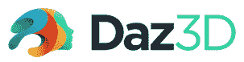

Daz 3D 是专为动画师和设计师设计的人物姿势，动画，渲染应用程序。 它使他们能够创建 3D 人体模型。 该工具的最新版本允许您向图像添加光和纹理。

**Features:**

*   提供 3D 电影，姿势和动画。
*   模型是手绘的细节。
*   您可以将内容导入其他 3D 软件工具，例如 Maya，Mudbox 和 3DS Max。
*   它使您能够以 COLLADA，Universal 3D，BVH 和 FBX 格式导出输出。
*   您只需单击几下即可将图形传输到 Maya 软件。

**链接：** [https://www.daz3d.com/daz_studio/](https://www.daz3d.com/daz_studio/)

* * *

### 16）剪辑工作室

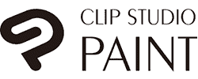

Clip Studio Paint 是一种工具，可让您使用自然笔刷进行绘画。 它可以帮助您捕获图形中的每个细节。 此工具具有用于绘制线条的内置标尺。

**Features:**

*   使用此工具可以编辑层的厚度，形状等。
*   您可以自定义一支笔来绘制笔划。
*   它具有内置的稳定器，可以使线路平滑。
*   您可以添加带有开始和编辑效果的结束笔触。
*   它提供了 1000 多种可自定义的画笔。
*   Clip Studio 使您可以设置自己的笔刷形状和纹理，以获得独特的笔刷。
*   您可以将图层转换为点图像。

**链接：** [http://www.clipstudio.net/en/](http://www.clipstudio.net/en/)

* * *

### 17）询问

[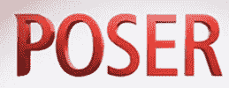 ](/images/1/120319_0827_20BEST3DAni17.png) 

Poser 是 Bondware 发行的 3D 计算机图形程序。 它提供了可立即使用的 3D 人物，衣服，头发和照明设备，可以快速启动项目。

**Features:**

*   您可以轻松地使用 3D 角色创建动画和艺术作品。
*   它可以帮助您创建用于插图，艺术，动画，漫画等的人物。
*   该工具使数字艺术家可以访问大量第三方数字内容。

**链接：** [https://www.posersoftware.com](https://www.posersoftware.com)

* * *

### 18）电影风暴

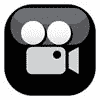

Moviestorm 是一款实时动画应用程序。 您可以使用此工具在计算机上制作电影。 它提供了许多教程和文档来学习和制作 3Damimation。

**Features:**

*   此应用程序允许您修改道具，纹理，动画，环境等。
*   您还可以使用第三方软件（例如 Google Sketchup，Autodesk 的 3D Studio Max，Blender 等）制作的模型。
*   Moviestorm 使您可以自定义适合您的项目的元素。
*   它可以帮助您创建引人入胜的演示文稿和故事。
*   您可以使用此工具制作商业和培训视频。

**链接：** [https://www.movi​​estorm.co.uk/hub/home](https://www.moviestorm.co.uk/hub/home)

* * *

### 19）行星边

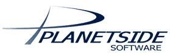

Planetside 是用于构建，渲染和设置逼真的自然环境的最佳 3D 动画解决方案。 该工具使您可以快速轻松地微调场景。 您可以使用它在电影中产生视觉效果。

**Features:**

*   您可以设计具有逼真的阴影的云。
*   它使您可以在图像中添加镜头效果。
*   Planetside 包含所有用于制作更好动画的面向动画的工具。
*   它提供了逼真的臭氧模拟。
*   该软件包括用于向图像添加阴影的着色器。

**链接：** [https://planetside.co.uk](https://planetside.co.uk)

* * *

### 20）Muvizu

[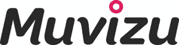 ](/images/1/120319_0827_20BEST3DAni20.jpg) 

Muvizu 是一个软件应用程序，可让您在桌面上制作 3D 动画电影。 该工具提供了一种更好的方式来描述使用动画的任何故事。 您可以拖放可自定义的字符和设置以制作动画。

**Features:**

*   您可以自定义字符类型。
*   它会自动将嘴唇同步到角色。
*   该工具提供虚拟灯光。
*   Muvizu 提供特殊效果。
*   它可以帮助您轻松创建高质量 3D 动画。
*   Muvizu 允许您使用纹理为任何字符着色。

**链接：** [http://www.muvizu.com](http://www.muvizu.com)