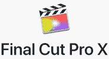
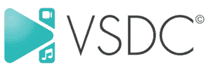

# 2020 年 26 种最佳 Adobe Premiere Alternative [免费/付费]

> 原文： [https://www.guru99.com/free-adobe-premiere-alternative.html](https://www.guru99.com/free-adobe-premiere-alternative.html)

Adobe Premiere 是一种视频编辑软件，可帮助您轻松轻松地对视频进行更改。 它使您能够以 AVI（音频-视频交错），MXF 材料交换格式）等格式导出视频。

但是，Adobe Premiere 有一些局限性，例如它需要大量的系统资源才能运行它。 此外，此工具非常昂贵，并且如果要搜索它，则需要了解许多元素。

以下是精选功能可替代 Adobe Premiere 的顶级工具的清单。 该列表同时包含开源（免费）和商业（付费）软件。

### 1）HitFilm Express

HitFilm Express 是 Adobe Premiere 的强大竞争对手，它使您可以轻松地编辑视频和添加效果。 它可以帮助您修剪，更改音频等。

**功能**：

*   组合 2D 和 3D 视频非常容易。
*   它支持 410 多种效果。
*   该工具可以在 Windows 和 Mac 上使用。
*   HitFilm Express 提供了无限的曲目来安排视频剪辑。
*   它提供颜色校正和分级功能。
*   包含一个跟踪面板，用于控制 HitFilm 内部的 2D 跟踪。

**链接**： [https://fxhome.com/hitfilm-express](https://fxhome.com/hitfilm-express)

* * *

### 2） [Filmora](https://bit.ly/2UA2tEV)

[Filmora](https://bit.ly/2UA2tEV) 是提供拖放功能的简单视频编辑器。 它可以帮助您使用 UI 旋转，合并，修剪和翻转视频。 这个程序有一个直观的用户界面和大量的视频效果。

**Features:**

*   它支持 4K 质量的视频编辑。
*   您可以控制视频的速度。
*   此工具可帮助您将 GIF 文件导入视频。
*   Filmora 提供逐帧预览。
*   您可以从视频中分离音频。
*   它将电影分成许多段。
*   这个应用程式可以解决相机震动和鱼眼等相机问题

**链接**： [https://filmora.wondershare.com/](https://bit.ly/2UA2tEV)

* * *

### 3） [Vegas Pro](https://bit.ly/2zlQnrc)

[Vegas Pro](https://bit.ly/2zlQnrc) 是一款易于使用的用户界面来编辑视频的软件。 该工具会自动保存您的工作。 它可以帮助您从平板电脑，摄像机和智能手机导入视频。

**Features:**

*   它提供了数百种效果。
*   您可以轻松删除视频片段的整个部分。
*   它支持 HDR（高动态范围）。
*   您可以编辑 8K 的视频。
*   Sony Vegas Pro 提供了拖放界面。
*   该工具提供了一个嵌套的时间表，可以加快您的工作流程。
*   Sony Vegas Pro 的高级版本提供了镜头校正插件。
*   您可以制作慢动作视频。

**链接**： [https://www.vegascreativesoftware.com/int/](https://bit.ly/2zlQnrc)

* * *

### 4）Final Cut Pro X

Final Cut Pro X 是 Apple Inc.发行的专业视频编辑软件。该程序提供了现代且简单的 UI 来编辑视频。

**Features:**

*   您可以更改 AVI（音频视频交错）FLV（Flash 视频）等视频格式。
*   它使您可以添加平移和缩放效果。
*   您可以调整片段的白平衡。
*   Final Cut Pro X 使您可以同时播放多个剪辑。
*   您可以快速消除相机抖动的影响。
*   该软件的最新版本可帮助您编辑文本和标题的动画。
*   更改视频效果的背景。
*   您可以将视频上传到 YouTube 和 Facebook。

**链接**： [https://www.apple.com/in/final-cut-pro/](https://www.apple.com/in/final-cut-pro/)

* * *

### 5）苹果 iMovie

iMovie 是用于 iOS 和 macOS 的视频编辑工具。 它允许您选择数十种样式来制作标题动画。 您可以更改拍摄速度。

**Features:**

*   它提供 10 多种创意视频格式，以增添影院感。
*   您可以向视频添加诸如色彩校正的画龙点睛。
*   Imovie 允许您创建 4K 分辨率的电影。
*   它使您可以从易于使用的模板创建电影预告片。

**链接**： [https://www.apple.com/in/imovie/](https://www.apple.com/in/imovie/)

* * *

### 6） [Movavi](https://bit.ly/2TqL0xJ)

[Movavi](https://bit.ly/2TqL0xJ) 是用户友好的视频编辑器，使您可以编辑来自手机和 PC 的视频。 完成视频中的更改后，您可以将其共享给 YouTube。

**Features:**

*   该程序具有修剪和分割视频的功能。
*   该工具支持 4K 视频格式。
*   它使您能够缩放视频。
*   Movavi 支持所有设备，包括 PC 和移动设备。

**链接**： [https://www.movavi.com/support/how-to/windows-movie-maker-review.html](https://bit.ly/2TqL0xJ)

* * *

### 7） [Wevideo](https://bit.ly/2Xl1RD9)

[Wevideo](https://bit.ly/2Xl1RD9) 是一个基于 Web 的协作视频编辑平台，可在任何浏览器中使用。 它可以帮助您更改视频的背景。

**Features:**

*   您可以从 Chromebook，Windows，移动版和 Mac 编辑视频。
*   它使您能够轻松开发高质量的视频。
*   这个应用程式提供无限的云端储存空间来制作影片。
*   您可以向视频添加自定义文本，颜色，表情符号等。

**链接**： [https://www.wevideo.com](https://bit.ly/2Xl1RD9)

* * *

### 8）流明 5

Lumen5 是一个视频创建平台，可以帮助您创建广告，故事，帖子等的视频内容。您只需要输入指向文章或博客帖子的链接，它就会自动获取视频。

**Features:**

*   您可以通过每个片段中写入的文本量来了解每个场景的长度。
*   它支持 16：9 和 1：1 或 9:16 的比例。
*   可以根据您选择的媒体文件来计算文本的位置。
*   您可以按照自己的方式自定义视频。
*   它使您可以将视频中的徽标作为水印上传。
*   Lumen5 支持 480p，1080 和 720p 视频格式。

**链接**： [https://lumen5.com](https://lumen5.com)

* * *

### 9）火箭弹

Rocketium 是一家 SaaS 公司，可帮助您轻松编辑视频。 它使您可以与同事协作以一起制作视频。 该工具具有一个丰富的媒体库，其中包含超过 1500 万个项目。

**Features:**

*   Rocketium 提供了 API 和 SDK 集成工具。
*   它使您可以自定义视频。
*   该工具提供了数千个模板和插件。

**链接**： [https://rocketium.com](https://rocketium.com)

* * *

### 10）达芬奇决心

DaVinci Resolve 是一款适用于 macOS，Linux 和 Windows 的视频编辑软件。 您可以使用此工具在视频中应用转换，混合模式，颜色等级等。

**Features:**

*   它具有双重时间线，可让您快速编辑剪辑。
*   您可以立即将项目共享给 YouTube 和 Vimeo 等在线服务。
*   DaVinci Resolve 使您可以创建具有不同帧速率的时间线。
*   它使您可以与其他人进行远程协作。

**链接**： [https://www.blackmagicdesign.com/products/davinciresolve/](https://www.blackmagicdesign.com/products/davinciresolve/)

* * *

### 11）Openshot

OpenShot 是一个开源视频编辑器。 它支持 Linux，Mac 和 Windows 操作系统。 此工具具有拖放功能。

**Features:**

*   您可以根据需要创建任意多个图层。
*   标题可以具有 3D 动画效果。
*   它使您可以上下移动或锁定轨道。
*   您可以调整，调整和旋转剪辑的大小。
*   Openshot 为视频交易提供实时预览。
*   您可以快速调整标题的字体和颜色。
*   该软件可帮助您从视频中分割出音频片段。

**链接**： [https://www.openshot.org](https://www.openshot.org)

* * *

### 12）[威力导演](https://bit.ly/2ZKHEcU)

[PowerDirector](https://bit.ly/2ZKHEcU) 是讯连科技开发的视频编辑软件。 它允许您在视频中广告自定义形状和对象。 该工具支持动态图形和动画标题。

**Features:**

*   您可以导入 8K 视频。
*   《威力导演》使您能够以 1：1 的输出比例制作视频。
*   您可以在视频中添加形状。
*   它提供了许多现成的模板。
*   该工具提供慢动作和快动作效果。
*   您可以纠正片段中的颜色失真。
*   它可以稳定晃动的画面。
*   您可以导入和编辑在相机上拍摄的视频。

**链接**： [https://www.cyberlink.com/products/powerdirector-video-editing-software/features_zh_CN.html](https://bit.ly/2ZKHEcU)

* * *

### 13） [Video Pro X](https://bit.ly/2WTOhaX)

[Video Pro X](https://bit.ly/2WTOhaX) 是 MAGIX 设计的视频编辑软件。 此工具使您可以单击鼠标来剪切视频。 它支持 8K 超高清视频。

**功能**：

*   您可以轻松地分割和修剪视频。
*   它允许您重新排序，删除和复制曲目。
*   您可以缩放轨道。
*   Video Pro X 可帮助您应用标题和转场。
*   您可以从相机，DSLR 或智能手机导入视频。
*   此应用程序使您可以在线共享视频。

**链接**： [https://www.magix.com/in/video/video-pro-x/new-features/#c1161115](https://bit.ly/2WTOhaX)

* * *

### 14）灯光作品

Lightworks 是一个用于以各种格式编辑任何数字视频的平台，包括 2K 分辨率，4K 分辨率和 HD 格式。 它支持 Linux，Windows，Mac OS 等操作系统。

**Features:**

*   您可以轻松地编辑视频时间轴并进行修剪。
*   它使您能够导出 YouTube，Vimeo 等的视频。
*   您可以制作 2D 和 3D 标题。
*   Lightworks 允许您与其他人共享剪辑并分配读取或写入访问权限。
*   您可以轻松自定义快捷方式。
*   Lightworks 支持英语，德语，意大利语和更多语言。
*   该工具提供了一种修剪视频的简单方法。

**链接**： [https://www.lwks.com](https://www.lwks.com)

* * *

### 15）肯德利夫

Kdenlive 是一种开源视频编辑软件。 此应用程序使您可以编辑多轨。 它可以帮助您配置快捷方式。

**Features:**

*   您可以旋转和缩放视频。
*   它提供了广泛的主题。
*   该工具会自动调整标题中的字母和行距。
*   您可以将图像添加到视频中。
*   Kdenlive 自动备份您的工作。
*   它提供了时间线预览，可以流畅播放。

**链接**： [https://kdenlive.org/en/features/](https://kdenlive.org/en/features/)

* * *

### 16）Avid Media 作曲家

Avid Media Composer 是由 Avid 技术开发的电影编辑应用程序。 它可以帮助您轻松创建高质量的视频。

**Features:**

*   Avid Media Composer 使您可以轻松编辑视频。
*   您可以向剪辑添加效果。
*   它可以使用 8K，16K，HDR（高动态范围）等媒体格式。
*   该软件可与您的队友进行实时协作。

**链接**： [https://www.avid.com/media-composer](https://www.avid.com/media-composer)

* * *

### 17） [Pinnaclesys](https://bit.ly/2WvFlHw)

[Pinnaclesys](https://bit.ly/2WvFlHw) 是一种视频编辑工具，具有增强的色彩分级功能以提高视频质量。 它包含 2000 多种效果。

**Features:**

*   您可以跨 4K 和 HD 格式的轨道高效地编辑视频。
*   提供 360 度视频编辑。
*   此应用程序使您可以分屏视频。
*   您可以编辑从任何摄像机捕获的视频。
*   它可以帮助您裁剪，旋转，编辑和缩放视频。
*   Pinnaclesys 可以稳定晃动的视频。

**链接**： [https://www.pinnaclesys.com/en/products/studio/ultimate/](https://bit.ly/2WvFlHw)

* * *

### 18）[会声会影 Ultimate](https://bit.ly/3g8JKJo)

[会声会影 Ultimate](https://bit.ly/3g8JKJo) 是 Corel 制作的电影编辑软件。 它使您可以通过多轨时间线对 HD，4K 或 360 剪辑进行更改。 它具有 2000 多个可自定义的过滤器。

**Features:**

*   它在视频中提供了色彩校正功能。
*   您可以创建拆分视频屏幕布局。
*   会声会影 Ultimate 允许您导出具有透明背景的视频。
*   您可以拖放元素以创建剪辑。
*   它使您可以逐帧增强摄像机视频。
*   此应用程序使您可以跟踪对象并添加移动文本或图形。
*   可以自定义形状，标题和图形的移动。

**链接**： [https://www.videostudiopro.com/en/products/videostudio/ultimate/#features](https://bit.ly/3g8JKJo)

* * *

### 19）康师傅

KineMaster 是专为 Android 和 iOS 操作系统设计的视频编辑应用程序。 它支持多层视频，音频，文本以及效果。

**Features:**

*   剪辑层可以专业修剪。
*   它提供了视频的即时预览。
*   您可以使用自定义颜色过滤视频。
*   可以调整视频的速度。
*   从视频中提取音轨并进行更改。
*   支持多层编辑视频。

**链接**： [https://www.kinemaster.com/](https://www.kinemaster.com/)

* * *

### 20） [MacXvideo](https://bit.ly/2yuLvQc)

[MacXvideo](https://bit.ly/2yuLvQc) 是为 Mac OS 构建的视频编辑产品。 它可以帮助您轻松压缩 4K，5K 或 8K 视频。 使用此工具，您可以通过 Whatsapp，电子邮件，YouTube，Facebook 等与同事共享剪辑。

**Features:**

*   您可以快速将效果应用于视频。
*   它可以缩小由 HFR（高帧频）制成的视频。
*   您可以处理来自任何来源的剪辑，包括平板电脑，相机，便携式摄像机等。
*   将多个视频片段合并到一个文件中。
*   MacXvideo 使您可以裁剪或旋转视频以适合任何设备的屏幕。
*   它支持 HEVC（高效视频编码）和 MP4。
*   您可以制作多轨视频。

**链接**： [https://www.videoproc.com/macxvideo/](https://bit.ly/2yuLvQc)

* * *

### 21）Mixcord PicPlayPost

 

Mixcord PicPlayPost 是一个编辑视频的平台。 它允许您创建长达 30 分钟的视频。 您可以使用此工具修剪，加速和减慢视频。

**Features:**

*   此工具最多支持 9 个视频拼贴。
*   您可以与其他人共享 1080p 视频。
*   它使您可以自定义视频上的水印。
*   Mixcord PicPlayPost 允许您向视频添加多个剪辑。

**链接**： [https://www.mixcord.co/pages/picplaypost](https://www.mixcord.co/pages/picplaypost)

* * *

### 22）Kinovea

Kinovea 是管理您的视频收藏的软件。 它使您可以减慢或反转视频。 它使您可以轻松旋转，缩放以及更多操作。

**Features:**

*   您可以叠加多个视频。
*   此工具可帮助您同步视频。
*   时间序列和其他度量可以导出为 CSV（逗号分隔值）文件。

**链接**： [https://www.kinovea.org/features.html](https://www.kinovea.org/features.html)

* * *

### 23）Magisto

Magisto 是一个基于云的平台，用于创建营销和产品相关的视频。 它支持各种视频编辑样式和声音。

**Features:**

*   该工具具有可分析您的视频片段的人工智能。
*   它支持 iOS，Android 操作系统。
*   您可以稳定相机的震动。
*   它具有一组样式，可帮助用户确定电影的样式。

**链接**： [https://www.magisto.com/video-marketing](https://www.magisto.com/video-marketing)

* * *

### 24）VSDC

VSDC 是 Flash-Integro 制作的视频编辑器。 它能够产生包括 UHD，4K，3D 等在内的高质量素材。此应用程序可帮助您突出显示或模糊视频中的元素。

**Features:**

*   您可以使用 AVI（音频视频集成），MP4，MPG（运动图片组）等格式编辑视频。
*   创建或更改从手机，网络摄像头等捕获的视频。
*   您可以将视频直接上传到 YouTube。
*   VSDC 允许您将一种剪辑格式转换为另一种。
*   该软件使您可以将对象放置在时间轴上的任何位置，并且大小不限。

**链接**： [http://www.videosoftdev.com/free-video-editor](http://www.videosoftdev.com/free-video-editor)

* * *

### 25） [Nero 标准](https://bit.ly/2AW0Z0x)

[Nero Standard](https://bit.ly/2AW0Z0x) 是完全集成的视频编辑产品。 它使您可以轻松地剪切和修剪视频剪辑。 该软件可让您预览高清质量的视频。

**Features:**

*   您可以从任何设备导入，创建和编辑视频。
*   它使您只需单击鼠标即可从视频中提取音频。
*   Nero 可用于创建宽屏电视电影。
*   您可以快速创建具有现成效果的项目。
*   此工具使您可以与他人共享影片。
*   您可以按照自己喜欢的方式在视频中设置转场和字体。

**链接**： [https://www.nero.com/eng/products/nero/](https://bit.ly/2AW0Z0x)