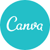
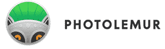
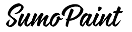
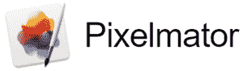

# 2020 年 16 种最佳 Photoshop 替代品[免费/付费]

> 原文： [https://www.guru99.com/best-photoshop-alternatives.html](https://www.guru99.com/best-photoshop-alternatives.html)

Photoshop 是 Adobe 开发的图形编辑工具。 它具有许多用于基于像素的图像和矢量图形的图像编辑功能。

但是，Photoshop 有一些局限性，例如某些工具，不显示进度条。 它缺少使用触摸笔或手写笔提供输入的功能。 此外，对于新用户而言，该工具可能很难学习。

这是能够替换 Photoshop 的热门工具的精选列表。 该列表同时包含开源（免费）和商业（付费）软件。

### 1）帆布

Canva 是图像编辑软件，可帮助您与团队一起创建设计。 该工具包含大量照片，插图和图标。 您可以使用它在照片上添加贴纸。

**功能**：

*   它可以让您裁剪任何照片。
*   您可以将文本添加到任何图像。
*   此工具可帮助您向任何照片添加透明效果。
*   它具有照片增强剂，可以帮助您增加亮度。
*   您可以使图像模糊。
*   它具有复古效果的工具。
*   Canva 提供了许多免费图标。
*   它可以帮助您构建更好的徽章。

**链接**： [https://www.canva.com/](https://canva.7eqqol.net/r3Ggd)

* * *

### 2）豌豆

这是一个在线照片编辑器，支持多种文件格式，包括 PSD，XCF，CDR 等。此工具可用于矢量和栅格图形。 您可以使用它来调整图像大小，创建插图，处理照片，设计网页等。

**Features**:

*   它提供两种类型的笔刷形状，例如圆形和图案。
*   该工具提供了多种操作图层的方法。
*   您可以在曲线形状上写文本。
*   它使您可以用粗线或颜色用特定的笔触填充形状。
*   Photopea 具有可帮助您对齐图像元素的网格。
*   您可以使用文档的不同层来创建 GIF 动画图像。

**链接**： [https://www.photopea.com/](https://www.photopea.com/)

* * *

### 3）Pixlr

Pixlr 是在线照片编辑器。 这个程序有一系列易于浏览的照片编辑工具。 它可以帮助您调整图像大小，裁剪和删除背景。

**Features**:

*   使用此工具可以在图片上绘制任何内容。
*   您可以修复瑕疵，复制照片的一部分或去除斑点。
*   它允许您添加诸如清晰度，魅力，光晕和马赛克的效果。
*   您可以为图像使用边框，叠加层，形状或图标。
*   Pixlr 提供了使图像变亮或变暗的模式。
*   您可以从 Google 或 Facebook 访问文件和图像。

**链接**： [https://pixlr.com/editor/](https://pixlr.com/editor/)

* * *

### 4）Corel 图片

 

Corel Photo 油漆是 Photoshop 的强大竞争对手。 该工具支持 300 多种类型的相机。 它使您能够平衡颜色，调整温度，饱和度和色彩。

**Features**:

*   您可以使用非破坏性图层创建复杂的合成。
*   您可以在图像中添加诸如 bokeh（柔和背景）和棕褐色（红棕色）色调之类的特殊效果。
*   Corel PHOTO-PAINT 可帮助您裁剪，拉直和缝合图像。
*   您可以使用此应用程序从照片中删除不需要的区域。
*   该软件具有遮罩工具，可帮助您选择图像的一部分。

**链接**： [https://www.coreldraw.com/en/pages/photo-paint/](https://www.coreldraw.com/en/pages/photo-paint/)

* * *

### 5）发光

Luminar 是 Skylum 开发的图像编辑应用程序。 使用此工具可以增强皮肤和肖像。 它可以帮助您快速突出显示图像的重要部分。

**Features**:

*   它使您可以添加逼真的阳光。
*   您可以为图像添加对比度。
*   Skylum 允许您轻松浏览和分类所有文件夹中的图像。
*   您可以在图像中应用 75 种以上的即时外观。
*   该工具具有树叶增强剂，可改善树木，花朵或植物的颜色。
*   您可以轻松地从照片中删除不需要的对象。

**链接**： [https://skylum.com/luminar](https://skylum.com/luminar)

* * *

### 6）摄影机

Photolemur 是一款使用 AI（人工智能）自动改善照片质量的应用程序。 它使您可以改善一张以上的照片。 您可以使用此工具使您的皮肤光滑，增强眼睛并去除瑕疵。

**Features**:

*   它可以帮助您一键增强任何照片。
*   该工具具有多种样式，可让您轻松个性化图像。
*   Photolemur 使您可以将图片拖放到工作区。

**链接**： [https://photolemur.com/](https://photolemur.com/)

* * *

### 7）SUMO 油漆

Sumo paint 是一个简单的基于在线 Flash 的图像编辑软件。 它具有许多工具，可帮助您更快地处理图像。 该工具包含 300 多个高质量画笔。

**Features**:

*   您可以使用形状工具轻松创建不同的形状。
*   它使您可以脱机工作。
*   您可以创建逼真的墨水印象。
*   它会自动检查更新并修复错误。
*   您可以使用画笔库填充任何位图。
*   Sumopaint 可帮助您创建具有 3D 效果的波浪。
*   您只需单击几下鼠标即可创建螺旋渐变形状。
*   此应用程序可帮助您在图像中产生波浪效果。

**链接**： [https://www.sumopaint.com/](https://www.sumopaint.com/)

* * *

### 8）亲和照片

Affinity photo 是由 Serif 开发的 photoshop 替代产品。 您可以将其用于 Windows，macOS 和 iOS 平台。 它使您可以合并 HDR（高动态范围）照片。

**Features**:

*   它支持全景图，即场景拼接的广角视图。
*   您可以同时处理多个图像。
*   它允许 360 度图像编辑。
*   您可以用数字方式绘画照片。
*   Affinity 有一系列工具，例如道奇（Dodge），克隆，刻录和补丁。
*   使用此工具可以删除图像的任何区域。
*   您可以调整曝光，白平衡，黑点等。
*   您可以查看和编辑 EXIF（可交换图像文件格式）信息。

**链接**： [https://affinity.serif.com/en-gb/](https://affinity.serif.com/en-gb/)

* * *

### 9）素描

Sketch 是矢量图形编辑器。 您可以将此应用程序用于手机，网页，图标和 UI 设计。 它包含一些必不可少的工具，可帮助您轻松编辑任何图像。

**Features**:

*   它使用户可以设计矢量图像。
*   您可以更新设计组件并与他人共享。
*   该软件产品使您只需单击几下即可在设计中添加面部，位置和名称。
*   它提供了 200 个用于设计草图的插件。

**链接**： [https://www.sketch.com/](https://www.sketch.com/)

* * *

### 10）Pixelmator

Pixelmator Pro 是用于开发专业图像的图形编辑器。 该应用程序具有可用于编辑和修饰照片的工具集合。

**Features**:

*   它与 macOS Catalina 和新的 Mac Pro 兼容。
*   该工具支持多 GPU（图形处理单元）。
*   您可以删除照片中不需要的颜色。
*   它允许您自定义模板中的任何符号。
*   Pixelmator 拥有手工制作的画笔的集合。
*   您可以混合和组合任何特殊效果或艺术效果。
*   它可以让您修饰任何照片。

**链接**： [https://www.pixelmator.com/pro/](https://www.pixelmator.com/pro/)

* * *

### 11）PicMonkey

PicMonkey 是可帮助您创建照片，社交媒体图形，Facebook 封面等的工具。 该工具具有多功能的文本工具，效果，矢量图形等。

**Features**:

*   此应用程序具有用于媒体发布，卡片，传单等的一百多个模板。
*   您可以轻松地在照片中添加图形和文本。
*   它具有 6000 多个纹理和图形。
*   Picmonkey 包含 100 种字体。
*   您可以加载空白拼贴布局以组装不同的图像。

**链接**： [https://www.picmonkey.com/](https://www.picmonkey.com/)

* * *

### 12）图片

Fotor 是一款用于编辑摄影作品的应用程序。 您可以在线使用此工具，也可以免费下载。 它具有适合您主题的各种贴纸，图标，标志和剪贴画。

**Features**:

*   您可以修饰任何肖像。
*   它提供了多种照片滤镜选择。
*   Fotor 使您可以调整光线，颜色，大小等。
*   该工具具有多种模板。
*   它提供了 100 多个相框。

**链接**： [https://www.fotor.com/](https://www.fotor.com/)

* * *

### 13）GIMP

GIMP 是可用于 Windows，Linux 等的图像编辑器。您可以使用此免费的开放源代码工具，该工具支持 C ++，C，Python，Scheme 和 C 等编程语言。

**Features**:

*   它为数字和印刷媒体提供了色彩管理功能。
*   Gimp 支持一系列自定义选项和 3 个和第三方插件。
*   您可以使用此工具生成图形设计元素和图标。
*   它使您可以与 Perl 和 Python 编程语言集成。

**链接**： [https://www.gimp.org/](https://www.gimp.org/)

* * *

### 14）克里塔

Krita 是一个免费的开源图形编辑器。 该工具使素描和绘画更加容易。 它可以帮助您组合，展平或订购图层以组织艺术品。

**Features**:

*   它允许您自定义画笔。
*   该工具使您可以使用内置的矢量绘图工具来创建漫画面板。
*   您可以突出显示绘图部分。
*   Krita 帮助您将绘图合并到当前的颜色管理管道中。
*   它允许您导入其他艺术家的纹理和画笔包。

**链接**： [https://krita.org/en/features/highlights/](https://krita.org/en/features/highlights/)

* * *

### 15）橡子

橡子是由 Flying Meat 公司开发的光栅图形编辑程序。 它使您可以合并图像，去除背景，执行色彩校正。 您还可以使用此工具将文本放置在圆上以创建徽标。

**Features**:

*   您可以为照片添加阴影。
*   它包含许多矢量图像，例如星星，箭头，曲线等。
*   使用此工具可以变换，旋转和调整任何图层的大小。
*   它可以帮助您将表情符号放在路径上。
*   您可以跨层和图像克隆。
*   Flyingmeat 支持 PNG，GIF，BMP，PDF，SVG 等文件格式。
*   它使您可以创建自定义画笔或在现有的画笔中进行更改。

**链接**： [https://flyingmeat.com/acorn/](https://flyingmeat.com/acorn/)

* * *

### 16）PhotoLine

Photoline 是由 pl32 公司开发的应用程序。 使用此工具可以将颜色与 ICC（国际色彩联盟）混合。 您可以使用它来创建 HTML 画廊。 您可以导入 PDF 文件。

**Features**:

*   您可以修饰和校正任何照片。
*   它使您可以创建 GIF 和 Flash 动画。
*   此工具可帮助您打印多页标签，文档以及传单。
*   它支持 USB 记忆棒。
*   您可以向任何方向旋转图像。
*   Pl32 允许您创建日历。
*   您可以批量编辑图像。

**链接**： [https://www.pl32.com/](https://www.pl32.com/)