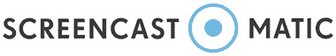

# 2020 年 16 种最佳屏幕录像机[免费/付费]

> 原文： [https://www.guru99.com/best-free-screen-recorder.html](https://www.guru99.com/best-free-screen-recorder.html)

屏幕录制软件可让您捕获屏幕以与他人共享，创建与产品相关的视频，教程，课程，演示，YouTube 视频等。 这些软件使您可以从网络摄像头和屏幕录制视频。

以下是精选的 Top Screen Recorder 列表，以及其受欢迎的功能和网站链接。 该列表同时包含开源（免费）和商业（付费）软件。

### 1） [Screencast-O-Matic](https://bit.ly/3ckSOYJ)

[Screencast-O-Matic](https://bit.ly/3ckSOYJ) 是易于使用的屏幕录像机，可让您捕获屏幕的任何区域。 它提供了一个选项，可以从网络摄像头添加视频并从麦克风添加旁白。

**功能**：

*   您可以为视频设置过渡效果和叠加效果。
*   它允许您从其他设备导入视频，图像和音频。
*   您可以显示或隐藏光标和网络摄像头。
*   放大或缩小以突出显示视频的特定区域。
*   您可以添加和编辑旁白，音乐和系统音频。
*   您可以将样式应用于文本，形状和图像。

**Link**: [https://screencast-o-matic.com/lp/screen-recorder-india-4/](https://bit.ly/3ckSOYJ)

* * *

### 2） [Camtasia](https://techsmith.z6rjha.net/c/1359419/587703/5161)

[Camtasia](https://techsmith.z6rjha.net/c/1359419/587703/5161) 是在 Windows 和 Mac 上录制和创建具有专业外观的视频的工具。 Use 可以使用此软件制作视频教程，视频课程，YouTube 视频，演示视频等。

**Features:**

*   您可以记录网络摄像头和屏幕以及演示文稿。
*   它提供音乐和音频库。
*   您可以创建引人注目的标题和注释。
*   Camtasia 使您可以添加“缩放”，“平移”和“设置动画”。
*   您可以在场景和幻灯片之间使用过渡，以改善视频流。
*   Camtasia 使您可以创建测验。
*   您可以为视频添加效果。

**链接**： [https://techsmith.z6rjha.net/c/1359419/587703/5161](https://techsmith.z6rjha.net/c/1359419/587703/5161)

* * *

### 3）Screencastify

Screencastify 是用于 Chrome 的视频屏幕捕获程序设计。 它仅通过按一个记录按钮即可帮助您记录网络摄像头，选项卡或桌面的内容。 该工具可用于创建录制演示，视频教程等的截屏视频。

**Features:**

*   您可以在没有互联网的情况下录制视频。
*   它提供了鼠标聚光灯单击突出显示以吸引注意力。
*   您可以将其直接上传到 YouTube。
*   它使您可以将视频导出为 GIF，MP4 或 MP3 动画格式。
*   您可以借助麦克风进行旁白。
*   Screencastify 自动保存到 Google 驱动器。

**链接**： [https://www.screencastify.com/](https://www.screencastify.com/)

* * *

### 4） [Movavi 屏幕录像机工作室](https://bit.ly/3b5ySsI)

[Movavi 屏幕捕获](https://bit.ly/3b5ySsI)是一种轻量级的屏幕录制工具，用于视频流，捕获视频呼叫等。它可以帮助您捕获每个声音 60 帧的全高清视频。

**Features:**

*   录制带有插头，麦克风或声音的屏幕，或录制语音。
*   包括一系列设置，包括帧频和音量。
*   您可以轻松剪辑和加入视频剪辑。
*   即使您不在，此软件也可以帮助您录制视频。
*   它使您可以将结果共享到 Google 云端硬盘，Movavi Cloud 或 YouTube。
*   无需特殊硬件即可捕获屏幕音频。
*   您可以从任何来源进行录制，包括麦克风，系统声音和网络摄像头。

**链接**： [https://www.movavi.com/screen-recorder/](https://bit.ly/3b5ySsI)

* * *

### 5） [ApowerREC](https://bit.ly/2VLhvXL)

[ApowerREC](https://bit.ly/2VLhvXL) 工具可用于录制实时流式视频，桌面活动等。 它使您可以在全屏或自定义区域内捕获活动。

**Features:**

*   它可以在录制任何视频时提供实时编辑。
*   您可以从网络摄像头录制视频。
*   该软件允许您创建计划任务以自动记录 PC 屏幕截图/网络摄像头。
*   您可以将视频转换为 AVI，MP4，WMV 等。
*   它使您可以调整音量并自定义麦克风或声卡的音频源。

**链接**： [https://www.apowersoft.com/record-all-screen](https://bit.ly/2VLhvXL)

* * *

### 6）[冰淇淋屏幕录像机](https://bit.ly/2VBhPs0)

[Icecream 屏幕录像机](https://bit.ly/2VBhPs0)是一种屏幕录像工具，可让您记录计算机屏幕的任何区域。 此工具可帮助您记录视频教程，应用程序和游戏，实时流，Skype 通话，网络研讨会等。

**Features:**

*   它允许您选择输出质量。
*   您可以选择屏幕区域或记录全屏。
*   该软件可帮助您使用网络摄像头覆盖来录制屏幕。
*   您可以在屏幕录制中添加文本，形状和箭头。
*   Icecream 应用程序使您可以记录全屏 3D 游戏。
*   您可以记录屏幕并将其保存为 GIF 格式。
*   它使您可以在屏幕录像中添加水印徽标。

**链接**： [https://icecreamapps.com/Screen-Recorder/](https://bit.ly/2VBhPs0)

* * *

### 7）[着迷](https://bit.ly/3a8BvZz)

[Captivate](https://bit.ly/3a8BvZz) 是用于您可以与 Adobe Creative Cloud 一起使用的教程和电子学习的交互式视频制作器。 它允许您捕获屏幕内容并将其导出为静止视频。

**Features:**

*   它可以优化任何屏幕尺寸的内容。
*   此工具可让您将视频另存为 MP4。
*   您可以在学习视频中添加按钮。
*   它可以帮助您发布最终的视频供桌面或网络使用或制作应用。
*   您可以在移动设备上快速构建情节提要。
*   使用此软件，您可以导入 PowerPoint 演示文稿并将其转换为多媒体，交互式模块。
*   您可以从 Adobe Illustrator，Adobe Photoshop 和 Adobe Audition 导入和同步内容。

**链接**： [https://www.adobe.com/in/creativecloud/tools/screen-recorder.html](https://bit.ly/3a8BvZz)

* * *

### 8）肥皂盒

Soapbox 工具可帮助您记录，编辑和共享视频。 您可以单击“记录”按钮并进行编辑以共享网络摄像头，屏幕或分屏视图。

**Features:**

*   您可以将录制与截屏结合起来。
*   它使您只需单击几下即可将视频导出到社交媒体。
*   您可以循环播放 GIF 和文本叠加层。
*   支持从网络摄像机录制视频。

**链接**： [https://wistia.com/soapbox](https://wistia.com/soapbox)

* * *

### 9）AceThinker

AceThinker 使您可以在计算机屏幕上记录并保存活动。 它具有各种屏幕记录模式，可帮助您对鼠标光标或全屏周围的特定区域进行屏幕录像。

**Features:**

*   它仅允许您录制音频。
*   您可以注释视频。
*   它使您可以计划任务。
*   该工具具有多种用于捕获视频的模式。

**链接**： [https://acethinker.com/desktop-recorder](https://acethinker.com/desktop-recorder)

* * *

### 10）织机

Loom 是一款可帮助您通过可共享视频传达信息的工具。 它使您可以捕获您的前置摄像头，计算机屏幕的记录，并立即对其进行叙述。

**Features:**

*   它允许您通过简单的链接共享视频。
*   该软件可帮助您使用视频与他人进行交流。
*   您可以创建任意数量的视频。

**链接**： [https://www.loom.com/](https://www.loom.com/)

* * *

### 11）FlashBack 专业版

FlashBack Pro 产品可通过捕获声音和摄像头来帮助您制作引人入胜的视频。 该工具使您可以在线创建和共享任何格式的视频教程。

**Features:**

*   它可以捕获 PC 屏幕的任何部分，并将其转换为视频文件。
*   您可以添加注释，图像和声音，使其看起来更专业。
*   可以将其上传到 YouTube。
*   FlashBack Pro 允许您在视频中添加水印。
*   您可以从多个监视器进行记录。
*   该工具提供了帧编辑和音频编辑。
*   您可以添加注释。

**链接**： [https://www.flashbackrecorder.com/](https://www.flashbackrecorder.com/)

* * *

### 12）TinyTake

TinyTake 是专为 Windows 和 Mac 平台设计的视频录制软件。 该软件使您可以捕获计算机屏幕上的视频，添加评论并与他人共享。

**Features:**

*   您可以分配自定义快捷键。
*   在屏幕上录制视频超过 120 分钟。
*   您可以将视频存储在云中。
*   您可以放大或缩小任何视频。
*   此工具是代理服务器友好的。
*   TinyTake 使您可以共享指向存储的视频的链接。

**链接**： [https://tinytake.com/](https://tinytake.com/)

* * *

### 13） [Snagit](https://bit.ly/2XyNOLW)

[TechSmith Snagit](https://bit.ly/2XyNOLW) 是用于屏幕简短记录的屏幕图像和视频记录应用程序。 它可以将动作记录在屏幕上，并作为 MPEG 4 视频文件记录音频。

**Features:**

*   它使您可以通过步骤快速记录视频。
*   您可以在视频期间在网络摄像头和屏幕录像之间切换。
*   录制来自麦克风或计算机系统音频的音频。
*   您可以将视频转换为 GIF 动画，并将其添加到您的网站。
*   Snagit 可帮助您修剪任何视频剪辑。
*   您只需轻按几下即可记录 iOS 屏幕。

**链接**： [https://www.techsmith.com/store/snagit](https://bit.ly/2XyNOLW)

* * *

### 14）[屏幕流](https://bit.ly/34KGL4w)

[ScreenFlow](https://bit.ly/34KGL4w) 是 Telestream 的视频编辑，屏幕录制和共享软件。 它可以帮助您将家庭视频制作成专业视频。

**Features:**

*   您可以访问超过 500,000 种独特的媒体类型。
*   它允许您记录您的 iPhone 或 iPad 屏幕。
*   您可以添加转场，视频动画，徒手注释，文本动画等。
*   该工具使您可以使用内置的视频动画为标题，徽标和图形设置动画。
*   您可以使用样式和模板来制作软件教程。
*   它可以帮助您使用嵌套剪辑，市场，嵌套剪辑和多轨道编辑来组织项目。
*   您可以在 YouTube，Wistia，Vimeo，Imgur 等内容发布网站上发布视频。
*   从任何视频项目中创建动画 APNG 和 GIF。

**链接**： [http://www.telestream.net/screenflow/overview.htm](https://bit.ly/34KGL4w)

* * *

### 15） [ActivePresenter](https://bit.ly/2VdjuFc)

[ActivePresenter](https://bit.ly/2VdjuFc) 是一种屏幕录像工具，可让您记录旁白，网络摄像头和音频系统。 它可以安装在 Windows，Linux 和 Mac 操作系统上，可用于创建软件演示。

**Features:**

*   您可以轻松地将屏幕记录为全动态视频。
*   它允许您录制扬声器和麦克风的音频。
*   您可以将实况镜头集成到视频中。
*   它使您可以将内容导出到
*   您可以导出各种视频格式的内容，例如 AVI，MP4，MKV，WMV 和 WebM。
*   该软件支持 HTML5。

**链接**： [https://atomisystems.com/activepresenter/](https://bit.ly/2VdjuFc)

* * *

### 16）Droplr

Droplr 是适用于 Windows 和 Mac 平台的程序。 您可以使用它与他人共享截屏视频，文件和屏幕截图。 该程序在后台运行，您可以使其成为工作流程的简化部分。 Droplr 有吸引力，直观且不引人注目。

**Features:**

*   捕获的屏幕截图可以保存到云中。
*   您可以标记捕获的屏幕截图。
*   它允许您添加带有捕获的快照的消息。
*   您可以在屏幕截图上模糊敏感的细节。

**链接**： [https://droplr.com/](https://droplr.com/)