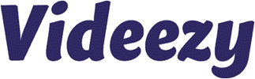
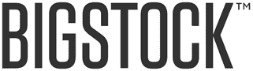
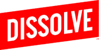
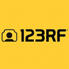
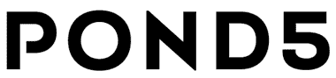
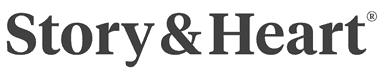
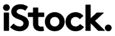
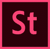

# 2020 年 17 个最佳股票视频网站[有偿/免版税素材]

> 原文： [https://www.guru99.com/stock-video-footage.html](https://www.guru99.com/stock-video-footage.html)

股票视频是短片，可以用于电影制作和个人目的。 找到合适的视频片段非常棘手。 有许多股票视频网站可帮助您下载没有专利使用费的高质量视频剪辑。 下载它们后，您可以随意使用它们多次。

以下是精选的 Top Top Pay Stock Videos 及其热门功能和网站链接。

### 1）Shutterstock

Shutterstock 是提供高质量许可视频的公司。 您可以购买并将其用于个人和商业项目。 这个在线平台提供了许多 4K 和 HD 格式的视频。

**功能：**

*   您可以按分辨率，每秒帧数，长度等搜索片段。
*   它提供了广泛的视频类别，例如建筑物，野生动物，艺术等。
*   该站点每周自动添加新鲜的视频。
*   您可以下载使用最新技术和相机拍摄的视频。
*   该视频结合了艺术和技术上的卓越。

**链接：** [https://www.shutterstock.com/royalty-free/video-categories](https://www.shutterstock.com/royalty-free/video-categories)

* * *

### 2）维德沃

Videvo 提供免费的股票视频素材，可以在任何项目中使用。 您可以下载 4K 和 HD 格式的视频片段。 它允许您多次使用视频。

**Feature:**

*   您可以搜索数千种股票视频。
*   它具有无忧许可。
*   Videvo 每天上传视频。
*   它可以帮助您根据构图，角度和焦距等镜头类型下载视频。

**链接：** [https://www.videvo.net](https://www.videvo.net)

* * *

### 3）videezy

Videezy 使您能够浏览和下载大量视频。 您可以获取高清股票背景剪辑和视频片段。

**Feature:**

*   Videezy 提供了易于查找的类别视频。
*   您可以按最佳匹配或最新的顺序对视频进行排序。
*   该站点提供了大量可以进一步使用的背景。
*   您可以使用 SD，HD -720，HD -1080 和 4K 分辨率视频。
*   它使您能够下载 MP4 和 MOV 文件格式的视频。

**链接：** [https://www.videezy.com](https://www.videezy.com)

* * *

### 4）Flickr 的

Flickr 是一家视频托管公司，可让您与他人共享剪辑。 它可以帮助您在线存储，排序和搜索视频。

**Feature:**

*   该网站提供了各种类别的视频下载。
*   它使您可以根据摄像机类型查找视频。
*   您可以按名称，活动，最旧，最新等对视频进行分类。

**链接：** [https://www.flickr.com/search](https://www.flickr.com/search)

* * *

### 5）停尸房

MorgueFile 是一个网站数据库，用于下载公司或公众使用的高质量视频。 它使您能够修改，调整大小和自定义视频。

**Feature:**

*   您可以创建一个木板（集合）以在线保存视频。
*   Morguefile 提供免版税的视频剪辑。
*   它允许您下载 4K 视频。
*   该公司提供用于制作电影的各种素材。
*   您可以搜索和下载办公室视频，人员视频，职业视频等。
*   它使您能够从手机下载视频。

**链接：** [https://morguefile.com/videos](https://morguefile.com/videos)

* * *

### 6）Bigstockphoto

Bigstockphoto 是一个网站，其中包含许多用于商业用途的视频。 它允许您根据发布用于编辑或非编辑使用的模型来选择许可证类型。

**Feature:**

*   您可以搜索最受欢迎，相关或最新的视频。
*   可以按分辨率和关键字过滤结果。
*   它通过实时聊天，电话或电子邮件提供支持。

**链接：** [https://www.bigstockphoto.com/video/search/](https://www.bigstockphoto.com/video/search/)

* * *

### 7）视频块

Videoblocks 是允许您下载和使用视频以用于个人或商业目的的网站。 登录该网站的帐户后，您将获得各种免版税的剪辑。

**Feature:**

*   Videoblocks 库包含数百万个 4K 和 HD 视频。
*   您可以根据需要下载尽可能多的股票视频片段。
*   Videoblocks 可帮助您查找 YouTube 的新闻片段和文字动画。
*   它使您能够下载素材库，运动背景和后效应模板。

**链接：** [https://www.videoblocks.com](https://www.videoblocks.com)

* * *

### 8）运动元素

Motionelements 提供了获取用于商业用途的视频的地方。 它为全球股票媒体买卖双方提供了完全本地化的体验。

**Feature:**

*   您不需要支付额外的许可费用
*   它使您可以在无限的项目中永久使用剪辑。
*   该站点可安全用于商业用途。
*   您可以将视频用于任何项目类型，包括广告，事件，博客，网站，YouTube 等。
*   它支持信用卡，银行转帐或 PayPal 等付款方式。

**链接：** [https://www.motionelements.com/free/stock-footage](https://www.motionelements.com/free/stock-footage)

* * *

### 9）溶解

Dissolve 是一个平台，允许您出于各种目的下载素材。 它可以帮助您探索各种拍摄和主题。

**Feature:**

*   您可以下载 SD，HD 和 4K 文件格式的素材。
*   视频由专业电影摄制者拍摄，用于商业项目。
*   它提供了按类别的视频，例如美术，时尚和电影。
*   您可以根据人体姿势探索片段。

**链接：** [https://dissolve.com](https://dissolve.com)

* * *

### 10）胶片供应

Filmsupply 提供电影制作人，制片人和代理商的镜头。 它提供了许多电影制片人的视频片段。 您可以向电影胶片发送简短的概念或想法，然后它将搜索剪辑。

**Feature:**

*   它使您能够下载视频用于商业和编辑用途。
*   您可以根据电影摄制者，心情，人物等来过滤视频。
*   该平台提供了许多主题，例如冬天，夏天，欢乐，爱情等。

**链接：** [https://www.filmsupply.com](https://www.filmsupply.com)

* * *

### 11）RocketStock

RocketStock 是 After Effects 模板和资产的提供者。 动作设计师，视频编辑，电影制片人和电影摄影师均可使用它。

**功能：**

*   RocketStock 提供了广泛的视频元素包。
*   它具有 After Effects 模板的集合。
*   您可以在任意多个项目中使用您的包。
*   它具有内置的视频自定义工具。
*   该网站提供了详细的视频教程。

**链接：** [https://www.rocketstock.com](https://www.rocketstock.com)

* * *

### 12）123RF

123RF 是一家股票内容代理。 它包含一组视频，这些视频经过检查是否存在法律和模型问题。 该公司的网站支持英语，荷兰语，法语和更多语言。

**Feature:**

*   您可以找到分辨率为 240WD，480SD，720HD，4K 等的视频。
*   您可以获取与美容，教育，动物，抽象，生活方式等相关的剪辑。
*   每天上传超过 90,000 个内容。
*   您可以为您的团队或企业定制计划。

**链接：** [https://www.123rf.com/stock-footage/](https://www.123rf.com/stock-footage/)

* * *

### 13）池塘 5

Pond5 是一个位于纽约的网站，用于下载免版税视频。 它具有大量的素材库。 您可以与他人共享下载的文件。

**Feature:**

*   它提供了超过 1700 万个股票视频剪辑。
*   每天增加成千上万的视频。
*   您可以上传自己的视频以观看类似的镜头。
*   可以按成分或颜色过滤上传的视频。
*   Pond5 可帮助您查找视频，电视连续剧等。
*   它为所有主要的视频编辑软件提供集成。
*   该组织提供用于庆祝，生活方式，动物，商业等的素材。

**链接：** [https://www.pond5.com/stock-video-footage/](https://www.pond5.com/stock-video-footage/)

* * *

### 14）故事与心

Storyandheart 是一个协作的电影制作和故事驱动的视频许可平台。 它提供了一个下载带有视频的故事的地方。

**Feature:**

*   您可以浏览故事以搜索片段。
*   它允许您选择人类的心情来浏览视频。
*   Storyandheart 可帮助您将真实的镜头与观众联系起来。
*   上载的视频是由世界各地的电影制片人制作的。

**链接：** [https://www.storyandheart.com](https://www.storyandheart.com)

* * *

### 15）iStock

IStock 提供了一个在线平台，以浏览独家免版税的股票视频。 它可以帮助您发现 4K，HD（高清）和 SD（标准清晰度）视频。

**Feature:**

*   它提供了自然，建筑，医疗保健，食品，饮料等视频类别。
*   您可以根据需要将这些视频虚拟地用于任何项目多次。
*   Istock 使您可以按最匹配，最新和最受欢迎的顺序对视频进行排序。
*   您可以按上传日期和时长搜索视频。

**链接：** [https://www.istockphoto.com/in/footage](https://www.istockphoto.com/in/footage)

* * *

### 16）剪辑

Clipstill 是一个平台，使您可以利用视频进行营销和网络使用。 下载视频时，Clipstill 允许您将其用于任何慈善或教育目的。

**Feature:**

*   您可以获取 MPEG4（运动图像专家组）和 GIF（图形交换格式）格式的视频。
*   它使您可以根据人物，地点，食物，自然等下载片段。
*   将新项目上载到 Clipstill 时，您会收到一封电子邮件。

**链接：** [https://www.clipstill.com](https://www.clipstill.com)

* * *

### 17）Adobe Stock

 

Adobe 股票提供高清和 4K 分辨率的免版税视频。 它提供了运动图形模板和视频循环。 下载视频后，您可以随意使用视频多次。

**Feature:**

*   它每天添加视频。
*   该应用可以在多个设备上使用。
*   您可以使用美学搜索过滤器轻松找到视频。
*   无限用户可以使用一种计划。
*   Adobe Stock 使您可以随时随地访问媒体文件。
*   它简化了计费过程。

**链接：** [https://stock.adobe.com/video](https://stock.adobe.com/video)