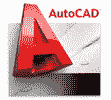
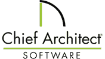

# 2020 年 22 种最佳 Sketchup 替代品

> 原文： [https://www.guru99.com/sketchup-alternative.html](https://www.guru99.com/sketchup-alternative.html)

SketchUp 是 3D 建模计算机程序。 该工具带有 3D 图库，可让您搜索模型并在其他用户之间共享。 但是，该工具并非没有缺陷，因为即使借助插件也很难将工具用于更复杂的建模。 此外，当渲染大量面片顶点表面时，它将崩溃。

以下是能够替换 Sketchup 的热门工具的精选列表。 此列表包含开源（免费）和商业（付费）软件。

### 1）AutoCAD

AutoCAD 是一种计算机辅助设计（CAD）软件，建筑师，工程师和建筑专业人士可以依靠它们来创建精确的 2D 和 3D 工程图。 您几乎可以在任何设备上的 AutoCAD 中编辑和创建工程图。

**功能**：

*   在几乎任何设备上创建，编辑和查看图纸
*   帮助您使用 Autodesk 的云访问 AutoCAD 中的任何 DWG 文件
*   减少眼疲劳，改善对比度
*   允许您在工程图中显示所有附近的测量值
*   创建，编辑和查看 CAD 工程图
*   轻松选择和预览对象即可删除多个对象。

**链接**： [https://www.autodesk.in/products/autocad/features](https://www.autodesk.in/products/autocad/features)

* * *

### 2）最大 3Ds

3DS Max 是功能强大的 3D 建模和动画软件。 游戏开发人员，视觉效果艺术家和图形设计师可以使用它来创建高质量的场景并提供引人入胜的 VR 体验。

**Features:**

*   使用此工具，您可以使用集成的 Arnold Renderer 创建和渲染引人注目的场景。
*   您可以使用自动化流程扩展工作流程。
*   您可以使用顶点，边和面信息来更改模型。
*   使用多边形细分曲面有效地创建有机对象和参数对象。
*   产生复杂的粒子效果，例如水，喷雾，雪和火。

**链接**： [https://www.autodesk.in/products/3ds-max/features](https://www.autodesk.in/products/3ds-max/features)

* * *

### 3）pCon.planner

Pcon 规划器是 Sketchup 的替代品，可让您创建精美的图像。 它还为您的客户提供了您的计划的全面概述。

### 特征：

*   添加不同格式（DWG，SKP，3DS 等）的 CAD 模型
*   帮助您发挥创造力
*   使您生成令人惊叹的图像
*   为您的客户提供您的计划的全面概述
*   优秀的设计应该从各个角度来看
*   通过 pCon.planner 直接访问广泛的材料目录
*   允许您创建高质量的 3D 图形

**链接**： [https://pcon-planner.com/en/3d-room-planner/](https://pcon-planner.com/en/3d-room-planner/)

* * *

### 4）Solidworks

SolidWorks 是在 Microsoft Windows 上运行的计算机辅助设计工具或软件。 该工具允许您从一个功能到另一个功能实施现有的功能属性和参数。

特征：

*   使用此工具，您可以使用几何比较，视图同步或面同步来比较两个设计之间的几何差异
*   您可以在两个 SolidWorks 文档之间比较属性
*   该工具支持基于几何准则选择环，面，边和特征
*   它允许您根据模型中的参数定位，操纵和更改模型中的特征
*   SolidWorks 提供了一种分析工具来查找零件文档中的薄区域和厚区域
*   它使您可以简化零件，装配体文件并自动创建简化的配置

**链接**： [https://www.solidworks.com](https://www.solidworks.com)

* * *

### 5）BricsCAD

BricsCAD 是现代 CAD 的替代方案。 它可以帮助您专注于构建具有成本效益的 CAD 工具。 它是一个高度兼容的工具，可以作为永久许可使用，您可以一次使用并永久使用。

**Features:**

*   使您可以优化 2D 工程图和 3D 模型
*   查看和修改两个实体之间的距离，而无需启动命令
*   在 BricsCAD 会话中与您的同事进行协作。

**链接**： [https://www.bricsys.com/en-eu/bricscad/](https://www.bricsys.com/en-eu/bricscad/)

* * *

### 6）nanoCAD

NanoCAD 是易于使用的 CAD 应用程序，可通过提供高性能，经典界面和本地功能来帮助您提供出色的用户体验。 该工程设计工具旨在提供所有行业的设计和项目文档。

**Features:**

*   nanoCAD 实现了高效且易于学习的经典风格 CAD 用户界面
*   它本身使用行业标准的 DWG（* .dwg）文件格式
*   它包括用于创建和编辑 2D / 3D 对象的广泛工具集
*   nanoCAD 脚本引擎可帮助您自动化日常例行任务
*   该工具还提供了绘图设置对话框，可让您设置多个绘图区域并创建多页绘图

**链接**： [https://nanocad.com](https://nanocad.com)

* * *

### 7）FreeCAD

FreeCAD 是一个开源的参数化 3D 建模器。 它主要用于设计任何大小的现实对象。 参数化建模使您可以轻松修改设计。

**Features:**

*   作为命令行应用程序运行
*   参数关联文档对象
*   内置 Python 控制台
*   平面几何图形创建。
*   完全可定制/可脚本化的图形用户界面

[https://www.freecadweb.org](https://www.freecadweb.org)

* * *

### 8）shapr3D

Shapr3D 使用与 SolidWorks 相同的引擎在本地运行。 您可以创建无与伦比的性能，完整的脱机功能以及 CAD 兼容性。

**Features:**

*   使用 Apple Pencil 直接建模
*   使用“减”，“合并”和“相交”有效地组合单独的实体
*   使用 Shapr3D 的直观工具有效地开发更强大的原型
*   将您的工作直接发送到桌面 CAD 以进行细化编辑
*   建立高度灵活的创意工作流程
*   使用方便可视化的指南移动，旋转，镜像和缩放模型。
*   在任何地方进行设计

**链接**： [https://www.shapr3d.com/features](https://www.shapr3d.com/features)

* * *

### 9）Solid Edge

Solid Edge 使用同步技术来帮助您加速产品设计，帮助您更快地进行修订并改善设计数据的重复使用。 它支持 2D 制图，一流的钣金设计，柔性零件和装配体建模，并提供无与伦比的移动性。

**Features:**

*   它使您可以将直接建模的速度和简便性与参数设计的灵活性和控制能力结合起来。
*   工程图布局，详图，注释和尺寸标注控件
*   出色的组装性能
*   允许您构建完整的钣金设计系统
*   通过数据库驱动的管道规格访问，简化 P & ID 工作流程。

**链接**： [https://solidedge.siemens.com/zh_CN/solutions/products/3d-design/](https://solidedge.siemens.com/en/solutions/products/3d-design/)

* * *

### 10）librecad

LibreCAD 是用于 2D 设计的免费计算机辅助设计应用程序。 它可以在 Linux，macOS，Unix 和 Windows OS 上运行。

**Features:**

*   由经验丰富的团队开发并得到友好社区的支持
*   LibreCAD 最初是一个构建 CAM 功能的项目
*   提供超过 30 种语言的版本
*   准备 2D 工程图的理想选择。

**链接**： [https://librecad.org/#features](https://librecad.org/)

* * *

### 11）CorelCAD

CorelCAD 使用 XVL Studio 3D CAD Corel 版本（CorelDRAW®Technical Suite 2019 的集成附件）无缝地实现对 3D 设计的更改。它还提供了 CorelDRAW Technical Suite 2019 随附的基本 XVL Studio 软件所没有的关键功能和优势。

**Features:**

*   广泛的 3D CAD 文件支持
*   直观的 3D CAD 插图
*   先进的动画工具
*   以 3D 和 2D 输出和共享可视化效果
*   直观的 3D CAD 插图

链接： [https://www.coreldraw.com/en/product/technical-suite/xvl-studio/](https://www.coreldraw.com/en/product/technical-suite/xvl-studio/)

* * *

### 12）草稿

DraftSight 2019 是功能丰富的 2D 和 3D CAD 解决方案。 该工具是 SketchUp 的强大竞争对手。 这是创建，格式化和排列图层的简便工具，可确保您的设计井井有条并符合图层标准。

**Features:**

*   2D 设计&文档
*   使用一个命令快速修改以移动，旋转，复制和缩放实体。
*   从您的库中导入现有块，或创建可用作设计中重复元素的新块。
*   通过 PDF 参考底图等功能帮助您提高效率，以引用您的 PDF

**链接**： [https://www.draftsight.com](https://www.draftsight.com)

* * *

### 13）MicroStation

MicroStation 提供了高级参数化 3D 建模功能。 它允许基础架构交付数据驱动的，支持 BIM 的模型。

**Features:**

*   真正的 3D 参数化建模设计
*   帮助您确保组织和项目特定的标准和内容的正确应用
*   使用整套的绘图工具创建精确的工程图
*   您可以实时查看和使用其他人的设计信息
*   自信地在每个项目的正确上下文中工作，并自动应用所需的设置和标准

**链接**： [https://www.bentley.com/en/products/product-line/modeling-and-visualization-software/microstation](https://www.bentley.com/en/products/product-line/modeling-and-visualization-software/microstation)

* * *

### 14）矢量作品

Vectorworks Architect 提供诸如 2D 绘图，3D 建模和建筑信息建模（BIM）之类的功能。 该工具旨在帮助建筑师。

**Features:**

*   使您可以在完全集成的 BIM 工作流程中进行素描，绘图和建模。
*   它允许构建 3D 施工现场模型，绘制现场蓝图以及设计数字漫游演示。
*   用于景观设计和规划的多合一解决方案。
*   它可以帮助您根据自己的想象来创建和记录任何设计。

**链接**： [https://www.vectorworks.net/zh-CN/architect](https://www.vectorworks.net/en-US/architect)

* * *

### 15）ZW3D

ZW3Dis CAD / CAM 解决方案针对产品开发的整个过程进行了集成设计，具有用于 Solid-Surface 混合建模，非固态模具分割和智能 CNC 加工策略的最快内核。

**Features:**

*   ZW3D 支持转换不同 3D 建模系统的非本机 CAD 数据。
*   创新的 Solid-Surface 混合建模可最大化设计灵活性
*   特定的应用功能适合不同行业
*   提供强大的参数建模和直接编辑

**链接**： [https://www.zwsoft.com/zw3d](https://www.zwsoft.com/zw3d)

* * *

### 16）规划器 5d

Planner 5D 是另一个重要的 3D 替代工具，使您可以在 2D / 3D 模式下创建逼真的内部和外部设计。

**Features:**

*   它允许您使用快照功能将设计捕获为逼真的图像
*   从各种角度设计时的 2D 和 3D 视图
*   直观且以用户为中心的界面，提供了简单的设计过程，而无需任何教程或说明
*   将自定义颜色，图案和材料应用于家具
*   成为成长中社区的一部分。 上传和自定义项目

**链接**： [https://planner5d.com](https://planner5d.com)

* * *

### 17）概念图

概念图是创建和管理从概念到实现的新方法。 它是一个 3D 编辑业务图表，想法管理和项目管理平台。

**Features:**

*   下一代 ConceptDraw 软件
*   建筑平面图设计师。
*   绘图和图表解决方案。
*   快速流程图技术。
*   绘图工具。
*   实物技术。
*   通信&演示设备

**链接**： [https://www.conceptdraw.com](https://www.conceptdraw.com)

* * *

### 18）总建筑师

Chief Architect 软件使家庭设计项目栩栩如生。 用于房屋设计和室内设计的自动化建筑工具&浴室设计使创建施工图，CAD 详细信息和 3D 模型变得容易。

**Features:**

*   首席建筑师是面向建筑师，建筑商和改建的领先设计工具
*   提供自定义背景
*   智能屋顶技术解决了复杂的屋顶系统。
*   透视和正交 3D 摄影机工具。
*   导出 360°球形视图。

**链接**： [https://www.chiefarchitect.com](https://www.chiefarchitect.com)

* * *

### 19）ProgeCAD

ProgeCAD 是一种经济高效的 2D 制图和 3D 建模 CAD 软件，支持业界流行的 DWG & DXF 文件格式。 该工具提供了最佳性能的 32 位和 64 位操作系统。

**Features:**

*   使用 ReCap 改进了对 PointCloud 的支持
*   在曲面实体零件上以隐藏的视觉样式进行 3D 打印。
*   发布重新设计的用户界面，打印设置中的新功能
*   表格单元格可以包含有助于您进行与其他表格单元格中的值相关的计算的公式
*   修改列表中的某些变量时，将监视带有通知的列表。

**链接**： [https://progecadindia.com/features-of-progecad-2020-professional.php](https://progecadindia.com/features-of-progecad-2020-professional.php)

* * *

### 20）酷

Coohom 可帮助您创建 3D 模型并将其应用于 Edge AR，VR，平面图和高质量渲染解决方案中。 它使您的客户能够可视化其产品。

**Features:**

*   高性价比，高质量，大规模
*   使您的客户可视化他们的产品
*   拖放有助于生成 2D 和 3D 房间设置的模型。
*   它可以帮助您取代传统摄影
*   产品由许多纹理和组件组成。

**链接**： [https://www.coohom.com](https://www.coohom.com)

* * *

### 21）卢米翁

Lumion 是专为建筑师和设计师设计的 3D 渲染软件。 它可以帮助您快速将其变为现实并在本地环境中进行展示。 您可以使用材料来装饰模型。

**Features:**

*   您可以花在设计上，而不用花在渲染过程上。
*   获得出色的结果，非常适合客户演示会议，设计开发，建筑营销等。
*   在现实环境中的 3D 模型具有成千上万的高质量对象和引人注目的材料。
*   您无需任何培训即可学习创建动画，图像。

**链接**： [https://lumion.com/index.html](https://lumion.com/index.html)

* * *

### 22）BRL-CAD

BRL-CAD 是功能强大的开源，跨平台建模系统。 此 3D auto-cad 软件提供交互式几何编辑，高性能的渲染和几何分析以及系统性能分析。

**Features:**

*   帮助您制作更好的 CAD 系统。
*   与世界各地的人们 100％免费
*   构造实体几何
*   提供图形显示窗口

**链接**： [https://brlcad.org](https://brlcad.org)

* * *

### 23）ActCAD 2020 专业版

ActCAD 2020 专业工具非常简单易用。 它为所有 DWG，DXF 文件提供本机支持。 它还提供了带有 5000 多个标准符号的块库。

**Features:**

*   易于使用的界面和命令
*   使用最新的 IntelliCAD 9.2 引擎
*   内置 PDF 到 DXF 转换器
*   具有超过 5000 个标准符号的块库
*   永久许可证
*   自我许可转让
*   提供 USB 加密狗和网络许可选项
*   工匠专业 3D 渲染器
*   功能区和经典菜单样式界面可用

**链接**： [https://actcad.com/ap/actcad.php](https://actcad.com/ap/actcad.php)

* * *

### 24）ArCADia

ArCADia 3D 自动化工具可在设计的所有阶段提供完整的控制和安全性，同时流化并加速实施。

**Features:**

*   系统在整个设计过程中支持并协调所有参与者
*   它在设计的各个阶段提供安全性和控制性，并加快实施速度。
*   实施。
*   ArCADia 应用程序具有 IFC 格式支持，可帮助用户与其他程序（例如 Allplan，Archicad 或 Revit）进行协作。

**功能**： [https://www.arcadiabimsystem.com](https://www.arcadiabimsystem.com)

* * *

### 25）工具

Cove.tool 是从开发的工具和流程中发展而来的软件产品。 它可以帮助您实时管理能源。

**Features:**

*   获取准确的能源模型
*   实时管理能源报告
*   更新现有的 3D 模型
*   导入几何图形以随着设计的进行获得快速反馈
*   最适合特定的建筑物位置

**链接**： [https://www.covetool.com](https://www.covetool.com)

* * *

### 26）城市引擎

CityEngine 是先进的 3D 建模软件。 与传统的建模技术相比，它用于创建交互式和沉浸式城市环境的时间更少。

**Features:**

*   建立整个 3D 城市
*   帮助您设计城市环境
*   掌握 3D 内容创作
*   CityEngine 是一个独立的桌面应用程序，可以导入任何地理空间矢量数据

**链接**： [https://www.esri.com/zh-CN/arcgis/products/esri-cityengine/overview](https://www.esri.com/en-us/arcgis/products/esri-cityengine/overview)

* * *

### 27）涡轮增压

TurboCAD Deluxe 是 2D 制图，3D 建模和渲染软件。 轻松调整界面以访问数百个工程图，修改，标注和注释工具。 它可以帮助您渲染设计以进行强大的演示，与 AutoCAD 共享等等

 

**Features:**

*   可自定义的功能区配置
*   命名视图增强
*   法兰片伸直工具的改进
*   功能区 UI 主题支持和其他功能区增强
*   RedSDK 到 Lightworks 转换器的改进

**链接**： [https://www.turbocad.com/](https://www.turbocad.com/)