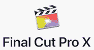
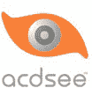

# 2020 年 36 种最佳视频编辑软件

> 原文： [https://www.guru99.com/best-video-editing-software.html](https://www.guru99.com/best-video-editing-software.html)

视频编辑软件使您可以在非线性系统上执行数字视频的后期制作视频编辑。 它取代了传统的赛璐 film 胶片编辑工具和模拟视频编辑机。 有许多具有共同功能的视频编辑工具，例如自动重新格式化视频格式，浏览成千上万个免费视频片段，云存储设施等。

以下是精选的顶级视频编辑软件及其流行功能和网站链接。 该列表同时包含开源（免费）和商业（付费）软件。

### 1）Camtasia

Camtasia Studio 是一个视频编辑器，可轻松基于 Windows，Mac 和 Linux 平台创建具有专业外观的视频。

**功能**：

*   轻松录制屏幕并编辑视频
*   它可以帮助您简化视频审核过程。
*   提供超过 900,000 种免版税的视频，音乐和可定制资产。
*   它提供引人注目的图块，注释和标注。
*   使用此工具可以添加放大，缩小和平移动画。
*   您可以添加测验问题和互动性来衡量学习视频。
*   Camtasia Studio 使您可以记录和导入演示文稿。
*   创建图像和视频以提供反馈。

**链接**： [https://www.techsmith.com/video-editor.html](https://techsmith.z6rjha.net/c/1359419/587698/5161)

* * *

### 2） [Filmora](https://bit.ly/2UA2tEV)

[Filmora](https://bit.ly/2UA2tEV) 是具有直观用户界面和大量视频效果的视频制作应用程序。 此工具具有高级编辑模式，并且可以对视频进行更大的控制，包括关键帧设置。

**Features:**

*   该工具提供快速处理，代理文件和可调节的预览质量，可帮助您提高工作效率。
*   您可以解决相机抖动和鱼眼之类的相机问题。
*   一键式更改视频的美感。
*   您可以在线分享故事。
*   在 100 个完整的视频轨道中组织您的媒体。
*   它具有 PC / Mac 交叉兼容性。

**链接**： [https://filmora.wondershare.com/](https://bit.ly/2UA2tEV)

* * *

### 3） [Icecream Apps Video Editor](https://bit.ly/2BXrqTX)

[Icecream Apps 视频编辑器](https://bit.ly/2BXrqTX)是易于使用的视频编辑软件，可用于 Windows。 此应用程序使您可以快速更改视频。 它允许您修剪剪辑，添加事务，旋转等等。

**Features:**

*   您可以将标题添加到任何视频场景
*   它提供了一个编辑视频的时间表。
*   直观的 GUI 提供。
*   您可以向视频添加效果。
*   它允许您裁剪视频。

**下载链接**： [https://icecreamapps.com/Video-editor/](https://bit.ly/2BXrqTX)

* * *

### 4）搅拌机

Blender 是一个开源 3D 创建套件，支持动画，运动跟踪，视频编辑，2D 动画等。此工具允许您使用 Blender 的 Python 脚本 API 自定义应用程序。

**Features:**

*   用户可以更改动画姿势编辑器。
*   该工具可以渲染多层 OpenEXR 文件。
*   用户可以轻松地将 2D 图像与 3D 结合在一起。
*   它提供了带有洋葱皮的动画支持。
*   Blender 允许用户自定义窗口布局和快捷方式。

**链接**： [https://www.blender.org/](https://www.blender.org/)

* * *

### 5）Final Cut Pro X

Final Cut Pro x 可帮助您加速图形任务，如渲染，实时特效和导出。 它还允许您将礼品卡用于 Apple 的数字内容和订阅。

**Features:**

*   使用各种格式自动同步多达 64 个角度的视频
*   Final Cut Pro 包含直观，全面的工具集，可用于多种格式的隐藏式字幕
*   极大地加速了图形任务，例如渲染实时效果和导出。
*   Final Cut Pro 可帮助您加快后期制作工作
*   在 360°视频中添加 2D 和 3D 标题，并应用模糊，发光和其他 360°效果。
*   针对全新 Mac Pro 进行了优化
*   加快后期制作工作

**链接**： [https://www.apple.com/in/final-cut-pro/](https://www.apple.com/in/final-cut-pro/)

* * *

### 6）Adobe Premiere Pro CC

Adobe Premiere 是一种视频编辑软件，可帮助您轻松地对视频进行更改。 它允许您以 AVI（音频-视频交错），MXF 材料交换格式）等格式导出视频。

 

**Features:**

*   自动重新格式化您的视频
*   帮助您管理曲线调整
*   扩展您的编辑平台
*   加速音频混合
*   沉迷于创建和分享故事所需的所有工具

链接： [https://www.adobe.com/in/products/premiere.html](https://www.adobe.com/in/products/premiere.html)

* * *

### 7）渲染森林

Renderforest 是一个基于云的视频编辑工具，用于为 YouTube 创建视频介绍视频，解释器动画等。它是一个在线视频和动画制作工具，可让您跨各种浏览器工作。

**Features:**

*   为 YouTube 频道创建专业的宣传片和宣传片。
*   解释器动画和演示
*   为您的企业节省时间的视频编辑解决方案
*   帮助您创建逼真的移动应用视频和教程
*   上传您的视频文件或使用商业视频

[https://www.renderforest.com/](https://www.renderforest.com/)

* * *

### 8）波浪

Wave 是一种视频编辑工具，可让您创建品牌视频内容，从而帮助您建立受众群体。

**Features:**

*   使用最大的 3 亿个股票视频和图像库轻松创建视频。
*   通过简单的拖放操作即可导入视频剪辑，图像和音乐。
*   允许您向视频添加日志
*   将视频的宽高比更改为 30 多种流行的尺寸，并针对每个社交平台进行优化。

**链接**： [https://wave.video/](https://wave.video/)

* * *

### 9）视频

InVideo 可帮助您将内容转换为出色的视频。 该工具使您可以将文章或博客转换为引人入胜的视频。

**Features:**

*   1500 多个高级视频模板。
*   将您的文章转换为引人入胜的视频
*   帮助您查找和自定义模板
*   使您可以在现有启动中创建徽标
*   允许您自动将文本转换为语音

**链接**： [https://invideo.io/](https://invideo.io/)

* * *

### 10）Moovly

Moovly 的拖放视频编辑工具。 它使您可以使用超过一百万个免费媒体对象的库来创建引人入胜的视频。

**Features:**

*   自动视频生成。
*   内容导入/导出。
*   可自定义的品牌和视频模板。
*   拖动&放置界面。 企业整合。 HTML5 技术。
*   个人和团体媒体库。 屏幕录像。
*   您可以轻松创建模板。
*   它提供了文本转语音功能。

**链接**： [https://www.moovly.com/](https://www.moovly.com/)

* * *

### 11）木筏

Kapwing 是用于创建图像，视频和 GIF 的协作视频编辑平台。 该工具允许您上载，编辑和与团队共享文件。

**Features:**

*   实时协作
*   每个用例的正确平台
*   它适用于手机和计算机上的每个操作系统。

**链接**： [https://www.kapwing.com/](https://www.kapwing.com/)

* * *

### 12）伊莫

IMovie 是用于 iOS 和 macOS 的视频编辑工具。 它使您可以选择数十种样式来制作标题动画。 您可以更改拍摄速度。

**Features:**

*   您可以向视频添加诸如色彩校正的画龙点睛。
*   它使您可以在 iPhone 或 iPad 上开始编辑，然后在 Mac 上完成。
*   内置音乐，声音效果和配音录音
*   iMovie 可帮助您创建 4K 分辨率的电影。
*   它使您可以从易于使用的模板创建电影预告片。

**链接**： [https://www.apple.com/in/imovie/](https://www.apple.com/in/imovie/)

* * *

### 13）流明 5

Lumen5 是一个视频创建平台，可以帮助您创建广告，故事，帖子等的视频内容。您必须输入指向文章或博客帖子的链接，它将自动获取视频。 它使您可以将视频中的徽标作为水印上传。

**Features:**

*   您可以通过每个片段中写入的文本量来了解每个场景的长度。
*   它支持 16：9 和 1：1 或 9:16 的比例。
*   可以根据您选择的媒体文件来计算文本的位置。
*   您可以按照自己的方式自定义视频。
*   Lumen5 支持 480p，1080 和 720p 视频格式。

**链接**： [https://lumen5.com/](https://lumen5.com/)

* * *

### 14）Clipchamp

Clipchamp 提供免费的视频编辑器，压缩器，转换器和网络摄像头，以创建视频。 它允许您修剪，剪切，速度控制，标题，过滤视频。

**Features:**

*   创建和编辑 PC 或 Mac，笔记本电脑或台式机的视频
*   将您的内容与专业资产结合起来。
*   它允许您根据需要拖放尽可能多的视频，图像和音频。
*   您可以创建 YouTube，Facebook，幻灯片和 Instagram Promos

**链接**： [https://clipchamp.com/en/](https://clipchamp.com/en/)

* * *

### 15）河马视频

河马视频利用您的视频资产来提升您的营销，销售和电子邮件活动。 它还可以帮助您自动执行个性化视频电子邮件。

**Features:**

*   通过视频弥合沟通差距
*   收集视频推荐，调查和反馈
*   通过受众人口统计提高视频投资回报率
*   吸引潜在客户并将其转化为客户

**链接**： [https://www.hippovideo.io/](https://www.hippovideo.io/)

* * *

### 16）Media Composer

Media compose 是功能强大的免费视频编辑软件。 该工具可帮助您针对任何生产角色定制界面。 该视频编辑软件为您提供了更多的功能和速度。

**Features:**

*   获取独立视频编辑器的标准
*   整合工作流程并团队协作
*   自定义任何生产角色的界面

**链接**： [https://www.avid.com/media-composer](https://www.avid.com/media-composer)

* * *

### 17）火箭弹

Rocketium 是 SaaS 软件包的一部分，可帮助您轻松编辑视频。 它使您可以与同事协作以一起制作视频。 该工具具有一个丰富的媒体库，其中包含超过 1500 万个项目。

**Features:**

*   Rocketium 提供了 API 和 SDK 集成工具。
*   它使您可以自定义视频。
*   该工具提供了数千种可自定义的模板和 Adobe 插件
*   您可以通过列出视频获得更多网站转化
*   该工具提供了数千个视频模板和插件。

链接： [https://rocketium.com](https://rocketium.com)

* * *

### 18）视频

Wideo 是一个在线视频创建和编辑软件，使用户可以创建，编辑和共享在线视频。 该平台可帮助个人创建教程视频，视频电子贺卡，动画演示等。

**Features:**

*   轻松创建营销视频
*   分享和下载 MP4 格式的视频
*   浏览我们内置库中的数千个免费视频片段。
*   Wideo 可帮助您创建具有独特设计的幻灯片演示文稿。

**链接**： [https://wideo.co/](https://wideo.co/)

* * *

### 19）紫藤

Wistia 是一款软件，可帮助您在网站上呈现引人入胜的视频体验。 它在社区的帮助下进行了介绍和推广。

**Features:**

*   创造引人入胜的电视品质体验
*   阻止观众分心
*   发送有关新视频的电子邮件通知，并使用查看者数据创建自定义受众
*   发送有关新视频的电子邮件通知，并使用查看者数据到并有助于创建自定义受众。

### 链接： [https://wistia.com/](https://wistia.com/)

* * *

### 20） [Pinnacle Studio](https://bit.ly/2WvFlHw)

[Pinnacles Studio](https://bit.ly/2WvFlHw) 是一种视频编辑工具，具有增强的色彩分级功能以提高视频质量。 它包含 2000 多种效果。

**Features:**

*   您可以跨 4K 和 HD 格式的轨道高效地编辑视频。
*   提供 360 度视频编辑。
*   您可以裁剪，旋转，编辑和缩放视频。
*   此应用程序使您可以分屏视频。
*   您可以编辑从任何摄像机捕获的视频。
*   它可以帮助您稳定不稳定的视频。

**链接**： [https://www.pinnaclesys.com/en/products/studio/ultimate/](https://bit.ly/2WvFlHw)

* * *

### 21）达芬奇决心

DaVinci Resolve 是一款适用于 macOS，Linux 和 Windows 的视频编辑软件。 您可以使用此工具在视频中应用转换，混合模式，颜色等级等。

 

**Features:**

*   它具有双重时间轴，可让您快速编辑剪辑。
*   您可以立即与 YouTube 和 Vimeo 等在线服务共享您的项目。
*   DaVinci Resolve 使您可以创建具有不同帧速率的时间线。
*   它使您可以与其他人进行远程协作。

**链接**： [https://www.blackmagicdesign.com/products/davinciresolve/](https://www.blackmagicdesign.com/products/davinciresolve/)

* * *

### 22）Fxhome

Fxhome 是视频编辑和录制工具。 它使您可以编辑视频并添加效果。 它可以帮助您修剪，更改音频等。

### 特征：

*   组合 2D 和 3D 视频非常容易。
*   它支持 410 多种效果。
*   该工具可以在 Windows 和 Mac 上使用。
*   HitFilm Express 提供了无限的曲目来安排视频剪辑。
*   它提供颜色校正和分级功能。
*   它包含一个跟踪面板，用于控制 HitFilm 内部的 2D 跟踪。

**链接**： [https://fxhome.com/hitfilm-express](https://fxhome.com/hitfilm-express)

* * *

### 23）Videostudiopro

会声会影 Ultimate 是 Corel 制作的电影编辑软件。 它使您可以通过多轨时间线对 HD，4K 或 360 剪辑进行更改。 它具有 2000 多个可自定义的过滤器。 它还提供了色彩校正功能。

 

**Features:**

*   您可以创建拆分视频屏幕布局。
*   会声会影使您可以导出具有透明背景的视频。
*   您可以拖放元素以创建剪辑。
*   它使您可以逐帧增强摄像机视频。
*   此应用程序使您可以跟踪对象并添加移动文本或图形。
*   可以自定义形状，标题和图形的移动。

**链接**： [https://www.videostudiopro.com/en/products/videostudio/ultimate/#features](https://www.videostudiopro.com/en/products/videostudio/ultimate/)

* * *

### 24）ACDSee

ACDSee 是最古老的视频编辑软件之一。 它已扩展为各种类型的移动平台上的图像和视频编辑应用程序。 该工具允许您执行图像处理，视频，分层编辑等。

 

**Features:**

*   导入您的素材，使用现有媒体或生成自己的素材。
*   安排，编辑，分割，修剪和合并音频和视频记录以及静止图像。
*   帮助您转换，定型和渲染各种格式和大小
*   ACDSee 视频转换器 5 轻松转换视频文件

**链接**： [https://www.acdsee.com/en/video-editing-software/](https://www.acdsee.com/en/video-editing-software/)

* * *

### 25）威力导演超

《威力导演》是讯连科技开发的视频编辑软件。 它允许您在视频中广告自定义形状和对象。 该工具支持动态图形和动画标题。

**Features:**

*   它允许您导入 8K 视频。
*   《威力导演》使您能够以 1：1 的输出比例制作视频。
*   您可以在视频中添加形状。
*   它提供了许多现成的模板。
*   该工具提供慢动作和快动作效果。
*   您可以纠正片段中的颜色失真。
*   它可以稳定晃动的画面。
*   您可以导入和编辑在相机上拍摄的视频。

链接： [https://www.cyberlink.com/products/powerdirector-video-editing-software/features_zh_CN.html](https://www.cyberlink.com/products/powerdirector-video-editing-software/features_en_US.html)

* * *

### 26）MacXvideo

MacXvideo 是为 MacOS 构建的视频编辑产品。 它可以帮助您轻松压缩 4K，5K 或 8K 视频。 该工具使您可以通过 WhatsApp，电子邮件，YouTube，Facebook 等与同事共享剪辑。

**Features:**

*   您可以快速将效果应用于视频。
*   它可以缩小由 HFR（高帧频）制成的视频。
*   您可以处理来自任何来源的剪辑，包括平板电脑，相机，便携式摄像机等。
*   将多个视频片段合并到一个文件中。
*   MacXvideo 使您可以裁剪或旋转视频以适合任何设备的屏幕。
*   它支持 HEVC（高效视频编码）和 MP4。
*   您可以制作多轨视频。

**链接**： [https://www.videoproc.com/macxvideo/](https://www.videoproc.com/macxvideo/)

* * *

### 27）魔术师

Magisto 是一个基于云的平台，用于创建营销和产品相关的视频。 它支持各种视频编辑样式和声音。

**Features:**

*   该工具为分析视频片段的人工智能提供支持。
*   它支持 iOS，Android 操作系统。
*   您可以稳定相机的震动。
*   它具有一组样式，可帮助用户确定电影的样式。

**链接**： [https://www.magisto.com/](https://www.magisto.com/)

* * *

### 28）mysimpleshow

Simpleshow 已经为公司客户创建了解释器视频已有多年。 该视频编辑工具使任何人都可以制作专业视频。

**Features:**

*   预览视频并立即进行更改
*   为您的业务制作众筹视频
*   您可以将其用于公司沟通。
*   通知您的观众或宣传主题或故事情节
*   与观众一起发布和分享您的视频
*   预览视频并进行更改
*   上传您的录音，并允许您将声音与故事同步。

**链接**： [https://www.mysimpleshow.com/](https://www.mysimpleshow.com/)

* * *

### 29）WeVideo

Wevideo 是一个基于 Web 的协作式视频编辑平台，可在任何浏览器中使用。 它可以帮助您更改视频的背景。 它使您能够轻松开发高质量的视频。

 

**Features:**

*   您可以从 Chromebook，Windows，移动版和 Mac 编辑视频。
*   这个应用程式提供无限的云端储存空间来制作影片。
*   通过出色的家庭电影帮助您将回忆带入生活
*   帮助您激发任何主题的有意义的学习和创造性表达
*   您可以向视频添加自定义文本，颜色，表情符号等。

**链接**： [https://www.wevideo.com](https://www.wevideo.com/)

* * *

### 30）

Lightworks 是一个用于以各种格式编辑任何数字视频的平台，包括 2K 分辨率，4K 分辨率和 HD 格式。 它支持 Linux，Windows，Mac OS 等操作系统。

**Features:**

*   您可以轻松地编辑视频时间轴并进行修剪。
*   它使您能够导出 YouTube，Vimeo 等的视频。
*   您可以制作 2D 和 3D 标题。
*   Lightworks 允许您与其他人共享剪辑并分配读取或写入访问权限。
*   您可以轻松自定义快捷方式。
*   Lightworks 支持英语，德语，意大利语和更多语言。
*   该工具提供了一种修剪视频的简单方法。

**链接**： [https://www.lwks.com/](https://www.lwks.com/)

* * *

### 31）罗克西奥

Roxia 是一款实用软件，可以帮助您清理困难。 该工具可帮助您自动转换首选格式的视频。

**Features:**

*   自动将视频转换为所需的格式
*   从 YouTube 等热门网站捕获流式网络视频
*   将 DVD 复制到数字文件
*   捕获视频和音频
*   复制 DVD，音频 CD 等

**链接**： [https://www.roxio.com/en/store/video/](https://www.roxio.com/en/store/video/)

* * *

### 32）媒体网站

Mediasite 甚至向运动场提供视频捕获，管理和流媒体解决方案，供全球学习。 它提供了每个视频编辑人员创建引人入胜的故事所需的一系列工具。

**Features:**

*   移动友好型管理门户
*   策划，观看视频并与之互动
*   能够下载字幕文件以改善视频的可访问性。

**链接**： [https://mediasite.com/](https://mediasite.com/)

* * *

### 33）黑色视频

Nero Standard 是完全集成的视频编辑产品。 它使您可以轻松地剪切和修剪视频剪辑。 该软件可让您预览高清质量的视频。

 

**Features:**

*   您可以从任何设备导入，创建和编辑视频。
*   它使您只需单击鼠标即可从视频中提取音频。
*   Nero 可用于创建宽屏电视电影。
*   您可以快速创建具有现成效果的项目。
*   此工具使您可以与他人共享影片。
*   您可以按照自己喜欢的方式在视频中设置转场和字体。

**链接**： [https://www.nero.com/eng/products/nero-video/](https://www.nero.com/eng/products/nero-video/)

* * *

### 34）Panopto

Panopto 是为组织构建的视频平台。 这是在整个组织中录制，实时播放，管理和共享视频的最简单方法。

**Features:**

*   视频协作软件
*   支持远程学习视频平台
*   提供企业交流视频
*   它使您可以与 LMS，Web 门户等集成。
*   在课程视频中进行互动

**链接**： [https://www.panopto.com](https://www.panopto.com)

* * *

### 35）媒体筒仓

MediaSilo，一种视频编辑工具，可以帮助世界各地的讲故事者进行协作，并以最适合他们的方式呈现。 它是一种视频编辑工具，可处理编码和播放，查看&批准以及媒体管理。

**Features:**

*   将企业级安全性和按需水印与优雅的可用性结合在一起。
*   使讲故事的人能够制作更多更好的视频。
*   法医，可见，覆盖或 DRM 是最常见的水印形式
*   它提供了简单而安全的共享。

**链接**： [https://mediasilo.com/](https://mediasilo.com/)

* * *

### 36）促销

Promo 是一款视频编辑和录制软件，可让您自定义 2,500 多个最佳视频模板。

**Features:**

*   允许您宣传愿景，产品，业务，销售，想法，事件，博客文章
*   获取在线成功所需的所有视频
*   提供有效推广所需的所有创意资产和工具
*   帮助用户创建大量的视觉内容和无限制的视频

**链接**： [https://promo.com/](https://promo.com/)