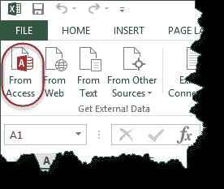
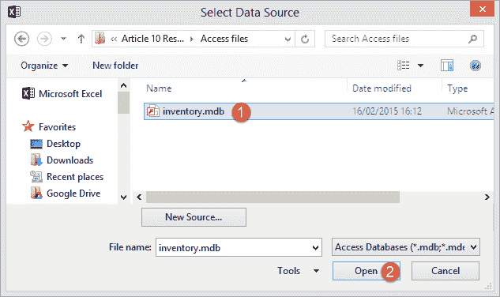
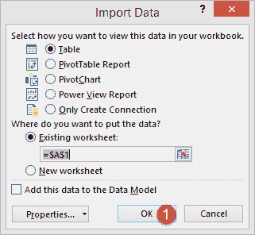
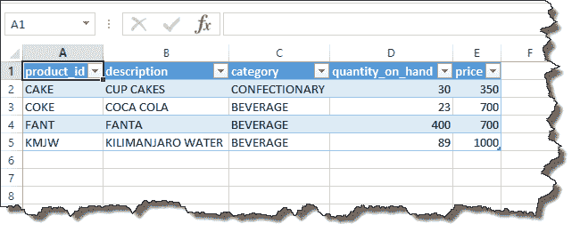

# 如何将 MS Access 数据导入 Excel [示例]

> 原文： [https://www.guru99.com/import-access-data-excel.html](https://www.guru99.com/import-access-data-excel.html)

在本教程中，我们将从 Microsoft Access 数据库支持的简单外部数据库中导入数据。 我们将把产品表导入 excel。 您可以下载 Microsoft Access 数据库。

*   打开一个新的工作簿
*   单击数据选项卡
*   单击访问按钮，如下所示

*   您将获得如下所示的对话窗口

*   浏览到您下载的数据库并
*   点击打开按钮

*   点击确定按钮
*   您将获得以下数据

[下载数据库和 Excel 文件](https://drive.google.com/uc?export=download&id=1qV-EHWE9ZSbIHFT4ATz8JLqrD8TeXDpL)