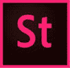
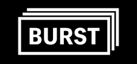
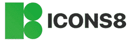
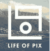
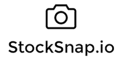
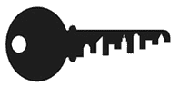
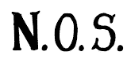
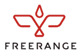

# 30 最佳免费图片库在 2020 年

> 原文： [https://www.guru99.com/free-stock-photos.html](https://www.guru99.com/free-stock-photos.html)

股票图像站点是获取高质量 HD 照片和图像的绝佳资源，您可以将其用于各种目的的设计中。 这些图像是营销，广告，个人或商业用途的理想来源。 它还用于创意项目，发布网站和博客等。

以下是精选的 Top Stock Photo 网站，以及其受欢迎的功能和网站链接。 该列表同时包含开源（免费）和商业（付费）软件。

### 1）像素

Pexels 是一个免费的图像托管工具，可提供根据 Pexels 许可获得许可的高质量和免费库存照片。 它使您可以将照片展示在数百万的访问者面前，并宣传您的网站，博客或社交媒体资料。

**功能：**

*   帮助数百万用户查找其网站的照片或图像。
*   提供高质量的免费图片素材
*   轻松创建和管理您的投资组合
*   它帮助数以百万计的创作者开发出精美的产品和设计。

**链接：** [https://www.pexels.com/](https://www.pexels.com/)

* * *

### 2）不飞溅

Unsplash 是一个由社区提供支持的平台，该平台已赠送了数十万张照片。 该工具可让您找到 100 多个最佳免费特征图像。

**Features:**

*   Unsplash API，具有更强大的功能并支持高流量的用例
*   获取您需要的图像
*   提供可广泛访问的 Unsplash 库
*   发现最美丽的免费图片和图像

**链接：** [https://unsplash.com](https://unsplash.com)

* * *

### 3）美食家

Foodiesfeed 是一个库存照片网站，提供看起来完全免费的自然照片。

**Features:**

*   来自世界各地的美食摄影师分享他们的照片
*   一个由食品摄影师组成的全球社区，可以为企业主，设计师，食品博客，社交媒体经理等提供帮助。
*   在这里，您可以与才华横溢的摄影师交流

**链接：** [https://www.foodiesfeed.com/](https://www.foodiesfeed.com/)

* * *

### 4）Flickr 的

Flickr 是一个视频和照片图片网站，可让您与他人共享照片。 它可以帮助您存储，排序和搜索在线照片。

**Features:**

*   该网站提供了各种类别来下载照片和视频。
*   它使您可以根据相机类型查找照片和视频。
*   您可以按名称，活动，最旧，最新等对照片和视频进行分类。

**链接：** [https://www.flickr.com](https://www.flickr.com/search/?text=stock%20)

* * *

### 5）Adobe Stock

Adobe 股票提供高清分辨率的免版税照片。 它提供运动图形模板。 下载照片后，您可以随意使用它多次。

**Features:**

*   它每天添加照片。
*   该应用可以在多个设备上使用。
*   您可以使用美学搜索过滤器轻松找到照片和视频。
*   无限的用户可以使用一个计划。
*   Adobe Stock 使您可以随时随地访问媒体文件。
*   它简化了计费过程。

**链接：** [https://stock.adobe.com/](https://stock.adobe.com/in/)

* * *

### 6）Picjumbo

Picjumbo 是一个免费的图片网站，可让您下载免费的图片，背景和免费的高分辨率图片供个人和商业使用。

 

**Features:**

*   您可以制作最漂亮的网站，模板，应用或博客文章
*   提供高分辨率的图像和照片
*   有很多类别，包括商业照片，免费食物照片，抽象图像等。

**链接：** [https://picjumbo.com/](https://picjumbo.com/)

* * *

### 7）Rgbstock

Rgbstock 提供了大量的高质量免费图片和插图，壁纸和背景的精美免费图形。

**Features:**

*   帮助您在几分钟内创建免费的照片库
*   它提供了 100,000 多张照片。

**链接：** [http://www.rgbstock.com/](http://www.rgbstock.com/)

* * *

### 8）爆裂（通过 Shopify）

Burst 是由 Shopify 支持的免费股票照片网站。 图像库包含数千张由我们全球摄影师社区拍摄的高分辨率，免版税的图像。

**Features:**

*   帮助您下载免费的高分辨率图像
*   提供库存图像，非常适合博客和网站
*   裁剪，调整大小，添加文本和过滤器以及修改我们的库存照片
*   使您可以按类别浏览股票摄影

**链接：** [https://burst.shopify.com/](https://burst.shopify.com/)

* * *

### 9）

png 提供了一个充满活力的创意社区，共享无版权的图像和视频。 该站点使您可以下载免版税的照片和视频，还可以与世界各地的人们共享公共领域的图片。

 

**Features:**

*   提供快速搜索和用户友好的界面。
*   在搜索结果中滑动。
*   一键式图像浏览器
*   它允许您直接下载和共享所有尺寸的图像。
*   消息和评论可帮助您与他人建立联系。

链接： [https://pixabay.com/](https://pixabay.com/)

* * *

### 10）短剑

Kaboompics，一种用于图片的免版税服务。 到今天为止，该网站已经获得了超过 600 万次展示。 它提供互补的调色板。

 

**Features:**

*   每天，最高质量的新照片都会添加到 Kaboompics 中。
*   允许您下载并使用它来达到目的
*   您无需支付高昂的费用即可获得高级内容。

**链接：** [https://kaboompics.com/](https://kaboompics.com/)

* * *

### 11）驼鹿

驼鹿是一种图片工具。 您会发现数百万高清图片，插图和矢量。 它还可以帮助您创建股票图像。

 

**Features:**

*   帮助您创建完美的股票图像
*   Moose 允许您撤消和重做更改，并可以将图片保存到草稿中。
*   帮助您创建具有不同模型的个人图像

**链接：** [https://photos.icons8.com/](https://photos.icons8.com/)

* * *

### 12）停尸房

Morguefile 网站的创建是为了向创意专业人士和教师提供免费的图像交换，供他们在工作中使用。 这些照片由来自世界各地的众多创意人士提供。

**Features:**

*   使用滤镜和增强功能编辑图像。
*   创建多个类似的框并按类别组织。
*   访问过去的图像包。
*   您可以无广告查看 Morguefile.com。

**链接：** [https://morguefile.com/](https://morguefile.com/)

* * *

### 13）Piwwizard

Pilkwizard 是一百万个库存图片和视频的图书馆。 它是免版税的，并且可以安全地用于商业用途。

**Features:**

*   免版税且可安全用于商业用途，无需注明出处。
*   它提供了许多图像类别，例如花朵，生日，圣诞节，动物，具有特定颜色的图像等。
*   只需单击一下鼠标，即可轻松查看最受欢迎的照片。
*   轻松搜索高分辨率照片。

**链接：** [https://pikwizard.com/](https://pikwizard.com/)

* * *

### 14）Lifeofpix

Lifeofpix 库存图片工具可帮助您以全新的方式管理您的私人&公开个人资料。

**Features:**

*   每周发现一周的新摄影师
*   在特色部分提供了多种选择
*   免费将照片用于商业和个人用途
*   随时探索我们本周摄影师的最佳照片。

**链接：** [https://www.lifeofpix.com](https://www.lifeofpix.com)

* * *

### 15）摄影

测绘学是世界上最奇怪的免费高分辨率照片集，其中包括世界上最好，最有创意的图像。

**Features:**

*   高分辨率免费股票图像的集合。
*   索引网站，数十百万个网站和数千个竞争对手中的数十亿个页面

**链接：** [https://gratisography.com/](https://gratisography.com/)

* * *

### 16）库存

免费照片是可用于个人和商业项目的工具。

**Features:**

*   提供高质量的照片
*   最好的客户支持
*   提供商业用途图片
*   需要归因
*   提供促销代码支持

**链接：** [https://freestocks.org/](https://freestocks.org/)

* * *

### 17）重拍

Reshot 为世界上最优秀的摄影师提供了一个漂亮的平台，可以共享他们的最佳作品的样本，以免费用于创意项目。

**Features:**

*   Reshot 将帮助您提升创意项目
*   Reshot 为世界上最优秀的摄影师提供了一个漂亮的平台，可以共享他们的最佳作品的样本，以免费用于创意项目。

**功能：** [https://www.reshot.com/](https://www.reshot.com/)

* * *

### 18）摄影

摄影术是著名的摄影图库&，其中提供图像和视频库

**Features:**

*   提供照片上传支持
*   最佳归因要求
*   高分辨率，免费照片

**链接：** [https://picography.co/](https://picography.co/)

* * *

### 19）Isorepublic

ISO Republic 是一个独立的网站，提供有关最佳高分辨率照片和视频的大量收藏。

**Features:**

*   该网站提供精选的库存图片和视频集合
*   根据慷慨的 CC0 许可提供高质量的免费图片和视频。
*   允许您下载并将其用于个人和商业项目

**链接：** [https://isorepublic.com/](https://isorepublic.com/)

* * *

### 20）Skitterphoto

Skitterphoto 可免费用于任何目的。 您可以下载和编辑照片，也可以将其用于商业用途。

**Features:**

*   提供最佳的免费照片
*   查找，显示和共享公共领域照片的地方
*   帮助我们为您提供最佳的网站。

[https://skitterphoto.com/](https://skitterphoto.com/)

* * *

### 21）抢购

Stocksnap 提供一些最佳的库存照片。 它可以帮助您建立商务网站，打印小册子，创意项目。

**Features:**

*   提供高质量的照片
*   它在一个简单的 CC0 许可证下提供图像
*   帮助您编辑和修改照片
*   它使您可以浏览和定位传达感觉，正确的情绪，感觉等的图像。

**链接：** [https://stocksnap.io/](https://stocksnap.io/)

* * *

### 22）专注

FoCA 提供免费的照片，视频和模板。 您可以在网站，主题，模板，打印材料和社交媒体帖子上使用这些图像。

**Features:**

*   FOCA 提供免费的 Creative Commons 摄影，供个人和商业使用
*   照片是根据 CC0 许可证获得许可的，可以免费使用和重新分发。
*   他们每周都会添加在 FOCA 中添加的新照片。

**链接：** [https://focastock.com/](https://focastock.com/)

* * *

### 23）Stockvault

Stockvault 是一个免费的图片网站，允许摄影师&的艺术家分享他们的照片和艺术品。

特征：

*   您可以查看有关数百篇摄影和设计文章的博客
*   收集和存档高分辨率照片
*   提供可立即使用的网页布局和徽标

**链接：** [https://www.stockvault.net/](https://www.stockvault.net/)

* * *

### 24）负空间

NeegativeSpace 是一个免费的库存图片网站，可直接在您的收件箱中提供免费的库存图片。

**Features:**

*   允许您在 Creative Commons CC0 许可下免费使用
*   高分辨率免费图片
*   在您的邮箱中获取最新的免费股票照片。
*   高品质的照片

**链接：** [https://negativespace.co/](https://negativespace.co/)

* * *

### 25）自由射击

**Features:**

*   免费使用商业，建筑，自然，人等的图片。
*   可用于广告和社交媒体平台
*   用于网站或移动应用程序
*   它可以用于商业或非商业（个人）目的。
*   所有图像均免费提供商业用途。
*   没有水印和归属

**链接：** [https://libreshot.com/](https://libreshot.com/)

* * *

### 26）Shutterstock

Shutterstock 是提供高品质许可照片和视频的公司。 您可以购买并将其用于个人和商业项目。

**Features:**

*   您可以按分辨率，每秒帧数，长度等搜索片段。
*   它提供了广泛的照片类别，例如建筑物，野生动物，艺术等。
*   该站点每周自动添加新鲜的照片。
*   您可以下载使用最新技术和相机拍摄的图像。
*   该视频结合了艺术和技术上的卓越。

**链接：** [https://www.shutterstock.com](https://www.shutterstock.com)

* * *

### 27）新旧库存

新旧库存提供许多经典照片。 它收集了来自公共档案馆的大量老式照片。

**Features:**

*   它具有独特的黑白照片收藏
*   经典照片用户，用于个人和非商业用途。

**链接：** [https://nos.twnsnd.co/](https://nos.twnsnd.co/)

* * *

### 28）Bigstock 照片

Bigstockphoto 是一个网站，其中包含许多商业用途的图像。 它允许您根据发布用于编辑或非编辑使用的模型来选择许可证类型。

**Features:**

*   您可以搜索最受欢迎，相关或最新的图像。
*   可以按分辨率和关键字过滤结果。
*   它通过实时聊天，电话或电子邮件提供支持。

**链接：** [https://www.bigstockphoto.com/](https://www.bigstockphoto.com/)

* * *

### 29）自由放养

Freerange Stock 工具的创建旨在为商业和非商业用途提供高质量的库存照片。

**Features:**

*   为您的应用提供高质量的免费照片
*   当用户点击提交内容旁边的广告时，摄影师将获得报酬。
*   下载图像的结束编号
*   提供多种模板

**链接：** [https://freerangestock.com/search/all/stock-photos](https://freerangestock.com/search/all/stock-photos)

* * *

### 30）花式渴望

FancyCrave 是大量库存照片，您可以在其中学习如何更聪明地旅行，节省更多钱。

**Features:**

*   免费使用照片集。
*   无限下载高清照片。
*   具有出色构图的图像

**链接：** [https://fancycrave.com/](https://fancycrave.com/)