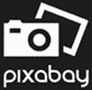
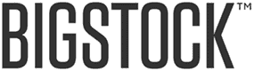

# 2020 年 18 个最佳免费股票视频网站

> 原文： [https://www.guru99.com/free-stock-video-websites.html](https://www.guru99.com/free-stock-video-websites.html)

股票视频网站是获取高质量高清视频的绝佳资源。 这些视频只是营销，广告，个人或商业用途的理想来源。 它还用于创意项目，发布，网站博客等。

以下是精选的顶级免费视频网站，以及其受欢迎的功能和网站链接。 该列表同时包含开源（免费）和商业（付费）软件。

### 1）像素

Pexels 提供了高质量和免费的股票视频。 它使您可以将照片和视频展示在数百万的访问者面前，并宣传您的网站，博客或社交媒体资料。

**功能**：

*   帮助数百万用户查找其网站，博客，产品或书籍封面的视频。
*   提供高质量的免费股票视频
*   轻松创建和管理您的投资组合
*   它可以帮助数以百万计的创造者开发出精美的产品和设计。

**链接**： [https://www.pexels.com/videos/](https://www.pexels.com/videos/)

* * *

### 2）

png 提供了一个充满活力的创意社区，可以共享无版权的 i 视频剪辑。 该站点允许您下载免版税视频，也可以与世界各地的人们共享视频作为公共领域。

**Features:**

*   提供快速搜索和用户友好的界面。
*   在搜索结果中滑动。
*   一键式视频查看器
*   它使您可以直接下载和共享各种尺寸的视频。
*   消息和评论部分可帮助您与他人联系。

链接： [https://pixabay.com/videos/](https://pixabay.com/videos/)

* * *

### 3）专注

您可以在网站，主题，模板，印刷材料和社交媒体帖子中使用的免费视频剪辑和模板。

**Features:**

*   FOCA 提供免费的 CC0 录像带供个人和商业使用
*   视频是根据 CC0 许可证许可的，可以免费使用和重新分发。
*   他们每周都会在 FOCA 网站上添加新视频。

**链接**： [https://focastock.com/](https://focastock.com/)

* * *

### 4）维德沃

Videvo 是一个网站，您可以在其中找到数千个免费的股票视频，动态图形，音乐曲目和音效。

**Features:**

*   广泛的股票媒体内容库，包括 7500 多个免费的股票视频和动态图形剪辑
*   大多数视频均获得免版税许可，并由 videvo 授予归因许可。
*   您可以将免费的 HD 和 4K 股票视频和动态图形上传到 Videvo 存档中

**链接**： [https://www.videvo.net](https://www.videvo.net)

* * *

### 5）Videezy

Videezy 是一个免费的视频网站，提供了越来越多的高质量录像，这些录像使电影制作容易且负担得起。

**Features:**

*   它允许您按最新视频浏览。
*   提供支持按类别过滤视频
*   它提供了广泛的动画和 After Effects 模板
*   您可以与其他创意电影制片人互动

**链接**： [https://www.videezy.com](https://www.videezy.com)

* * *

### 6）Motionarray

Motionarray 网站允许您下载数千个模板，免版税的视频素材，音乐等。

**Features:**

*   免费下载 Premiere Pro 模板和股票视频&音乐
*   来自客户的实时，精确到帧的反馈。
*   通过独特的转场和效果增强视频
*   创建一个令人惊叹的视频作品集网站

**链接**： [https://motionarray.com](https://motionarray.com)

* * *

### 7）Flickr 的

Flickr 是一个股票视频网站，可让您与他人共享视频片段。 它可以帮助您存储，分类和搜索在线视频。

**Features:**

*   该网站提供了各种类别的视频下载。
*   它使您可以根据摄像机类型查找视频。
*   您可以按名称，最旧，最新，活动等对视频进行分类。

**链接**： [https://www.flickr.com](https://www.flickr.com/search/?text=video&license=4%2C5%2C6%2C9%2C10)

* * *

### 8）皮克维扎德

Pilkwizard 是一百万个库存图片和视频的图书馆。 这是免版税的视频，可安全用于商业用途，无需注明出处。

**Features:**

*   提供免费的绿屏视频
*   花和慢动作视频
*   最佳高清和 4K 视频库

**链接**： [https://pikwizard.com/video](https://pikwizard.com/video)

* * *

### 9）Bigstock 照片

Bigstockphoto 是一个网站，其中包含许多用于商业用途的视频。 它允许您根据发布的模型选择许可证类型，以用于编辑或非编辑用途。

**功能**：

*   您可以搜索最流行，相关或最新的视频。
*   可以按分辨率和关键字过滤结果。
*   它通过实时聊天，电话或电子邮件提供支持。

**链接**： [https://www.bigstockphoto.com/video/search/](https://www.bigstockphoto.com/video/search/)

* * *

### 10）[运动元件](https://bit.ly/36hl90c)

[MotionElements](https://bit.ly/36hl90c) 是一个在线素材网站，可下载免费的视频剪辑。 您可以在全球任何媒体上使用多个项目。

**Features:**

*   多种免版税视频剪辑，可满足您的业务需求
*   兼容各种视频编辑软件，例如 Sony Vegas Pro，Adobe Premiere 和 Final Cut ProX。
*   您每周可以下载 5 个免费元素

**链接**： [https://www.motionelements.com/free/stock-footage](https://bit.ly/36hl90c)

* * *

### 11）Lifeofpix

Lifeofpix 网站提供股票视频，可帮助您以全新的方式管理您的私人&公开个人资料。

**功能**：

*   在特色部分提供了多种选择
*   免费使用用于商业和个人用途的视频
*   点击快速预览
*   随时浏览一周中最精彩的视频。
*   允许您捐赠视频

**链接**： [https://lifeofvids.com](https://lifeofvids.com)

* * *

### 12）伊苏共和国

Iso republic 是一个独立的网站，提供有关最佳高分辨率视频和照片的大量收藏。

**Features:**

*   该网站提供精选的库存图片和视频集合
*   根据慷慨的 CC0 许可提供高质量的免费股票视频
*   允许您下载并将其用于个人和商业项目。

**链接**： [https://isorepublic.com/](https://isorepublic.com/)

* * *

### 13）Mixkit

Mixkit 网站提供了大量来自许多不同类别的股票视频。 所有的剪辑都是免费的和高质量的。

**Features:**

*   您可以注册新闻通讯，以获取每周上传的需求剪辑。
*   可下载高质量的视频并将其用于您的项目。
*   使您可以将内容与高质量的免费视频结合在一起
*   悬停剪辑预览
*   准备在个人和商业项目中使用视频
*   不断发展我们的贡献者社区。

**链接**： [https://mixkit.co](https://mixkit.co)

* * *

### 14）鸡蛋

Mazwai.com 是免费的股票视频和运动图像资源。

**Features:**

*   不断扩大免费内容库，
*   如果您想做出贡献，则需要确保我们所有内容都可以安全使用。
*   精选镜头以确保最高质量

**链接**： [https://mazwai.com](https://mazwai.com/)

* * *

### 15）掩护

Coverr 为网站主页或 Facebook 提供了广泛的免费剪辑。 您可以搜索其剪辑库，或等待每个星期一上传的新剪辑。

**Features:**

*   免费观看精美视频。
*   将视频上传到您的网站。
*   添加以下代码段。

**链接**： [https://coverr.co](https://coverr.co)

* * *

### 16）胆大

Dareful.com 是一个在线空间，您可以在其中找到免费的 4K 股票视频片段，可以根据您的业务或个人需求下载和使用。

**功能**

*   它提供无限下载
*   您可以用于各种类型的项目
*   免税使用许可，使您可以在所有类型的产品中使用以进行全球发行
*   知识共享署名 4.0 国际许可。

**链接**： [https://www.dareful.com](https://www.dareful.com)

* * *

### 17）Xstockvideo

Xtockvideo 可免费下载和免费使用视频库。 超过 9 万名成员可以使用其涵盖 9 个类别的录像库。

*   美观和有吸引力的模板
*   安全&可靠的视频和模板下载
*   提供高清格式的股票视频片段

**链接**： [http://www.xstockvideo.com](http://www.xstockvideo.com)

* * *

### 18）Vidsplay

Vidsplay 网站提供了数量完全免费的素材库。 该网站每周都会定期更新素材，以确保您的视频项目脱颖而出。

**Features:**

*   搜索功能
*   点击剪辑预览
*   提供各种高清素材

**链接**： [https://www.vidsplay.com](https://www.vidsplay.com)