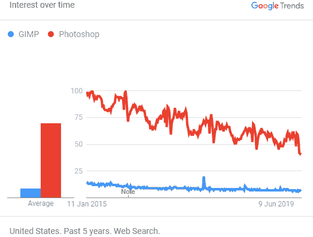
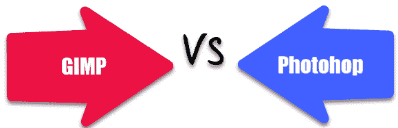

# GIMP 与 Photoshop：主要区别

> 原文： [https://www.guru99.com/gimp-vs-photoshop.html](https://www.guru99.com/gimp-vs-photoshop.html)

## 什么是 GIMP？

GIMP 是一种免费软件和开源栅格图形编辑工具。 GIMP 的完整形式是 GNU 图像处理程序。 它用于图像编辑和润饰，自由形式绘图，将图像转换为不同格式以及更专门的工作。 该程序根据 GPLv3 +许可证发布，可用于 macOS，Microsoft Windows 和 Linux。

在此 GIMP 与 Photoshop 教程中，您将学习：

*   [什么是 GIMP？](#1)
*   [什么是 Photoshop？](#2)
*   [GIMP 的功能](#3)
*   [Photoshop](#4) 的功能
*   [GIMP](#5) 中使用的工具
*   [用于 Photoshop](#6) 的工具
*   [GIMP 和 Photoshop](#7) 之间的区别
*   [何时使用 Photoshop？](#8)
*   [何时使用 GIMP？](#9)
*   [使用 GIMP](#10) 的优势
*   [使用 Photoshop](#11) 的优点
*   [使用 GIMP](#12) 的缺点
*   [使用 Photoshop](#13) 的缺点

## 什么是 Photoshop？

Photoshop 是用于照片修饰和图像编辑的应用程序。 它由 Adobe 针对 Windows 和 macOS 发布。 该工具为您提供创建，增强，编辑艺术品，图像和插图的功能。 对于设计师，图形艺术家，摄影师，Web 开发人员和创意专业人员而言，Adobe Photoshop 是一个重要工具。

## GIMP 的功能

以下是 GIMP 的重要功能：

*   有效管理色彩
*   该工具带有可自定义的用户界面
*   它可以帮助您修饰从相机拍摄的数码照片。
*   它具有基本的矢量图形功能。
*   轻松增强照片。
*   支持不同的硬件设备，包括 MIDI 控制器，USB 等。
*   导出为 JPEG，PNG，GIF，TIFF 和其他文件格式。
*   您一次可以打开无限数量的图像。
*   GIMP 支持完整的 Alpha 通道。
*   可以进行多次撤消或重做。
*   它提供了可转换的选择和路径。
*   它具有前景提取工具。
*   多达 100 个随时可用的插件。
*   您可以将 GIMP 文件加载，显示，转换和保存为多种格式。
*   易于使用的渐变编辑器和混合工具

Google Trends GIMP vs Photoshop

## Photoshop 的功能

以下是 Photoshop 的重要功能：

*   您可以连接到社交媒体平台 Behance。
*   它具有智能的锐化滤镜。
*   它使用发电机技术建造。
*   在移动设备上用 Photoshop 编辑的图像可以自动另存为云。
*   智能的升采样功能使低分辨率图像可以打印。
*   多种形状和路径选择的有用工具。
*   支持有条件的操作，可帮助您自动执行繁琐且重复的任务。
*   它提供一键式色彩校正。
*   您可以轻松润饰照片
*   特效和失真功能。
*   它还可以帮助您恢复褪色的照片
*   您可以增加 UI 的大小。
*   可以进行多次撤消。
*   您可以通过选择主题进行快速选择。
*   修复灰尘，一副镜头或红眼等瑕疵非常简单。
*   在线发布编辑的图像或通过电子邮件发送。
*   用铅笔和钢笔工具绘制图像。
*   对象可以快速转换为图层。
*   按比例变换多个图层，而无需使用 Shift 键。
*   它具有一个运动模糊库，其中包括两个效果，旋转模糊和路径模糊。

## GIMP 中使用的  工具

以下是 GIMP 中使用的重要工具：

*   **选择工具：**正方形区域，月食，套索，剪刀，前景，模糊等。
*   **画笔工具：**混合，画笔，喷枪，克隆，修复等，以及铅笔，污迹，闪避，墨水，透视图克隆和填充。
*   **变换工具：**移动，裁剪，旋转，缩放，翻转，缩放，对齐和透视。
*   **色彩工具**：色彩平衡，着色，亮度对比度，阈值，后色调，去饱和度，阈值，水平，曲线，亮度对比度工具，色相饱和度等。
*   **其他工具：**路径，测量，放大和颜色选择器工具。

## Photoshop 中使用的工具

以下是 Photoshop 中使用的重要工具：

*   **修饰和绘画工具：**修复画笔，补丁，画笔工具，红眼笔，铅笔，颜色替换，橡皮擦工具，背景橡皮擦，锐化，污迹和减淡工具。
*   **画笔工具：**混合器画笔工具，历史记录画笔和美术史。
*   克隆图章工具和图案图章工具。
*   **转换工具：**旋转，缩放，扭曲，倾斜，扭曲，透视。
*   液化工具。
*   **裁剪和切片工具：**透视裁剪工具，切片工具，切片选择工具。
*   **移动和选择工具：**移动工具，画板工具，椭圆选框，矩形选框工具，单行选框工具，套索和魔术棒。
*   **测量工具：**吸管，3D 材质吸管，颜色采样器，标尺和计数工具。
*   **类型和绘图工具：**笔，自由形式的笔工具，添加/删除锚点工具，转换锚点，垂直和水平类型工具，路径选择工具，直接选择工具等。
*   **导航工具：**手，旋转视图，缩放工具。

## GIMP 和 Photoshop 之间的区别

这是 GIMP 和 Photoshop 之间的主要区别：

| **GIMP** | **Photoshop** |
| GIMP 是免费的图像编辑软件。 | Photoshop 是付费的图像编辑软件。 |
| GIMP 的设计考虑了数字摄影 | Photoshop 并非仅考虑数字照片而构建。 它涵盖了许多其他方面。 |
| 需要培训或知识，因为其可用性很难。 | 任何人都可以轻松使用。 |
| GIMP 支持 Windows，Linux 和 Mac 操作系统。 | Photoshop 支持 Windows 和 Mac 操作系统。 |
| 它是一个轻量级的软件。 | 这是一个重量级的软件。 |
| 通常不会占用超过 25 MB 的存储空间。 | 它通常从您的计算机占用 1GB。 |
| 您不需要大量内存即可运行 GIMP。 | 您需要大量内存和其他资源才能运行 photoshop。 |
| 它是一个开源软件。 | 它是专有或接近源的软件。 |
| GIMP 即使对于非专业人士也易于使用。 | Photoshop 是摄影师和设计师以及照片编辑者的理想选择。 |
| GIMP 是一个以社区为中心的工具。 | Photoshop 已向客户付款。 |
| 可以在 GIMP 中打开 Photoshop 文件，因为它可以读取和编辑 PSD 文件。 | 您无法在 photoshop 中打开 GIMP 文件，因为它不支持 GIMP 的本机文件格式。 |
| GIMP 包含许多插件。 | Photoshop 插件，由 Phase 1，Kodak 等著名摄影品牌设计。 |
| GIMP 是批处理图像的理想选择。 | Photoshop 可以批量处理，但是要花很多时间才能完成。 |
| 您无法使用 GIMP 在智能手机上编辑图片。 | Photoshop 使您可以在智能手机上编辑图片。 |
| 它的更新不是很重要。 | 它提供了重要的重要更新。 |
| GIMP 是一种包含较少工具的软件。 | Photoshop 是包含许多工具的软件。 |
| 它用于一般目的。 | 它是专业使用的。 |
| 它提供了灵活性。 | 它不提供灵活性。 |
| 由于 GIMP 是公用软件，因此标准未分类。 | Photoshop 在工业标准上运行。 |
| 需要较低的系统要求才能运行。 | 需要更高的系统要求才能运行。 |

## 何时使用 Photoshop？

以下是使用 Photoshop 的重要原因：

*   如果您是专业人士，则可以使用 Photoshop。
*   Photoshop 主要用于其多功能工具和专业人员的众多选择。
*   大多数客户喜欢用 Photoshop 完成的工作。
*   很多时候，专业人士向客户提供 PSD 文件。 在这种情况下，您必须使用 Photoshop 工具。

## 何时使用 GIMP？

以下是使用 GIMP 的重要原因：

*   价格问题时
*   如果您具有 Linux 操作系统，则可以选择 GIMP 而不是 Photoshop。
*   有许多应用程序可以裁剪照片，增加亮度或对比度，但是使用 GIMP 应用程序，您可以进行真正的编辑工作。
*   GIMP 是便携式的，因此您可以轻松地将其保存在笔式驱动器中，并随身携带。
*   您可以将台式机或笔记本电脑用作临时图像编辑机，因为您拥有完整的软件。

## 使用 GIMP 的优点

以下是使用 GIMP 的优点/优点：

*   GIMP 的最大优势在于它是免费的。
*   GIMP 可以从云，外部驱动器或本地文件夹运行，而无需将其安装到您的计算机系统中。
*   它包含所有高级功能，例如路径和图层。
*   您可以从照片中删除背景。
*   可以在 GIMP 中打开 Photoshop 文件。 这意味着您可以在 GIMP 中使用 Photoshop 画笔和图案。
*   它具有一个更智能的菜单系统，比 Photoshop 中的菜单系统更有用。
*   它具有完善的工具可用于图像遮罩。
*   当您处理面向网页设计的小照片时，此图像编辑工具比 Photoshop 快。
*   它是面向初学者的用户友好软件。

## 使用 Photoshop 的优点

这是使用 Photoshop 的优点/优点

*   您可以使用 Photoshop Actions 工具自动执行任何操作。
*   Photoshop 有一个非常有用的斑点去除工具。
*   制作全景和照片堆叠图像非常容易。
*   它提供了更好的复杂层支持。
*   可以更改 photoshop 中的图像以修复故障。
*   您可以快速创建和编辑新的艺术品图像。
*   Adobe Photoshop 使您可以减轻红眼问题。
*   您可以通过单击鼠标按钮来美白牙齿。
*   它可以帮助您调整图片中人物的肤色。

## 使用 GIMP 的缺点

以下是使用 GIMP 的缺点/缺点：

*   GIMP 无法处理 8 位 RGB，灰度和索引图像以外的任何内容。
*   与 Photoshop 相比，它包含有限的第三方插件。
*   如果您需要编辑具有多个图层的大图像，GIMP 的效果将不佳。
*   在 GIMP 软件中创建美观的弧形可能很困难。
*   GIMP has fewer tools compared to Photoshop.

    您可以找到一些 GIMP 应用程序教程。

## 使用 Photoshop 的缺点

以下是使用 Photoshop 的缺点/缺点：

*   Adobe Photoshop 是 GIMP 的替代产品，后者非常昂贵。
*   Photoshop 是一个重量级的程序，因此需要配备完善的 PC。
*   Photoshop 可能是有用的学习资源，但并不适合初学者。
*   它对矢量图形的支持较少。
*   高质量的图形很难渲染。
*   如果您不熟悉图像编辑，则很难在 Photoshop 中工作。

## 关键区别

*   GIMP 是免费的图像编辑软件，而 Photoshop 是付费图像编辑软件。
*   GIMP 和 Photoshop 都包含许多插件，但是 photoshop 插件是由 Phase 1，Kodak 等著名照片品牌设计的。
*   GIMP 包含较少的工具，而 Photoshop 包含许多工具。
*   您不能使用 GIMP 在智能手机上编辑图片，而可以使用 Photoshop 在智能手机上编辑图片。
*   由于 GIMP 是公用软件，因此未对标准进行分类，因此 Photoshop 运行于工业标准。
*   GIMP 用于一般用途，而 Photoshop 专业使用。