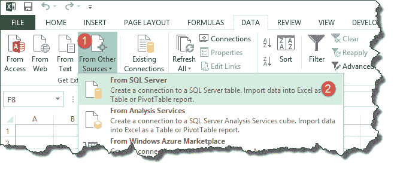
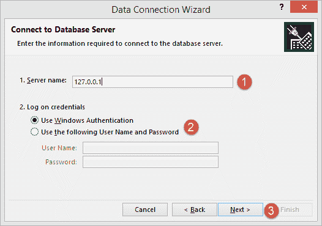
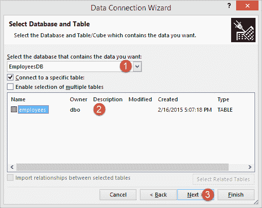
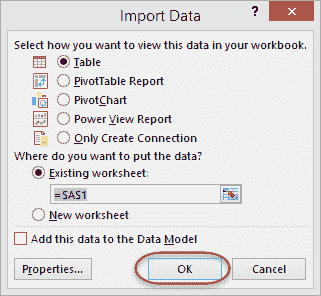
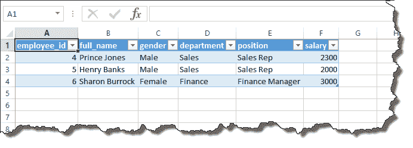

# 如何将 SQL 数据库数据导入 Excel [示例]

> 原文： [https://www.guru99.com/import-sql-data-excel.html](https://www.guru99.com/import-sql-data-excel.html)

在本教程中，我们将从 SQL 外部数据库导入数据。 本练习假定您有一个有效的 SQL Server 实例和 SQL Server 基础。

首先，我们创建要导入 Excel 的 SQL 文件。 如果您已经准备好 SQL 导出文件，则可以跳过以下两个步骤，转到[下一步](#1)。

1.  创建一个名为 EmployeesDB 的新数据库
2.  运行以下查询

```
USE EmployeeDB
GO

CREATE TABLE [dbo].[employees](
	[employee_id] [numeric](18, 0) NOT NULL,
	[full_name] [nvarchar](75) NULL,
	[gender] [nvarchar](50) NULL,
	[department] [nvarchar](25) NULL,
	[position] [nvarchar](50) NULL,
	[salary] [numeric](18, 0) NULL,
 CONSTRAINT [PK_employees] PRIMARY KEY CLUSTERED 
(
	[employee_id] ASC
)WITH (PAD_INDEX = OFF, STATISTICS_NORECOMPUTE = OFF, IGNORE_DUP_KEY = OFF, ALLOW_ROW_LOCKS = ON, ALLOW_PAGE_LOCKS = ON) ON [PRIMARY]
) ON [PRIMARY]

GO

INSERT INTO employees(employee_id,full_name,gender,department,position,salary)
VALUES 
('4','Prince Jones','Male','Sales','Sales Rep',2300)
,('5','Henry Banks','Male','Sales','Sales Rep',2000)
,('6','Sharon Burrock','Female','Finance','Finance Manager',3000);

GO

```

### 使用“数据连接向导”对话框将数据导入 Excel

*   在 MS Excel 中创建一个新的工作簿
*   单击数据选项卡



1.  从其他来源按钮中选择
2.  如上图所示，从 SQL Server 中选择



1.  输入服务器名称/ IP 地址。 对于本教程，我连接到本地主机 127.0.0.1
2.  选择登录类型。 由于我在本地计算机上并且启用了 Windows 身份验证，因此我将不提供用户 ID 和密码。 如果要连接到远程服务器，则需要提供这些详细信息。
3.  点击下一个按钮

一旦连接到数据库服务器。 将打开一个窗口，您必须输入所有详细信息，如屏幕截图所示



*   从下拉列表中选择 EmployeesDB
*   单击雇员表将其选中
*   单击下一步按钮。

它将打开一个数据连接向导以保存数据连接并完成连接到员工数据的过程。


*   您将获得以下窗口



*   点击确定按钮



[下载 SQL 和 Excel 文件](https://drive.google.com/uc?export=download&id=1kJTZAfpH-WugRnUr3_XtzlbTUgAFEfU0)