# 数字营销教程：在线课程

> 原文： [https://www.guru99.com/free-digital-marketing-tutorial.html](https://www.guru99.com/free-digital-marketing-tutorial.html)

最近的研究表明，数字营销是科技行业中增长最快的行业。 本课程旨在使您成为数字营销专家

在本教程中，您将学习-

[数字营销简介](#1)

[搜索引擎优化-SEO 教程](#2)

[社交媒体营销：提示和秘密](#3)

[在线付费广告：最终指南](#4)

[电子邮件和移动应用营销](#5)

## 数字营销简介

* * *

几个世纪以来，营销始终以客户为中心，提供服务和产品的方式已经改变，但策略却保持不变。 技术确实在所有领域带来了革命，从印刷媒体到数字媒体的营销也不例外。 数字营销的快速增长是互联网和社交媒体网站渗透的直接结果。

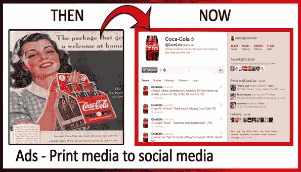

与传统的营销方式不同，您不必挨家挨户说服人们您的产品有多好，相反，Facebook 中的“喜欢”和 Twitter 中的“关注者”可以完成这项工作。

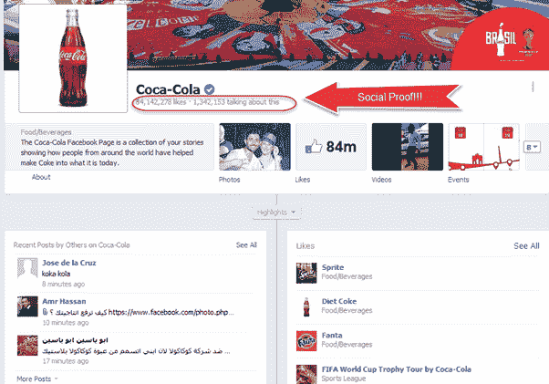

数字营销围绕四件事


*   **社交媒体**：使用 Facebook 和 Twitter 等社交网站与您的客户群进行互动。 将其用作支持渠道，启动新产品的启动板，宣布折扣和独家优惠券以促进销售
*   **SEO** ：SEO 或搜索引擎优化是一种技术，可让网站从 Google，Microsoft，Yahoo 等搜索引擎获取更多流量。它分为两类，即页面外 SEO 和页面上 SEO
*   **内容营销**：内容营销的目标是通过不断创建有价值的相关内容来吸引和吸引客户，以吸引目标受众，从而推动可获利的客户行为。 内容营销对于公司而言非常重要，因为人们在网上发现信息会影响他们的购买决策。
*   **广告**：在线广告比传统广告有很多优势，主要的区别是针对性。大多数在线营销平台接受标语/文字/富媒体广告格式，这些格式以三种方式计费 **CPM（ 千美元成本，CPL（每线索成本）和 CPC（每次点击成本）**。 在每千次展示费用中，广告客户为广告获得的每 1000 次广告观看付费，而 CPC 则是广告客户为使一位访问者进入其网站的广告点击而支付给搜索引擎的金额。 广告客户为每次点击支付给搜索引擎和在线发布商。 广告的另一种形式是“潜在客户成本”，其中广告商向对广告商的报价感兴趣的感兴趣的消费者支付明确的注册费用

## 搜索引擎优化-SEO 教程

* * *

##### 什么是 SEO？

SEO 是改善网站结构，内容和组织的过程，以使搜索引擎可以正确地对其进行索引。 它还涉及进行促销活动以提高搜索引擎排名

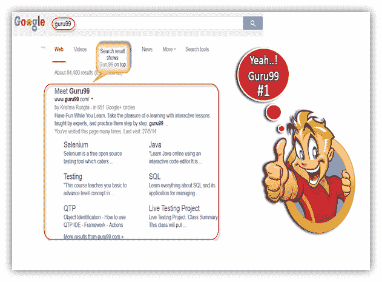

在进一步研究之前，我们先了解一下-

### 搜索引擎如何工作？

几乎每个搜索引擎都会执行以下*，**蜘蛛或 Web 爬网，索引&并显示*** 。

*   **Spiders & Crawlers**: Spiders crawl over the web in search of content (Hence the name Spider). Once they finish scanning and identifying the relevant content, they copy the searched content and store it in a search engines ***database***. While they are scanning one web page, they make note of links to other web pages from this page and later scan the linked web pages as well & this process keeps going on for all webpages. ( For example : Page A links to Page B which in turn links to Page C. Here, Page A,B,C will be stored as well as any page which is linked from Page C ) .

    网络爬行者将从网页中收集以下（但不限于）信息-

    **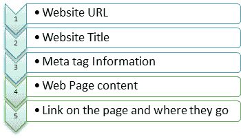** 

*   **Indexing: **Now that website information is stored in Search Engines Database, how will it know which page to put on top of search results and which on last ? Enter Indexing.

    排名基于**关键字**进行。

    当引擎对网络上的页面内容进行爬网和索引时，它们会在基于关键字的索引中跟踪这些页面。 搜索引擎拥有数百万个较小的数据库，每个数据库都以特定的关键字词或短语为中心。

    下一个问题，搜索引擎如何知道要为页面排名的关键字？ 为了确定搜索引擎是否会查看页面内容，页面标题，页面 URL 和其他因素

    下一个问题，假设有 20000 个网页，每个网页都使用相同的关键词足球。 搜索引擎如何确定将哪个页面显示为＃1，＃2 等...输入搜索引擎排名因素，其中要考虑域年龄，域信任度，主题性，指向页面的外部指向链接的数量和相关性，社交信号以及许多其他因素 更多。 本教程稍后将对此进行详细介绍

*   **显示**：搜索引擎活动的最后一步是为搜索查询检索最匹配的结果，这将在浏览器中显示搜索结果。

### 关键字在 SEO 中的作用

关键字实际上是 SEO 的关键。 关键字是个人或用户进入搜索引擎以查找特定信息的内容。

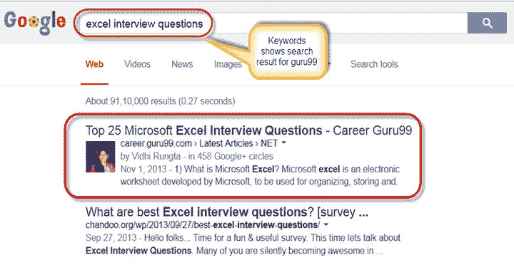

关键字构成网页元数据的一部分，并帮助搜索引擎将页面与适当的搜索查询进行匹配。

*   **关键字密度**

人们常常误解为，通过包含更多描述您的网站的关键字，最终可以帮助搜索引擎将您的网站置于首位。 实际上，更多关键字有时会因“垃圾邮件”或关键字填充而受到惩罚。 因此，从 SEO 角度出发，明智地使用关键字成为必须。 那么，关键字的理想频率是多少？ 人们认为，为了获得最佳结果，主要关键字的关键字密度应为 3-7％，次要关键字的关键字密度为 1-2％。

*   **特殊位置的关键字，页面标题&标题**

您的关键字必须确切地出现在网页上非常重要。 如果您在“页面标题，标题，段落”中有关键字，尤其是在 URL 中，则该关键字会增加计数。 例如，如果竞争对手的网页与该网页具有相同数量的关键字，但是如果您在 URL 中包含了关键字，则与竞争对手相比，您的网页更有机会脱颖而出。

将关键字放在“页面标题”或“标题标签”中被认为是放置关键字的最佳位置。 背后的原因是搜索引擎首先在“标题标签”中查找关键字，然后在“标题标签”中查找关键字。 标准标题标签关键字最多可包含 70 个字符。

为了使标题标签最有效，需要在每个网页的其他区域（如“标题”）中对其进行支持。 您的标题应该是页面上包含主要关键字的最大标题，您也可以在标题中包含次要关键字。 标题长度没有限制，但仍推荐在 7-8 个字左右。 对于关键字，有一些设置标准以达到最佳效果，如下表所示。

| **关键字** | **最佳 SEO 结果的标准** |
| 

*   网址中的关键字

 | 

*   第一个单词是 URL

中关键字的最佳位置 |
| 

*   标题标签

中的关键字 | 

*   关键字应在标题标签的开头，10 到 60 个字符，没有特殊字符

 |
| 

*   描述元标记

中的关键字 | 

*   显示主题少于 200 个字符

 |
| 

*   关键字元标记

中的关键字 | 

*   显示主题少于 10 个单词

 |
| 

*   正文中的关键字密度

 | 

*   含量的 5-20％

 |
| 

*   标题中的关键字

 | 

*   适当使用 Hx 字体标签

 |

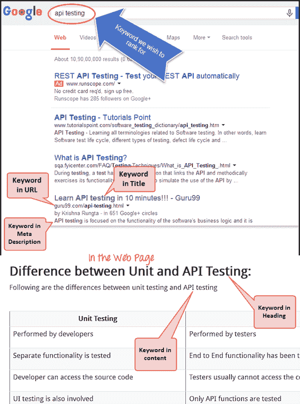

### 成为投票

像 Google 这样的搜索引擎，使用词干进行搜索查询。 词干允许给定搜索查询的所有形式的单数，复数，动词形式以及类似的词。 例如，如果某人搜索“ Mountain **跟踪**”，它将保留该词组的所有变体形式的搜索结果，例如“ Mountain **跟踪**”，“ Mountain **跟踪器**”和 以此类推。

### 排名和排名因素

**Meta-tags**：最早用于优化网站结果的方法之一是向搜索引擎提供元数据。 元数据不过是有关在该页面上找到的数据的数据。

有两个重要的元标记或元数据

*   **元描述**
*   **元关键字**

**元关键字**和**元描述**都可以提高搜索引擎排名。 meta description 标记旨在作为页面内容的简短摘要。 元描述的限制大约为 170-200 个字符，为网站的每个页面都编写了唯一的描述。 元描述格式看起来像这样

< meta name =“ description” content =“页面内容的简短描述。” >

```
**Example:** 
```

```
Meta-description for website "guru99" 
```

**< meta name =“ description” content =“在 Guru99.com 上找到免费的在线教程，以助您事业蒸蒸日上。今天就开始利用在线学习的优势” / >**

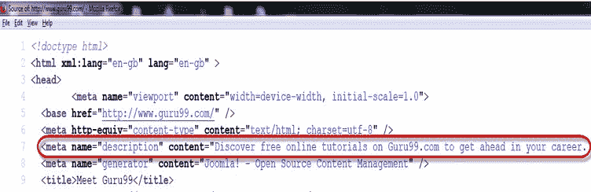

```
While meta keywords format would look something like this 
```

```
**<meta name="keywords" content="keywords, keyword, keyword phrase,etc.">** 
```

**示例**：

网站“ guru99”的元关键字

**< meta name =“ keywords” content ==“免费在线教育，SAP 测试等。” >**

### 链接大厦

##### 页面&页面优化

SEO 优化主要分为两部分：页面优化 ***和页面优化*** 和 ***。***

**正面非页优化**

离页 SEO 是通过使外部链接指向它来提高搜索引擎排名的过程。 您可以找到的链接越多越好，网页在搜索结果中的排名就越高

从搜索引擎的角度来看，高质量的反向链接被认为是好的，并且对您的离线 SEO 产生最大的影响。 高质量的反向链接具有以下特性

1.  来自高页面排名网页的传入链接
2.  使用不同的锚文字
3.  Dofollow 或 Nofollow 链接
4.  从类似的利基博客或网站获取反向链接
5.  避免戴黑帽 SEO
6.  域名管理机构
7.  高信任度
8.  链接域和目标域的主题高度相关
9.  现场年龄-显示现场稳定性

**负页外**不应该执行的操作

*   链接购买：如果您被抓到，罚款是巨大的
*   伪装：尝试防止伪装（在搜索引擎中代表的网页与原始网页不同）
*   域名劫持：当有人通过更改域名注册，在您不知情的情况下，将您的域名移走或滥用您的域名时。 永远不要这样做，这是刑事犯罪。
*   其他黑帽技术

**积极的网页优化**

页面优化直接处理网站的内容和结构。 页面优化重点在于

1.  独特的标题标签和标题
2.  关键字频率

*   网址
*   正文
*   标题

1.  同义字
2.  文案写作
3.  向图像添加描述
4.  良好的内部导航

**网页**上的负数不应该做什么

*   **通过避免非常频繁地重复关键字来避免对优化惩罚（OOP）产生负面影响的**
*   **链接到不良邻居**：不要链接到链接农场或其他具有不良页面排名的网站
*   **避免使用毒药字**：在标题标签中，单词“ link”被视为毒药字或停用词。 您还应避免使用其他许多有害词
*   **避免从其他域中窃取文本或图像**
*   **避免过多的交叉链接**
*   **避免通过刷新元标记将用户重定向到另一个页面。**除非他/她点击了访问者，否则不会立即将您的访问者发送到另一个页面

为了获得最佳 SEO 结果，请务必定期维护它，因为如果您的网站运行缓慢或链接断开，则在搜索引擎中的排名不会很高。

### 谷歌熊猫

| 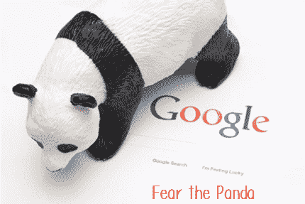 | Google panda 是 Google 的搜索结果排名算法，旨在降低“低质量网站”或“瘦网站”的排名，并在搜索结果顶部附近返回较高质量的网站。 换句话说，它会验证网站的“内容”。 |

**如何逃脱熊猫爪**

1.  尽量避免与那些已经被评为低质量网站的网站建立链接
2.  当心那些充斥着 Google adsense 的网站
3.  避免使用很少或没有审核的网站，尤其是那些对其网站快速接受您的评论或博客的网站

### 谷歌企鹅

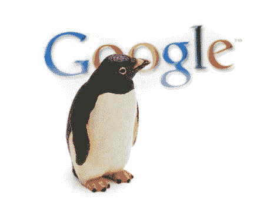

Google 的另一个算法更新是“ Google Penguin”，它对那些违反了搜索引擎设置的 Google 网站站长指南的网站进行了处罚。 该程序专门针对那些实施黑帽 SEO 技术（例如关键字填充，重复内容和大量链接构建等）的网站。 除非向其发送过多的关键字，否则企鹅不会损坏该网站。

**如何摆脱企鹅的啄食**

1.  从来宾博客网络中删除所有链接
2.  删除垃圾网站的链接
3.  删除所有完全匹配的锚链接
4.  删除所有优化的锚链接
5.  Nofollow Guest Post 链接

### SEO 审核和链接删除

SEO 审核和链接删除对于成功运行您的网站非常重要，因为搜索引擎会不时修改其算法。 为了使您的网站取得成功，有必要与当前的指南和搜索引擎要求保持同步。 忽略链接审核可能会使您的网站处于高风险。

对于链接审核和链接删除，可以使用许多在线工具，例如**， [](https://www.google.com/webmasters/tools/home?hl=en)** Google 网站管理员工具， [MOZ](http://moz.com/tools) ，[开放站点浏览器](http://www.opensiteexplorer.org/)， [雄伟的 SEO](http://www.majesticseo.com/) 等。它将仔细检查“反向链接”并提供一些有用的指标，例如

*   链接到您网站的特定 URL
*   这些 URL 分别链接到您网站上的页面
*   每个传入链接使用的锚文本
*   每个进入链接是跟随还是不跟随

在删除质量低下的链接时，您必须要小心，因为其中一些链接可能与您的网站高度相关，并且来自上升中的网站。 将来，它们可能会成为重要的流量来源。

***“坏链接”*** 的特征是什么

*   来自多个站点的具有相同锚文本的链接
*   来自与您的利基无关的网站的链接
*   低流量和低 PR 的链接（页面排名）
*   来自文章目录或类似于链接场的网站的链接
*   来自链接交换的链接
*   付费链接
*   来自不在 Google 索引中的网站的链接
*   博客评论中的垃圾链接

如果网站所有者没有从您的网站中删除错误的链接，则可以使用 Google 的[拒绝](https://www.google.com/webmasters/tools/disavow-links-main?pli=1)工具。 此拒绝工具将删除不良链接。

此拒绝工具适用于以下情况

*   当您进行手动操作时
*   网站管理员不会删除指向您网站的错误链接，也不会要求您删除它们
*   当您看到指向您网站的链接时，您不想与之关联
*   当您担心负面的 SEO 时
*   您会看到指向您不想与之关联的站点的链接
*   您看到了链接炸弹攻击，并担心它可能会伤害您的网站
*   您担心有人会为您提交垃圾邮件报告
*   您会看到排名下降，并且认为这与 Google 运行的算法有关，例如：企鹅算法

## 社交媒体营销：提示和秘诀

* * *

社交网络营销是关于使用社交媒体网站作为营销工具来优化收入或增加品牌知名度。 社交媒体营销使用诸如 SMO（社交媒体优化）之类的策略，可以通过两种方式完成

a）将社交媒体链接添加到内容，例如共享按钮和 RSS feed

b）通过更新推文，博客文章和状态，通过社交媒体推广网站

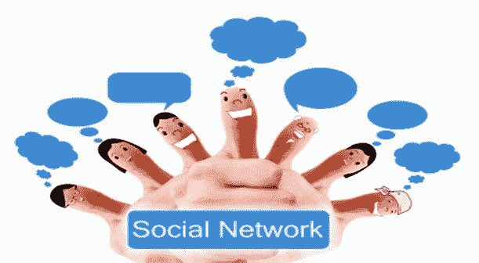

社交媒体营销可帮助公司从客户，Twitter，Facebook，Instagram，Myspace，Linkedln 和 Youtube 等社交网站获得直接反馈，这些社交网站在过去几年中对社交营销做出了重大贡献。 社交媒体在营销中的成功归因于用户和服务渲染器之间的非常“个人”交互。

### FaceBook 营销

脸书功能比其他社交网站更详细。 他们允许产品提供照片，视频，更长的描述选项和推荐，其他追随者可以在产品页面上表达自己的意见，以供其他人查看。 Facebook 可以链接回产品推特页面，并发出事件提醒。 这可以通过连接到 Facebook，管理页面上的字段的各个组或业务组，并直接向管理员发送消息来进行网站推广来完成。 您还可以创建自己的个人页面，例如可以在上面上传视频或网站信息，这里我们有“ Guru 99” Facebook 页面，该页面已通过 Facebook 吸引到许多电子学习者。

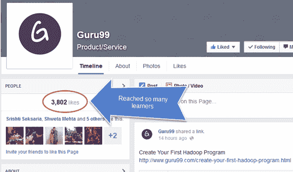

接下来，您还可以根据自己的喜好创建一个组或加入一个组，例如，如果您是计算机极客并且正在搜索 Java 计算机组，那么您可以加入一个 Java 组，在其中询问有关 Java 的问题或共享与 Java 有关的任何信息。 与您的小组一起使用 Java。

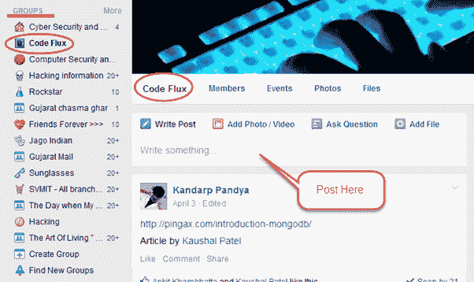

为了促进社交媒体营销并管理定期在社交网站上发布消息，使用了自动计划工具。 [*Hootsuite*](https://hootsuite.com/) 是一种这样的工具，它为用户提供了扩展的功能，可用于自动和调度消息，监视会话并跨多个网络跟踪结果。 例如，这里显示了如何为网站 [Guru99](/) 设置和计划不同的教程。

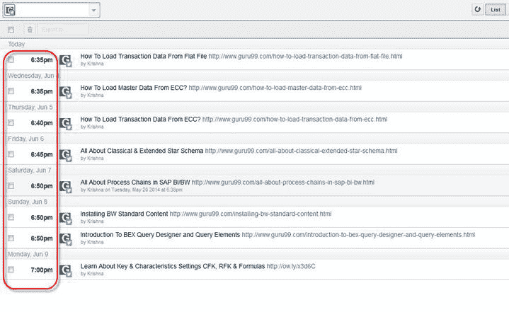

### Twitter 营销

这是一个微博客服务，允许从客户发送和接收消息。 这可以帮助商人与同龄人及其客户进行联系和沟通。 您也可以在 Twitter 上创建您的个人页面，并可以在 Twitter 上上传您的网站并共享与网站相关的信息。

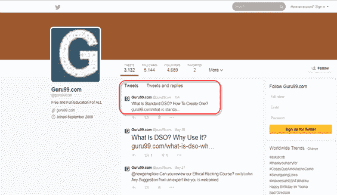

Twitter 是一个很好的工具，可以在不侵犯其隐私的情况下吸引新客户/客户

### 领英营销

LinkedIn 将来自不同背景的专业人士联系起来，并通过联系业务专业人员提供了扩展业务的机会。 通过使用小部件，成员可以直接向其客户宣传其产品或网站。 **“公司页面”** 是 linkedin 中的一种功能，它可以使您的客户像企业简历一样快速浏览您的业务。

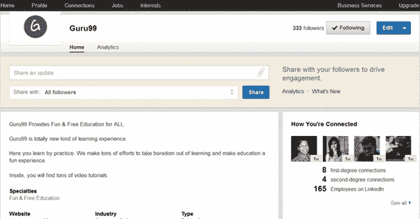

您在 linkedin 上的个性化网页也可以用作与同龄人小组或电子学习者进行讨论的开放平台。 除了您的个性化页面外，还可以选择加入组，公司或任何特定的专业组（医生，房地产&基础结构，工作门户网站，业务组等）。

最近的研究已将 LinkedIn 列为社交推荐公司首页的首选。

*   领英（LinkedIn）：有 64％的社交推荐人访问了公司主页
*   Facebook：17％的社交推荐人访问公司主页
*   Twitter：14％的社交推荐人访问了公司主页

## Google+更多

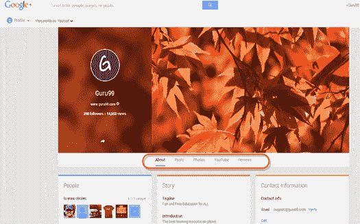

Google Plus 提供了可用于营销目的的各种功能，例如

1.  圈子：您可以创建组或加入自己喜欢的圈子
2.  流：提供所选联系人或组的即时更新
3.  照片：上传照片
4.  Sparks：它使您每次登录时都能指定感兴趣的领域
5.  加一：这就像一本“类似按钮”的面孔书，您可以在其中表达对任何特定产品的意见
6.  视频聊天和闲聊：所有查询都可以通过视频聊天工具解决，该工具可用于促进现场客户互动，而聊天则允许进行群聊。

除此之外，您还可以加入自己感兴趣的社区，例如 guru99 已为软件测试人员创建了社区，他们可以在此页面中使用这些页面讨论他们共同感兴趣的主题。

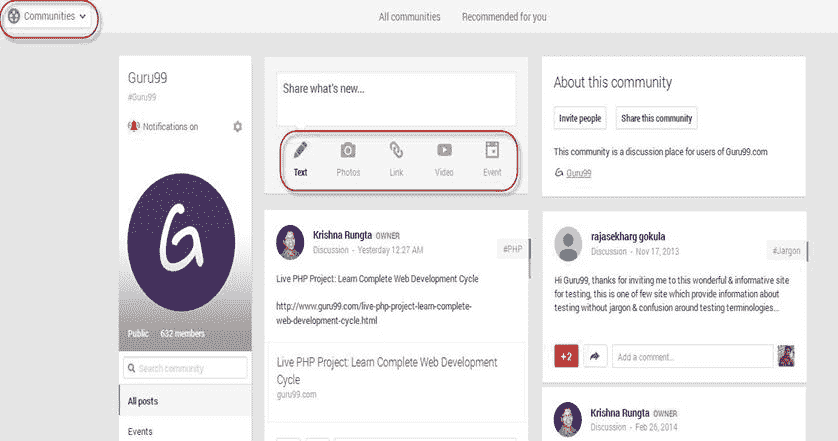

### 宣传影片

视频是吸引客户的最快方法之一。 视觉效果比印刷或数字文本对客户的影响更大，与其他媒介相比，它可以更令人信服地说明产品。 “ Youtube”上的营销转向，观众变成了粉丝，而粉丝变成了客户。 同样，您网站上的视频页面也有更多机会获得良好的评分，因为视频页面的竞争非常少。

一种方法是将多个视频嵌入到一个网页上，以创建一系列相关的视频。 另一种选择是重新调整视频的用途以产生相关内容。 它包括演示文稿，作为播客和图像的屏幕截图，转录和 PDF 下载。

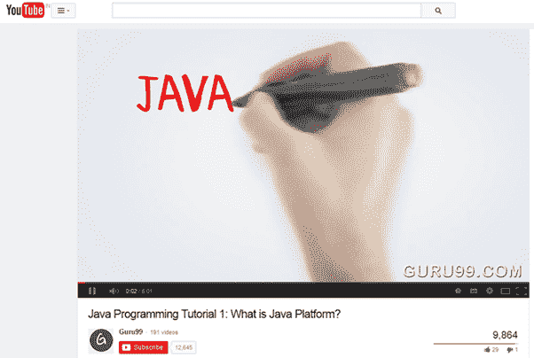

要使观看者获得最大的视频链接，请附加视频的脚本。 YouTube 还为视频提供字幕选择。

对于 Intagram Marketing，请参考[本教程](https://www.x-cart.com/instagram/marketing.html)

## 在线付费广告：最终指南

* * *

每次点击付费广告或 PPC 表示您每次客户或用户点击广告时都需要付费。 您只需支付出价金额即可。 由 Google 经营的最流行的按点击付费计划之一是 AdWords。

每次点击付费（PPC）营销是协作，复杂和反复的。 每次点击付费营销围绕关键字展开。 下面的屏幕快照演示了 Google 广告的外观。

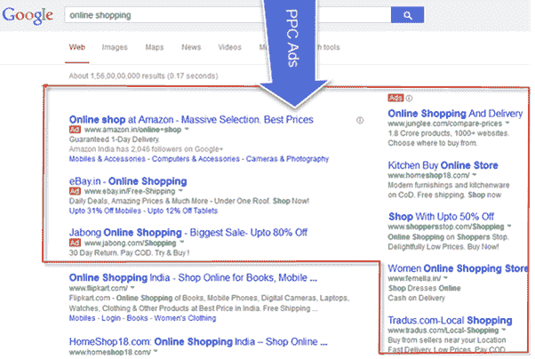

成功进行 PPC 竞选的几个重要方面

*   首先了解 PPC 活动的目的
*   针对目标受众进行研究
*   关键字研究
*   执行 A / B 测试
*   向竞争对手学习广告文案，然后再制作自己的广告文案
*   关键字分组与组织
*   广告中的关键字应包含着陆页的关键字
*   广告组的创建和管理
*   **Managing your PPC campaign**

    创建新的广告系列后，必须确保它们保持有效并有效，并且必须正确管理 PPC 广告系列

*   持续分析您的帐户效果
*   添加 PPC 关键字并扩大您的 PPC 广告系列的覆盖范围
*   要提高广告系列的相关性，请将非转化字词添加为否定关键字
*   将您的广告组分成更小，更相关的组。
*   停止效果不佳的关键字
*   修改目标网页的内容和号召性用语（CTA）以与各个搜索查询保持一致，以提高转化率
*   不要将所有访问量发送到同一页面

| **不良广告**的示例 | **优质广告**的示例 |
| 

*   滚刀黑咖啡
*   自 1947 年开始销售咖啡
*   快来看看我们的选择

 | 

*   滚刀的优质有机黑咖啡
*   清爽优质的
*   进口黑咖啡的特惠折扣

 |

## Facebook 广告

Facebook 为用户提供了独特的工具来宣传其产品或服务。 Facebook 提供**点击到网站，网站转换，页面帖子参与度，页面喜欢**等选项。 在这里，我们选择了**单击“网站”选项，**当您输入网站的 URL 并单击“继续”时，它会将您定向到广告页面。

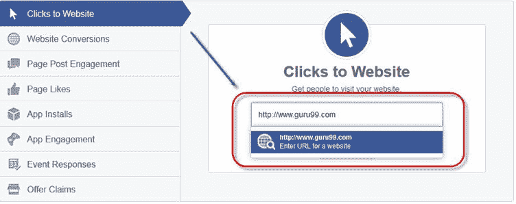

输入广告页面的网址后，下一步就是上传您要在用户查看广告时展示的广告图片。 在此屏幕快照中，我们上传了一张图片，显示**“免费直播硒项目”。**

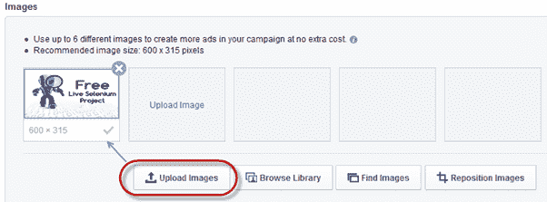

在同一页面上，您可以像这样在此处设置广告标题**：“ Live Selenium Testing”** 另一个功能是**号召性用语，或点击**按钮。 在您的广告上显示**，现在预订，**等按钮。 您可以根据需要选择此按钮，此处我们选择了**无按钮**选项，因为我们不需要在广告上显示按钮。

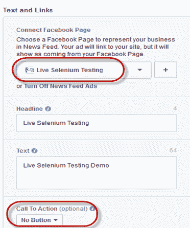

上传广告图片后，下一步就是确定广告的受众群体并为其定位。 在广告页面上，您可以按照以下屏幕截图所示处理帐户，并可以根据特定受众群体的**位置，年龄，性别，语言**等来缩小受众群体的范围，也可以从同一受众群体出价 页。

在这里，我们选择了**印度，美国和英国**等国家/地区，并将广告定位在 19-24 岁的**年龄段**之间，并相应地设置了其他类别。

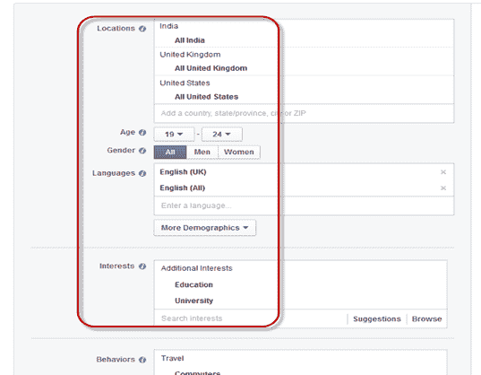

下一步是设置广告限额，例如您想为广告花费多少钱，然后可以相应地设置金额限额。 例如，我们将每天的费用上限设置为 100 卢比，那么您的广告就会在 Facebook 上展示，直到当天的金额为零。


出价和定价是下一步，您可以选择要向广告客户付款的方式，无论是按点击次数**（点击出价）还是**支付广告费用 仅仅展示您的广告**（竞价出价）。** 选择任何一个选项后，您可以单击**下订单**，然后您将转到 Facebook 广告的最后一步。

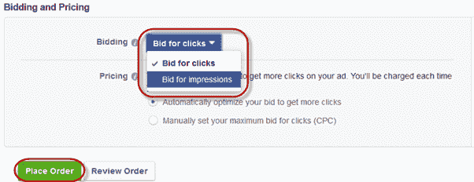

一切设置完成后，您将进入流程中最重要的部分和最后一步，是的，您猜对了，银行存钱，一旦完成付款工作，您的广告就会得到审核和批准。 Facebook 组，不久您的广告就会开始在您的帐户上展示。

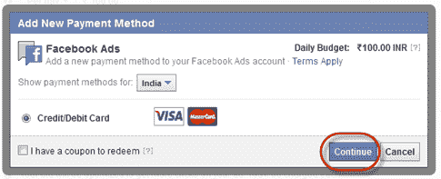

对于桌面用户，广告将显示如下所示的屏幕截图

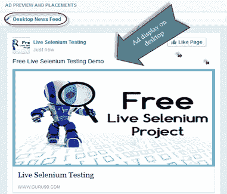

对于移动用户，广告将像这样显示，如下所示

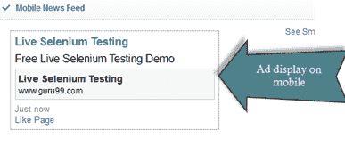

## Twitter 广告

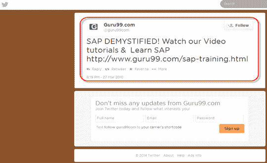

Twitter 广告直接在 Twitter 的时间轴中实施，因此它们不仅适合，而且不会分散观众的体验。

**Twitter 的广告类型**

Twitter 通过推广广告和产品，异常显示了其在线营销潜力。 其中某些广告类型在此处着重强调。

*   **Twitter 带有下载选项的新广告到来**：这种新型广告允许用户通过 Twitter 下载应用程序，并且是试图将利润丰厚的游戏广告引入 Twitter。 在此之上，

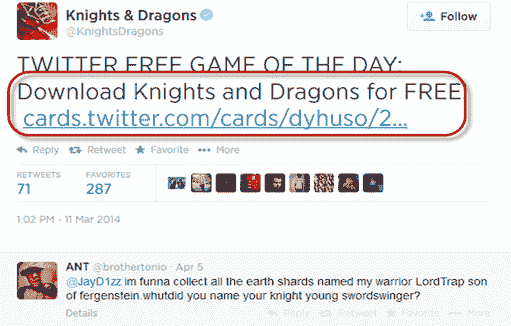

*   **带有点击通话按钮的广告**：与 Facebook 一样，twitter 还将在 twitter 帐户中引入 Click to button 选项，以便直接访问广告商。 它将使感兴趣的消费者可以在单个选项卡中找到他们感兴趣的产品

**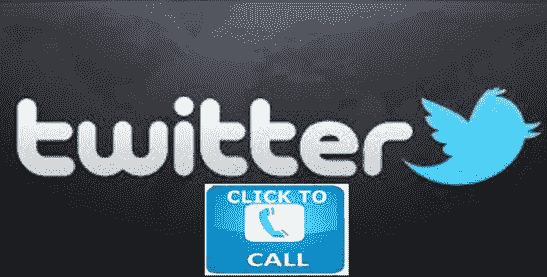** 

*   **Promoted hashtags , promoted account, promoted tweet:**

    **推荐的标签**：推荐的标签可以使人们了解您的产品或主题。 单击主题标签可以显示所有包含该主题标签的推文

    **推荐帐户**：它可以帮助建立关注者并提高知名度。 推广帐户以 CPF（每关注者成本）定价，广告客户只为获得的新关注者付费

    **推文**：将推文推广到任何目标都可以带来意识，参与度并吸引关注者。 推广的推文使用每次参与费用定价。 如果用户单击升级的推文（转发，回复，收藏或关注），则认为 Twitter 参与。 广告客户只为第一次参与付费。

    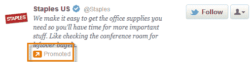

    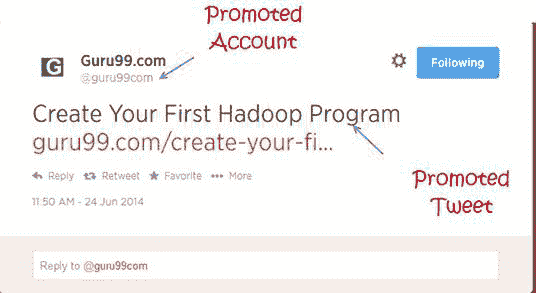

**Twitter 卡**

使用 Twitter 卡，您可以将丰富的照片，视频和媒体体验附加到推文上，以吸引网站访问量。

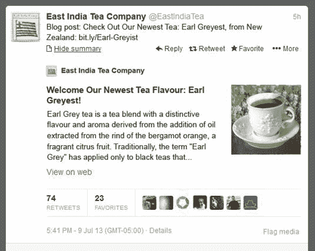

## 电子邮件和移动应用营销

* * *

随着互联网的使用，电子邮件营销已变得越来越普遍，并且是以最小的成本吸引最大用户的通用方法。 它是一种直接营销形式，使用电子邮件作为一种交流手段。 电子邮件营销是与客户保持联系并同时促进您的业务和产品的有效方式。 通过电子邮件营销，您还可以跟踪对您的产品或服务表现出兴趣的人数百分比。 专业的电子邮件营销被认为是组织营销策略的更好方法。 这是电子邮件营销的一些好处。

*   **基于权限的列表构建**：它是通过为潜在的电子邮件联系人提供一个签名框并通过后续电子邮件确认其批准来创建电子邮件列表的
*   **广告系列创建**：能够通过品牌，主题和时间表来组织和构造大量电子邮件
*   **在线报告**：跟踪各个电子邮件广告系列的发送情况，打开的速率以及未打开或退回的电子邮件
*   **丰富的内容集成**：使用模板，拖放编辑器添加图形，视频，音频和测试
*   **列表管理**：能够组织，细分，编辑，扩展和管理客户或客户电子邮件联系信息的数据库

**如何成功实施电子邮件营销活动**

有一些简单的技巧可以有效地进行电子邮件营销

*   为了引起读者的注意，请确保您的主题行或标题突出。 需要保持简短简短
*   您的徽标需要在电子邮件顶部清楚突出显示
*   强调电子邮件的前两三行以产生影响
*   提供网站登录页面的链接
*   在诸如展览会等离线活动中收集电子邮件地址，并将其导入数据库并向他们发送欢迎电子邮件
*   通过 Google plus 公司页面推广优惠和电子邮件注册

### 自动安排电子邮件

当人们必须定期将相同的文档或消息批量发送给不同的人时，电子邮件计划可能会很有帮助。 电子邮件的自动化不仅限于发送和接收邮件，还应考虑其他活动，例如自动删除不需要的电子邮件，将电子邮件附件保存到本地文件夹，与文本文件或 csv 进行电子邮件集成等。 [Aweber](https://www.aweber.com/landing.htm) 是一个这样的平台，您可以在其中管理和自动化您的邮件，并根据其计划邮件。 如下面的屏幕截图所示，我们已经安排了有关 JavaScript 的每条消息或教程，并通过依次安排将其发送给订阅者。

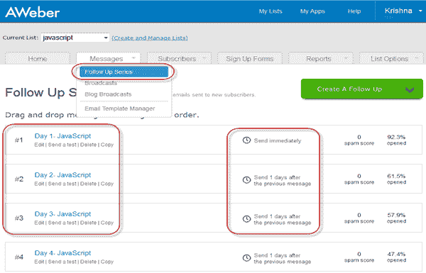

许多电子邮件服务提供商没有内置的自动调度功能，因为它们具有扩展名，并且可以将此扩展名添加到其邮件系统中。 例如，“ Boomerang”，可以在 Google chrome 或 Firefox 中用于计划电子邮件。 [Mail Chimp](http://mailchimp.com/) 是另一个邮件管理器，您可以在其中设置邮件的数据，时间，批处理传递等。

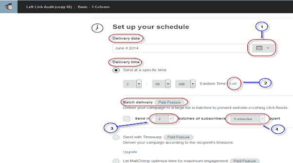

邮件黑猩猩的重要功能是保留其订户的跟踪记录，并提供信息，例如谁都查看了您的邮件，他们单击的链接以及从何处访问链接（地理位置），反之亦然。

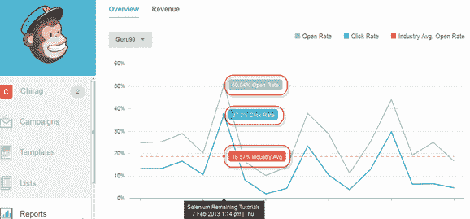

## 移动应用营销

在构建移动应用程序时，需要做一些事情

1.  **扩大社交媒体的影响力** ****：建立稳定的社交媒体，关注 Facebook，Twitter，Google +，Tumblr
2.  **推动整个应用的参与度**：专注于鼓励持续参与并不断更新新内容，以防止用户对您的应用失去兴趣
3.  **提高应用商店的评价**：尝试提高您的应用的评价，这将为您的应用带来大量流量
4.  **应用下载量稳步上升**：当您的应用下载量更多时，总会有更多收入，因此，如果您有有价值的产品，它会自动提高下载率。

## 移动应用宣传视频

作为病毒式营销活动的一部分，促销视频非常重要。

*   制作简短且内容丰富的促销视频。
*   突出显示您的应用程序的所有关键功能，并指出为什么您的应用程序比竞争对手更好
*   另外，还包括您的应用的屏幕截图
*   视频准备就绪后，您必须积极进行网络营销或分发该视频。 将其发布在论坛上，使用 Facebook 和 Twitter 之类的社交网站发挥最大作用，将其上传到 youtube 等。

最后，如果您创建一个 GREAT 移动应用程序，那么人们将为您进行营销！ 在这里，我们将看到公司 Guru99 的移动应用程序。

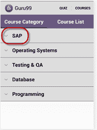 ](/images/AdvanceSelenium/071514_0654_EmailandMob4.png) [ 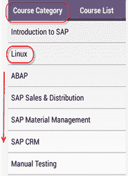 ](/images/AdvanceSelenium/071514_0654_EmailandMob5.png) [ 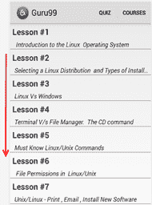

## 网站分析

Web 分析是研究，分析和报告 Web 数据，以了解和优化 Web 使用的目的。 此技术对于衡量有多少人访问过该站点，访问该站点的频率或他们选择访问您站点的路线非常有用。 从管理员的角度来看，Web 分析非常有用，因为他们可以弄清楚站点的哪个区域受欢迎，哪个区域不受欢迎。

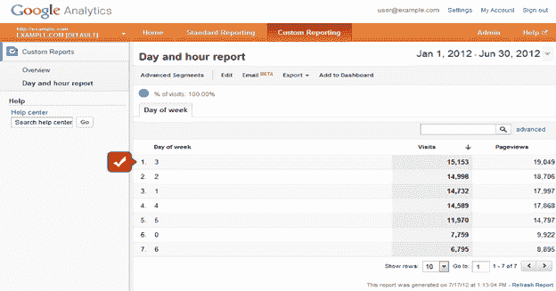

Web 分析软件可用于监视您的网站页面是否正常工作。 市场上有各种 Web 分析软件，其中有 [Google Analytics](http://www.google.com/analytics/) ，Adobe 网站催化剂，IBM Coremetrics Web 分析，IBM 的 Unica Netsight，雅虎营销仪表板，Piwik，Moz 等。

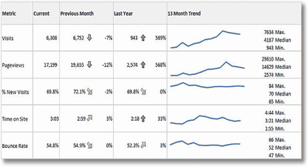

一个好的分析工具应满足以下条件

*   如果您决定更改某些内容，可以重新分析数据吗？
*   您是否可以重新分析日志的子集以获得更集中的视图
*   解决方案每月跟踪多少个网页
*   总拥有成本是多少
*   是否容易与其他数据源集成

[完整的数字营销课程](https://career.guru99.com/recommends/digital-marketing-course-2/)