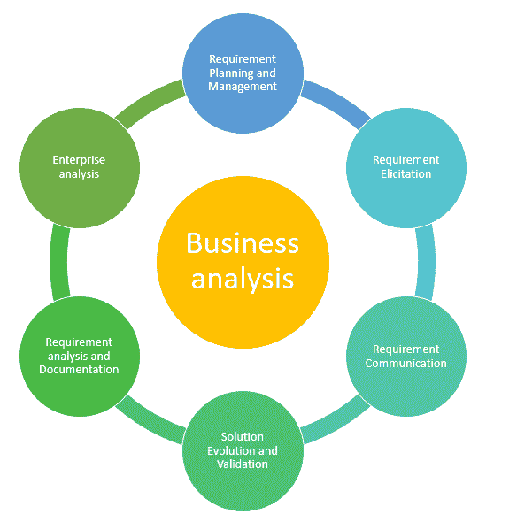
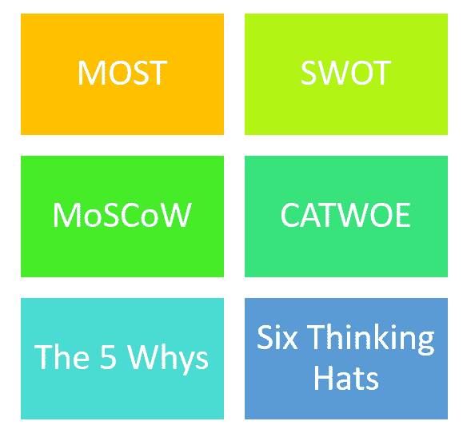

# 什么是业务分析？ 工艺&技术

> 原文： [https://www.guru99.com/business-analysis-process-techniques.html](https://www.guru99.com/business-analysis-process-techniques.html)

## 什么是业务分析？

业务分析被定义为研究学科，可帮助您找到业务需求并定义业务问题的解决方案。 它还包括一个软件系统开发组件。

业务分析过程为任何项目的初始框架的开发提供了概念和见解。 它存储了密钥，以指导有序执行业务建模的项目利益相关者。

在此业务分析教程中，您将学习：

*   [什么是业务分析？](#1)
*   [为什么要使用业务分析？](#2)
*   [业务分析流程](#3)涉及的步骤
*   [常见业务分析技术](#4)

## 为什么使用业务分析？

以下是使用业务分析方法的重要原因：

*   它可以帮助您了解公司的结构和动态
*   它使您能够了解目标组织中的当前问题。
*   它可以帮助您确定改进潜力并推荐解决方案，以使组织能够实现目标。
*   它可以帮助您确定并明确说明变更的需求。
*   最大化组织交付给利益相关者的价值。

## 业务分析过程中涉及的步骤

以下是业务分析的步骤：

1.  企业分析
2.  需求计划与管理
3.  需求启发
4.  需求分析和文档
5.  需求沟通
6.  解决方案的演变和验证。

**步骤 1）企业分析**

该区域涵盖了项目前活动的集合，这些活动导致业务分析师指导的项目选择。

活动如下：

*   它有助于维护业务架构
*   允许您准备业务案例
*   准备决策包

**步骤 2）需求计划&管理**

在此步骤中，您需要定义与需求的计划和管理相关的任务和资源。 这可以帮助您确保根据特定项目进行的一系列活动是适当的。 正确且一致地捕获更改也很重要。

**步骤 3）需求征询**

需求确定阶段包括从用户，客户和其他利益相关者那里研究和发现系统的需求。

**步骤 4）需求分析&文档**

此阶段描述利益相关者如何分析，组织和指定解决方案的设计和实现。 需求分析可帮助您定义用于构造原始数据的方法和工具。

**步骤 5）需求沟通**

此阶段是用于表达需求分析输出的活动的集合。 此外，在解决方案实施之前，每个需求都需要打包，评估和批准。

**步骤 6）解决方案评估和验证**

此阶段确保解决方案应能够满足利益相关者的目标。

## 常见的业务分析技术

以下是最重要的业务分析技术：

### 最

大多数是任务，目标，策略的简短形式。 它使业务分析师可以对组织要达到的目标以及如何解决此类问题进行全面的内部分析。

### 杵

杵代表（政治，经济，社会学，技术，法律和环境）。 此模型可帮助业务分析人员评估可能影响其组织的所有外部因素，并确定如何解决它们。

### 苦战

SWOT 是优势，劣势，机会和威胁的完整形式。 此技术可帮助您找到优点和缺点。 它还允许适当分配资源。

### 莫斯科

MosCow 的长形式是必须或应该，可能或将要进行处理。 该技术通过提供一个框架来对需求进行优先排序，在该框架中，每个单独的需求都应相对于其他需求进行评估。

### 有线电视

CATWOE 是客户，演员，转型过程，世界观，所有者和环境的首字母缩写。 此技术可帮助您识别可能受业务采取的任何操作影响的流程。

### 5 个为什么

该技术是六西格码和业务分析技术的骨干。 它由一些主要问题组成，这些问题使业务分析师可以通过询问为什么会出现这种情况来找出问题的根本原因。

### 六顶思考帽

此过程可帮助您考虑其他观点和想法。 他将“六顶帽子”归类为：

*   绿色（创意思维）
*   蓝色谈大图概述。
*   白色（逻辑，数据驱动的思维）
*   黄色（积极思考，主要侧重于专业人士）
*   红色（基于情绪的反应）
*   黑色（反对思想，着眼于缺点）

### 摘要：

*   业务分析是一门研究学科，可帮助您发现业务需求并定义业务问题的解决方案
*   它可以帮助您了解公司的结构和动态
*   以下是业务分析的步骤：1）企业分析 2）需求计划和管理 3）需求征求 4）需求分析和文档 5）需求沟通和 6）解决方案的演变和验证。
*   重要的业务分析技术包括：1）最多 2）方式 3）快捷方式 4）莫斯科 5）小屋 6）5 个理由和 7）六顶思考帽
*   大多数是任务，目标，策略的简短形式
*   SWOT 是优势，劣势，机会和威胁的完整形式
*   MosCow 的长形式是必须或应该，可能或将会处理
*   CATWOE 是客户，演员，转型过程，世界观，所有者和环境的首字母缩写
*   该技术是六西格码和业务分析技术的骨干
*   此过程可帮助您考虑其他观点和想法