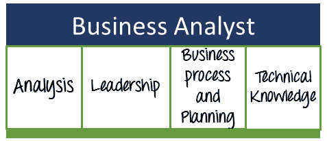

# 什么是业务分析师？ 角色，责任，技能，认证

> 原文： [https://www.guru99.com/introduction-business-analysis.html](https://www.guru99.com/introduction-business-analysis.html)

## 谁是业务分析师？

在最近的业务场景中，业务分析师已经扮演了关键角色。 有人认为业务分析师的作用是为组织赚钱，这在直接情况下可能并非如此。 但是间接地，业务分析师采取的行动和决策确实会对组织的财务前景产生影响。

### 业务分析师做什么？

业务分析师的主要工作职责是与所有利益相关者&进行沟通，以得出，分析和验证对业务流程，信息系统和策略的更改的要求。

专业的业务分析师在使组织朝着效率，生产力和盈利能力发展方面发挥着重要作用。

在进入本教程之前，我们将了解业务分析师的一些基本观点，以帮助组织成功。 对于任何业务分析师而言，最重要的优先事项是尝试理解以下内容

*   了解业务做什么以及如何做
*   确定如何改善现有业务流程
*   确定支持新功能实施的步骤或任务
*   设计要实施的新功能
*   分析实施新功能的影响
*   实施新功能

## 不同的业务分析师角色

业务分析师可以来自任何部门，并且角色因部门而异。 业务分析师分为以下几类：

*   业务分析师
*   业务流程分析师
*   IT 业务分析师
*   业务系统分析师
*   系统分析师
*   数据分析师
*   职能架构师
*   可用性或 UX 分析人员

## 优秀业务分析师的技能

基本上，要根据这四个属性来判断一个好的业务分析师

*   **分析技能**-出色的分析技能将使优秀的业务分析师脱颖而出。 BA 角色的很大一部分包括分析数据，工作流，用户或涉众的输入，文档等。
*   **领导技能**-指导团队成员，预测预算，帮助团队成员解决问题等。
*   **业务流程和计划**-规划项目范围，理解和实施项目需求，确定项目所需的资源等
*   **技术技能**-如果业务分析师在 IT 领域，则几乎没有技术方面的知识，例如操作系统，硬件功能，数据库概念，网络，SDLC 方法等。

## 资质认证

根据国际商业分析协会（IIBA），CBAP（认证的商业分析专业人员）证书是专业商业分析师的认可证书。 他们提供两种类型的认证。 认证考试是基于计算机的，由多项选择题组成。

*   业务分析能力证书：至少需要 3750 个小时的工作经验才能获得此认证
*   经认证的业务分析专业（高级）：至少需要 7500 个小时的工作经验才能获得此认证

对于离岸学生，他们可以在线进行认证考试。 有关更多信息，您可以访问[网站](https://my.iiba.org/CPBase__item?id=a131N000006rGhtQAE)。

## 工作

业务分析师的招生说明书每年都在增加，特别是对于 IT 部门。 即使是入门级，业务分析师的平均工资也估计在 80,000 美元至 130,000 美元之间。

国际商业分析协会（IIBA）呈指数增长，表明对商业分析师的需求不断增长。 业务分析师始终是组织的重中之重，因为他们必须与高层管理人员，客户和利益相关者密切合作。

根据美国劳工统计局的数据，预计 BA 工作将在 2012 年至 2022 年之间增长 19％。

## 结论：

业务分析师的角色很有希望，并且必须处理组织的不同层次。 业务分析师分为不同的类别，例如业务流程分析师，IT 业务分析师等等。

*   好的业务分析师应具备之类的技能
    *   分析能力
    *   领导能力
    *   业务流程与计划
    *   技术能力
*   可以帮助业务分析师的各种工具有 TopTeam Analyst，SmartDraw，Blueprint 等。
*   由认可机构 IIBA 提供的 BA 在线认证课程
*   根据美国劳工统计局的数据，预计 BA 工作将在 2012 年至 2022 年之间增长 19％。