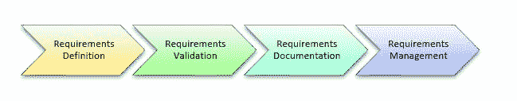

# 需求生命周期管理

> 原文： [https://www.guru99.com/lifecycle-of-requirement.html](https://www.guru99.com/lifecycle-of-requirement.html)

## 什么是需求生命周期？

需求生命周期涉及多个阶段，有时可能是一个复杂的过程。 过程的性质取决于您为软件开发选择的方法，例如敏捷，瀑布式，增量式等。每个阶段可能涉及大量的文书工作和批准程序。 它还处理项目文件，例如项目建议书，项目管理计划，项目范围和业务案例。 让我们来了解业务分析师需要了解的一些常见需求生命周期。

需求生命周期图

## 阶段 1：需求定义

它是需求收集过程的主要阶段之一，通常称为需求提取。

一旦需求被收集，就可以按照产品发行或冲刺的逻辑将其组织在文件夹中。

对这些需求进行进一步分析，以为业务分析师准备事实和数据，以根据分析结果跟踪可能的结果。 此过程称为**影响评估。**

## 阶段 2：需求验证

需求确认阶段包括考虑各种涉众的需求，分析满足新产品或变更产品所需的需求或条件。

对于任何项目的成功而言，验证需求都是非常重要的。 需求验证包括检查规格，线框，高保真仿真，可追溯性分析等。

有一些需求验证工具可以用很少的人工干预来进行验证。

## 阶段 3：需求文档

需求文件应涵盖以下内容

*   项目涉众要求
*   业务分析计划
*   现状分析
*   范围说明规范

## 阶段 4：需求管理

需求管理过程包括计划，监视，分析，沟通和管理那些需求。 如果需求管理不善，最终产品将受到不利影响。 在线有需求管理工具可帮助您以最小的门槛来管理需求。