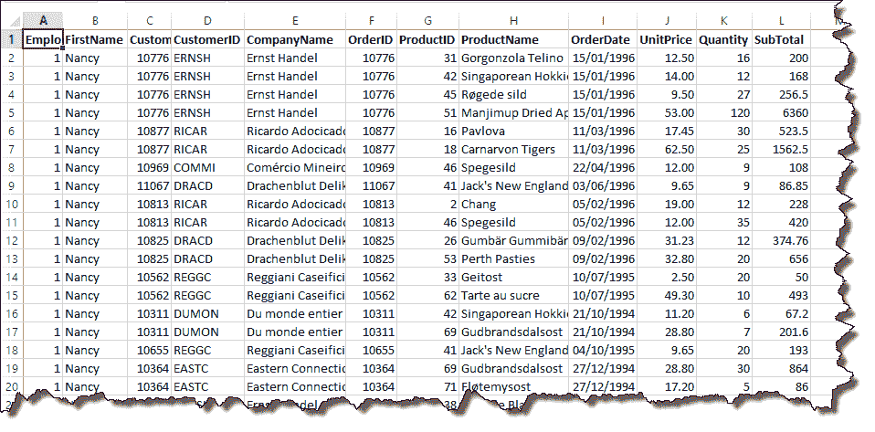
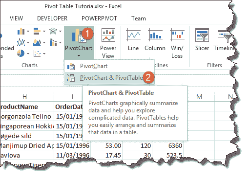
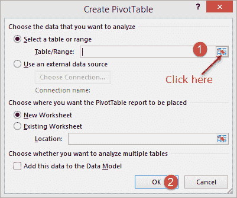
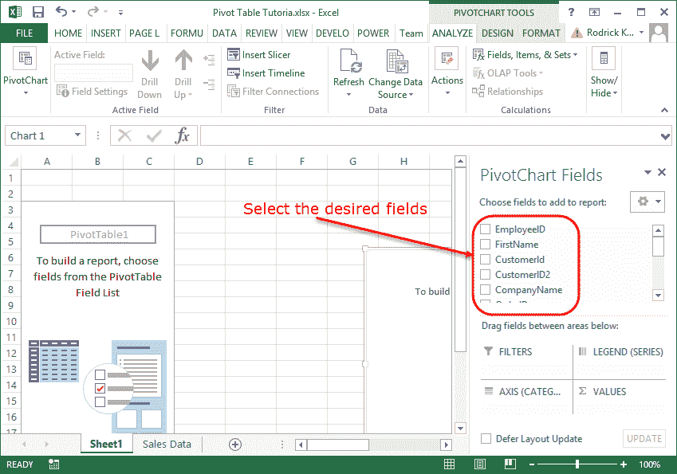
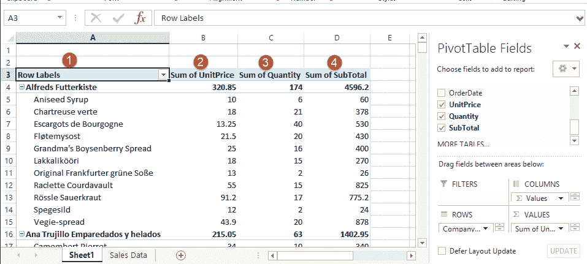
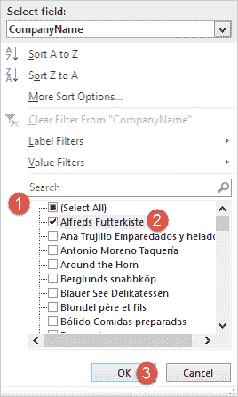
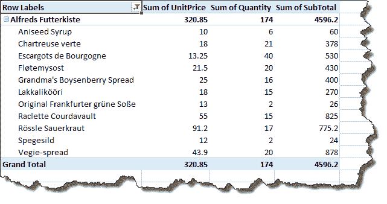
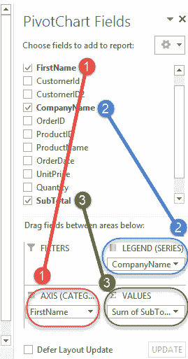
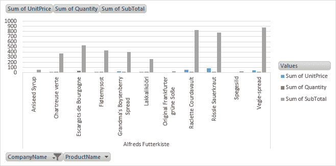

# 如何在 Excel 中创建数据透视表：初学者教程

> 原文： [https://www.guru99.com/pivot-tables-in-excel-beginner-s-guide.html](https://www.guru99.com/pivot-tables-in-excel-beginner-s-guide.html)

有时候，您将需要分析大量数据并生成易于阅读和理解的报告。 数据透视表使我们能够分析此类数据并生成满足业务报告要求的报告。

在本教程中，我们将涵盖以下主题：

*   [什么是数据透视表？](#1)
*   [关于创建数据透视表的分步教程](#3)
*   [二维数据透视表](#4)
*   [使用图表](#5)可视化数据透视表数据

## 什么是数据透视表？

数据透视表是一个大型数据集的摘要，通常包括总数，平均值，最小值，最大值等。假设您有不同区域的销售数据，有了数据透视表，您可以按区域汇总数据并查找 每个区域的平均销售额，每个区域的最大和最小销售额等。数据透视表可让我们分析，汇总和仅显示报告中的相关数据。

## 关于创建数据透视表的分步教程

下图显示了从 North wind 访问数据库整理的示例销售数据。

您可以在此处下载示例 Excel 数据。

[下载上面的 Excel 数据文件](https://drive.google.com/uc?export=download&id=0ByI5-ZLwpo25ZG55aXlKa3ctOHc)

从上图可以看到，我们的电子表格包含很多数据。 假设我们要创建一个客户摘要，将所有订单按产品分组，并显示所有交易的数量，单价和小计。

*   打开您下载的 Excel 文件
*   单击功能区上的“插入”选项卡

*   您将获得以下窗口

*   单击选择表/范围按钮，如上图所示
*   您将获得以下迷你窗口

*   单击单元格地址 A1
*   按键盘上的 Ctrl + A 选择所有数据单元
*   现在显示的迷你窗口如下所示

*   单击关闭按钮返回到选项窗口
*   点击确定按钮

*   选择以下字段
    *   公司名
    *   产品名称
    *   单价
    *   数量
    *   小计
*   您的工作表现在应如下所示

*   请注意，以上数据已按客户公司名称，产品名称，单价，数量总和和小计总和分组。
*   请注意“行标签”旁边的下拉按钮。 此按钮使我们可以对数据进行排序/过滤。 假设我们只对 Alfreds Futterkiste 感兴趣
*   单击“行标签”下拉列表，如下所示

*   取消勾选（全选）
*   选择 Alfreds Futterkiste
*   点击确定按钮
*   您将获得以下数据

## 二维数据透视表

二维数据透视表是在行和列上均具有字段的表。 假设我们要以行的形式列出员工姓名，并使用列来表示客户姓名，并用总销售额填写单元格。

*   激活销售数据表
*   单击“插入”选项卡
*   单击数据透视图&表格按钮
*   选择所有数据。 Excel 现在应该记住先前的范围，因此您只需单击“确定”按钮
*   将使用数据透视表工具创建一个新工作表
*   选择字段，如下图所示

现在，您的数据透视表将如下所示

## 使用图表可视化数据透视表数据

使用 Excel 2013，您无需手动创建图表。 当您创建数据透视表，更改聚合函数，应用过滤器等时，Excel 会为您创建图表。

下面的图表是通过简单的数据透视图练习自动为我们创建的，该透视图仅过滤了 Alfreds Futterkiste 的数据。

## 摘要

数据透视表和图表使我们能够汇总和分析大型数据集。 我们可以使用汇总函数，例如 SUM，MINIMUM，MAXIMUM，AVERAGE 等。当我们处理数据时，excel 将自动为我们创建和更新图表。