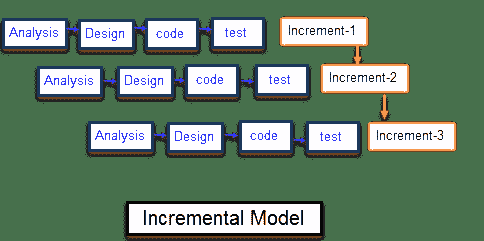

# SDLC 中的增量模型：使用优势&劣势

> 原文： [https://www.guru99.com/what-is-incremental-model-in-sdlc-advantages-disadvantages.html](https://www.guru99.com/what-is-incremental-model-in-sdlc-advantages-disadvantages.html)

### 什么是增量模型？

增量模型是软件开发的过程，其中需求被分解为软件开发周期的多个独立模块。 增量开发是从分析设计，实施，测试/验证，维护开始的步骤。

每次迭代都要经过**需求，设计，编码和测试阶段**。 系统的每个后续发行版都会向先前的发行版添加功能，直到实现了所有设计的功能。

当第一个增量交付时，该系统即投入生产。 第一个增量通常是解决基本要求的核心产品，在下一个增量中添加了补充功能。 一旦客户分析了核心产品，便会为下一个增量制定计划。

## 增量模块的特征包括

*   系统开发分为许多小型开发项目
*   逐步构建了部分系统以产生最终的整体系统
*   首先解决最高优先级要求
*   开发需求后，该增量的需求将被冻结

| **增量阶段** | **分阶段进行的活动** |
| **需求分析** | 

*   收集软件的要求和规格

 |
| **设计** | 

*   在此阶段设计了一些高端功能

 |
| **代码** | 

*   在此阶段完成软件编码

 |
| **测试** | 

*   部署系统后，它将经历测试阶段

 |

## 何时使用增量模型？

*   明确了解系统要求
*   当需要早期发布产品时
*   软件工程团队的技能或培训水平不高时
*   当涉及高风险的特征和目标时
*   这种方法更多地用于基于 Web 应用程序和基于产品的公司

## 增量模型的优缺点

| **优势** | **劣势** |
| 

*   该软件将在软件生命周期中快速生成。

 | 

*   它需要一个良好的规划设计

 |
| 

*   更改需求和范围的方法灵活且成本较低

 | 

*   问题可能是由于系统架构引起的，因此并非整个软件生命周期中都预先收集了所有要求

 |
| 

*   在整个开发阶段都可以进行更改

 | 

*   每个迭代阶段都是固定的，并且彼此不重叠

 |
| 

*   与其他模型相比，该模型的成本更低

 | 

*   要在一个单元中纠正问题，需要在所有单元中进行纠正，并且会花费大量时间。

 |
| 

*   客户可以响应每个建筑物

 |   |
| 

*   错误易于识别

 |   |