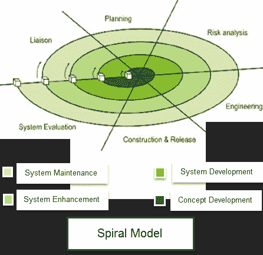

# 什么是螺旋模型？ 什么时候使用？ 优点&缺点

> 原文： [https://www.guru99.com/what-is-spiral-model-when-to-use-advantages-disadvantages.html](https://www.guru99.com/what-is-spiral-model-when-to-use-advantages-disadvantages.html)

## 什么是螺旋模型？

螺旋模型是瀑布模型和迭代模型的组合。 螺旋模型的每个阶段都以设计目标开始，并以客户审查进度结束。 螺旋模型最早是由 Barry Boehm 在 1986 年的论文中提到的。

Spiral-SDLC 模型的开发团队从一小部分需求开始，并贯穿这些需求的每个开发阶段。 软件工程团队在不断增长的螺旋中增加了对附加要求的功能，直到应用程序准备好进入生产阶段为止。

## 螺旋模型阶段

| **螺旋模型阶段** | **在**阶段执行的活动 |
| **规划** | 

*   它包括估算迭代的成本，进度和资源。 它还涉及了解系统分析师与客户之间持续通信的系统要求

 |
| **风险分析** | 

*   在计划和确定风险缓解策略的同时，进行了潜在风险的识别

 |
| **工程学** | 

*   它包括在客户站点

上的测试，编码和部署软件 |
| **评估** | 

*   客户对软件的评估。 此外，还包括识别和监控进度延误和成本超支等风险

 |

## 何时使用螺旋方法？

*   在工程大的时候
*   何时需要频繁发布
*   适用于创建原型的情况
*   当风险和成本评估很重要时
*   适用于中高风险项目
*   当需求不清楚和复杂时
*   随时可能需要进行更改
*   当由于经济优先事项的变化而无法进行长期项目承诺时

### **螺旋模型**

的优缺点

| **优势** | **劣势** |
| 

*   其他功能或更改可以在以后进行

 | 

*   不符合计划或预算的风险

 |
| 

*   由于原型构建是在小碎片中完成的，因此成本估算变得容易了

 | 

*   最适合大型项目，也需要风险评估专家

 |
| 

*   持续或反复发展有助于风险管理

 | 

*   为确保其平稳运行，必须严格遵循螺旋模型协议

 |
| 

*   开发速度很快，并且系统地添加了功能

 | 

*   文档更多，因为它具有中间阶段

 |
| 

*   总是有客户反馈的空间

 | 

*   不建议用于较小的项目，这可能会花费很多

 |