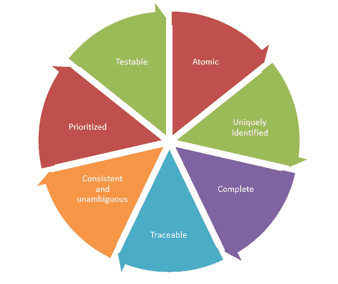
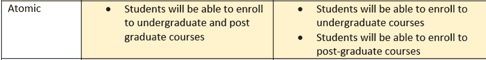
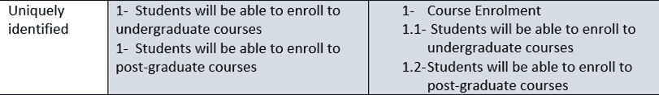
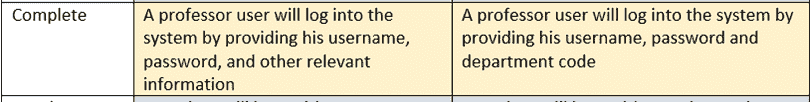
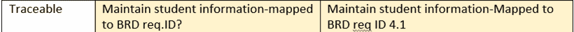

# 示例软件需求分析

> 原文： [https://www.guru99.com/learn-software-requirements-analysis-with-case-study.html](https://www.guru99.com/learn-software-requirements-analysis-with-case-study.html)

软件需求是系统中要实现的功能性或非功能性需求。 功能性意味着向用户提供特定服务。

例如，对于银行应用程序，功能要求将是客户选择“查看余额”时，他们必须能够查看其最新帐户余额。

软件需求也可以是非功能性的，也可以是性能需求。 例如，非功能性要求是系统的每个页面都应在 5 秒内对用户可见。

因此，基本上**的软件要求是**

*   功能或
*   无功能

**需要已在系统中实现的**。 **软件需求通常表示为陈述。**

**在本教程中，我们将学习**

*   [需求类型](#1)
*   [其他要求来源](#2)
*   [如何分析需求](#3)
*   [原子](#4)
*   [唯一标识的](#5)
*   [完成](#6)
*   [一致且明确](#7)
*   [可追溯的](#8)
*   [已优先处理](#9)
*   [可测试的](#10)
*   [结论](#11)

### 要求类型

1.  **Business requirements**: They are high-level requirements that are taken from the business case from the projects.

    例如，移动银行服务系统向东南亚提供银行服务。 针对印度确定的业务需求是帐户摘要和资金转账，而针对中国账户摘要和账单支付则确定为业务需求

| 国家 | 提供银行功能或服务的公司 |
| 印度 | 帐户摘要和资金转帐 |
| 中国 | 帐户摘要和帐单支付 |

2.  **Architectural and Design requirements**: These requirements are more detailed than business requirements. It determines the overall design required to implement the business requirement.

    对于我们的教育机构，建筑和设计用例将是登录名，课程详细信息等。要求如下所示。

| 银行用例 | 需求 |
| 缴费 | 该用例描述了客户如何登录到网上银行并使用账单支付工具。

客户将看到已注册开票人的未结帐单的仪表板。 他可以添加，修改和删除开票人明细。 客户可以为不同的计费操作配置 SMS，电子邮件警报。 他可以查看过去已付​​帐单的历史记录。

启动此用例的参与者是银行客户或支持人员。 |

3.  **System and Integration requirements**: At the lowest level, we have system and integration requirements. It is detailed description of each and every requirement. It can be in form of user stories which is really describing everyday business language. The requirements are in abundant details so that developers can begin coding.

    在“帐单支付”模块的示例中，将提到添加帐单的要求

| 缴费 | 要求 |
| 添加帐单 | 

*   公用程序提供商名称
*   关系/客户编号
*   自动付款–是/否
*   支付整个账单–是/否
*   自动付款限额–如果账单超过指定金额，请勿付款

 |

有时对于某些项目，您可能没有收到任何要求或文档。 但是，您仍然可以考虑需求的其他来源或需求信息，以便可以将软件或测试设计基于这些需求。 因此，您可以依赖的其他需求来源是

### 其他要求来源

*   来自已经在该项目上工作的同事或员工的知识转移
*   与业务分析师，产品经理，项目负责人和开发人员讨论项目
*   分析已在系统中实现的先前系统版本
*   分析项目的较早需求文件
*   查看过去的错误报告，一些错误报告被转换为增强功能，可以实施为当前版本
*   查看安装指南（如果有）以查看需要进行的安装
*   分析团队尝试实施的领域或行业知识

无论您有什么要求来源，请确保以某种形式记录下来，并请其他经验丰富且知识渊博的团队成员进行审核。

### 如何分析需求

考虑一个教育软件系统的示例，学生可以在其中注册不同的课程。

让我们研究如何分析需求。 需求必须保持其需求的标准质量，不同类型的需求质量包括

*   原子
*   唯一识别
*   完成
*   始终如一
*   可追溯的
*   优先
*   可测

让我们以一个示例来了解这一点，此处显示的表格中有三列，

1.  第一列表示“要求质量”
2.  第二列指出-“有问题的不良要求”
3.  第三列与第二列相同，但–“已转换为良好要求”。

| 需求质量 | 不良要求的例子 | 良好要求的例子 |
| 原子 | 

*   学生将可以报读本科和研究生课程

 | 

*   学生将能够报读本科课程
*   学生将能够报读研究生课程

 |
| 唯一识别 | 1-学生将能够注册本科课程 1-学生将能够注册研究生课程 | 

1.  课程注册
2.  学生将能够注册本科课程
3.  学生将能够注册研究生课程

 |
| 完成 | 教授用户将通过提供用户名，密码和其他相关信息来登录系统 | 教授用户将通过提供其用户名，密码和部门代码来登录系统 |
| 始终如一 | 学生将修读本科课程或研究生课程，但不能同时修读这两种课程。 一些课程将对本科生和研究生开放 | 一个学生将拥有本科生或研究生，但不能同时拥有两者 |
| 可追溯的 | 维持学生信息映射到 BRD req.ID？ | 维护与 BRD req ID 4.1 对应的学生信息 |
| 优先 | 注册学生优先级 1 维护用户信息优先级 1 注册课程优先级 1 查看成绩单优先级 1 | 注册学生优先级 1 维护用户信息优先级 2 注册课程优先级 1 查看成绩单优先级 3 |
| 可测 | 系统的每一页将在可接受的时间范围内加载 | 注册学生并注册系统的页面将在 5 秒钟内加载 |

现在，让我们从原子开始详细了解每个需求。

#### 原子

因此，您的每一项要求都应该是原子性的，这意味着它应该处于非常低的详细程度，因此不可能分离成组件。 在这里，我们将在原子和唯一标识的需求级别上看到这两个需求示例。

因此，让我们继续以教育领域的系统构建为例。 在这里，不好的要求是“学生将能够报名参加本科和研究生课程”。 这是一个不好的要求，因为它不是原子的，因为它涉及两个不同的实体本科生和研究生课程。 因此，显然这不是一个好的要求，而是不好的要求，因此对应的好的要求就是将其分为两个要求。 因此，一个人谈论的是本科课程的入学率，而另一个人谈论的是研究生课程的入学率。

#### 唯一标识

同样，下一个需求质量是检查唯一标识的需求，这里我们有两个单独的需求，但是它们都有相同的 ID＃1。 因此，如果我们参考 ID＃来引用我们的需求，但是由于两者都具有相同的 ID＃1，我们所参考的是文档或系统的其他部分并不清楚是哪个确切的需求。 因此，用唯一的 ID 分开，这样好的要求将在第 1 节课程注册中重新返回，并且有两个要求：1.1 ID 是本科课程的入学率，而 1.2 ID 是研究生课程的入学率。

#### 完成

同样，每个要求都应完整。 例如，此处的错误要求是“教授用户将通过提供其用户名，密码和其他相关信息来登录系统”。 这里其他相关信息不清楚，因此应以良好的要求将其他相关信息详细说明以使要求完整。

#### 一致且明确

接下来，每个要求都应保持一致且明确，因此在此例如我们有一个要求：“一个学生将修读本科课程或研究生课程，但不能同时修读这两个课程”，这是一个要求，还有其他要求则是“某些课程将 向本科生和研究生开放”。

该要求中的问题在于，从第一个要求开始，似乎将课程分为研究生课程和研究生课程两类，并且学生可以选择两者之一，但不能同时选择两者。 但是，当您阅读其他要求时，就会与第一个要求发生冲突，并告诉您某些课程将对研究生和本科生开放。

因此，很明显将这个不好的要求转换为很好的要求，即“一个学生将拥有本科课程或研究生课程，但不能同时拥有这两个课程”。 这意味着每门课程都将被标记为本科课程或研究生课程

#### 可追溯

每个需求都应该是可追溯的，因为已经有不同级别的需求，我们已经看到在顶部我们有业务需求，然后是架构和设计需求，然后是系统集成需求。

现在，当我们将业务需求转换为架构和设计需求，或者将架构和设计需求转换为系统集成需求时，必须具有可追溯性。 这意味着我们应该能够满足每一项业务需求，并将其映射到相应的一个或多个软件体系结构和设计需求。 因此，这是一个错误要求的示例，上面写着“维护学生信息-映射到 BRD 请求 ID？”。 此处未提供需求 ID。

因此，将其转换为一个好的需求时会说同样的事情，但是它被映射为需求 ID 4.1。 因此，应该为每个需求提供映射。 以同样的方式，我们具有高低级映射需求，系统和集成需求之间也存在对实现该需求的代码的映射，并且系统和集成需求之间也存在对测试该特定需求的测试用例的映射 。

因此，这种可追溯性遍及整个项目

#### 优先

| Prioritized | 注册学生优先级 1
维护用户信息优先级 1
报名课程-优先级 1
查看报告卡-优先级 1 | 注册学生优先级 1
维护用户信息优先级 2
注册课程优先级 1
查看报告卡优先级 3 |

然后，必须对每个需求进行优先级排序，以便团队制定指导原则，以便能够先实施哪些需求，然后再完成。 在这里您可以看到不良优先级已经注册了学生，维护了用户信息，并且每个需求都赋予了优先级-1。 并非所有事物都具有相同的优先级，因此可以优先考虑需求。 因此，此处的良好要求示例是注册学生和注册课程的优先级最高，同时保持用户信息的优先级低于 2，然后我们以优先级 3 查看报告卡

#### 可测试

| 可测 | 系统的每一页将在可接受的时间范围内加载 | 注册学生并注册系统的页面将在 5 秒钟内加载 |

每个需求都应该是可测试的，这里的糟糕需求是“系统的每个页面都将在可接受的时间范围内加载”。 现在，此要求存在两个问题，首先是每个页面意味着可以有很多页面，这将浪费测试工作。 另一个问题是它说页面将在可接受的时间范围内加载，现在什么是可接受的时间范围？ 可以接受谁。 因此，我们必须将不可测试的参数转换为可测试的参数，该参数明确说明了我们正在谈论的页面是“注册学生并注册课程页面”，并且给出了可接受的时间范围，即 5 秒。

#### 总结

因此，这就是我们必须在适当级别上查看每个需求的方式。 例如，如果我们要构建有关系统和集成需求的软件。 我们必须查看软件需求规范或用户案例中给出的系统和集成需求，并将其应用于每个需求质量。 然后检查每个需求是否都是原子的，唯一标识的和完整的，等等。