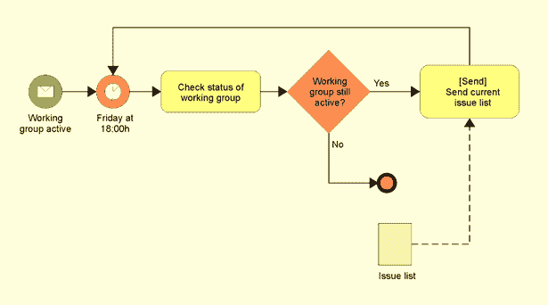
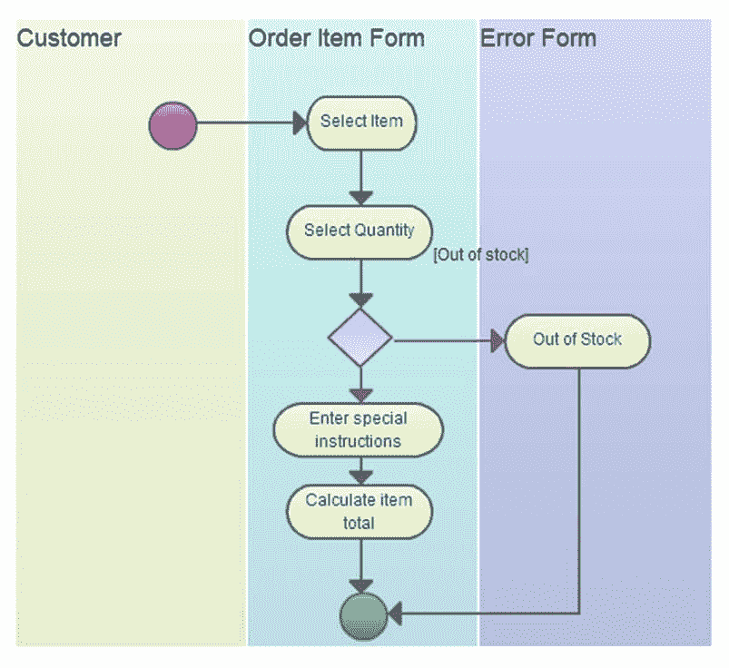
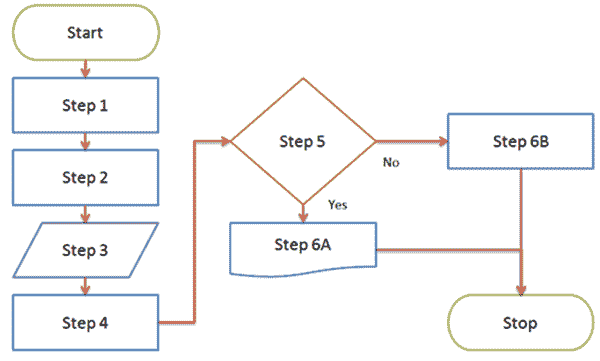
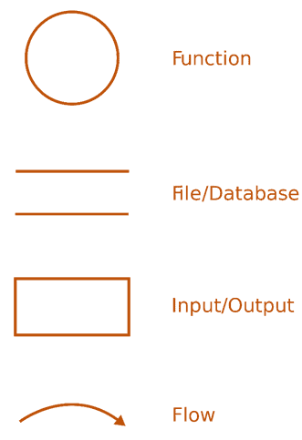
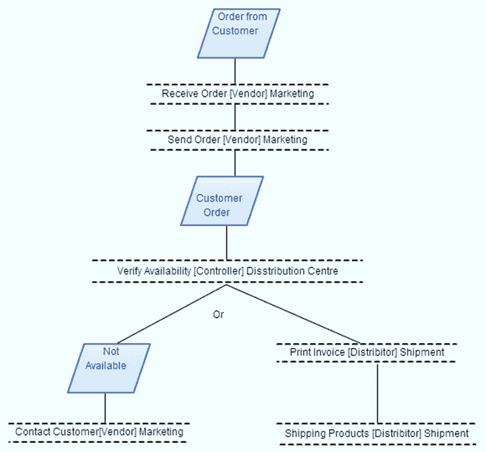
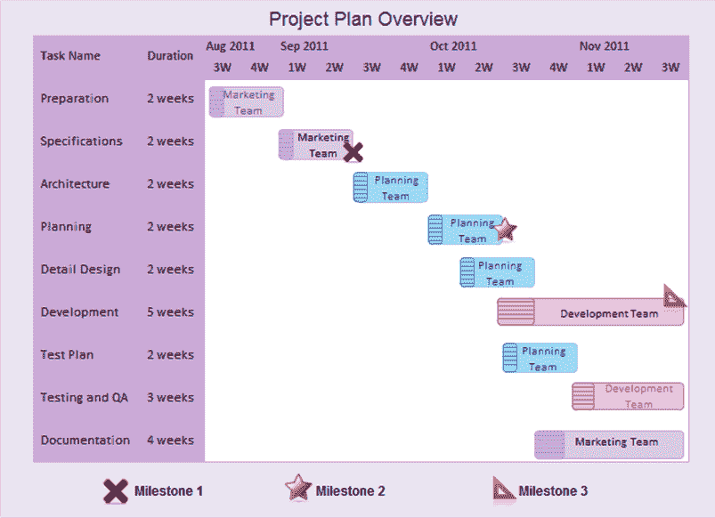
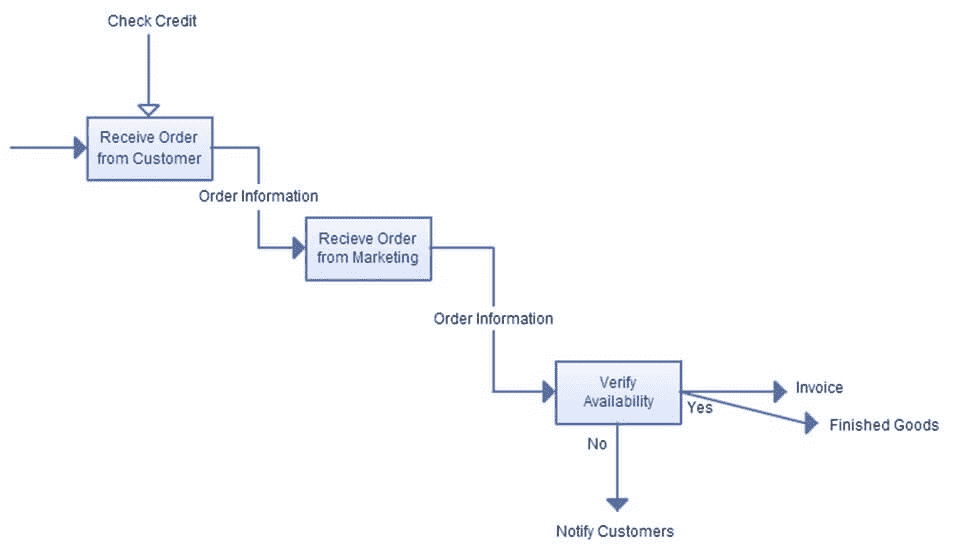
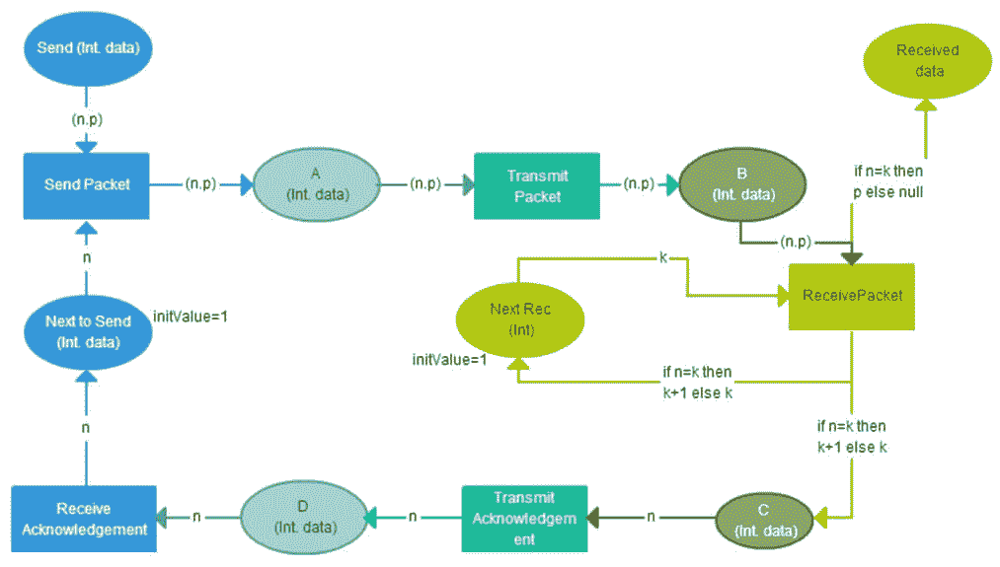
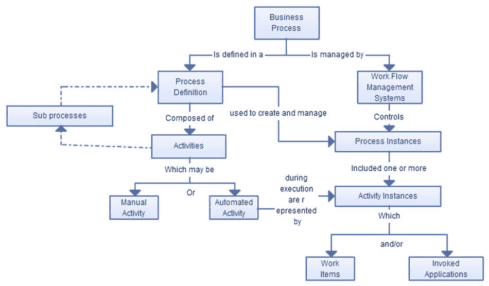

# 需求分析技术及示例：完整教程

> 原文： [https://www.guru99.com/requirements-analysis-and-transformation-techniques.html](https://www.guru99.com/requirements-analysis-and-transformation-techniques.html)

作为业务分析师，需求分析是您工作中最重要的部分。 它将**帮助您确定涉众**的实际需求。 同时，使您能够与利益相关者以他们理解的语言（例如图表，模型，流程图等）而非复杂的文本进行沟通。

需求分析有一个

*   具体目标
*   特定输入
*   具体输出
*   使用资源
*   有一些活动要按顺序执行
*   可能影响多个组织单位
*   为客户创造某种价值

## 需求分析技术

需求分析技术主要用于映射业务工作流，以便您可以分析，理解并对该工作流或流程进行必要的更改。

根据软件开发过程，可以使用各种需求分析技术，例如

2.  业务流程建模符号（BPMN）

BPMN（业务流程建模&表示法）是使用简单对象的业务流程的图形表示，可帮助组织以标准方式进行通信。 BPMN 中使用的各种对象包括

*   流对象
*   连接对象
*   泳道
*   人工制品。

精心设计的 BPMN 模型应该能够提供有关流程中所进行活动的详细信息，例如，

*   谁在进行这些活动？
*   这些活动需要哪些数据元素？

使用 BPMN 的最大好处是更易于共享，并且大多数建模工具都支持 BPMN。

3.  UML（统一建模语言）

UML 是一种建模标准，主要用于软件系统的规范，开发，可视化和文档编制。 为了捕获重要的业务流程和工件，UML 提供了类似的对象

*   州
*   目的
*   活动
*   类图

有 14 个 UML 图可以帮助进行建模，例如用例图，交互图，类图，组件图，序列图等。UML 模型在 IT 领域非常重要，因为它已成为所有利益相关者之间进行交流的媒介。 基于 UML 的业务模型可以直接输入到需求工具中。 UML 图可以是行为模型和结构模型这两种类型。 行为模型试图提供有关系统功能的信息，而结构模型将给出系统组成的信息。

4.  流程图技术

流程图是一组相关活动或动作的顺序流程和控制逻辑的直观表示。 流程图有不同的格式，包括线性，自上而下和跨功能（泳道）。 流程图可用于不同的活动，例如表示数据流，系统交互等。使用流程图的优点是，即使对于非技术团队成员，它也易于读取和编写，并且可以按功能显示并行过程 ，流程的关键属性等。

5.  数据流程图

数据流程图显示了系统如何根据输入和输出处理数据。 数据流程图的组成部分包括

*   处理
*   流
*   商店
*   终结者

逻辑数据流程图显示系统的活动，而物理数据流程图显示系统的基础结构。 可以在 SDLC（系统开发生命周期）内的分析阶段的需求启发过程的早期设计数据流程图，以定义项目范围。 为了便于分析，可以将数据流程图深入到其子过程中，该子过程称为“分层 DFD”。

6.  角色活动图-（RAD）

角色活动图类似于流程图类型表示法。 在角色活动图中，角色实例是流程参与者，具有开始和结束状态。 RAD 需要对流程或组织有深入了解，才能确定角色。 RAD 的组件包括

*   活动项目
*   外部事件
*   状态

角色根据其执行的职责集将活动分组为责任单位。 活动可以与角色隔离进行，或者可能需要与其他角色的活动进行协调。

外部事件是状态更改发生的时间点。

当一个州从一个州到另一个州发展时，州可用于描绘角色的活动。 当达到特定状态时，表示已达到特定目标。

RAD 易于阅读和呈现流程的详细视图，并允许并行进行活动，因此有助于支持交流。

7.  甘特图

甘特图是进度表的图形表示，有助于协调，计划和跟踪项目中的特定任务。 它表示对象的总时间跨度，细分为增量。 甘特图表示在垂直轴上要执行的所有任务的列表，而在水平轴上则表示估算的活动持续时间或分配给活动的人员的姓名。 一个图表可以演示许多活动。

8.  IDEF（函数建模的集成定义）

IDEF 或功能建模的集成定义是一个通用名称，指的是企业建模语言的类别。 它用于对支持系统分析，设计或集成所需的活动进行建模。 IDEF 大约有 16 种方法，最有用的 IDEF 版本是 IDEF3 和 IDEF0。

9.  有色皮氏网（CPN）

CPN 或彩色 Petri 网是用于**规范，验证，设计和仿真**的图形化语言。 有色 Petri 网是图形和文本的组合。 它的主要成分是**位置，过渡和圆弧**。

Petri 网对象具有特定的题词，例如

*   **放置**：它具有.Name，.Color Set，.Initial 标记等题词。
*   **转换**：lt 具有题名，如.Name（用于标识）和.Guard（布尔表达式由某些变量组成）
*   **弧**：其铭文如.Arc。 当评估圆弧表达式时，它会产生多组标记颜色。

10.  工作流程技术

工作流技术是一种可视化的图表，代表一个或多个业务流程，以阐明对流程的理解或提出流程改进建议。 与流程图，UML 活动和流程图等其他图一样，工作流技术是最古老且流行的技术。 BA 甚至使用它在需求确定期间记录笔记。 该过程包括四个阶段

*   信息收集
*   工作流程建模
*   业务流程建模
*   实施，验证&执行

11.  面向对象的方法

面向对象的建模方法使用面向对象的范式和建模语言来设计系统。 它着重于在问题域中查找和描述对象。 面向对象方法的目的是

*   帮助表征系统
*   知道什么是不同的相关对象
*   它们如何相互联系
*   如何指定或建模问题以创建有效的设计
*   分析需求及其含义

此方法适用于具有动态要求（经常更改）的系统。 它是派生系统的用例，活动流和事件流的过程。 面向对象的分析可以通过文本需求，与系统利益相关者的沟通和愿景文档来完成。

对象具有状态，状态更改由行为表示。 因此，当对象收到消息时，状态会通过行为而改变。

12.  缺口分析

差距分析是一种用于确定任何业务及其功能的建议状态与当前状态之间的差异的技术。 它回答诸如项目当前状态是什么的问题？ 我们要在哪里？ 等等。差距分析的各个阶段包括

*   审查系统
*   发展要求
*   比较方式
*   含义
*   建议