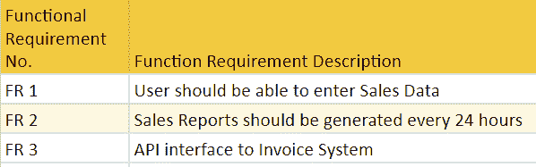

# 什么是功能需求？ 规格，类型，示例

> 原文： [https://www.guru99.com/functional-requirement-specification-example.html](https://www.guru99.com/functional-requirement-specification-example.html)

## 什么是功能需求？

**功能要求**（FR）是对软件必须提供的服务的描述。 它描述了软件系统或其组件。 功能不过是软件系统的输入，其行为和输出。 它可以是计算，数据处理，业务流程，用户交互或定义系统可能执行的功能的任何其他特定功能。 功能需求也称为**功能规范**。

在软件工程和系统工程中，功能需求的范围可以从发送者的必要性的高级抽象声明到详细的数学功能需求规范。 功能性软件要求可帮助您捕获系统的预期行为。

在本教程中，您将了解更多有关：

*   [功能需求文档应包含哪些内容？](#3)
*   [功能需求的好处](#4)
*   [功能需求示例](#5)
*   [非功能与功能需求](#6)
*   [功能需求的最佳做法](#7)
*   [创建功能需求时出错](#8)

## 功能需求文档应包含哪些内容？

<figure style="margin-left: auto;margin-right: auto;">

Example Functional Requirements

功能需求应包括以下内容：

*   在每个屏幕上进行的操作的详细信息
*   数据处理逻辑应输入系统
*   它应该具有系统报告或其他输出的描述
*   有关系统执行的工作流程的完整信息
*   它应明确定义允许谁创建/修改/删除系统中的数据
*   功能文档中应记录系统如何满足适用的法规和合规性要求

## 功能需求的好处

这里是创建典型功能需求文档的优缺点-

*   帮助您检查应用程序是否正在提供该应用程序的功能要求中提到的所有功能
*   功能需求文档可帮助您定义系统或其子系统之一的功能。
*   功能需求以及需求分析有助于识别缺失的需求。 它们有助于明确定义预期的系统服务和行为。
*   在功能需求收集阶段捕获的错误最便宜。
*   支持用户目标，任务或活动

### 功能要求的类型

这是最常见的功能需求类型

*   交易处理
*   商业规则
*   认证要求
*   报告要求
*   行政职能
*   授权等级
*   审计追踪
*   外部介面
*   历史数据管理
*   法律法规要求

## 功能要求示例

*   该软件会根据 ABC 联系人管理系统自动验证客户
*   销售系统应允许用户记录客户的销售
*   该应用程序中所有窗口的背景颜色将是蓝色，并且具有十六进制 RGB 颜色值 0x0000FF。
*   只有管​​理级别的雇员有权查看收入数据。
*   该软件系统应与银行 API 集成
*   软件系统应通过 [508 节](https://www.section508.gov/)可访问性要求。

## 非功能需求与功能需求

这是功能需求和非功能需求之间的主要区别：

| **参数** | **功能要求** | **非功能性要求** |
| --- | --- | --- |
| 这是什么 | 动词

 | 属性

 |
| 需求 | 必填

 | 这是非强制性的 |
| 捕获类型 | 它是在用例中捕获的。 | 它被捕获为质量属性。 |
| 最终结果 | 产品功能

 | 产品属性

 |
| 捕捉 | 易于捕捉

 | 难以捕捉的

 |
| 目的 | 帮助您验证软件的功能。 | 帮助您验证软件的性能。 |
| 重点领域 | 关注用户需求 | 专注于用户的期望。 |
| 文献资料 | 描述产品的作用 | 描述产品如何运作 |
| 测试类型 | 功能测试，例如系统，集成，端到端，API 测试等。 | 非功能测试，例如性能，压力，可用性，安全性测试等。 |
| 测试执行 | 测试执行是在进行非功能测试之前完成的。 | 功能测试后 |
| 产品资讯 | 产品功能

 | 产品属性

 |

## 功能需求的最佳做法

制定功能需求文档的重要最佳实践如下：

*   不要将两个需求合而为一。 使需求保持粒度。
*   您应该使每个要求尽可能完整和准确。
*   该文件应起草所有技术要求。
*   将所有需求映射到有助于成功交付软件的目标和原则
*   使用访谈，研讨会和随意交流来达到要求。
*   如果存在任何会严重影响需求的已知已验证约束，则应记录为关键状态。
*   您必须在文档中记录所有假设。

## 创建功能需求时出现错误

这里是创建功能需求文档时常犯的一些错误：

*   放入不合理的额外信息，可能会使开发人员感到困惑
*   在需求文档中没有提供足够的细节。
*   您可以添加规则或示例，对语句或目标进行范围界定，但需求本身除外。
*   遗漏了一条重要信息，这是完全，准确和确定性地陈述要求的绝对必要条件。
*   当需求被修改时，一些专业人员开始捍卫他们记录的需求，而不是寻找正确的事实。
*   没有映射到目标或原则的需求。

## 重点学习

*   功能需求定义了系统或其组件
*   功能需求文档应包含数据处理逻辑和有关系统执行的工作流程的完整信息
*   功能需求以及需求分析有助于识别缺失的需求
*   事务更正，调整和取消，业务规则，认证要求，报告要求，管理功能，授权级别，审计跟踪，外部接口，历史数据管理，法律或法规要求是各种类型的功能要求
*   优良作法是不要将两个需求合而为一。 使需求保持粒度。
*   在功能需求文档中，应避免添加可能使开发人员感到困惑的不合理的额外信息。