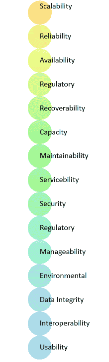

# 什么是非功能性要求？ 类型和例子

> 原文： [https://www.guru99.com/non-functional-requirement-type-example.html](https://www.guru99.com/non-functional-requirement-type-example.html)

## 什么是非功能性要求？

**非功能性要求**（NFR）指定软件系统的质量属性。 他们根据响应性，可用性，安全性，可移植性和其他对软件系统成功至关重要的非功能性标准来判断软件系统。 非功能性需求示例，*“网站加载速度有多快？”* 无法满足非功能性需求可能会导致系统无法满足用户需求。

非功能需求使您可以跨各种敏捷积压对系统的设计施加约束或限制。 例如，当同时用户数为> 10000 时，站点应在 3 秒内加载。非功能需求的描述与功能需求一样重要。

在本教程中，您将了解有关-

*   [非功能需求的类型](#2)
*   [非功能需求的示例](#3)
*   [功能需求与非功能需求](#4)
*   [非功能需求的优势](#5)
*   [非功能需求的缺点](#6)

## 非功能需求的类型

*   可用性要求
*   可维修性要求
*   可管理性要求
*   可恢复性要求
*   安全要求
*   数据完整性要求
*   容量要求
*   可用性要求
*   可伸缩性要求
*   互操作性要求
*   可靠性要求
*   可维护性要求
*   法规要求
*   环境要求

## 非功能要求的示例

以下是一些非功能需求的示例：

1.  首次成功登录后，用户必须立即更改最初分配的登录密码。 此外，首字母绝对不能重复使用。
2.  员工从未允许更新其工资信息。 此类尝试应报告给安全管理员。
3.  用户每次访问数据项的不成功尝试均应记录在审核跟踪中。
4.  网站应足以应付 2000 万用户，影响其性能
5.  该软件应该是可移植的。 因此，从一个操作系统迁移到另一操作系统不会造成任何问题。
6.  信息隐私，限制技术的出口，知识产权等应进行审计。

## 功能要求与非功能要求

| **参数** | **功能要求** | **非功能性要求** |
| --- | --- | --- |
| 它是什么？ | 动词

 | 属性

 |
| 需求 | 必填

 | 这是非强制性的 |
| 捕获类型 | 它是在用例中捕获的。 | 它被捕获为质量属性。 |
| 最终结果 | 产品功能

 | 产品属性

 |
| 捕捉 | 易于捕捉

 | 难以捕捉的

 |
| 目的 | 帮助您验证软件的功能。 | 帮助您验证软件的性能。 |
| 重点领域 | 关注用户需求 | 专注于用户的期望。 |
| 文献资料 | 描述产品的作用 | 描述产品如何运作 |
| 测试类型 | 功能测试，例如系统，集成，端到端，API 测试等。 | 非功能测试，例如性能，压力，可用性，安全性测试等。 |
| 测试执行 | 测试执行是在进行非功能测试之前完成的。 | 功能测试后 |
| 产品资讯 | 产品功能

 | 产品属性

 |

## 非功能需求的优势

非功能测试的优点/优点是：

*   非功能性要求确保软件系统遵循法律和合规性规则。
*   它们确保软件系统的可靠性，可用性和性能
*   它们确保了良好的用户体验并简化了软件的操作。
*   它们有助于制定软件系统的安全策略。

## 非功能需求的缺点

非功能要求的缺点/缺点是：

*   没有功能需求可能会影响各种高级软件子系统
*   在软件架构/高级设计阶段需要特别考虑，这会增加成本。
*   它们的实现通常不会映射到特定的软件子系统，
*   通过架构阶段后，很难修改不起作用的代码。

## 关键学习

*   非功能性需求定义了软件系统的性能属性。
*   非功能性需求的类型为可伸缩性容量，可用性，可靠性，可恢复性，数据完整性等。
*   非功能性要求的示例是员工从未被允许更新其工资信息。 此类尝试应报告给安全管理员。
*   功能需求是动词，非功能需求是属性
*   非功能需求的优势在于，它可以帮助您确保良好的用户体验和易于操作的软件
*   非功能需求的最大缺点是，它可能会影响各种高级软件子系统。