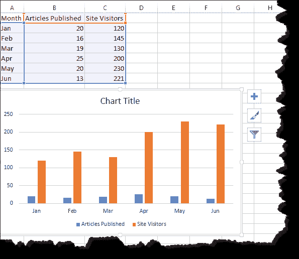
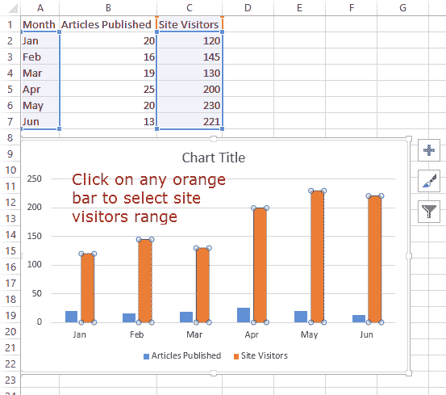
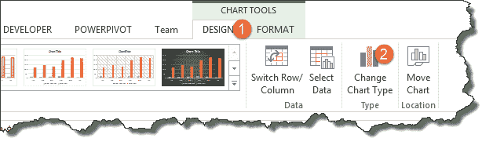
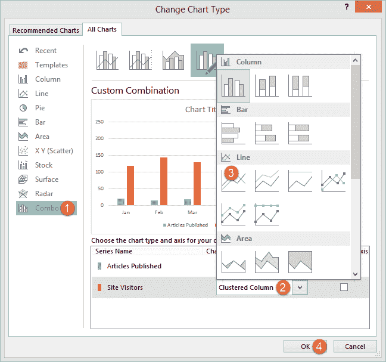
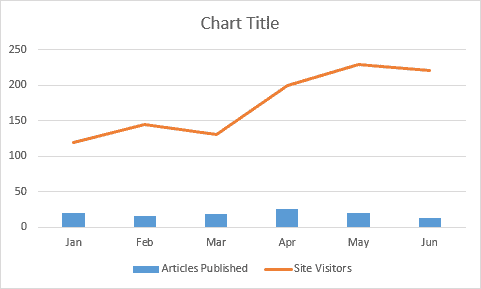
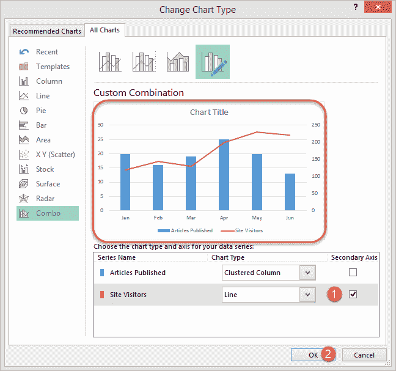
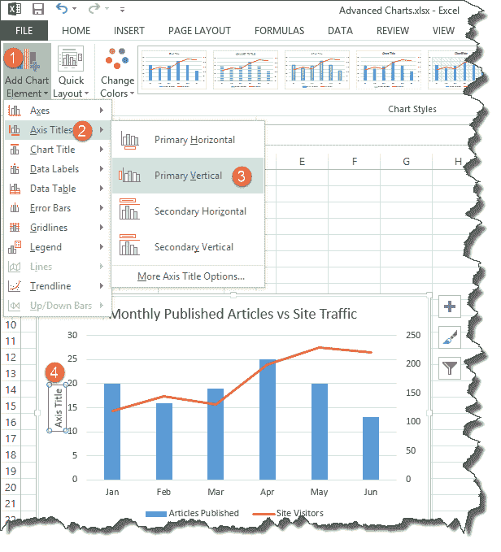
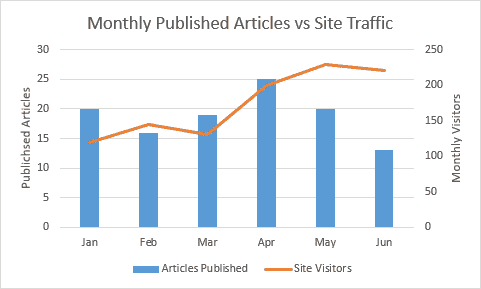

# Excel 中的高级图表&图形

> 原文： [https://www.guru99.com/creating-advanced-charts-in-excel.html](https://www.guru99.com/creating-advanced-charts-in-excel.html)

图形，图像和图表是可视化和表示数据的好方法，Excel 通过自动创建图表为我们做完全相同的事情。 有时候，我们希望超越 excel 为我们创建的基本图表。 本教程将重点介绍这种复杂性。

## 什么是高级图表？

高级图表是超越 Excel 创建的基本图表的图表。 假设您要在同一张图表上比较的数据不止一组，您可以使用一组数据创建基本图表，然后向其添加更多数据集并应用其他项目，即对图表进行格式化。 这就是高级图表的全部意义。

## 高级图表的重要性

*   它们在单个图表中提供了整合的信息，使您可以轻松比较多个数据集并快速做出决策
*   它们使我们能够自定义图表的外观

## 创建高级图表的分步示例

在本教程练习中，我们将假定我们运行一个博客，并拥有可以给我们每月访问者数量的软件。 我们希望看到每月发表的文章数量与每月总点击量之间的关系。 我们将使用以下数据集。

| 

月

 | 

发表文章

 | 

网站访问者

 |
| 

1 月

 | 

20

 | 

120

 |
| 

2 月

 | 

16

 | 

145

 |
| 

3 月

 | 

19

 | 

130

 |
| 

4 月

 | 

25

 | 

200

 |
| 

Jun

 | 

20

 | 

230

 |
| 

7 月

 | 

13

 | 

221

 |

*   在 Excel 中创建一个新的工作簿
*   输入上面显示的数据
*   创建一个基本的柱形图，如下所示。 如果您不知道如何创建基本图表，请阅读有关图表的文章。

现在是时候让我们的图表超越基本面了。 选择代表交通的橙色条

*   单击更改图表类型，如下所示

*   您将获得以下对话框窗口

1.  选择组合
2.  单击群集列
3.  选择折线图
4.  点击确定按钮

恭喜，您刚刚创建了一个包含两种图表类型的图表。

现在，将辅助轴添加到图表中，使其看起来更美观。

*   选择图表
*   单击图表工具下的“设计”，然后选择更改图表类型

1.  单击“站点访客”下的“辅助轴”复选框
2.  点击确定按钮

现在让我们编辑图表，主轴和辅助轴标题，如下所示。

1.  转到添加图表元素
2.  单击轴标题
3.  选择主要垂直行业
4.  双击图表标题并编辑标题

撰写每月发表的文章 vs 网站流量。 现在，您的完整图表应如下所示

从上面的完整图表中可以看到，我们已经合并了两个数据集并对其进行了可视化，从而可以轻松地显示一个数据集对另一个数据集的影响。

[下载上面的 Excel 代码](https://drive.google.com/uc?export=download&id=0BwL5un1OyjsdaG5HYy1VeWtoa28)

## 摘要

高级图表是整合多个数据集并将其可视化为身份模式的一种好方法。