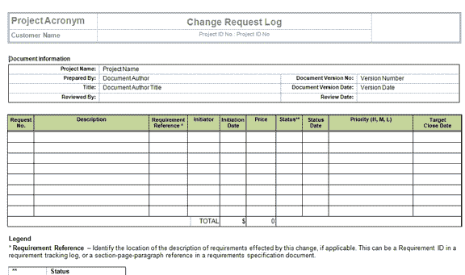
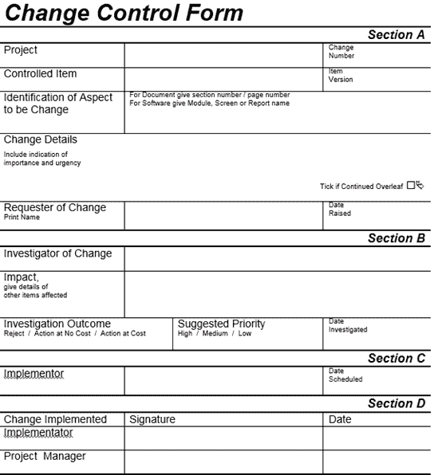

# 分步进行软件工程变更控制流程

> 原文： [https://www.guru99.com/change-control-business-analyst.html](https://www.guru99.com/change-control-business-analyst.html)

## 什么是变更控制？

变更控制是公司用于**文档，识别和授权对 IT 环境的变更**的过程。 它减少了系统未经授权的改动，破坏和错误的机会。

## 为什么要变更控制？

每当系统要求进行任何新的或不同的更改时，尤其是利益相关者，都不是可选的或不可忽略的。 必须在不影响系统其他组件的情况下实施它。 这是变更控制很方便的时候。 它可以帮助项目团队使用指定的控件和策略来修改项目的范围。 只要项目未按计划进行，就实行变更控制。

为了保持对变更请求的控制，必须完整并审查变更请求的正式文档。

在分析变更控制时可能遇到的问题数，例如

*   谁会批准更改？
*   是否需要贯穿变更控制委员会？
*   研究和实施更改需要多少时间？
*   更改对系统其他组件（进度，成本，资源等）有什么影响？
*   项目管理人员是否可以批准该阈值？

## 变更控制流程的不同因素

变更控制流程应考虑多种因素

| **变更控制流程**中的步骤 | **在变更控制**中采取的措施 |
| 

*   更改请求发起和控制

 | 

*   变更请求应标准化并接受管理审查
*   变更请求者应保持知情

 |
| 

*   影响评估

 | 

*   确保以结构化的方式评估所有变更请求，以分析可能的影响

 |
| 

*   更改的控制和文档

 | 

*   应保留更改日志，该日志应告知进行更改的日期，人员详细信息以及已实施的更改。
*   只有授权人员才能进行更改。
*   滚动过程 回到以前的版本应该被识别

 |
| 

*   文档和过程

 | 

*   每当进行系统更改时，程序和相关文档应相应更新

 |
| 

*   授权维护

 | 

*   应该控制系统访问权限，以防止未经授权的访问。

 |
| 

*   测试和用户签署

 | 

*   软件应经过全面测试

 |
| 

*   版本控制

 | 

*   控件应置于生产源代码上，以确保仅更新了最新版本。

 |
| 

*   紧急更改

 | 

*   应获得口头授权，并应将更改尽快记录在案

 |

## 变更控制流程

在研究变更控制流程涉及的内容之前，我们将熟悉变更控制中使用的文档。 进行变更控制时，主要涉及两个文件

*   **更改日志**：更改日志是一个文档，其中列出了有关所有更改请求的详细信息，例如项目编号，PCR（项目更改请求）ID，优先级，所有者详细信息，目标日期，状态和状态 日期，提出日期，提出的日期等。

*   **Change Request Form**: It is used to document details required to support the decision making process like type of change, benefits of change, name of resource requesting the change, time and estimate cost, priority of change, authorized person detail, change request status etc.

    

## 变更流程流程图

变更过程遵循特定的模式来实施产品或系统中的变更。 在这里，我们通过流程图说明了变更过程中涉及的步骤。

## 变更控制步骤

| **变更控制步骤** | **动作** |
| 

*   更改请求标识

 | 

*   确定更改的必要，并在项目更改请求表

中进行描述 |
| 

*   更改请求评估

 | 

*   如果更改无效，则必须将其推迟或拒绝
*   确定分析更改请求所需的适当资源
*   快速评估潜在影响并进行更新 变更请求表
*   在此阶段，应停止被拒绝的变更请求

 |
| 

*   更改请求分析

 | 

*   为进行分析，将更改请求分配给授权成员
*   延迟的更改重新输入此分析步骤
*   在此阶段，应停止被拒绝的更改请求

 |
| 

*   更改请求批准

 | 

*   在批准前确定变更风险和复杂程度
*   在批准前确定变更的影响程度
*   审查变更请求对授权人的影响
*   在此阶段，应停止拒绝的更改请求

 |
| 

*   更改请求实现

 | 

*   更新项目程序和管理计划
*   通知团队变更
*   监视变更请求的进度
*   记录变更请求的完成
*   关闭更改请求

 |

**注意**：变更控制的批准可以由**项目经理（首席 IT）或首席开发商（利益相关者）完成。**

## 变更管理与变更控制

| 

**变更管理**

 | 

**更改控制**

 |
| 

*   它负责管理和控制变更请求，以对 IT 基础架构或 IT 服务的任何方面进行变更，以最大程度地降低服务中断的风险并提高业务收益。

 | 

*   变更控制包括诸如提交，记录，分析和批准变更之类的活动，以改善系统或产品的整体性能。

 |