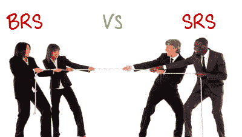

# BRS 与 SRS：了解差异

> 原文： [https://www.guru99.com/brs-vs-srs-the-myth-busted.html](https://www.guru99.com/brs-vs-srs-the-myth-busted.html)

在我们开始之前，您必须知道–

## 需求与规范之间的区别

| 

要求

 | 

规格

 |
| 他们概述了软件必须执行的“操作” | 他们概述了软件的“创建方式” |
| 他们从最终用户，业务和利益相关者的角度概述了该软件。 | 他们从技术团队的角度概述了软件。 |

## 关键区别

*   SRS 指定了要开发的软件的功能和非功能需求，而 BRS 是描述客户提供的需求的正式文档
*   SRS 由系统架构师创建，而 BRS 通常由业务分析师创建。
*   SRS 代表系统需求规范，而 BRS 代表业务需求规范。
*   SRS 来自 BRS，而 BRS 来自客户交互和需求。

各种文档都有大量的术语和术语

**规格文件-**

*   SRS-系统要求规范
*   FRS-功能需求规范
*   BRS-业务需求规范
*   CRS 兼容性要求规范
*   PRS-性能要求规范
*   RRS-可靠性要求规范
*   CRS 配置要求规范

**需求文档，例如-**

*   BRD-业务需求文档
*   SRD-系统需求文件

**思考**

*   这些文件在很多地方不是分开的，而是可以互换使用的。
*   规格和要求大致传达相同的信息，但传达给两个完全不同的受众。
*   对于创建了上述文档的给定项目，取决于项目的“性质”和组织的“流程”

在本教程中，我们将讨论 SRS 和 BRS

| 

BRS（业务需求规范）

 | 

SRS（系统需求规范）

 |
| 它以很高的层次描述了软件的功能规格 | 它概述了该软件的功能和技术规格 |
| 这是描述客户要求的正式文件（书面，口头） | 它规定了要开发的软件的功能和非功能要求 |
| 通常由与客户互动的业务分析师创建 | 通常由技术专家的系统架构师创建。

尽管在较小的公司中，BA 也会创建 SRS。

一些公司没有完全创建 SRS。 他们的 BRS 足够详细，也可以用作 SRS。

 |
| 它来自客户交互和需求 | 它来自 BRS |