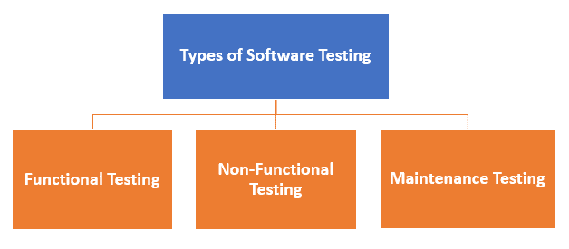

# 什么是软件测试？ 定义，基础&类型

> 原文： [https://www.guru99.com/software-testing-introduction-importance.html](https://www.guru99.com/software-testing-introduction-importance.html)

## 什么是软件测试？

**软件测试**被定义为检查实际结果是否符合预期结果并确保软件系统没有[缺陷](/defect-management-process.html)的活动。 它涉及软件组件或系统组件的执行，以评估一个或多个感兴趣的属性。 软件测试还有助于识别与实际需求相反的错误，空白或遗漏的需求。 它可以手动完成，也可以使用自动化工具完成。 有人更喜欢将软件测试称为[白盒](/white-box-testing.html)和[黑盒测试](/black-box-testing.html)。

简而言之，软件测试是指被测应用程序（AUT）的验证。 本教程向受众介绍了测试软件，并说明了其重要性。

在本教程中，您将学习：

*   [什么是软件测试？](#1)
*   [为什么软件测试很重要？](#2)
*   [软件测试有什么好处？](#3)
*   [软件工程测试](#4)
*   [软件测试的类型](#5)
*   [软件工程中的测试策略](#6)
*   [程序测试](#7)

## 为什么软件测试很重要？

测试很重要，因为软件错误可能代价高昂甚至危险。 软件错误可能会导致金钱和人员损失，并且历史上充斥着此类示例。

*   2015 年 4 月，由于软件故障影响了金融市场上 300,000 多名交易员，伦敦的彭博终端发生故障。 它迫使政府推迟 30 亿英镑的债务出售。
*   由于安全气囊感应器软件故障，日产汽车从市场召回了超过 100 万辆汽车。 据报告，由于该软件故障，发生了两次事故。
*   由于 POS 系统的软件故障，星巴克被迫关闭美国和加拿大约 60％的商店。 有一次，由于无法处理交易，该商店免费提供了咖啡。
*   由于软件故障，亚马逊的一些第三方零售商将其产品价格降低到了 1 便士。 他们蒙受了沉重的损失。
*   Windows 10 中的漏洞。此错误使用户可以通过 win32k 系统中的漏洞逃离安全沙箱。
*   2015 年，战斗机 F-35 成为软件漏洞的受害者，使其无法正确检测目标。
*   1994 年 4 月 26 日，中华航空空客 A300 因软件错误坠毁，造成 264 名无辜者丧生
*   1985 年，加拿大的 Therac-25 放射治疗机由于软件错误而发生故障，并向患者提供了致命的放射剂量，造成 3 人死亡，3 人重伤。
*   1999 年 4 月，一个软件错误导致价值 12 亿美元的军用卫星发射失败，这是历史上最昂贵的事故
*   1996 年 5 月，一个软件漏洞导致美国一家主要银行的 823 个客户的银行帐户记入 9.2 亿美元。

## 软件测试有什么好处？

这是使用软件测试的好处：

*   **具有成本效益**：这是软件测试的重要优势之一。 按时测试任何 IT 项目都可以帮助您长期节省资金。 如果错误在软件测试的早期阶段被捕获，则修复成本会降低。
*   **安全性**：这是软件测试中最脆弱和最敏感的好处。 人们正在寻找值得信赖的产品。 它有助于尽早消除风险和问题。
*   **产品质量**：这是任何软件产品的基本要求。 测试可确保将优质的产品交付给客户。
*   **客户满意度**：任何产品的主要目的都是使客户满意。 UI / UX 测试可确保最佳的用户体验。

## 软件工程测试

根据 ANSI / IEEE 1059，软件工程中的测试是一种分析软件项以查找当前条件与所需条件之间的差异的方法。 它还涉及评估软件的功能。

## 软件测试的类型

通常，测试分为三类。

*   功能测试
*   非功能测试或[性能测试](/performance-testing.html)
*   维护（回归和维护）

| **测试类别** | **测试类型** |
| 功能测试 | *   [单元测试](/unit-testing-guide.html)*   [集成测试](/integration-testing.html)*   冒烟*   UAT（用户接受测试）*   本地化*   全球化*   互操作性*   如此 |
| 非功能测试 | *   性能*   耐力*   负载*   体积*   可伸缩性*   可用性*   等等 |
| 保养 | *   回归*   维护 |

这不是完整列表，因为有[种以上的 150 种测试](/types-of-software-testing.html)类型，并且仍在增加。 另外，请注意，并非所有测试类型都适用于所有项目，而是取决于项目的性质&范围。

## 软件工程中的测试策略

以下是软件工程中的重要策略：

**单元测试**：程序员遵循此软件测试方法来测试程序的单元。 它可以帮助开发人员了解代码的各个单元是否正常工作。

**集成测试**：它专注于软件的构建和设计。 您需要查看集成单元是否正常运行。

**系统测试**：在这种方法中，您的软件将整体编译，然后进行整体测试。 此测试策略将检查功能，安全性，可移植性等。

## 程序测试

程序测试是执行旨在发现错误的任何程序的方法。 良好的测试是发现错误的高机率。 此测试过程可以显示是否存在错误。 可以在编写任何程序之前编写测试用例。

### 软件测试基础摘要：

*   软件测试被定义​​为一项活动，以检查实际结果是否与预期结果相符并确保软件系统无缺陷。
*   测试很重要，因为软件错误可能代价高昂甚至危险。
*   使用软件测试的重要原因是：成本效益，安全性，产品质量和客户满意度。
*   通常，测试分为三类功能测试，非功能测试或性能测试以及维护。
*   软件工程中的重要策略是：单元测试，集成测试，验证测试和系统测试。